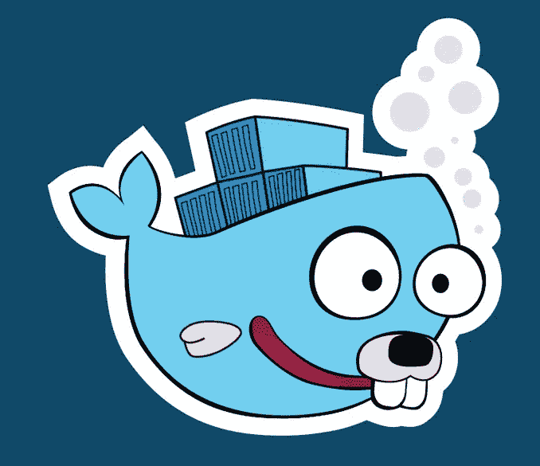

# 用 Docker 上的 cassandra db 体验 Go webapp

> 原文：<https://medium.com/nerd-for-tech/experiment-go-webapp-with-cassandra-db-on-docker-f3b12226b609?source=collection_archive---------9----------------------->

我有一个 SQL 数据库的 Go webapp 以前的职位。在我的职业生涯中，到目前为止，我一直在使用 SQL 数据库进行大部分持久存储。我在 NoSQL 的唯一经历是严重依赖 redis，过于注重缓存的使用而不是存储。我有一点使用 MongoDB 的经验，但是用例主要用于审计，而不是实际的业务数据。

因此，作为个人项目的一部分，我最近试着摆弄了一下 **Cassandra** 数据库。由于 Docker 在设置和形成多节点 **NoSQL** 设置方面提供的便利，体验相当不错。让我们开始…

PS:我假设你的系统里安装了 docker。我假设您了解 Go 和 Cassandra 知识以及基于 docker 的部署。对于一些基础知识，请参考一些早期的职位。我指的是我的个人项目的 github 链接如下

 [## prateekgupta 3991/gnews-服务

### Go 中的简单新闻服务。与谷歌新闻 api 集成-https://newsapi.org/使用卡珊德拉作为存储层和…

github.com](https://github.com/prateekgupta3991/gnews-service) 

# 设置 cassandra 节点

按照上面提到的步骤让 cassandra 出现在 docker 上:

> 创建一个节点-暴露在端口 9042
> 上>docker run-p 9042:9042-name my-Cassandra-1-m 1g-d Cassandra:3.11
> 
> 检查已创建实例的 IP
> >docker inspect—format = ' { { . network settings . IP address } } ' my-Cassandra-1
> 
> 创建另一个节点并链接到 prev 节点—在端口 9043
> >上公开 docker run—name my-CASSANDRA-2-m 2g-d-e CASSANDRA _ SEEDS = " $(docker inspect—format = ' { { . network settings . IP address } } ' my-CASSANDRA-1)" CASSANDRA:3.11
> 
> 通过 cqlsh 客户端使用 cassandra(替换 IP)
> >docker run-it—link my-Cassandra-1—RM Cassandra:3.11 bash-c ' exec cqlsh<<IP>>'
> 
> 检查 cassandra 节点状态
> >docker exec-I-t my-Cassandra-1 bash-c‘节点工具状态’

希望现在，你的卡珊德拉已经开始运行了。现在继续创建一个键空间/表。获取您创建的节点的 ip，因为这将在您的 go 应用程序中用于连接。

# 转到后端

我假设你已经有了一个基本的 go 后端。你可以参考上面的 github 链接来看看样例应用程序。
要从你的 go 应用程序连接到 cassandra，你需要使用库 gocql。
创建 gocql。将在您的存储库层中用于查询数据库的会话。

这将初始化会话。下一步是创建将拥有数据库会话的结构。

服务层将通过调用 **GetNewDbSession()** 创建数据库会话，然后可以在服务调用中使用。

我添加了 repo 链接和代码片段以供参考。希望有帮助。我的服务基于 http over json，并使用 gin-gonic 作为 REST 框架。

# 构建和部署- Docker

对于构建和部署步骤，我已经创建了一个基于 docker 的设置。我使用了 docker 缩微图像作为一种机制。我花了一段时间和多个学习视频和博客来构建最终的 docker 文件。没有保存 docker 文件的多次迭代。在这里附上相同的。

这很容易构建包含 Go 应用程序二进制文件和 docker-compose 文件的 docker 映像，以便启动后端。
PS:我假设你了解 docker 以及 docker 部署的相关文件和步骤。我把回购的自述文件里的东西都加了，供参考。

我就这样结束了这篇文章。我试图记录我在用 Cassandra 作为数据库构建 Go 应用后端的过程中所做的一切。如果你在帖子中发现不一致的地方，或者如果帖子对你有帮助，请在评论中告诉我。

在那之前，继续试验，继续编码。