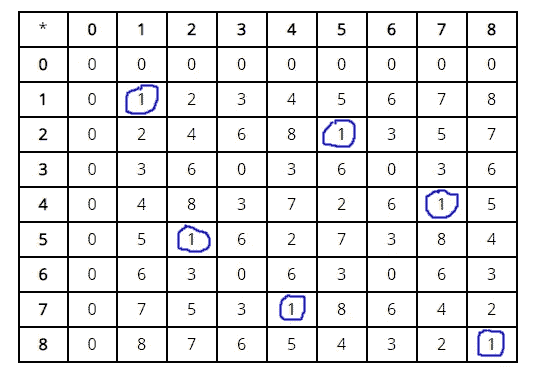
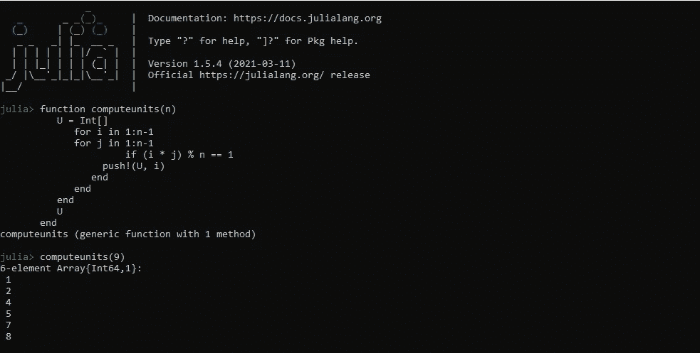
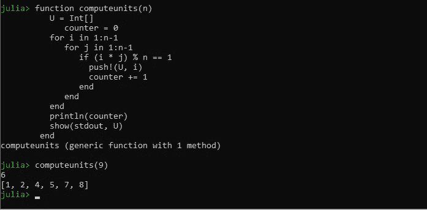
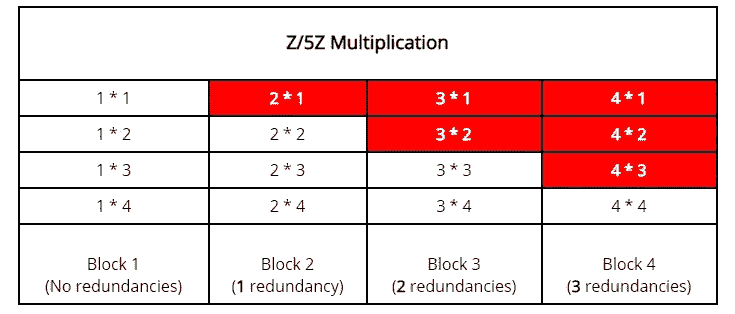
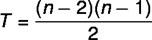

# 实验数学模环的计算单位

> 原文：<https://medium.com/nerd-for-tech/experimental-math-computing-units-of-modular-rings-12bc4276fa74?source=collection_archive---------4----------------------->


图片由[皮克斯拜](https://pixabay.com/?utm_source=link-attribution&amp;utm_medium=referral&amp;utm_campaign=image&amp;utm_content=2574943)的 Gerd Altmann 提供

一个*环*是一个模仿整数及其算术属性的代数结构。形式上，环被定义为由非空集、 **S** 和两个运算组成的结构；对于 **S** 中的所有 *x* 、 *y* 、 *z* ，加法( **+** )和乘法( ***** )满足以下性质:

1.  *x* + *y* 也是 **S** ( *追加*关闭)的成员
2.  *x*+*y*=*y*+*x*(加法*交换性*)
3.  *x*+(*y*+*z*)=(*x*+*y*)+*z*(*相对于加法的关联性*)
4.  有一个元素 **0** ，使得*x*+**0**=**0**+*x*=*x*对于 **S** 中的所有 *x* (相对于加法的*标识元素)*
5.  有一个元素 **-** *x* ，这样*x*+(*-x*)=**0**(*加法逆*)
6.  *x* * *y* 也是 S ( *乘法下的闭包*)的成员
7.  *x**(*y** z)=(x * y)* z(结合性)
8.  有一个元素 **1** ，使得 **S** 中的*x****1**=**1****x*=*x*(乘法*恒等式*)
9.  *x**(*y*+*z*)=(*x***y*)+(*x***z*)(*左分配性*)
10.  (*y*+*z*)**x*=(*y***x*)+(*z***x*)(*右分配性*)
11.  *x***y*=*y***x*(*乘法可换性* —可选)

好长的房产清单啊？嗯，我们可以简单地说:环是这样的代数结构( **S** ， **+** ， ***** )使得( **S** ， **+** )是阿贝尔[群](https://tundeayodele.medium.com/a-first-look-at-groups-314ebb452005) ( *性质 1 到 5* )并且( **S** ， ***** )是[幺半群](https://tundeayodele.medium.com/a-first-look-at-groups-314ebb452005) ( *性质)*

由于环是以整数为模型的，显然，环的原型例子是整数的集合以及加法和乘法的通常算术运算。这组整数通常由字母 **Z** 表示，来自于 **Zahlen** ，德语中的数字。
**Z** = {… -5，-4，-3，-2，-1，0，1，2，3，4，5，6，7，…}。
( **Z** 、 **+** 、 ***** )是一个环。作为一个练习，你可以确认这一点。

具有简单结构的环的另一个例子是由 **Z/nZ** 或 **Zₙ** 表示的模 n 整数的集合。这只是当 **n** 除以另一个整数时可能的余数的集合。例如 **Z/6Z** = {0，1，2，3，4，5}。
一般情况下， **Z/nZ** ={0，1，2，.。。，**n**—1 }。进行环操作的是*mod****n***。让我们称这种环为模环。您可以验证是否满足环属性集。

还有许多其他环的例子，但我们想在本文中集中讨论*模块化环*。

## 环形单位

考虑以下乘法:2 *(1/2)= 1
3 *(1/3)= 1
4 *(1/4)= 1 等等。
我们看到，一个数乘以它的*倒数*得到 **1** (乘法恒等式)，这当然是倒数的定义所期望的，但事实是，倒数(或者更专业地说，*乘法倒数*)并不总是对所有的数都存在。整数环( **Z** 、 **+** 、 ***** )中，3 的倒数或乘逆是什么？(1/3)?编号(1/3)不是 **Z** 的元素，因此不被接受。原来( **Z** 、 **+** 、 ***** )中唯一有乘法逆运算的数是 **-1** 和 **1、**，它们恰好是自己的逆运算； ****-1***-1 = 1
1* 1 = 1**

**具有乘法逆的环的元素被称为**单位**。环的单位集具有有趣的结构和一些重要的应用，例如，计算某些环的单位等价于寻找某些[丢番图方程](https://en.wikipedia.org/wiki/Diophantine_equation)的解。**

## **Z/nZ 的计算单位**

**现在，让我们开始计算模环的单位， **Z/nZ** 。我们从一个特定的戒指开始，比如说 **Z/9Z** 。似乎我们现在找到这些单位的唯一可用方法实际上是在 **Z/9Z** 中执行所有可能的乘法，并检查哪些被乘数产生 1。
**Z/9Z** ={0，1，2，3，4，5，6，7，8}。
Z/9Z 的乘法表如下所示。记住乘法是进行 *mod 9* 。**

****

**从表中我们可以看出，圆环的单位 **Z/9Z** 是数字
**1** 、 **2** 、 **4** 、 **5** 、 **7** 、 **8** 。举个例子，从表中可以看出，**2***5=**1**，所以 **2** 和 **5** 都是单位。
表格中有 64(8 的平方)个非零结果单元格，意味着我们执行了 64 次乘法。通常，计算 **Z/nZ** 的单位需要进行 **(n-1)** 模乘运算。**

**当 **n** 很大时，如果需要计算 **Z/nZ** 的单位怎么办？手动构造乘法表是不可行的。这就是计算机代码的用武之地。我们将在 Julia 中写一个程序来帮助计算任意 n 的单位。程序逻辑遵循上述程序；在 **Z/nZ** 中执行所有可能的乘法，并记录(存储在数组 U 中)产生 1 的被乘数。所以，我们需要两个循环——嵌套的；一个外循环用于顶行，一个内循环用于前导列(反之亦然)。我们将从 1 开始，不包括 0，因为乘以 0 总会得到 0。**

**下面是在[号上测试朱莉娅·REPL](https://docs.julialang.org/en/v1/stdlib/REPL/)的代码:**

****

**该代码将单位数组 U 显示为垂直列表，并指示数组中元素的数量。为了更好地格式化数组，我们可以使用 ***show()*** 函数，但是这次我们需要添加一个计数器来跟踪数组中元素的数量:**

****

**所以，我们现在有了一个在 Z/nZ 中计算单位的程序。利用乘法在环中可交换的事实，可以提高程序的效率。有些多余的乘法运算我们可以省去；
**2 * 3** 和 **3 * 2** 是一个东西，我们只取一个，不用费心计算另一个。下图显示了冗余是如何产生的，并有助于确定节省的计算步骤，以及我们如何从代码中排除冗余。**

****

**在*块 1，*循环的第一个周期，没有冗余。在*块 2* ，
， **2 * 1** 是多余的，因为 **1 * 2** 已经在前一个块中计算过了。
在*块 3* 处，由于前两个块的操作，有 2 个冗余。一个块从每个前面的块获得一个冗余；在*块* ***n*** 处，会有 ***n* -1** 冗余。**

**一般来说，对于 **Z/nZ** ，会有 **n-1** 个块或循环周期，最后一个块( **n-1** ) *第*个块会有(**n-1**)-**1**=**n-2**个冗余。所以冗余总数将是:
T =**1+2+3+…+n-2**
这是一个算术级数，有 **n-2** 项，第一项 1，公差带 1，最后一项 **n-2** 。利用等差数列的求和公式，我们得到:
T =((n-2)/2)(1+n-2)=((n-2)/2)(n-1)**

****

**这代表了当我们修改程序时，计算步骤的节省。修改后的程序现在将进行 **(n-1) -T** 模乘运算。**

**我们如何修改我们的代码来免除多余的操作？我想把它作为一个练习。**

**我们改进的单位计算算法还有改进的空间吗？即使去掉了多余的运算，感觉还是蛮力算法，更像是改进的“试乘法”。也许更多的理论会有所帮助。**

**根据单位的定义， **u** 是 **Z/nZ** 的一个单位，如果有 **Z/nZ** 的一个元素**I，这样**u*I*≡1(mod**n**)。同余意味着有一个整数 ***k*** 使得**u*I*-1 =*k*n**或**u*I*-*k*n = 1**。设 ***d*** 为 **u** 和 **n** 的最大公约数( *gcd* ，也就是说 ***d*** 除以*和 ***n*** ，因此除以 **u *i* - *k 而且由于**u*I*-*k*n = 1**，除数 ***d*** 必然等于 1。如果两个数的 *gcd* 为 1，则这两个数*互质*，它们除了 1 没有公因数或除数。我们刚刚证明了 **u** 和 **n** 互质，这是 **Z/nZ** 中单位的一个定义性质； **Z/nZ** 的单位与 **n** 互质。但是每一个与 **n** 互质的元素都是单位吗？我们也需要证明这一点。**********

```
*Let **v** be an arbitrary element of **Z/nZ** that is relatively prime to **n**.
That means gcd(**v**,**n**) = 1\. 
Then, by [Bézout’s lemma](https://en.wikipedia.org/wiki/B%C3%A9zout%27s_identity), there exist integers *x* and *y* such that
vx + ny = 1
ny = 1 - vx
Since y is an integer, the last equation implies n divides 1 - vx (with a remainder of 0), in the language of congruences:
1 - vx ≡ 0(mod n)
1 ≡ vx(mod n)
**vx ≡ 1(mod n)**.This implies **v** is a unit in **Z/nZ** which is what we wanted to prove.*
```

*上述结果为我们提供了另一种计算 **Z/nZ** 单位的方法；找出那些与 **n** 互质的元素。如前所述，如果两个数字的最大公约数(gcd)等于 1，则这两个数字是互质的，因此，我们的新算法将在通过 **Z/nZ** 元素的循环中使用 *gcd* 函数来检查互质性。
Julia 内置了 *gcd* 函数，但是为了不显得我们在作弊，我们准备自己写 *gcd* 函数，姑且称之为***ourowngcd****。*它基于欧几里德算法计算 gcd。*

*名为 *computeunitswithgcd* 的新单位计算算法如下所示。*

*这种新算法的一个明显的改进是不涉及乘法，只涉及模运算，而以前的算法既涉及乘法又涉及模运算。我们可以进一步加入一点智能优化，它只对偶数有效(*偶数大约有一半的时间出现，对吗？*)。如果 **n** 是偶数，那么它不可能是偶数的互质，所以我们懒得去检查 **Z/nZ** 的偶数元素是否互质。我们跳过偶数，循环 1，3，5，7…而不是循环 1，2，3，4…
这大约减少了 50%的循环周期。优化后的代码如下所示。检查 **n** 在开始时是否是偶数，如果是，则将循环步长设置为 2，而不是默认的 1。*

**computeunitswithgcd(n)* 是否是比 *computeunits(n)* 更高效的算法？您可以通过比较两种算法对于几个相当大的 *n* 的执行时间来找到实验结果。*

## *单位组*

*环的单位的一个有趣的性质是它们在乘法下形成一个群。前面算出的环 **Z/9Z** 的单位集是{ **1** ， **2** ， **4** ， **5** ， **7** ， **8** }，可以验证它满足闭性、结合律、恒等式和逆的群性质。*

*现在，让我们证明一般模环 **Z/nZ** 或任何一种环的单位集 **U** 构成一个群。运算就是乘法， ***** 。*

****关闭*** 。我们想证明对于 U 的任意元素 **a** 和 **b** ，它们的乘积
**a*****b***也在 U 中，换句话说我们想证明**a*****b***也是一个单位，即它有一个乘法逆。***

```
***Let A and B be the multiplicative inverses of a and b respectively. Then,
(a*b)*(B*A)= a*(b*B)*A = a*1*A = a*A = 1
(B*A)*(a*b)= B*(A*a)*b = B*1*b = B*b = 1
[The above statements made use of the associative property of rings and the fact that the product of an element and its inverse is 1].

From the two statements above, we can see that a*b has a multiplicative inverse, B*A, and is therefore a unit.***
```

******结合律。*** 结合性继承自环 **Z/nZ** *。****

*****认同。*** 标识元素 1 继承自环 **Z/nZ** 。**

*****逆。*** 顾名思义每个单位都有一个乘法逆。**