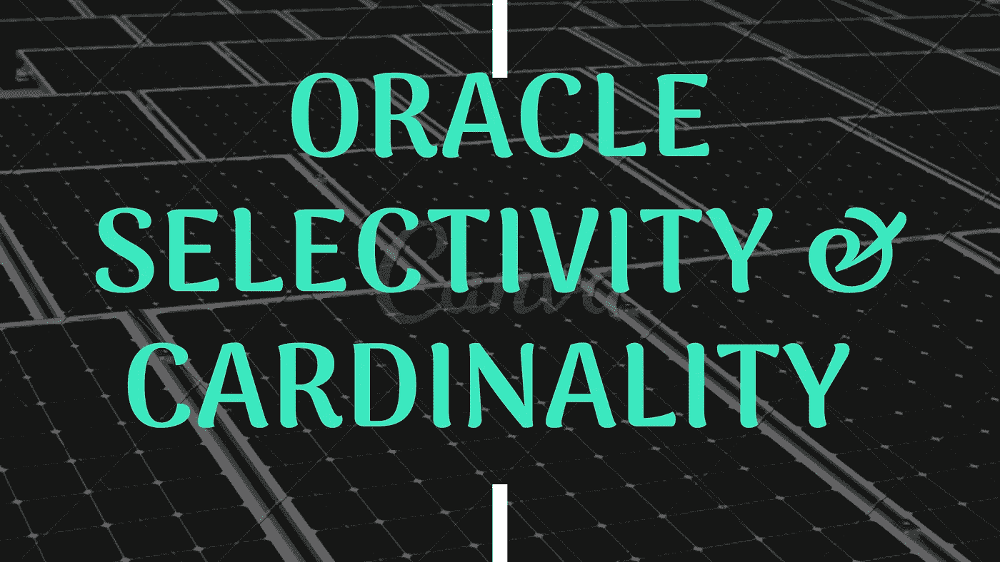

# 解释 oracle |访谈问答中的选择性和基数

> 原文：<https://medium.com/nerd-for-tech/explain-about-a-selectivity-and-cardinality-in-oracle-c4417213b6f3?source=collection_archive---------0----------------------->

在这里，我们将了解 oracle 中的选择性和基数

**什么是选择性？**

*   选择性是基于该表的全部行，从我们的查询中返回的行的估计比例。
*   假设我们有一个包含 9700 条记录的销售表。

> **select * from cust_sales 其中 promo _ id = 55**

*   它返回的行数大约是 8100。所以我们的查询返回了大量的记录。

> **select * from cust_sales 其中 promo _ id = 33**

*   它返回 2000 行。
*   所以优化器很可能会为这两个查询选择不同的执行计划。
*   如您所见，即使我们编写相同的语句，查询的选择性也会改变执行计划。

> 选择性将通过下面的公式计算。
> 
> **选择性=查询返回的行数/总行数**

*   从这里我们可以理解，选择性是通过我们期望从查询中返回的行数除以总行数来计算的。
*   如果选择性为 0，则表示我们的查询是“高选择性”的，这将返回较低的行数；如果选择性为 1，则表示查询是“低选择性”的，这将返回大量的行。

**什么是基数？**

*   基数是我们的查询返回的预期行数。

> **基数=总行数*选择性**

*   估计器估计我们执行的 I/O 成本。选择性影响分类成本。如果返回的行数太多，那么排序成本就会很高。因此在创建执行计划时会考虑这一点。
*   基数用于确定连接、排序和过滤成本。通过使用基数，优化器决定使用哪种连接方法，它将在使用索引时过滤和减少数据，等等。不正确的选择性和基数=不正确的计划
*   有时，优化器无法预测给定操作符将返回的行数(因为缺少表统计信息)。这可能会阻止 Oracle 正确估计查询计划的成本，从而导致选择次优的计划。
*   基数估计错误会导致查询运行缓慢。
*   让我们假设这里有两个例子

**例 1:**

在这些有 10 行的表中，您想从 EMP 表中知道最大的 EMP_NO。

> **从 EMP 中选择 MAX(EMP _ NO)；**

*   在上面这些具有选择性和基数细节的查询中

> **选择性= 10/10 = 1**

*   根据选择性规则，如果结果接近 1，则是“低选择性”

> **基数=被访问的行数= 10**

**例 2:**

在同一个示例中，我在查询中添加了过滤器

> **SELECT MAX(EMP _ NO)from EMP where LAST _ NAME = ' DHONI '；**

*   假设只有 2 名雇员的姓氏是“DHONI”

> **选择性=被访问的行数/总行数= 2/10 = 0.2 (40%的行被访问)**
> 
> **基数=被访问的行数= 2**