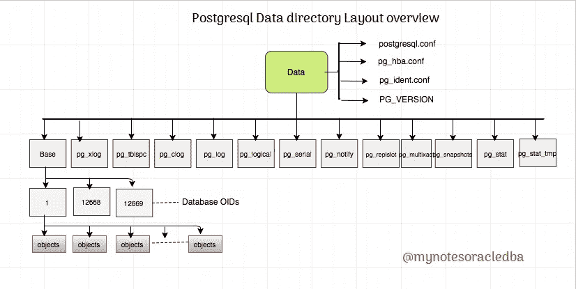

# 解释 PostgreSQL 数据目录布局|访谈 Q&A

> 原文：<https://medium.com/nerd-for-tech/explain-about-postgresql-data-directory-layout-interviewq-a-43025939365d?source=collection_archive---------9----------------------->

它概述了 PostgreSQL 文件的数据目录

**数据目录布局:
————**

Postgres 的一个实例称为集群。一个集群位于磁盘上，称为数据目录

默认情况下位于“/var/lib/psql/11/data/”上，这是数据目录的默认位置

**1。全球**

-它包含集群范围的数据库对象。我们这里有一些文件，每个文件都有某种类型的表或用户信息或元数据文件，这些文件与字典文件或表相关，pg_filenode.map =一个将内部关系(主要是系统目录表)映射到它们的 OIDr 的文件这里有适当的节点文件映射信息，存储在这里。
-服务器启动时使用的内部文件。

**Postgresql 数据目录布局**

2.**基地**

-这是主目录，包含数据库，在目录中，我们可以看到数据库目录及其每个数据库的一个目录

3. **pg_tblsc**

-这是一个目录，其中包含指向表空间位置的符号链接，以防我们在实例中创建了表空间。然后链接到表空间的物理位置，它将在 pg_tblsc 目录

中重新创建——如果我们已经创建了表空间，我们可以看到链接。如果我们使用默认表空间而不是创建新的用户表空间，我们就看不到目录中的任何链接

4.**pg _ wal**

-包含事务日志或 wal 段
-这些文件是二进制文件
5。**pg _ log**

——其中包含了我们的启动日志

**6.logs** 状态目录

——这些是以 pg_*开头的多个目录，大量的状态数据和大量的事务信息、临时统计信息。
-只是要求服务器的信息和目录的内容都是临时的

**8。配置文件**

1.PostgreSQL.conf —目录内最多的参数文件之一
2.pg_hba.conf —基于主机的访问控制文件或基于主机的认证文件
3.pg_ident.conf —用于 OS 认证
4 . PostgreSQL . auto . conf
5 .邮政局长。PID —包含 postmaster 详细信息，仅在集群启动并运行时可用
6.postmaster.opts —用于启动服务器的选项