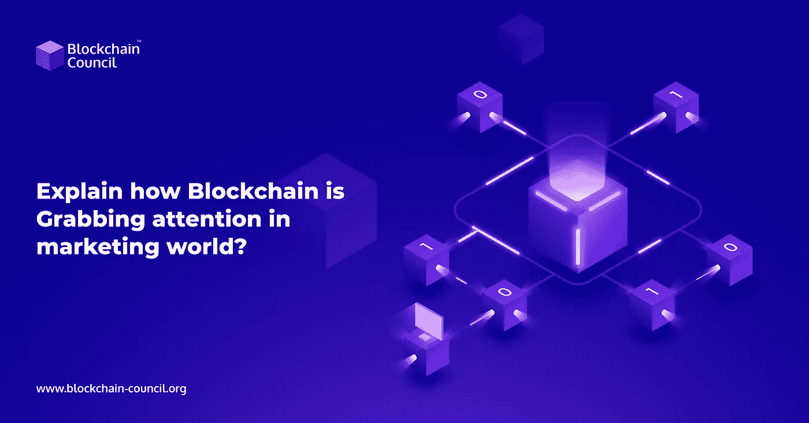

# 解释区块链如何在营销界获得关注？

> 原文：<https://medium.com/nerd-for-tech/explain-how-blockchain-is-gaining-attention-across-the-marketing-world-97a8f60309a?source=collection_archive---------5----------------------->

由于消费者行为和需求的不断变化以及新技术的采用，全球营销部门一直在不断发展。对营销行业有吸引力的最新技术之一是区块链。据 [**区块链专业**](https://www.blockchain-council.org/certifications/certified-blockchain-professional-expert/) 开发商介绍，目前的部分营销方案受到了区块链技术的影响。事实上，区块链还提出了制造业和物流业领域的优秀应用。现在是时候体验一下区块链对营销行业的颠覆了。那么，让我们来探索一下这项技术在这方面能带来哪些增强。

关注我们的媒体出版物，获取最新的区块链更新—[**https://medium.com/blockchaincouncil**](https://medium.com/blockchaincouncil)

# 目录

*   改善公共问责制和建立信任
*   消费者数据维护
*   品牌宣传
*   降价广告骗局
*   产品真实性的确认
*   高效的电子邮件发送
*   增强型广告
*   结束语

# 改善公共问责制和建立信任

现代消费者越来越意识到他们的权利，并且经常怀疑食物来源、交易和许多其他事情的可靠性。在这种情况下，即使是通过数字媒体或中介发布的信息性广告也不值得信任。

在这种情况下，让消费者信任他们的产品，让他们做出明确的购买决定，对营销人员来说变得至关重要。因此， [**区块链开发**](https://www.blockchain-council.org/certifications/certified-blockchain-developer/) 和在营销中的实施将是有益的，因为该技术带来了跨业务流程的顶级可见性。此外，区块链可以与出售公司签订数字合同，并通过其公共账本向公众公开。因此，它可以迫使公司遵循其企业社会责任。

# 消费者数据维护

目前，营销人员需要投入大量精力来收集相关的客户数据，以投放适当的广告。为此，他们必须连接多个来源，如社交媒体平台、谷歌等。而且，即使做了所有这些努力，他们也只能获得零碎的消费者信息。在这方面，区块链可以提供帮助，让营销人员通过一个统一的平台访问客户的档案数据。但是，为了实现这一点，营销人员可能需要向访问其个人资料的客户付费。因此，当品牌联系他们以获得订阅和每周简讯信息时，客户可以为分享他们的数据支付价格。

# 品牌宣传

**区块链开发**走向营销可以增强你的品牌推广方式。区块链的实施将提供一种新的支付网关。因此为购买者提供了额外的便利。这样做将有助于你的品牌成为一家技术娴熟、具有前瞻性思维的公司。

# 减少广告诈骗

**区块链颠覆营销**空间的另一个例子是区块链广告审计平台的建立。这些平台使用其固有的令牌来建立一个广告区，使营销人员能够审核遇到他们营销活动的访问者。为此，这些平台提供了一个基于区块链的注册中心，该注册中心在平台上使用智能合同，只存储经过验证的域名。这里，域名验证将通过令牌持有者参与的投票机制进行。这种平台的一个例子是 Adchain。

# 产品真实性的确认

时尚营销领域似乎**了解到了区块链**填补时尚和数字领域之间空白的潜力。事实上，正在出现的时尚品牌正在利用区块链平台来检查每件产品的可信度。此外，消费者还可以扫描他们从品牌购买的产品的原创性。由于区块链的数据不变性，消费者可以看到产品的整个生命周期。这些类型的平台将提高品牌供应链的透明度，以根除假冒产品。

# 高效的电子邮件发送

区块链技术可以帮助验证电子邮件的交付，并跟踪品牌与其目标受众之间的信息交流。此外，品牌可以利用该技术来确认广告商之间的电子邮件发送状态。根据区块链专业开发人员的说法，这一功能将减轻营销人员在有效的电子邮件营销方面的巨大压力。

# 增强型广告

主要广告集团对使用区块链技术从 OTT 电视和广播平台购买广告表现出兴趣。此外，这些团体可能会利用 Altice USA、英国的 channel 和业内其他知名公司，让出版商、营销人员和程序员共享重要数据。此外，品牌可以从 Flipkart 等公司收集数据，以确定广告购买目标，而无需获得真实数据。

# 结束语

上面，我们提到了区块链技术吸引全球营销人员注意力的几种方式。由于透明性和数据跟踪能力，它可以为广告商以及消费者带来优势。更重要的是，营销业务的整个环境也将受益于欺诈交易和假货供应的减少。

如果你想知道如何学习区块链？然后加入区块链委员会，获得强大的区块链认证。