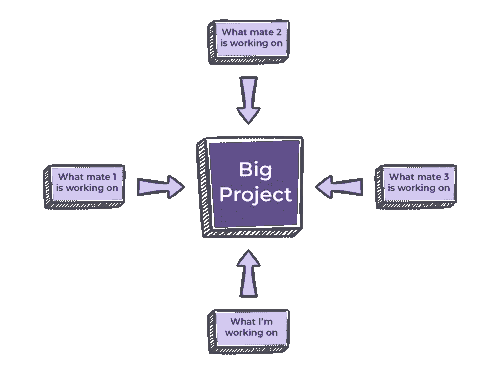

# 解释生活我 5: Git

> 原文：<https://medium.com/nerd-for-tech/explain-like-im-5-git-869329ad8514?source=collection_archive---------13----------------------->

由 [Unsplash](https://unsplash.com?utm_source=medium&utm_medium=referral) 上的 [La-Rel Easter](https://unsplash.com/@lastnameeaster?utm_source=medium&utm_medium=referral) 拍摄的照片

Git 是开发人员最有用的工具之一。它改善了团队协作并加快了工作过程，因为它允许您存储代码、跟踪更改并恢复到项目的以前版本。如果您还没有使用过 Git，请记住，它在开始时可能会有点困难。但是，一旦你熟悉了它，你会发现它非常简单。有点像生活中的一切，但在另一篇文章中有更多的内容。

按照这本书，你可以把 Git 定义为一个开源的分布式版本控制系统。而且，由于这个冗长的定义可能并没有真正的帮助，让我们把它分解一下，看看每个部分代表什么:

*   控制系统:这就是你如何知道 Git 是一个内容追踪器。它的一个主要目的是存储内容，其中 99%的时间是代码。
*   版本控制系统:存储在 Git 中的代码不断变化，越来越多的开发人员同时添加代码。考虑到这一点，对正在发生的一切有一个历史记录是很有用的。这就是版本控制系统介入的地方。
*   分布式版本控制系统:Git 有一个远程存储库，存储在服务器中，还有一个本地存储库，存储在每个开发人员的计算机中。这意味着每个开发人员在他们自己的计算机上都有一份代码副本。本地存储库是开发人员进行任何更改、测试和实验的地方，不会干扰从事同一项目的其他开发人员。远程存储库是与世界其他地方(或者仅仅是您的团队)共享代码最终版本的地方。为了更好地形象化我所说的，请看下图:

Git 如何工作

希望我能以一种对于渴望在技术世界工作的人来说可以理解的方式来分析 Git 是什么。但是，这就是你向 5 岁的自己解释 Git 的方式吗？我想没有。除非你当时知道“代码”、“存储库”或“开发人员”是什么意思。这样的话，我向你致敬。

**向 5 岁的自己解释 Git**

场景:你刚被送到幼儿园，你遇到了你的朋友。当你准备开始玩你从家里带来的玩具时，你的一个伙伴向你展示了他们的新乐高玩具。这是[乐高皇家骑士城堡](https://www.toysperiod.com/lego-set-reference/castle/royal-knights/lego-6090-royal-knights-castle/)，90 年代最受欢迎的乐高套装之一。你和你的四个朋友一起，组成一个小组，并决定开始工作。你想知道是在城堡的每个部分一起工作更好，还是在一些部分单独工作并在完成后将它们放在一起更好。

首先，你立刻开始做乐高玩具。没有人想分开工作，因为你想一起做所有的事情。虽然这听起来很有趣，但在开始的 20 分钟后，你会发现你实际上什么也没做。你不能决定如何开始组装城堡，因为你们 5 个人都想参与到这个过程的每一个部分。你感觉你的方法可能有点低效。城堡不可能由你们所有人一次建成。

所以，你带头提出一个新的计划。每个孩子都得到城堡的一部分，并独立工作。零件完成后，你就可以快速组装城堡了。当你一个人做这件事的时候，没有人会告诉你你做事情的方式是对还是错。当每个人都完成自己的工作时，你会注意到你们每个人都做得很好。如果城堡可以组装，这意味着你已经完成了这个项目。你做得很好！否则，你必须收回你的部分，重新开始工作。

Git 也是这样工作的。您有本地存储库，这是您工作的地方。然后，您有远程存储库，您的团队将他们在自己的本地存储库上分别做的事情放在一起。这也是其他分布式版本控制系统的工作方式。

**最后的想法**

随着项目有更多的开发人员同时工作，诸如 Git 这样的系统提供了一个安全的工作空间。它确保开发人员之间没有代码冲突，它允许您回到以前的版本或跟踪任何代码更改，并且它促进了团队的整体工作流和协作。

如果您在发展中国家迈出了第一步，并且想要有一个良好的开端，请尝试使用 Git。或者在类似的分布式版本控制系统(如 Mercurial 或 Bazaar)上运行。你可以从[这里](https://git-scm.com/book/en/v2/Getting-Started-Installing-Git)下载 Git 并开始使用。

另一件你可以测试的事情是在集中式版本控制系统或者本地版本控制系统上工作。分布式系统结合了两者的优点，因为在集中式系统中，您没有本地存储库，而在本地系统中，远程存储库丢失了。如果你是计算机科学专业的学生，你很可能已经体验过在本地版本控制系统上工作。

因为有更多的选择，所以由每个团队来决定哪种工作方式最适合他们。通常，战斗是在分布式和集中式之间进行的。集中版本控制系统的一个例子是 Subversion。要了解更多关于分布式和集中式系统的信息，请查看[这个 2 分钟的深刻而中肯的视频](https://www.youtube.com/watch?v=2ReR1YJrNOM)。