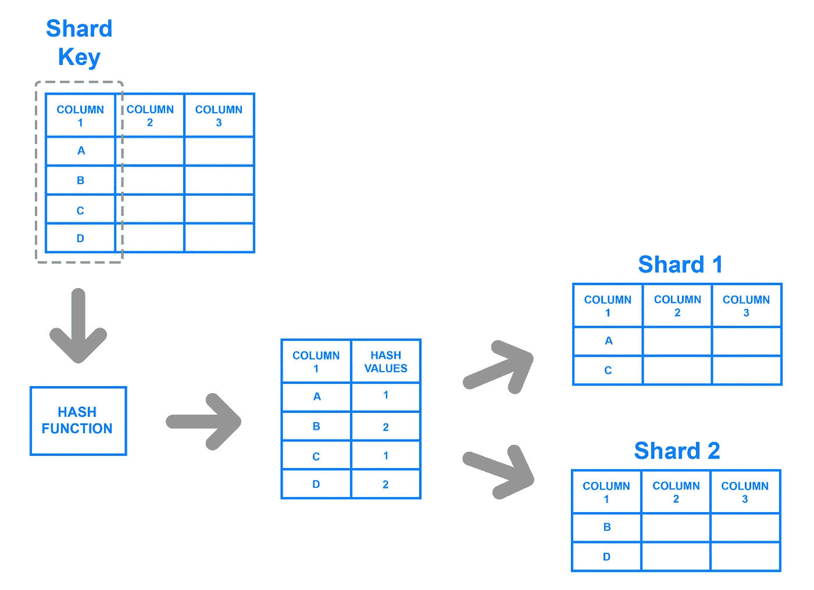
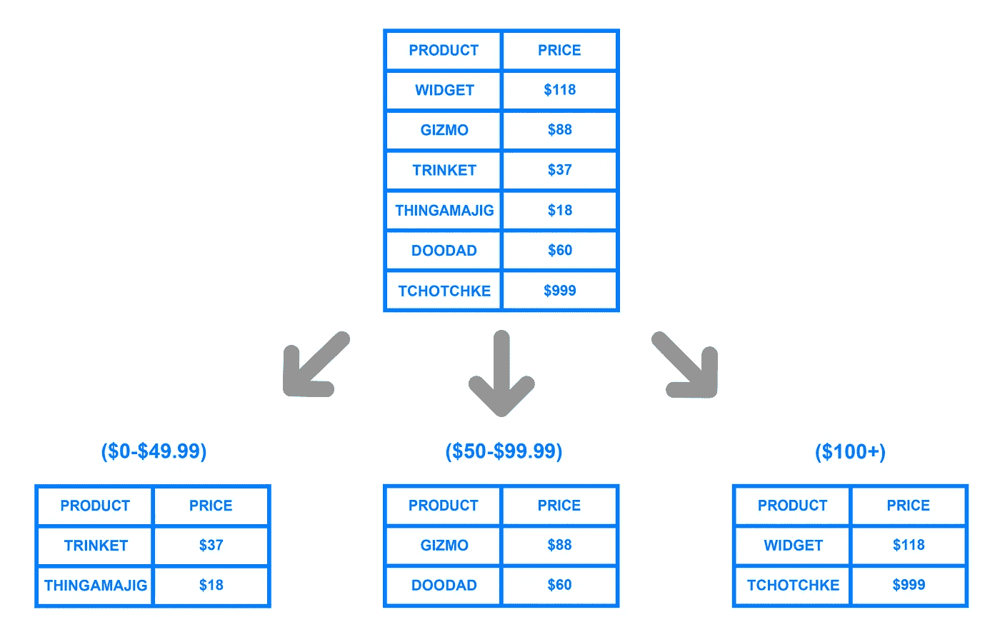

# 解释:数据库分片

> 原文：<https://medium.com/nerd-for-tech/explained-database-sharding-442b72eb28ed?source=collection_archive---------0----------------------->

你对数据库分片这个术语有什么理解？？

嗯， **Shard** 这个词的意思是“**整体**的一小部分”。因此，分片意味着将较大的部分分成较小的部分。这意味着将数据库分成小的数据库。嗯，事实上是的，但是怎么做呢？？答案在下面。

数据库分片是在多台机器上分割数据库以提高应用程序的可伸缩性的过程。在分片中，一个人的数据被分成两个或更多更小的块，称为*逻辑碎片*。逻辑碎片然后分布在单独的数据库节点上，称为*物理碎片*。

**需要分片:**

考虑一个非常大的数据库，它的分片还没有完成。例如，让我们以一个学院的数据库为例，其中整个学院的所有学生记录(现在和过去)都保存在一个数据库中。因此，它将包含非常大量的数据，比如 100，000 条记录。

现在，当我们需要从这个数据库中找到一个学生时，每次都要进行大约 100，000 次交易来找到这个学生，这是非常非常昂贵的。

现在考虑同样的大学生记录，根据年份分成更小的数据片段。现在，每个数据碎片将只有大约 1000-5000 名学生的记录。因此，不仅数据库变得更易于管理，而且每次的交易成本也大大降低，这是通过分片实现的。

因此，这就是为什么需要分片。

# ***分片类型:***

## 1.基于密钥的分片

*基于密钥的分片*，也称为*基于哈希的分片*，涉及使用从新写入的数据中获取的值，例如客户的 ID 号、客户端应用的 IP 地址、邮政编码等。—并将其插入到一个*散列函数*中，以确定数据应该进入哪个碎片。散列函数是一种函数，它将一段数据(例如，客户电子邮件)作为输入，并输出一个离散值，称为*散列值*。在分片的情况下，哈希值是一个分片 ID，用于确定传入数据将存储在哪个分片上。总的来说，该过程如下所示:

# 2.基于范围的分片

*基于范围的分片*涉及基于给定值范围的数据分片。举例来说，假设您有一个数据库，其中存储了零售商目录中所有产品的信息。您可以创建几个不同的碎片，并根据每个产品的价格范围来划分它们的信息，如下所示:

# 3.基于目录的分片

为了实现基于*目录的分片*，必须创建并维护一个*查找表*，它使用一个分片键来跟踪哪个分片保存了哪些数据。简而言之，查找表是一个包含一组静态信息的表，这些信息是关于在哪里可以找到特定数据的。下图显示了基于目录的分片的简单示例:

> *与基于范围的分片和基于键的分片相比，基于目录的分片更加灵活。基于范围的分片限制您指定值的范围，而基于键的分片限制您使用固定的基于哈希的函数。*

# 分片的好处:

对数据库进行分片的主要吸引力在于，它可以帮助促进*水平扩展*，也称为*向外扩展*。

*   ***较小的数据库更容易管理。*** 必须对生产数据库进行全面管理，以执行常规备份、数据库优化和其他常见任务。对于单个大型数据库，如果仅从完成所需的时间窗口来看，这些例行任务可能很难完成。通过使用分片方法，可以独立地维护每个单独的“碎片”,提供一个更易于管理的场景，并行地执行这样的维护任务。
*   ***数据库越小越快。*** 分片的可扩展性是显而易见的，通过在网络中的多个分片和服务器上分配处理来实现。不太明显的事实是，每个单独的碎片数据库将优于单个大型数据库，因为它的大小更小。通过将每个分片数据库托管在自己的服务器上，磁盘上的内存和数据之间的比例得到了适当的平衡，从而减少了磁盘 I/O 并最大限度地利用了系统资源。这将减少争用、提高连接性能、加快索引搜索和减少数据库锁。因此，分片系统不仅可以扩展到新的容量级别，单个事务的性能也会受益。
*   ***数据库分片可以降低成本。大多数数据库分片实现都利用了低成本的开源数据库和商品数据库。该技术还可以充分利用许多商业数据库的价格合理的“工作组”版本。与高端多 CPU 服务器和昂贵的存储区域网络(San)相比，分片技术可以很好地与商用多核服务器硬件和价格低廉的系统配合使用。由于节省了许可费、软件维护和硬件投资，总体成本降低幅度很大，与传统解决方案相比，在某些情况下降低了 70%。***

# 分片的缺点:

1.  **增加系统的复杂性:**适当地实现分片的数据库架构是一项复杂的任务。如果做得不正确，分片过程很有可能导致数据丢失或表损坏。分片也对你的团队的工作流程有很大的影响。
2.  **重新平衡数据:**在一个分片的数据库架构中，有时一个分片超过了其他分片，变得不平衡，这也被称为*数据库热点*。在这种情况下，对数据库进行分片的任何好处都被抵消了。数据库可能需要重新分片，以允许更均匀的数据分布。
3.  **连接来自多个碎片的数据:**为了实现一些复杂的功能，我们可能需要从分布在多个碎片上的不同来源提取大量数据。我们不能发出查询并从多个碎片中获取数据。我们需要向不同的分片发出多个查询，获取所有的响应并合并它们。
4.  **无本地支持:**并非每个数据库引擎都支持分片。正因为如此，分片往往需要“自己卷”。这意味着通常很难找到关于分片的文档或解决问题的技巧。

# **主要问题您应该在您的系统上实现它吗？**

也许是，也许不是，这取决于很多因素，一些人认为分片是达到一定规模的数据库的不可避免的结果，而另一些人认为这是一个令人头痛的问题，除非绝对必要，否则应该避免，因为分片增加了操作的复杂性。

由于复杂性的增加，分片通常只在处理大量数据时执行。以下是共享数据库可能有益的一些常见场景:

> 1.应用程序数据量的增长超过了单个数据库节点的存储容量。
> 
> 2.对数据库的写入或读取量超过了单个节点或其读取副本所能处理的量，导致响应时间变慢或超时。
> 
> 3.应用程序所需的网络带宽超过了单个数据库节点和任何读取副本可用的带宽，导致响应时间变慢或超时。

***在分片之前，您应该尝试所有其他优化数据库的选项。您可能需要考虑的一些优化包括:***

1.  设置远程数据库。
2.  实现缓存
3.  创建一个或多个副本
4.  升级到大型服务器

许多大的技术公司在他们的分布式系统中使用这种方法，他们中的许多人在某种程度上创新了这种方法，比如谷歌，facebook，亚马逊等等。

## 谷歌扳手和 HBase —范围分片

[这种类型的分片允许通过主键值高效地查询一系列行。这种查询的例子是查找位于下限和上限之间的所有关键字。](https://blog.yugabyte.com/four-data-sharding-strategies-we-analyzed-in-building-a-distributed-sql-database/)

你会看到许多大的技术公司在他们的系统设计中使用分片架构。

然而，对于那些希望横向扩展数据库的人来说，分片是一个很好的解决方案。但是，这也增加了复杂性，并为您的应用程序创造了更多潜在的故障点。对某些人来说，分片可能是必要的，但是创建和维护分片架构所需的时间和资源可能会超过对其他人的好处。

# **延伸阅读:**

 [## 摩尔先生在划片上下注

### 分片是一种数据库技术，将一个大数据库分成许多小数据库。而不是拥有 100 万…

signalvnoise.com](https://signalvnoise.com/posts/1509-mr-moore-gets-to-punt-on-sharding#)  [## 了解数据库分片|数字海洋

### 近年来，分片数据库受到了很多关注，但是很多人对分片数据库并没有一个清晰的理解…

www.digitalocean.com](https://www.digitalocean.com/community/tutorials/understanding-database-sharding#conclusion) 

以及系统设计大师 a . k . a . gaur av Sen 对数据分片的精彩解释

我希望你喜欢我的文章，我试图以最简单的方式解释数据库分片。为了解释软件开发中的系统设计，我开始了名为“解释:系统设计”的系列文章。

我希望你过得愉快，下次再见！！

**请在社交媒体上关注我:**

 [## Sparsh Gupta - Noida 工程学院&技术-新德里，德里，印度| LinkedIn

### 查看 Sparsh Gupta 在世界上最大的职业社区 LinkedIn 上的个人资料。Sparsh 有 3 个工作列在他们的…

www.linkedin.com](https://www.linkedin.com/in/sparsh-gupta-b80b5a169/) 

对于推特:[https://twitter.com/Sparsh94749562](https://twitter.com/Sparsh94749562)

对于 insta gram:[https://www.instagram.com/sparsh.gupta06/](https://www.instagram.com/sparsh.gupta06/)