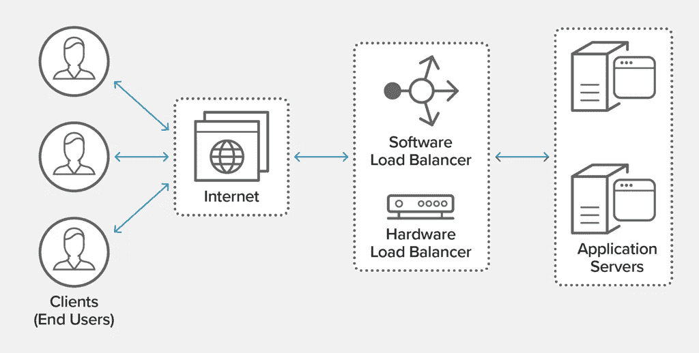
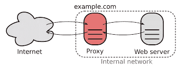
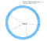
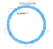

# 解释:负载平衡器

> 原文：<https://medium.com/nerd-for-tech/explained-load-balancer-89edc6d1f444?source=collection_archive---------0----------------------->

那么，什么是负载平衡器呢？它在哪里使用？？让我们在下面找到答案

因此，负载平衡器这个术语来源于 20 世纪 90 年代末，当时技术公司无法在单台大型计算机上处理大量流量，而且他们确实没有预算来购买新的计算机。

> "要发明，你需要一个好的想象力和一堆垃圾."—托马斯·阿尔瓦·爱迪生

爱迪生的名言非常适合 20 世纪 90 年代末的情况，然后他们出现了术语负载平衡器，负载平衡器是一种充当反向代理的设备，它通过网络或应用程序流量在服务器之间进行分配。就像下图一样。

> 反向代理是一种代理服务器，代表客户机从一个或多个服务器检索资源。代理是互联网和用户之间的媒介或网关。

# 那么，负载平衡实际上做什么呢？？

用更专业的语言来说，[负载平衡器](https://www.nginx.com/solutions/adc)充当位于您的服务器前面的“交通警察”,在所有能够满足这些请求的服务器之间路由客户端请求，从而最大限度地提高速度和容量利用率，并确保没有一台服务器超负荷工作，从而降低性能。如果一台服务器出现故障，负载平衡器会将流量重定向到其余的在线服务器。当一个新的服务器被添加到服务器组时，负载平衡器自动开始向它发送请求。

**要点** :-

*   跨多台服务器高效地分配客户端请求或网络负载
*   通过仅向在线服务器发送请求，确保高可用性和可靠性
*   提供根据需求增加或减少服务器的灵活性

如今，负载均衡器在每个大型可扩展的分布式系统中都是必不可少的，从每个视频流平台到电子商务平台，你都会在它们的系统设计中看到负载均衡器。例如，脸书，亚马逊，Airbnb，网飞，Youtube，谷歌等。负载平衡现在是系统设计的一个关键部分，现在你应该知道它是如何工作或运行的。

# 硬件与软件负载平衡

负载平衡器通常有两种类型:基于硬件的和基于软件的。基于硬件的解决方案的供应商将专有软件加载到他们提供的机器上，这些机器通常使用专门的处理器。为了应对网站流量的增加，你必须从供应商那里购买更多或更大的机器。软件解决方案通常运行在商用硬件上，使它们更便宜、更灵活。您可以将软件安装在自己选择的硬件上，或者安装在 AWS EC2 这样的云环境中。

# 负载平衡算法

不同的负载平衡算法提供不同的好处；负载平衡方法的选择取决于您的需求:

*   **循环调度** —请求按顺序分布在服务器组中。
*   **最少连接** —新请求被发送到当前与客户端连接最少的服务器。每台服务器的相对计算能力是决定哪台服务器连接最少的因素。
*   **最短时间** —向由公式选择的服务器发送请求，该公式结合了
    最快的响应时间和最少的活动连接。NGINX Plus 专属。
*   **Hash** —基于您定义的密钥分发请求，例如客户端 IP 地址或
    请求 URL。NGINX Plus 可以有选择地应用一致的散列来最小化负载的重新分配
    ,如果上游服务器组改变的话。
*   **IP 哈希** —客户端的 IP 地址用于确定哪个服务器接收请求。
*   **随机选择两个选项** —随机挑选两个服务器，然后将请求发送到
    通过应用最少连接算法(或者对于 NGINX 加
    最少时间算法，如果这样配置的话)选择的服务器。

最常用的是一致散列法，

# 一致散列法

# 哈希函数和模数(%)

将具有唯一标识符(例如 IP 地址)的所有传入请求被假定为均匀随机的。

使用散列函数，我们能够获得一个输出值，之后我们应用模函数来获得对应于负载平衡器应该将请求定向到的服务器的数字。

1.  哈希(IP 地址)→输出
2.  服务器数量的输出百分比-1 →服务器 ID

使用良好的哈希函数来确保输出值分布在一个值范围内以提高随机性是很重要的。然后，模函数保证服务器 ID 在 0 的范围内。(服务器数量-1。)

# 可视化映射

让我们后退一步，想象一下如何使用数组作为数据结构将每个请求映射到服务器。

在下面这个简单的例子中，数组的索引直接映射到服务器 ID，但是在生产环境中不一定是这样。因此，利用像数组这样的数据结构可以让我们更灵活地将输出映射到我们喜欢的服务器。

解决方案是使用一致的散列法。让我们先试着用三个步骤来形象化这个概念。

# 步骤 1:将请求映射到环上的一个位置

现在，让我们想象一个圆形数组，而不是一个规则的数组。类似于数组，每个请求现在都映射到散列环上的一个位置。

一个哈希环，其中每个客户端请求映射到一个索引

# 步骤 2:将服务器映射到环上的某个位置

因为每个服务器都有一个 ID，所以我们可以将应用于 IP 地址的相同散列和模函数应用于服务器 ID。让我们假设所选择的散列函数是最优的，并且我们在 IP 地址和服务器 ID 之间没有冲突。

某些索引现在被映射到服务器

# 第三步:顺时针移动

既然我们已经将请求和服务器映射到一个环上，那么最后一步就很简单了。

对于每个请求，我们只需以顺时针方式找到其右侧最近的服务器。例如，映射到索引 7 的传入请求由映射到索引 9 的服务器提供服务。

# 一致哈希如何最大限度地减少对其他服务器的影响？

由于请求由最右边的服务器提供服务，因此服务器数量的变化最多会影响一个其他服务器。

在上面的示例中，添加了一个新服务器，它映射到索引 95。映射到索引 88 的请求现在由映射到索引 95 的新服务器提供服务，而不是以前映射到索引 99 的服务器。

在这种情况下，只有映射到索引 99 的服务器需要使其缓存无效。同样，如果一台服务器被移除，下一台服务器的邻居将接管负载，而其他服务器不会受到影响。

在寻找最近的邻居时，一致散列的概念避免了强加在其他服务器上的改变的昂贵成本，并且将成本降低到常数。

# 负载平衡的优势

*   减少停机时间
*   可攀登的
*   裁员
*   灵活性
*   效率
*   全局服务器负载平衡

# 进一步阅读

 [## 什么是负载平衡？负载平衡器如何工作

### 负载平衡指的是在一组后端服务器之间有效地分配传入的网络流量，也…

www.nginx.com](https://www.nginx.com/resources/glossary/load-balancing/) 

Gaurav Sen 关于负载平衡和一致性哈希的视频，以便更好地理解

负载平衡器

一致散列法

我希望你喜欢我的文章，我试图用最简单的方式解释负载平衡和一致性散列。为了解释软件开发中的系统设计，我开始了名为“解释:系统设计”的系列文章。这是第二集，第一集在[https://medium . com/nerd-for-tech/explained-database-sharding-442 b 72 EB 28 ed](/nerd-for-tech/explained-database-sharding-442b72eb28ed)

对于那些不知道的人。

## 希望大家喜欢，分享一下。请在社交媒体平台上为我展示你的支持。这有助于我保持斗志。

 [## Sparsh Gupta -技术作家-技术书呆子| LinkedIn

### 查看 Sparsh Gupta 在世界上最大的职业社区 LinkedIn 上的个人资料。Sparsh 有 4 个工作列在他们的…

www.linkedin.com](https://www.linkedin.com/in/sparsh-gupta-b80b5a169/) 

对于 insta gram:【https://www.instagram.com/sparsh.gupta06/】T2

推特:https://twitter.com/Sparsh94749562