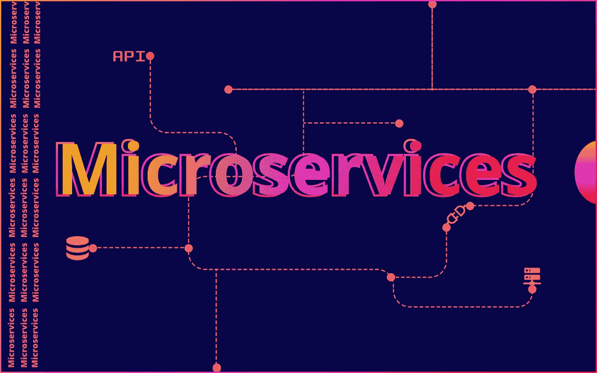
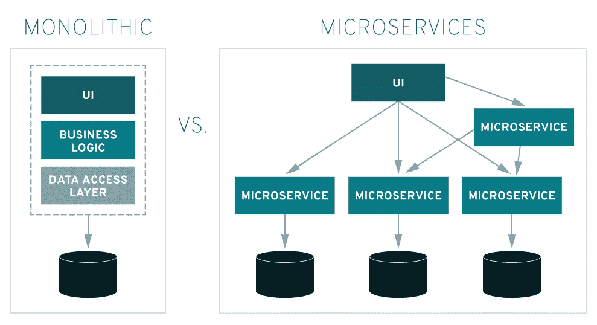

# 解释:微服务

> 原文：<https://medium.com/nerd-for-tech/explained-microservices-657c5e882fa8?source=collection_archive---------1----------------------->

## 在这一部分，我们将讨论微服务以及为什么它在技术行业越来越受欢迎。

# 一、什么是微服务？

**微服务**是一种使用容器构建分布式应用的架构设计。**微服务**之所以得名，是因为应用程序的每个功能都作为独立的服务运行。这种架构允许每个服务在不中断应用程序中其他服务的情况下进行扩展或更新。

> 啊，需要较低级的技术定义吗？？在底下

所以，让我们想象一个政府试图在他们的国家建造或发展一条高速公路，但是政府将会如何计划它。嗯，回答他们会把流程分成小流程就这样。他们将分阶段建设高速公路，甚至会有更多的部门，例如材料提供，测试，运输，以创建一个系统。

这就是在创建大型分布式系统的系统设计或软件开发中，我们分解开发过程的方式。因为像这样将会有许多服务独立运行以支持其他服务成为一个合适的系统。就像上面这张图片一样。

# 为什么它比其他建筑更好

微服务架构与更传统的整体方法的区别在于它如何将应用程序分解为核心功能。每个功能称为一个服务，可以独立构建和部署，这意味着单个服务可以运行(或失败)而不会对其他服务产生负面影响。这有助于您接受 DevOps 的技术方面，并使[持续迭代和交付(CI/CD)](https://www.redhat.com/en/topics/devops/what-is-ci-cd) 更加无缝和可实现。

想想你最近一次去网上零售商。你可能已经使用了网站的搜索栏来浏览产品。这种搜索代表一种服务。也许你还看到了相关产品的推荐——来自购物者偏好数据库的推荐。那也是一种服务。您是否向在线购物车添加了商品？你猜对了，又一个服务。

这就是为什么微服务架构在科技行业如此广泛地使用

# 优势

*   **开发人员独立性**:小团队并行工作，可以比大团队迭代得更快。
*   **隔离和弹性**:如果一个组件死了，你可以在一段时间内启动另一个组件，应用程序的其余部分可以继续运行。
*   **可伸缩性**:更小的组件占用更少的资源，并且可以伸缩以满足对该组件不断增长的需求。
*   **生命周期自动化**:单个组件更容易适应连续的交付管道和复杂的部署场景，而这在单片系统中是不可能的。
*   **与业务的关系**:微服务架构沿着业务领域边界划分，增加了整个组织的独立性和理解。
*   **更快上市:**由于开发周期缩短，微服务架构支持更敏捷的部署和更新。

# 怎么会有人从微服务入手？

好的，首先你应该知道等等，等等，等等……你只需要知道分解一个过程或者分解系统。设计一个系统。这是多么容易

1.  首先，尝试在您想要或可能成为的服务中进行分区
2.  第二，设计使运行服务相互独立
3.  尝试使服务有助于服务流
4.  决定您将为特定服务使用哪些构建工具。
5.  服务同步(最重要)
6.  构建和部署
7.  制定标准
8.  故障解决
9.  监控和记录
10.  生产部署

# 挑战…

会有优势，但也有一些挑战

1.  **构建:**你必须花时间识别服务之间的依赖关系。请注意，由于这些依赖性，完成一个构建可能会触发其他几个构建。
2.  **测试:** [集成](https://www.redhat.com/en/solutions/agile-integration)测试，以及端到端测试，会变得比以往更加困难，也更加重要。
3.  **版本化:**当您更新到新版本时，请记住您可能会破坏向后兼容性。您可以构建条件逻辑来处理这种情况，但这很快就会变得笨拙而令人讨厌。
4.  **部署:**是的，这也是一个挑战，至少在初始设置阶段是如此。为了使部署更容易，您必须首先投资相当多的[自动化](https://www.redhat.com/en/topics/automation)，因为微服务的复杂性对于人工部署来说变得难以承受。
5.  **日志记录:**对于分布式系统，您需要集中的日志来将所有的东西集中在一起。否则，规模是无法管理的。
6.  **监控:**拥有一个集中的系统视图来查明问题的根源是至关重要的。
7.  **调试:**通过您本地的[集成开发环境(IDE)](https://www.redhat.com/en/topics/middleware/what-is-ide) 进行远程调试不是一个选项，它不能跨数十或数百个服务工作
8.  **连接性:**考虑服务发现，无论是集中式的还是集成式的。

试着一次迈出一小步，随着时间的推移和经验的积累，你会成功的。祝您在这条激动人心的微服务架构之路上一切顺利。

# 更多阅读资料:-

 [## 什么是微服务？

### 登录/注册帐户选择语言微服务微服务是一种构建…

www.redhat.com](https://www.redhat.com/en/topics/microservices/what-are-microservices)  [## 什么是微服务？

### 微服务——也称为微服务架构——是一种构建应用程序的架构风格…

微服务. io](https://microservices.io/) 

请喜欢并分享我的内容，

 [## Sparsh Gupta -技术作家-技术书呆子| LinkedIn

### 查看 Sparsh Gupta 在世界上最大的职业社区 LinkedIn 上的个人资料。Sparsh 有 4 个工作列在他们的…

www.linkedin.com](https://www.linkedin.com/in/sparsh-gupta-b80b5a169/)