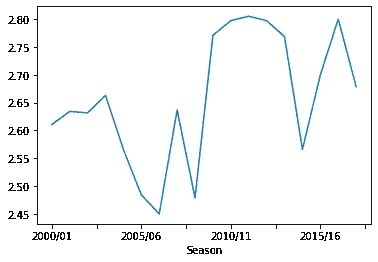
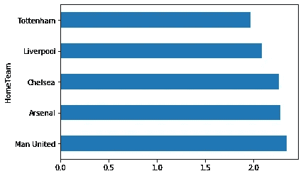
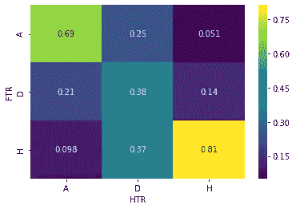

# 探索性数据分析:英格兰超级联赛

> 原文：<https://medium.com/nerd-for-tech/exploratory-data-analysis-english-premier-league-d9581623dd5?source=collection_archive---------10----------------------->

对英格兰顶级联赛历史的深入分析以及一些很酷的功能

EPL 是世界上最受欢迎、竞争最激烈的足球联赛之一，拥有来自世界各地的数百万球迷。在本文中，我们将对 EPL 的数据进行一些探索性的数据分析。我们还将通过一些很酷的函数来导出表的位置和释放。

我们手头的数据集可以从以下链接下载。[https://www.kaggle.com/saife245/english-premier-league](https://www.kaggle.com/saife245/english-premier-league)

为了这个分析，我们将下载从 2000/01 到 2017/18 的 18 个赛季的数据集。数据集在不同的 excel 文件(18 个文件)中，所以我们需要一个 for 循环来下载文件列表

```
cwd = os.path.abspath('') 
files = os.listdir(cwd)
df = pd.DataFrame()
for file in files:
     if file.endswith('.csv'):
            df = df.append(pd.read_csv(file), ignore_index=True) 
```

使用上面的代码，我们能够下载 18 个不同的文件，并且能够合并成一个完整的文件。在进行了一些数据预处理，删除了丢失的值之后，我们得到了一组 6460 行的数据，包括以下各列。

Div =联赛分区
日期=比赛日(日/月/年)
主队=主队
客场队=客场队
FTHG =全职主队进球
FTAG =全职客场队进球
FTR =全职成绩(H =主场胜，D =平局，A =客场胜)
HTHG =半场主队进球
HTAG =半场客场队进球
HTR =半场成绩(H =主场胜，D =平局，A =客场胜)

匹配统计数据(如果可用)
上座率=观众上座率
裁判=比赛裁判
HS =主队射门
AS =主队射门
HST =主队射门对准目标
AST =主队射门对准目标
HHW =主队击中门框
AHW =主队击中门框
HC =主队角球
AC =主队角球
HF =主队犯规
AF =主队犯规
HO = 主队越位
AO =客队越位
HY =主队黄牌
AY =客队黄牌
HR =主队红牌
AR =客队红牌

在将数据集减少到这些列之后，我觉得需要添加一些列。首先，FTR 的结果栏只说明结果是对主队有利还是对客队有利。为了改变这一点，我增加了两列:(获胜队和失败队)。数据转换的代码如下所示

```
conditions=[df['FTR']=='H',df['FTR']=='A',df['FTR']=='D']
choices=[df.AwayTeam,df.HomeTeam,'Match Drawn']
choices2=[df.HomeTeam,df.AwayTeam,'Match Drawn']
df['Losing Team']=np.select(conditions,choices,default=np.nan)
df['Winning Team']=np.select(conditions,choices2,default=np.nan)
```

此外，数据集也没有季节。要添加季节，我们可以使用 for 循环来添加季节，以升序格式对数据进行排序。EPL 通常有 380 场比赛，因此在 380 行数据之后，赛季将不得不改变。

现在我们已经完成了一些数据转换，让我们尝试进行一些基本的数据分析并回答一些问题。

# **过去 18 年的平均进球数趋势如何？**

要回答这个问题，我们可以使用 pandas 中的 groupby 函数来绘制一个线图。代码如下所示。

```
df.groupby('Season')['Total Goals'].mean().plot(kind='line')
```



按赛季平均进球/比赛得分

上面的线形图显示，每场比赛的平均进球数约为 2.5 至 2.8 个，2012 至 2015 赛季是进球数最多的赛季。

# **Q2)对比过去 18 年球队的主场赛季记录**

为此，我们将增加另一栏，将计算每场比赛的 hme 和客场球队的积分。我们将使用与之前获胜团队栏相同的格式。

```
conditions=[df['FTR']=='H',df['FTR']=='A',df['FTR']=='D']
choices=[3,0,1]
choices2=[0,3,1]
df['HomeTeamPoints']=np.select(conditions,choices,default=np.nan)
df['AwayTeamPoints']=np.select(conditions,choices2,default=np.nan)
```

转换后，我们可以添加一个 groupby 列，并绘制一个条形图，以查看球队在主场的平均得分。

```
df.groupby("HomeTeam")['HomeTeamPoints'].mean().sort_values(ascending=False).head(5).plot(kind='barh')
```



平均积分/主场比赛

从上表可以看出，2000 年的前 4 名拥有最好的主场记录。

使用这个数据集，我们将尝试绘制任何一年的季节表。我们稍后将把它开发成一个用户函数，用户可以输入季节并得到季节表。

```
def table():
    x=input("Please enter the season table that you want?")
    df_season=df[df['Season']==x]
    group1=df_season.groupby('HomeTeam')['HomeTeamPoints'].sum()
    group2=df_season.groupby("AwayTeam")['AwayTeamPoints'].sum()
    final=group1+group2
    final=final.sort_values(ascending=False)
    return final
```

上面的函数将能够导出我们想要的任何一年的季节表。该表可用于进一步分析。例如，使用相同的代码，我们可以得出平均最低积分要求，以避免降级。

```
sum1=0
for i in season:
    df_season=df[df['Season']==i]
    group1=df_season.groupby('HomeTeam')['HomeTeamPoints'].sum()
    group2=df_season.groupby("AwayTeam")['AwayTeamPoints'].sum()
    final=group1+group2
    final=final.sort_values(ascending=False)
    sum1=sum1+final.iloc[16]print("Average points required to escape relegation is ", round(sum1/18,0)
```

上述代码的结果是 38，这意味着平均积分足以逃脱降级，并留在 EPL。类似地，我们可以用它来查看获得前 4 名所需的最少点数。

```
sum1=0
for i in season:
    df_season=df[df['Season']==i]
    group1=df_season.groupby('HomeTeam')['HomeTeamPoints'].sum()
    group2=df_season.groupby("AwayTeam")['AwayTeamPoints'].sum()
    final=group1+group2
    final=final.sort_values(ascending=False)
    sum1=sum1+final.iloc[3]print("Average points required to achieve Top4 place is ", round(sum1/18,0)
```

上述代码的结果是 70，这意味着平均 70 分足以确保一个冠军联赛的席位。我们现在可以进一步评估裁判在决定比赛结果中有多重要。

为此，我们将进行一个假设检验，看看裁判对主队和弱队的态度是否有显著差异。对于这个分析，我们将再添加两列(主队预订积分)和(客队预订积分)。该代码将为每张黄牌分配 15 个预订点，为每张红牌分配 25 个预订点。

```
df['HBP']=df['HY']*15+df['HR']*25
df['ABP']=df['AY']*15+df['AR']*25
```

接下来，我们将进行 t 检验，以确定裁判对主队和客场队的态度是否有显著差异。

```
stat, p = ttest_ind(df.HBP, df.ABP)
print('Statistics=%.3f, p=%.3f' % (stat, p))
```

p 值约为 0，表明裁判对主队和客场队的态度存在显著差异。

EPL 最著名的事情之一就是势均力敌的比赛和激动人心的逆转。我们可以分析这些数据，看看改变主场和客场输球的球队的半场成绩有多容易。

```
sns.heatmap(pd.crosstab(df.FTR,df.HTR,normalize='columns'),cmap='viridis',annot=True)
```



例如，根据上面的热图，在 EPL 只有 5.1%的比赛中，客队能够逆转半场失利的结果。然而，如果客队在半场时获胜，他们有 69%的机会成为胜利者。此外，如果主队在半场时获胜，81%的主队最终会获胜。

最后，我们将分析一些主要车队的直接结果。我已经创建了一个功能，用户可以根据自己的意愿进入球队，代码将准备一个表格，列出头对头的记录。

```
def win_loss():
    team1=input("Please enter your first team")
    team2=input("Please enter your second team")
    new_df=df[(df['HomeTeam']==team1) | (df['HomeTeam']==team2)]
    new_df=new_df[(new_df['AwayTeam']==team1) | (new_df['AwayTeam']==team2)]
    return new_df['Winning Team'].value_counts()
```

例如，使用这个代码，我们可以看到阿森纳和切尔西的交锋记录。

```
Chelsea        14
Match Drawn    13
Arsenal         9
```

我希望你喜欢它。要连接，请通过以下链接访问我的 LinkedIn 个人资料。

[https://www.linkedin.com/in/suhaib-kamal/](https://www.linkedin.com/in/suhaib-kamal/)