# 探索性数据分析初学者指南

> 原文：<https://medium.com/nerd-for-tech/exploratory-data-analysis-for-absolute-beginners-titanic-survival-data-bc5ab3ee2c53?source=collection_archive---------10----------------------->

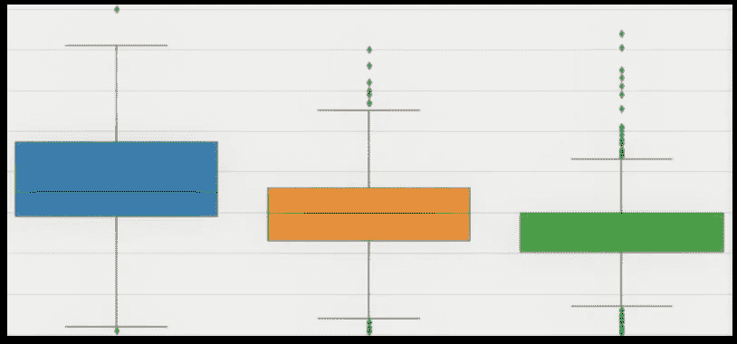

泰坦尼克号沉没的故事，从统计学的角度，用情节和数字叙述。

**什么是 EDA** :这是每一个成功的机器学习模型的第一步，是理解和熟悉数据的过程。

在 EDA 中，我们使用一些统计和可视化工具，如 Matplotlib 和 Seaborn，来理解手头的数据，并尽可能多地理解模式和关系。我们试图了解哪些特征在预期输出的预测中最有用。

通过对数据执行彻底的 EDA 和特征工程，我们可以使建模任务变得不费力且更高效。

来源:*《泰坦尼克号下》(T5)作者[威利·斯托尔](https://en.wikipedia.org/wiki/Willy_St%C3%B6wer)，1912 年*

如果我回到过去，登上泰坦尼克号，我能不能活下来？😎

让我们尝试使用简单的探索性数据分析来了解生存的几率。

你可以从[https://www.kaggle.com/c/titanic-dataset/data](https://www.kaggle.com/c/titanic-dataset/data)下载数据集

# **步骤 1** : **导入库并加载数据**

*   像 Pandas，Numpy，Matplotlib，Seaborn 这样的 Python 库，让我们很容易执行 EDA。
*   我们使用“%matplotlib inline”命令来查看 Jupyter 笔记本本身的绘图。

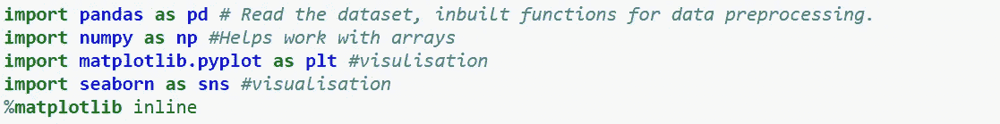

*   我们可用的数据在一个 CSV 文件中，它代表逗号分隔的值。
*   我们使用“read_csv()”将数据加载到“df”数据帧中。

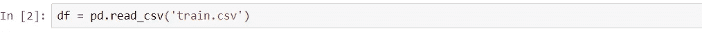

# **第二步:获得数据的基本概述**

*   “df.head()”让我们看到了数据帧的前几行。

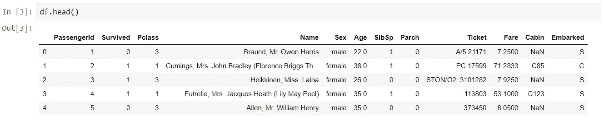

*   " df.shape()":获取数据帧的形状。有 891 行和 12 列。

*   " df.info()":基本信息，如列中非空值的数量、它们的数据类型等。

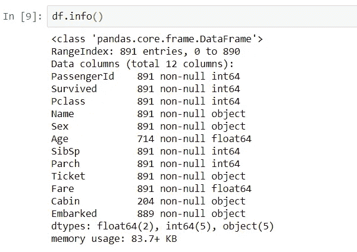

*   " df.describe()":重要的统计数据，如数字特征的平均值、中值和百分位数。

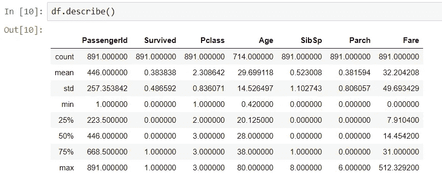

*   " df.drop()":删除那些显然不会给模型增加任何价值的特性。

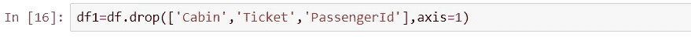

*   " df1.isnull()。sum()":哪一列有多少个空值？

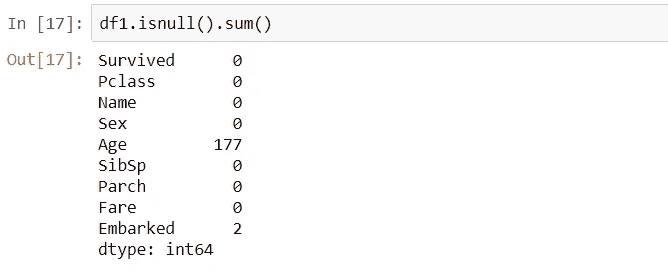

*   用特征平均值填写“年龄”栏中的 Nan 值，用特征模式填写“上船”栏中的 Nan 值。

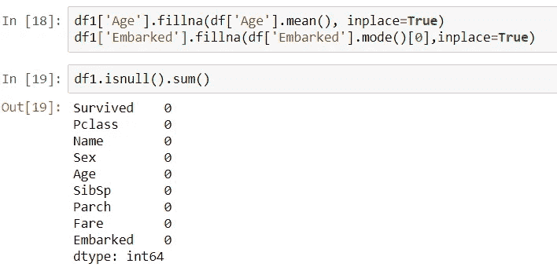

**让我们试着回答一些关于船上的人的基本问题:**

*   泰坦尼克号上乘客的男女比例是多少？:从下图可以看出，船上的男性比女性多得多。

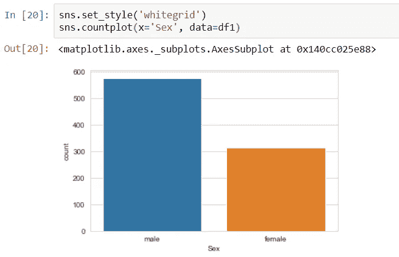

*   *数据是如何按照乘客等级分布的？与 1 和 3 等舱相比，3 等舱的乘客更多。*

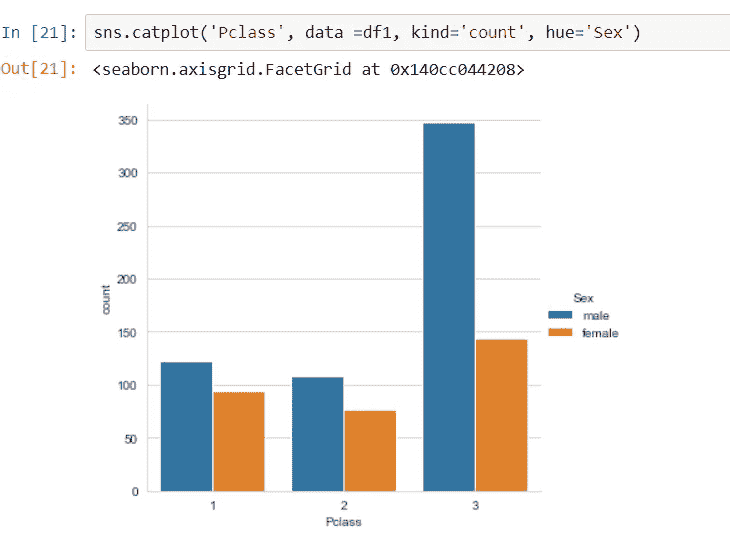

*   有多少活下来了，有多少没活下来？幸存的人数明显更少。

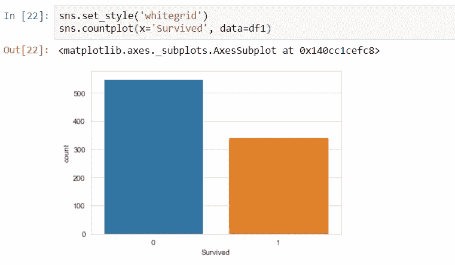

# **步骤 3:开始分析**

*   在进行分析时，请记住我们针对这个特定问题进行 EDA 的原因。我们的目标应该是发现模式、关系和知识，这将有助于预测乘客的生存能力或为我们创造对数据的更好理解。

**~~ >性**

*   男性和女性幸存者的人数差距很大。区分存活者和非存活者(死亡)的特征将有助于预测。

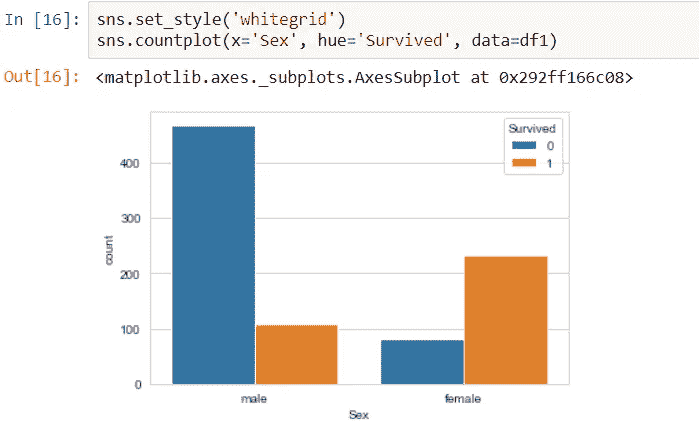

**~~ >客运班**

*   一等舱中超过 50%的乘客幸存下来，而三等舱中幸存的人数远远少于未生还的人数。
*   这可能是因为第三等级的人太多，或者是由于社会经济地位。

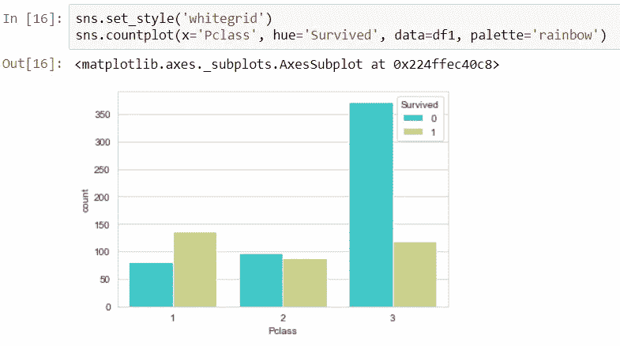

**~~ >年龄**

*   大多数乘客在 20 到 40 岁之间。

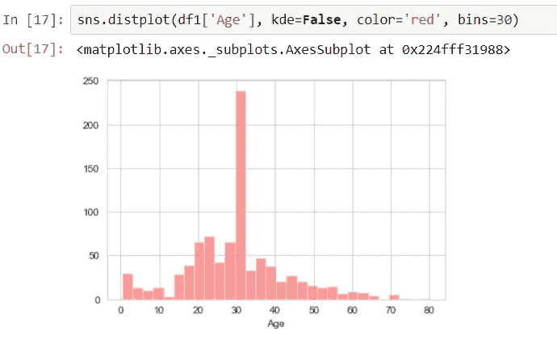

**~~ >兄弟姐妹配偶**

*   我们可以看到，大多数人都是独自旅行或在一个小公司。

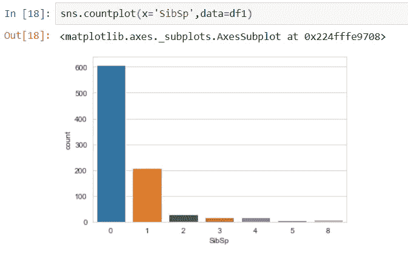

*   在与一个 Sibsp 一起旅行的乘客的情况下，幸存的人数多于未幸存的人数。

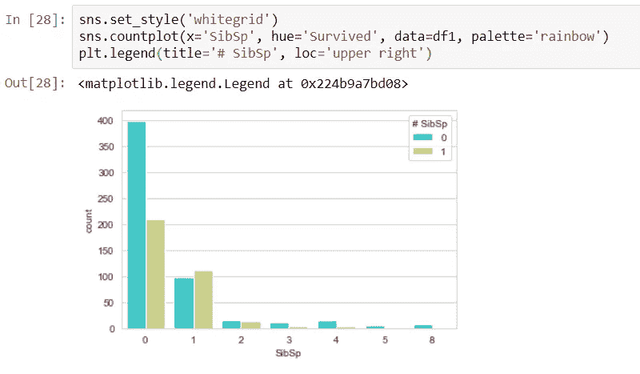

**~~ >票价**

*   “票价”直方图的右边有一条尾巴。大多数乘客都以经济的票价旅行。

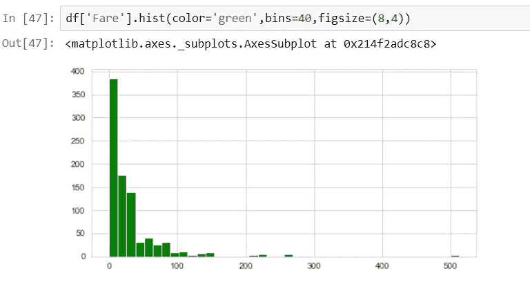

*   支付更高票价的人有更高的生存机会。

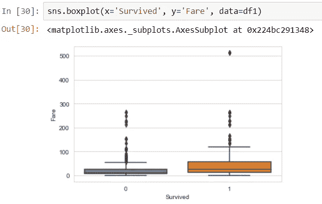

**~ ~>p 级 v/s 年龄**

*   年龄越大，乘客等级越高。

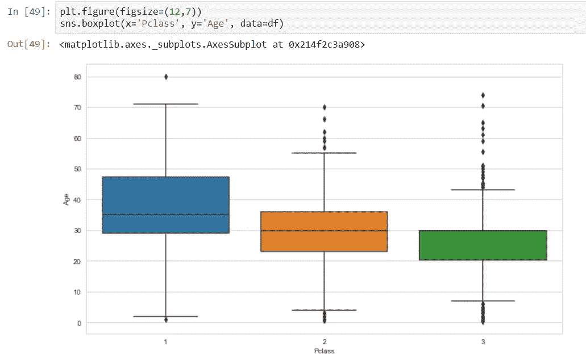

**~~ >乘客等级和年龄**

*   为了更清楚地显示年龄，我将每个乘客的年龄划分为不同的区间，并创建了一个新的列“binned_age”。
*   为了观察“阶级”和“年龄”对存活率的综合影响，我使用了熊猫方法“交叉表”。
*   在最后两个箱的第一类中，存活的数量小于未存活的数量。

**~~ >乘客等级和性别**

*   一等舱和二等舱的大部分女性都活了下来。
*   第二和第三类的大多数男性都死了。

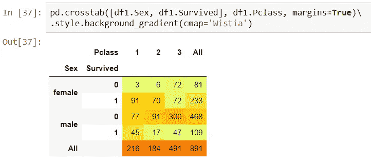

**要回答第一个问题，如果我回到过去，登上皇家邮轮泰坦尼克号，让我想想:**

如果我只考虑乘客级别和性别作为决定因素，事情就简单化了。

*   我是男性
*   考虑到我的财政状况，我会买一张三等票(2021 年差不多 100，000 印度卢比)😮).

使用上面输出[37]中的交叉表，我的生存概率是:(47/347) = 0.1354

> 只有 13.5%。不，我的机会似乎不大，我宁愿用我的时间机器去侏罗纪时代探险。

玩笑归玩笑，这只是 EDA 的一个基本演示，还有许多其他方式可以将这些数据可视化为许多其他功能的组合。您可以尝试要素提取来构建新要素。

我计划做一些越来越复杂的 EDA 项目。

再见，回头见。