# 印度 2019 年人民院选举的探索性数据分析

> 原文：<https://medium.com/nerd-for-tech/exploratory-data-analysis-of-lok-sabha-election-2019-in-india-f73762268bd8?source=collection_archive---------3----------------------->

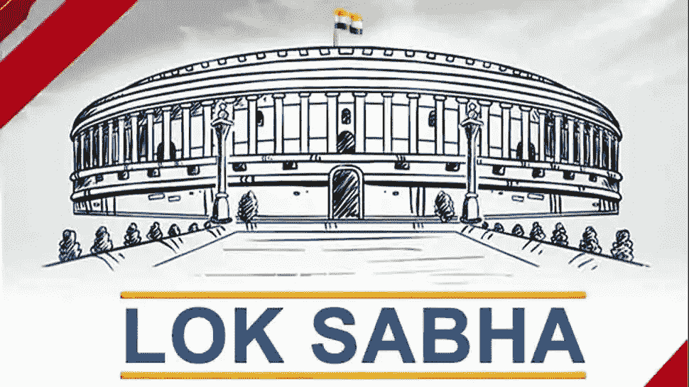

人民院是印度两院制议会的下院，上院是联邦院。人民院成员通过成人普选和得票最多者当选制选举产生，代表各自的选区，任期五年或直至总统根据部长会议的建议解散该机构。议会在新德里 Sansad Bhavan 的人民院开会。

印度宪法规定众议院的最高席位是 552 人(最初在 1950 年是 500 人)。目前，众议院有 543 个席位，最多由 543 名当选议员选举产生。在 1952 年至 2020 年期间，印度总统还根据印度政府的建议提名了另外两名英印社区成员，该建议于 2020 年 1 月被 2019 年第 104 号宪法修正案废除。人民院有 550 个座位。

总共为在册种姓(84 个)和在册部落(47 个)代表保留了 131 个席位(24.03%)。众议院的法定人数是全体议员的 10%。除非提前解散，否则人民院从指定召开第一次会议之日起继续运作五年。然而，在宣布紧急状态时，议会可以通过法律或法令延长这一期限。

**大选**于 2019 年 4 月 11 日至 5 月 19 日分七个阶段在[举行，选举](https://en.wikipedia.org/wiki/India)[第 17 届人民院](https://en.wikipedia.org/wiki/17th_Lok_Sabha)议员。计票结果于 5 月 23 日公布。大约有 9.12 亿人有资格投票，投票率超过 67%，是有史以来最高的，也是女性选民参与的最高水平。

印度人民党获得了 37.36%的选票，赢得了 303 个席位，进一步扩大了它的绝大多数席位，BJP 领导的 T2 全国民主联盟获得了 353 个席位。[印度国大党](https://en.wikipedia.org/wiki/Indian_National_Congress)赢得 52 个席位，未能获得要求担任反对党领袖所需席位的 10%，国大党领导的[联合进步联盟](https://en.wikipedia.org/wiki/United_Progressive_Alliance_(India))赢得 91 个席位。其他政党及其联盟赢得 98 个席位。

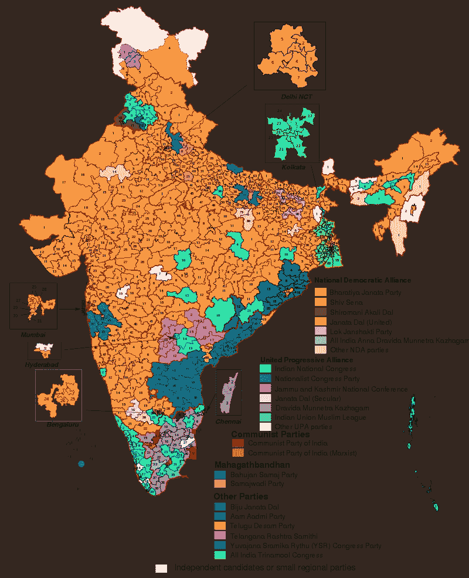

个人影响政府决策的最重要方式之一是投票。我们知道在我们国家每个人都有投票权。但是很多人对政治并不了解。因此，通过这个项目，我们可以了解不同的政党，他们的背景历史，以及他们最近在 2019 年印度人民院选举中的成功和失败。不幸的是，我们发现很少有候选人有犯罪史。所以通过这个数据分析，我们可以了解候选人的历史和政党的性质。我们可以了解获胜的一方以及他们在 2019 年的成功。在这部作品中，我们将主要关注**国家、获奖者、政党、性别、刑事案件、年龄**、**类别、教育。**

> **注:**
> 
> **我们特别要提到的是，这是一项无偏见的分析。在这方面，我们没有支持任何特定的一方。我们不想伤害任何政治观点，这不是一个基于宣传的审查。所以作者不承担任何后果。**

现在让我们开始这个项目包含什么。

# 数据集:

该数据集基于印度的 Lok Sabha 2019。这个数据集中总共有 2263 行和 19 列。通过使用这个数据集，创建了这个数据分析项目。

正如我们之前解释的，我们主要关注州、获胜者、政党、性别、刑事案件、年龄、类别、教育。

# **显示数据集:**

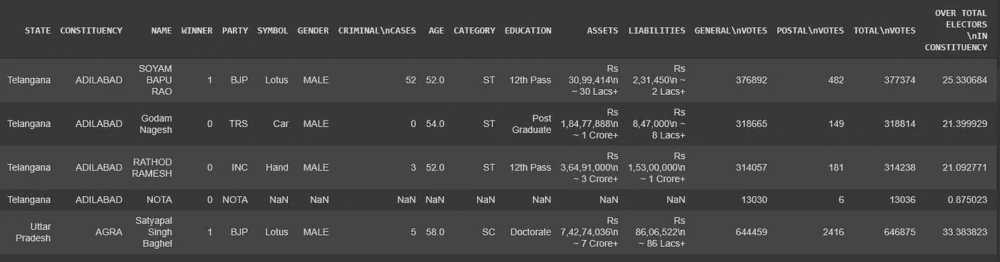

# 关于数据集中所有列的信息:

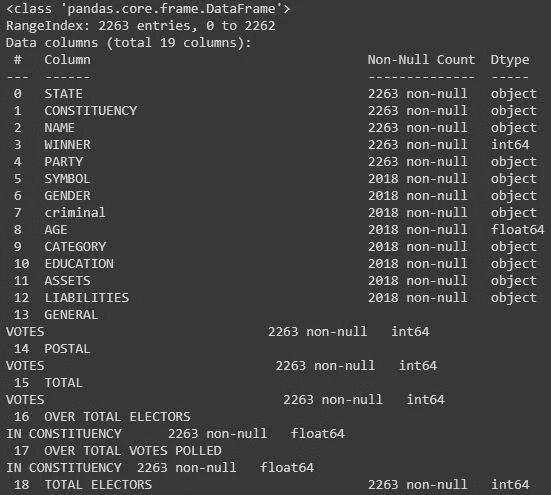

# 数据集的描述:

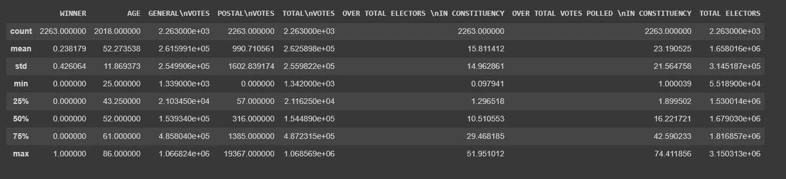

如我们所见，候选人的平均年龄是 52 岁。最年轻的候选人年龄是 25 岁。25%的候选人年龄在 43 岁以下。50%的候选人年龄在 52 岁以下。75%的候选人年龄在 61 岁以下。最年长的候选人年龄是 86 岁。

# 数据之间的相关性:

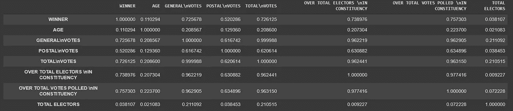

# 犯罪:

因为在“犯罪”列中存在“不可用”值，所以我们将其更改为 0 犯罪。

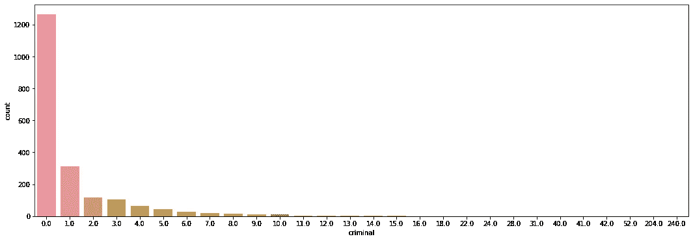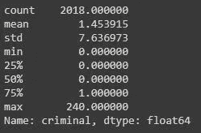

从下面给出的描述中，我们可以看到，参赛者的平均犯罪率为 1.45，对于最低犯罪率，25%和 50%的参赛者没有犯罪，但可悲的是，在 75 %的候选人中，犯罪率为 1.0。更令人惊讶的是，一个人设想的最大犯罪是 240，这是一个巨大的数字。超过 1200 名候选人没有一起犯罪。而一个人犯了 240 次罪。

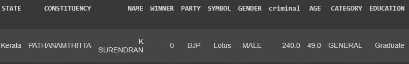

# 候选人的教育资格:

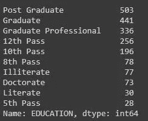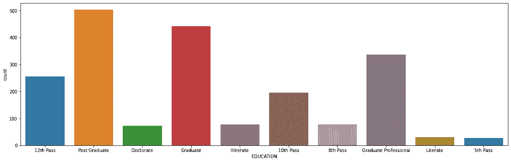

分析图形后，我们可以看到有两列 VIII 类通过和 V 类通过。但是我们相信被称为有文化的最低资格是 X 通过。所以我们把所有 V 通八考生都转换成文盲。

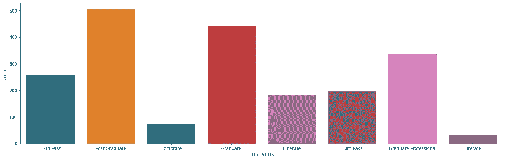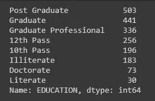

我们可以看到，印度的研究生考生数量是最大的(官方)。所以从教育的角度来看，这是一个积极的网站。

# 教育与犯罪案件柱状图:

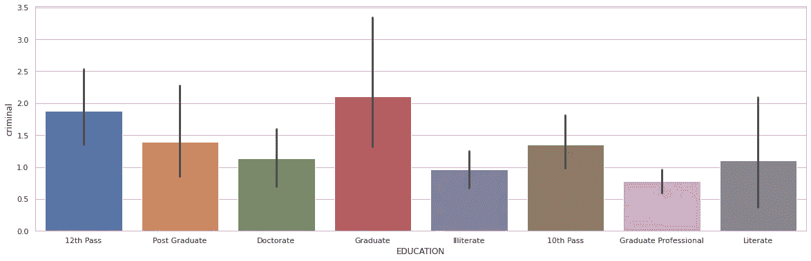

这张图表显示了候选人的学历和他们的犯罪记录。现在我们知道他们以前的犯罪背景和他们的学历。

我们可以从图表中分析出研究生和 12 级罪犯候选人最多。特别要提一下，一个毕业的人，就干了 240 起。

# 男性和女性候选人的饼状图:

该图代表了参加 Lok Sabha 2019 的男性和女性候选人。

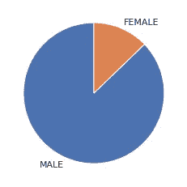

从这个饼状图中，我们可以看到男性候选人的数量远远大于女性候选人的数量。

# 有犯罪案件的州级候选人:

这是各州刑事案件竞争者和州刑事案件赢家的条形图。在比哈尔邦、喀拉拉邦、马哈拉施特拉邦、西孟加拉邦、北方邦，有刑事案件的候选人数量最多。

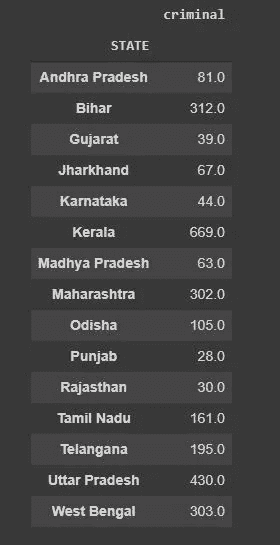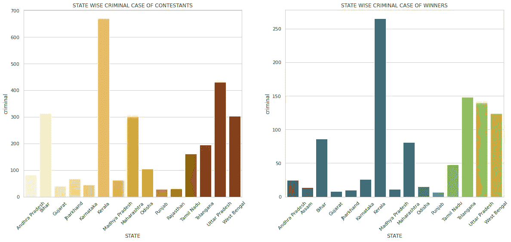

在这里，我们可以看到候选人和获胜者所在州的犯罪案件。这里的条形图显示了喀拉拉邦的最大高度，但西孟加拉邦、北方邦和特伦甘纳邦紧随其后。

# 类别增长条形图:

在这里，我们计算了 2019 年人民院选举中在册种姓、在册部落和普通候选人的人数。

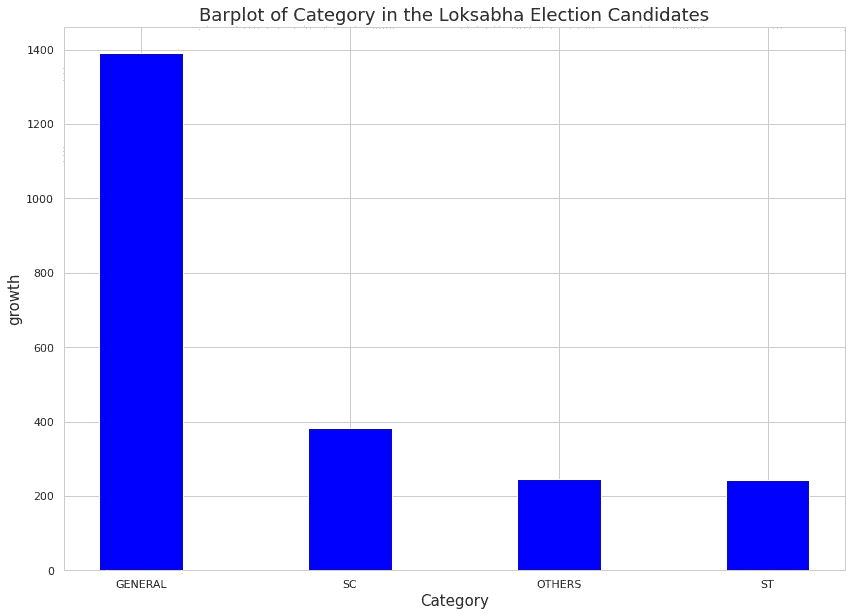

从图表中，我们可以看到，一般候选人的数量在印度是最大的。一般和其他类别的差别很大。

# 犯罪案件中政党与候选人的条形图:

这里我们在计算不同党派的刑事案件候选人。从这些知识中，我们可以了解刑事案件的不同当事人。

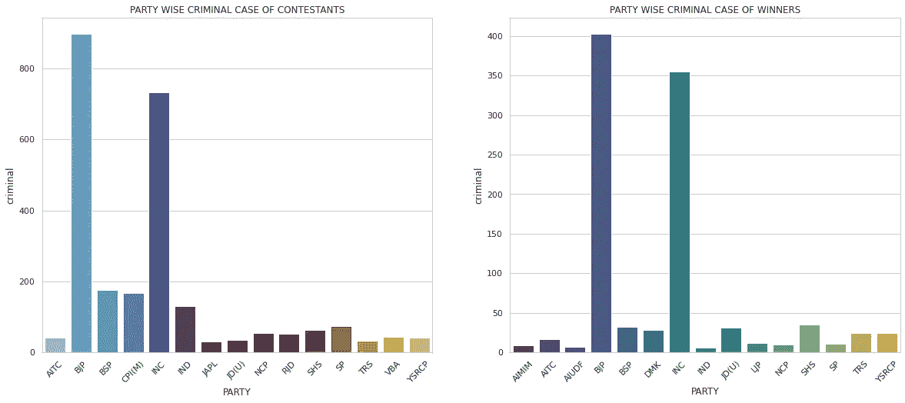

从上图中，我们可以看到 BJP 和国大党在印度拥有最多的刑事案件。这是因为，这两个政党都是总部设在印度，而大多数其他政党是地区性政党。

# 年龄与犯罪案件柱状图:

从这个柱状图可以了解不同年龄组考生的犯罪情况。

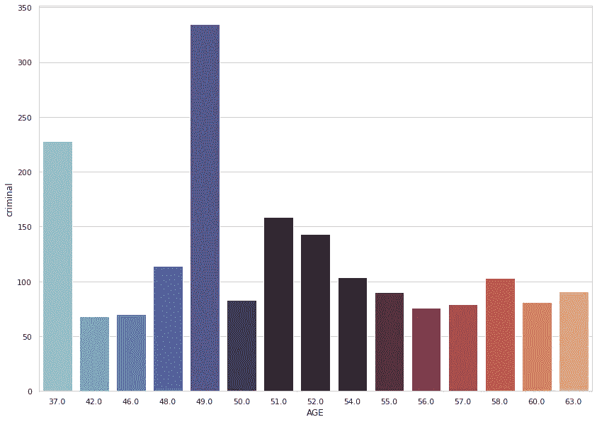

从图表中，我们可以注意到，犯罪记录在 49 岁、37 岁和 51 岁时达到最大值。此外，事实上一个 49 岁的人会犯下 240 起罪行。所以如果我们把它去掉，这个数字会有很大的变化。

# 州与总票数的条形图:

从这个柱状图中，我们可以了解到不同州的投票数。

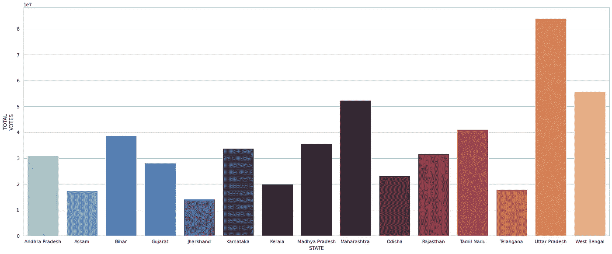

从柱状图中可以明显看出，马哈拉施特拉邦、北方邦和西孟加拉邦的总票数远远高于印度其他各邦，北方邦在总票数中名列第一。

# 性别与犯罪柱状图:

这是性别与犯罪的柱状图，从中我们可以知道，在印度，女性候选人的数量最多，或者男性候选人的数量最多。

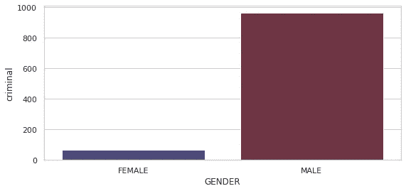

# 印度投票百分比柱状图:

这是 2019 年人民院不同州的投票百分比柱状图。

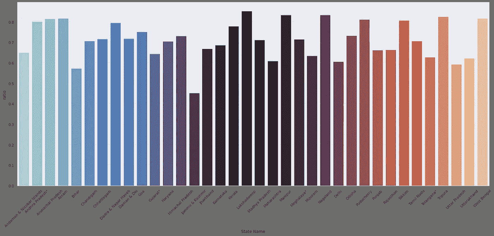

这是州与投票百分比的柱状图。我们可以从柱状图中看到，喀拉拉邦、西孟加拉邦、曼尼普尔邦、马哈拉施特拉邦等地的投票率非常高。所以在印度，人们对政治非常了解。

# 年龄对犯罪对赢家对性别对类别对国家对政党对教育:

# 来自不同州的女性获奖者:

从这幅图中，我们可以看到，西孟加拉邦的女性候选人得票率相对高于其他各邦，北方邦在这种情况下也不会落后太多。

因为西孟加拉邦在印度只有女性厘米，所以它可能会影响。而且她对女性发展非常热心。

# 年龄对犯罪对赢家对性别对类别对国家对政党对教育:

# 不同年龄考生的学历:

# 候选人的前 15 个投票百分比:

# 结论:

从以上分析，我们可以得出以下几点

1.  从这一分析中，我们发现印度人对选举制度和政党非常了解。在喀拉拉邦、西孟加拉邦、曼尼普尔邦、马哈拉施特拉邦等地，投票率非常高。
2.  BJP 候选人比其他政党更多地参与了人民院 2019。
3.  显而易见，马哈拉施特拉邦、北方邦和西孟加拉邦的总票数远远高于印度其他各邦，北方邦在总票数中名列第一。
4.  女性候选人的数量远远少于男性候选人的数量。
5.  不幸的是，我们发现喀拉拉邦的候选人有最多的刑事案件历史，西孟加拉邦、北方邦和特伦甘纳邦也紧随其后。一个人所犯的刑事案件最多为 240 起，他来自喀拉拉邦。
6.  我们注意到，候选人的刑事案件历史在 49 岁、37 岁和 51 岁时最多。

# 项目链接:

 [## GitHub-soham 2707/explorative-Data-Analysis-of-Lok-Sabha-Election-2019-in-India

### 为 soham 2707/探索性数据分析-of-Lok-Sabha-Election-2019-in-India 投稿。通过创造一个…

github.com](https://github.com/soham2707/Exploratory-Data-Analysis-of-Lok-Sabha-Election-2019-in-India..git) 

# 致谢:

Pinaki Subhra Bhattacharya

# 联系信息:

 [## Soham Nandi - B.P .波德达尔管理和技术学院-加尔各答，西孟加拉邦，印度|…

### 我自己 Soham Nandi 是一名数据科学爱好者，精通编程(Python、Pytorch、Flask、Streamlit ),并拥有……

www.linkedin.com](https://www.linkedin.com/in/soham-nandi-b39288215/) 

nandisoham2017@gmail.com

 [## soham2707 -概述

### Python |数据科学|机器学习|深度学习|后端开发人员| Android 开发人员|获得…

github.com](https://github.com/soham2707)