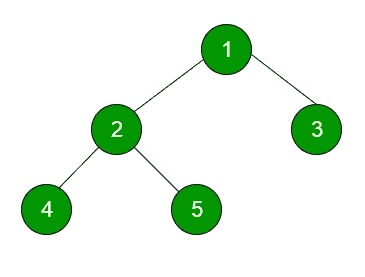
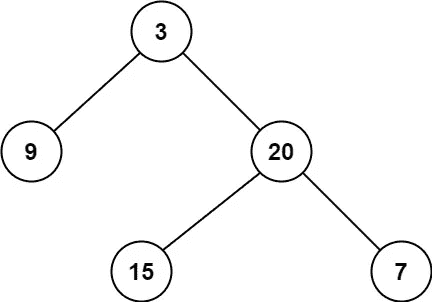
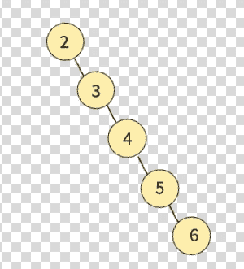
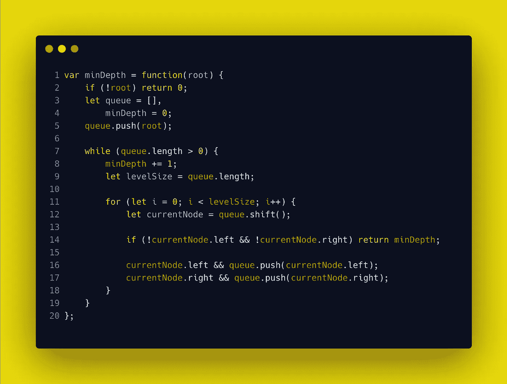
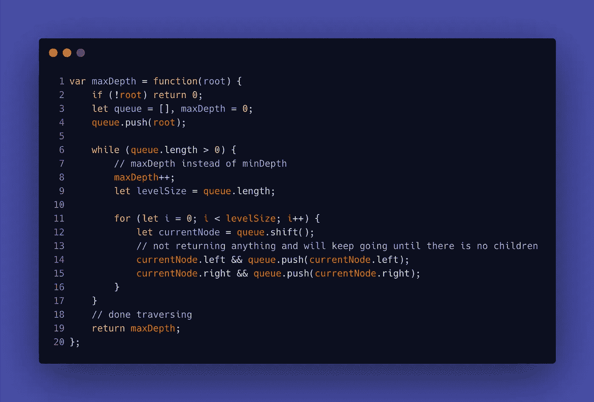

# 探究编码问题:二叉树的最小深度

> 原文：<https://medium.com/nerd-for-tech/explore-coding-question-minimum-depth-of-binary-tree-2069d0ed2e1a?source=collection_archive---------7----------------------->

## 这是 Leetcode 中的一个简单问题。我们将使用广度优先遍历来解决这个问题。

(免责声明:代码将以 Javascript 编写。)


有关联。信用:[模因发生器](https://www.google.com/url?sa=i&url=https%3A%2F%2Fmemegenerator.net%2Finstance%2F53436530%2Fspiderman-desk-while-everyone-else-is-partying-and-sleeping-im-sitting-here-studying-binary-search-t&psig=AOvVaw1wzWkaAw-LTYe37IkYuT2m&ust=1617856110777000&source=images&cd=vfe&ved=0CAMQjB1qFwoTCMjmue2l6-8CFQAAAAAdAAAAABAh)

你好。在本文中，我们将探讨“二叉树的[最小深度](https://leetcode.com/problems/minimum-depth-of-binary-tree/)的问题。这个问题不像中等水平的问题那么流行，比如“[二叉树水平顺序遍历](https://leetcode.com/problems/binary-tree-level-order-traversal/)”。但是！这个问题是一个很好的方法来介绍一个常见的主题:使用广度优先搜索(BFS)遍历二叉树(注意:我知道这不是最优化的解决方案。与使用 BFS 相比，递归具有更快的时间复杂度)。


曾询问英国电信“最小深度”的公司

对抗


公司已要求 BT 水平顺序遍历… Wow🥲

在我们开始之前，我想澄清一下，BFS 是水平的，而 DFS(深度优先搜索，在本例中是遍历)是垂直的。



信用:[极客暴富](https://www.geeksforgeeks.org/level-order-tree-traversal/)

上述树的层次顺序遍历为 1👉🏻2👉🏻3👉🏻四👉🏻 5;

对于 DFS，这取决于:

*   其他(左、根、根):4👉🏻2👉🏻5👉🏻一👉🏻 3;
*   预定(根、左、右):1👉🏻2👉🏻四👉🏻5👉🏻 3;
*   Postorder(左、右、根):4👉🏻5👉🏻2👉🏻3👉🏻一

对于这个问题，我们将使用 BFS —广度优先遍历来获得我们的结果。二话没说，让我们开始吧！

# 目录

*   [**提问**](#6f1f)
*   [**解**](#5d74)
*   [**故障**](#78e9)
*   [**时间&空间复杂度**](#cdfe)
*   [类似问题:二叉树最大深度](#219e)
*   [结论](#f322)

## 问题

```
Given a binary tree, find its minimum depth.The minimum depth is the number of nodes along the shortest path from the root node down to the nearest leaf node.**Note:** A leaf is a node with no children.
```

**例 1**



信用: [Leetcode](https://leetcode.com/problems/minimum-depth-of-binary-tree/)

```
**Input:** root = [3,9,20,null,null,15,7]
**Output:** 2
```

**例 2**



```
**Input:** root = [2,null,3,null,4,null,5,null,6]
**Output:** 5
```

树节点的定义

```
/**
 * Definition for a binary tree node.
 * function TreeNode(val, left, right) {
 *     this.val = (val===undefined ? 0 : val)
 *     this.left = (left===undefined ? null : left)
 *     this.right = (right===undefined ? null : right)
 * }
 */
```

## 先解决问题，再解决问题



✋🏻在我们深入分析故障之前，请花点时间阅读解决方案。

## 分解⤵️

本质上，我们想要做的是创建一个队列来存储树中的节点。随着我们一层一层地进行下去，当我们找到第一个叶节点(换句话说，没有子节点)时，我们最终想要返回二叉树的最小深度。

**下面是细目分类(连同示例 1):**

```
root = [3,9,20,null,null,15,7]
```

1.  我们将首先设置一个空数组`queue`来存储我们想要迭代的所有节点，作为变量`minDepth`来保持计数。

```
queue = []
minDepth = 0
```

2.我们还想确保长度数组`queue`大于 0，这样我们可以继续迭代，同时继续推进子节点(如果存在的话)。

```
queue.push(root)
queue = [3]
```

3.每当我们开始`while`循环时，这意味着我们将一次迭代一个级别。我们会将`1`添加到变量`minDepth`中。

```
minDepth = 1
queue = [3]
```

4.在`while`循环中，我们也想用`for`循环来循环通过关卡。我们还想确保设置一个新变量来跟踪当前`queue`的长度。然后，我们将获取队列的第一个元素，并检查它是否有子元素(左和右)。本质上我们想检查我们是否碰到了第一片叶子。如果我们这样做，我们将返回`minDepth`。

```
levelSize = queue.length // 1 
let currentNode = queue.shift();
// currentNode = 3 
```

5.如果在左边或右边，或者两者都有子节点，这也意味着我们还没有碰到任何叶子，我们将会推入队列。

```
// check if currentNode has left or right children -- and yes, it does.
queue = [9, 20]
```

6.我们将不断迭代，直到我们有一个返回值。

现在:

```
queue = [9, 20]
minDepth = 1
```

因为`queue`的长度大于 0，所以`while`循环继续。

```
minDepth++ // minDepth = 2
levelSize = 2
```

进入`for`循环以遍历该级别。

```
currentNode = 9 
// root = [3,9,20,null,null,15,7]
// check if there is any children...and there is not! -> two nulls
// 20 has two children: 15 on the left and 7 on the right.
if (!currentNode.left && !currentNode.right) // YES!
   return minDepth; // 2
```

现在我们的返回值是`2`。

就是这样！

哦，我差点忘了 7 号(顺便说一下，我最喜欢的数字)。

7.不要忘记边缘情况，如果是一棵空树，我们可以返回 0。

```
if (!root) return 0
// or some people prefer: if (root === null) return 0
```

这里的解决方案再次刷新你的记忆


## 时间复杂度

最坏的情况是，我们不得不探索一个不平衡的树，我们不得不遍历整个树(参见示例 2)。因为我们只迭代 N/2 个节点(逐层)，所以时间复杂度是 O(N)。

## 空间复杂性

至于空间复杂度，我们正在创建一个数组来存储我们正在迭代的节点。在任何级别，我们最多可以有 N/2 个节点，我们需要 O(N)空间来存储这些节点。

## 类似问题

对于二叉树的最大深度[，我们也有类似的解决方案。当我们找到一个叶节点时，我们不是返回`minDepth`，而是遍历整个二叉树，以在每次完成一个级别时增加`maxDepth`。](https://leetcode.com/problems/maximum-depth-of-binary-tree/)

解决方案应该是这样的:



BFS 溶液中 BT 最大深度的求解

然而，正如本文开头提到的，递归是一个更好的解决方案，因为与使用 BFS 相比，它将只使用 O(log N)时间，在这种情况下，它将继续消除树中不必要的部分，并继续将树切成两半，直到找到它的答案。

```
Recursion solution (which I would not go in depth):
var maxDepth = function(root) {
    if (!root) return 0;
    return Math.max(maxDepth(root.left), maxDepth(root.right)) + 1;
}
```

## 结论:我的观察

当我做更多的 BFS 问题时，我实际上注意到大多数解都非常相似，除了你可能需要在循环中做一些修改，这样你才能得到答案。但是在大多数情况下，我注意到 DFS(和递归)是比 BFS 更好的解决方案，特别是当你处理像[二叉树层次顺序遍历](https://leetcode.com/problems/binary-tree-level-order-traversal/)和[二叉树曲折层次顺序遍历](https://leetcode.com/problems/binary-tree-zigzag-level-order-traversal/)这样的问题时(希望能写另一篇关于这些问题的分解文章，比较 BFS 和 DFS 策略)。

无论如何，你对广度优先遍历怎么看？希望你对这个话题感觉稍微舒服一点，不会吓到你！

祝你好运，解决越来越多的难题！最后但同样重要的是，感谢您成为一名出色的读者和快乐编码！

