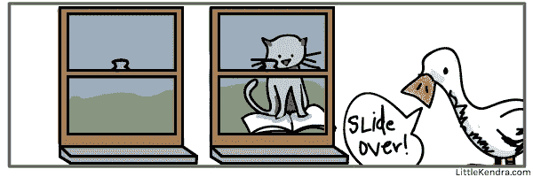
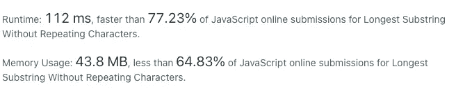
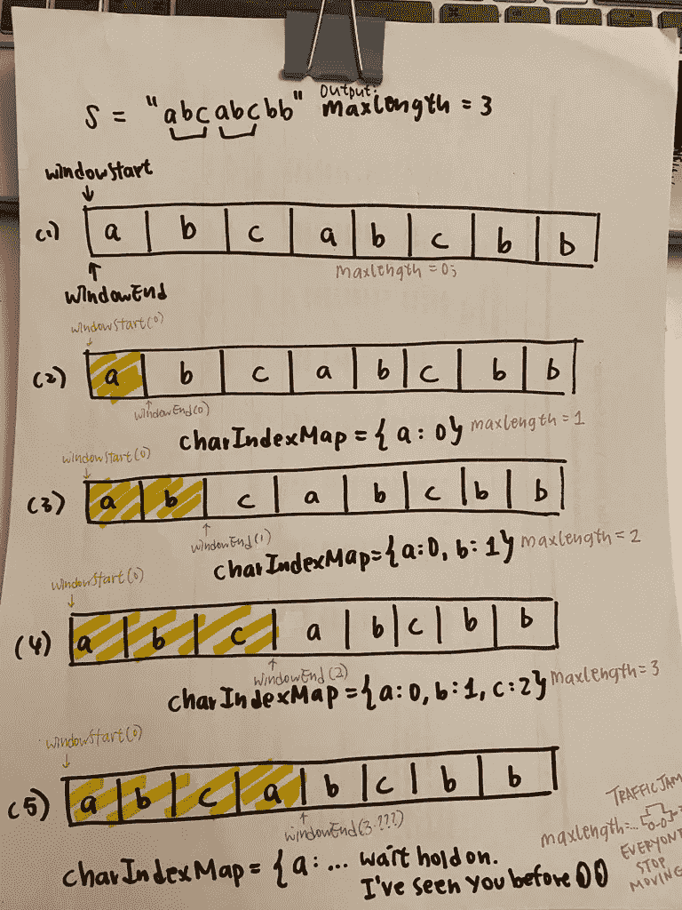
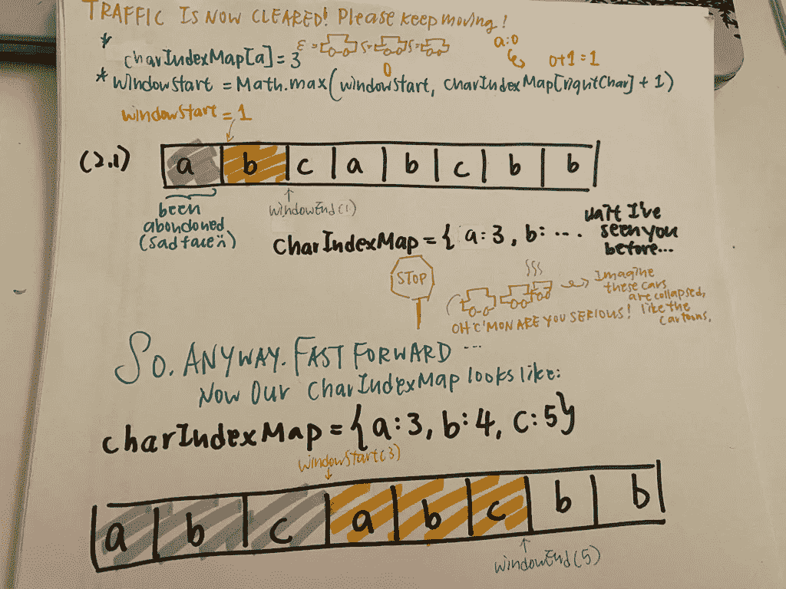
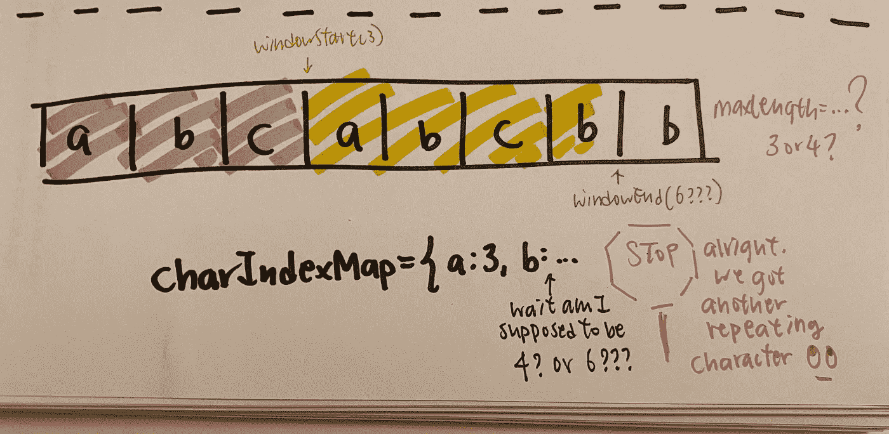
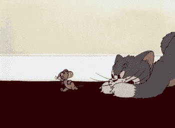

# 探索编码问题:没有重复字符的最长子串

> 原文：<https://medium.com/nerd-for-tech/explore-coding-questions-longest-substring-without-repeating-characters-234813a231cd?source=collection_archive---------1----------------------->

## 这是 Leetcode 中的一个中级编码问题。我们将使用“滑动窗口”模式来解决这个问题。

(免责声明:代码将以 JavaScript 编写和解释。我不是艺术家，所以我不知道在电脑上绘图的最佳工具，我将在本文中发表我的手绘图形。)



信用:[肯德拉·利特尔](https://littlekendra.com/2016/02/02/sliding-window-table-partitioning-what-to-decide-before-you-automate/)

**目录:**

*   [**问题**](#49b4)
*   [**溶液**](#48cb)
*   [**溶液击穿+目视**](#5563)
*   [**时空复杂性**](#2f2d)
*   [**结论**](#d874)

## 问题

[无重复字符的最长子串](https://leetcode.com/problems/longest-substring-without-repeating-characters/)

给定一个字符串`s`，找出不重复字符的**最长子字符串**的长度。

**实施例 1:**

```
**Input:** s = "abcabcbb"
**Output:** 3
**Explanation:** The answer is "abc", with the length of 3.
```

**实施例 2:**

```
**Input:** s = "bbbbb"
**Output:** 1
**Explanation:** The answer is "b", with the length of 1.
```

**实施例 3:**

```
**Input:** s = "pwwkew"
**Output:** 3
**Explanation:** The answer is "wke", with the length of 3.
Notice that the answer must be a substring, "pwke" is a subsequence and not a substring.
```

**实施例 4:**

```
**Input:** s = ""
**Output:** 0
```

为了表明这个问题的受欢迎程度，以下是提出这个问题的公司:


天啊🤯

## 解决办法

每个人都有不同的方法来研究数据结构和算法。我喜欢先看看解决方案，尤其是当我陷入困境时。因此，在深入讨论任何解释之前，我们先来看看解决方案。

Leetcode 的运行时和内存使用情况:



## 解决方案分解+可视化

*   由于我们使用的是“滑动窗口”模式，我们需要跟踪窗口的开始(`windowStart`)和结束(`windowEnd`)。我们使用“滑动窗口”的原因是因为我们试图获得连续的字符串，也就是子字符串，而不是子序列。
*   我们还想要一个**哈希表** `{}` 来跟踪每个字符的索引，这样我们就可以找到`maxLength`了解可能的`windowStart`，同时也避免了任何可能的重复字符。

好的，使用示例 1，

```
**Input:** s = "abcabcbb"
```

让我们进入视觉:

我们首先循环这部分代码

```
for (let windowEnd = 0; windowEnd < s.length; windowEnd++) {
    const rightChar = s[windowEnd];
    charIndexMap[rightChar] = windowEnd;
    maxLength = Math.max(maxLength, windowEnd - windowStart + 1);
}
```



此时，我们遇到了第一个重复出现的字符`'a'`。这个`charIndexMap`已经有一个`a`。因此，我们需要暂时停止循环过程。当这个进来的时候:

```
if (rightChar in charIndexMap) {
   windowStart = Math.max(windowStart, charIndexMap[rightChar] + 1);
}
```

✨ `charIndexMap[rightChar] + 1`是`windowStart`重新定位窗口的机会，尤其是当`rightChar`远远领先于`windowStart`时。

✨:我们还需要从头开始缩小窗口，所以我们在`charIndexMap`中只出现一次。

在此期间，我们的`maxLength`已经记录了最长的无重复字符的子串。



正如我们从图 2.1 中看到的，我们继续重新定位我们的`windowStart`，直到我们的`charIndexMap`已经被更新到我们的新索引，并且**对于每个字符**只出现一次(而不是`b: 1`和`b: 4`或者`c: 2`和`c:5`——那将会非常混乱并且不应该共存)。

经过一点调整，我们的`charIndexMap`现在…

```
charIndexMap = {a: 3, b: 4, c: 5}
```

而`maxLength`现在是…

```
maxLength = Math.max(3, 5-3+1)
maxLength = Math.max(3, 3)
maxLength = 3
// still 3!!!
```

我们可以继续滑动窗口，直到…



现在是对我在图中写的那些假设性问题进行头脑风暴的好时机。由于我们遇到了另一个重复的字符`'b'`，我们再次需要尽可能地重新定位我们的`windowStart`:

```
if (rightChar in charIndexMap) {
   windowStart = Math.max(windowStart, charIndexMap[rightChar] + 1);
}
```

剩下的几乎都是重复的。从我们新的重复角色开始，

```
// our new 'b' is at index 6, so as the windowStart and windowEnd
maxLength = Math.max(maxLength, 6 - 6 + 1)
          = Math.max(3, 1)
          = 3
```

由于我们已经用最后一个`b`到达了字符串的末尾，我们现在可以返回`maxLength`，在示例 1 中是 3。

好吧，我希望这些图表和代码不会让读者难以理解。如果这是一种视频格式，我认为这将非常有意义。但不管怎样，我希望你对正在发生的事情有所了解。

## 时间复杂度

上述算法的时间复杂度将是 **O(N)** ，因为 **N 代表输入字符串**中的字符数，并且我们也在循环整个字符串。

## 空间复杂性

至于空间的复杂性，这可能是一个棘手的问题。平均来说，我们有 **O(K)** 空间，因为 **K 代表存储在散列表**中的字符数。然而，在最坏的情况下，这可能是 O(N)，因为有可能在整个字符串中没有重复的字符，并且所有的字符都存储在 hashmap 中(记住，K ≤ N)。

# 结论

*   我们使用了**“滑动窗口”**模式来获取子串，不是子序列，而是子串。
*   我们使用了**散列表**来确保每个字符只出现一次。
*   如果你真的对汽车的比喻感到困惑，我试着想象整个场景，就像在卡通中一样，当一个角色跑得太快时，立即停止可能会导致其他以同样速度奔跑的角色相互摔倒



如果有更优化的解决方案，请告诉我！了解更多会很酷:)此外，我很想知道是否有任何绘图工具，我可以用来数字化这些图表，除非你真的喜欢我的画…😅

感谢你是一个伟大的读者。下次见！