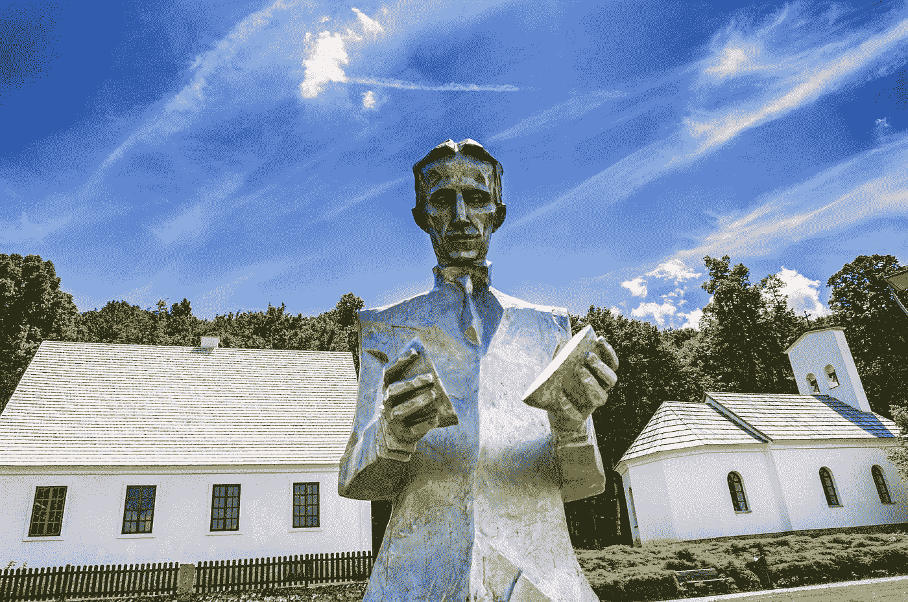

# 探索->学习->应用-ELA

> 原文：<https://medium.com/nerd-for-tech/explore-learn-apply-ela-6fc99439db1b?source=collection_archive---------10----------------------->

> 该框架的目标是为个人提供一条路径和一个环境，让他们从完全的初学者发展到使用技能作为工具来解决现实世界问题或构建现实世界问题的解决方案的人。

# 问题陈述-

如今，获得一份工作或取得好成绩是学习一项技能的首要动机。这导致了平庸，因为绝大多数个人不知道如何使用他们的技能来解决现实世界的问题或在现实世界中设计解决方案。没有强大的协作文化，志同道合的人一起工作，把他们的技能作为一种工具。

因为要设计一个问题的解决方案，需要来自多个领域的专业知识。我们观察到缺乏合作的生态系统和文化，在学习了一定数量的技能后，学生可以开始将它们与其他人一起应用到产品或某种解决方案中。

这就是为什么我们在 Nerd For Tech 发起了一项倡议，围绕实践学习和协作建立强大的专业人士和学习者文化。

简而言之，那些有经验的人(专业人士、教授、企业家、研究人员)可以指导学习者完成他们的学习之旅。不要误会有人会教。不，事实并非如此。我们希望培养一种学习者自学的文化，如果他们遇到问题，我们的专业人员和专家会随时提供帮助。

对于那些不理解应用技能来构建更好的解决方案有多重要的人。这里有一个小故事。

由 [Unsplash](https://unsplash.com?utm_source=medium&utm_medium=referral) 上的[Damir spanick](https://unsplash.com/@spanic?utm_source=medium&utm_medium=referral)拍摄的照片

尼古拉·特斯拉被认为创造了电气工程领域最重要的设计之一。如果不是他用自己的技能解决了远距离输电的问题，我们今天晚上可能会坐在黑暗中。他用自己的直觉和热情设计了如此强大的交流电机电路，以至于 120 年后我们仍然在交流机械中使用它们。

照片由 [Riccardo Annandale](https://unsplash.com/@pavement_special?utm_source=medium&utm_medium=referral) 在 [Unsplash](https://unsplash.com?utm_source=medium&utm_medium=referral) 拍摄

整个 ELA 框架分为两个阶段。

第一阶段—探索和学习第一阶段

第二阶段——应用和学习第二阶段

杰森·斯特鲁尔在 [Unsplash](https://unsplash.com?utm_source=medium&utm_medium=referral) 上的照片

让我们看看第一阶段是什么—

我们将努力在一个地方为各种领域和专业组织最好的免费学习资源。因此，学习者可以在一个地方找到他们所有的学习资源，至少目前是这样。

我们不想创造新的学习资源，因为网络上到处都是&许多社区和个人都在创造高质量的资源。不要误解我们:我们不是为了赚钱而复制资源；这是一个非盈利项目。相反，我们将简单地粘贴到我们的网站的链接，引导学习者到所有者的网站。

学习者可以使用这些按领域聚集的高质量资源进行探索，一旦他或她发现了他们的热情，他们就可以开始向他们学习。

照片由[加勒特·桑普森](https://unsplash.com/@garrhetsampson?utm_source=medium&utm_medium=referral)在 [Unsplash](https://unsplash.com?utm_source=medium&utm_medium=referral) 拍摄

一旦学习者达到一定的学习水平，第二阶段就开始了。

我们称第二阶段为“创业阶段”。这一切都是为了发现问题，与团队一起解决问题，同时并行学习先进的东西。

考虑一群年轻人，他们为了在现实世界中有所作为而积极学习新的东西。这种动力远比单纯为了拿个证书而学点东西重要。

斯科特·韦伯在 [Unsplash](https://unsplash.com?utm_source=medium&utm_medium=referral) 上拍摄的照片

在制定解决方案时，我们的专家和专业人员可以自愿指导一个小组。我们将努力为每个处于申请阶段的团队提供一名导师。

为了管理整个社区文化，我们已经建立了一个针对不同目的的不同渠道的社区。

这就是我们的 ELA(探索->学习->应用)框架。这里有一个网站链接，在这里你可以找到它的作用— [点击我](https://www.nerdfortech.org/ela)。