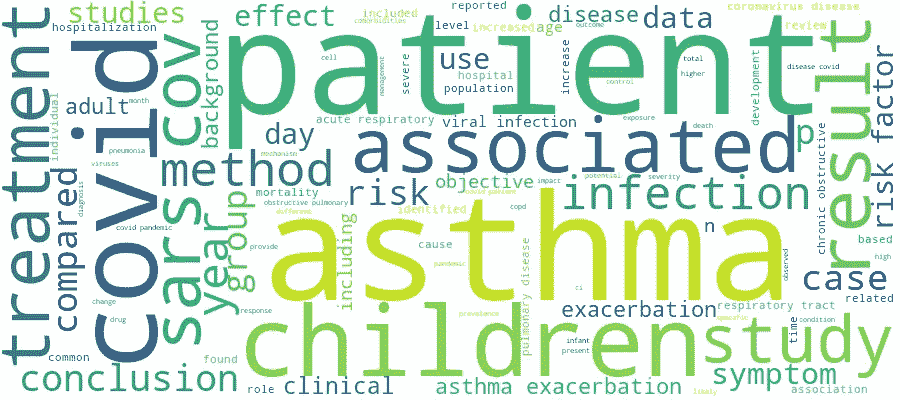
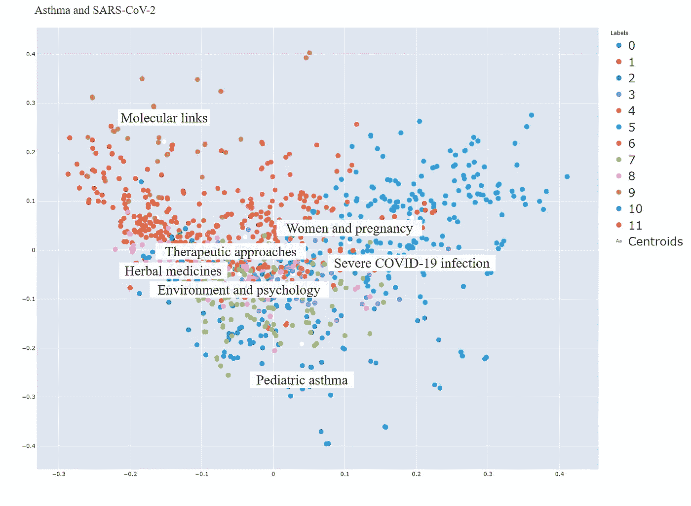

# 探索新冠肺炎和哮喘的研究领域

> 原文：<https://medium.com/nerd-for-tech/exploring-areas-of-investigation-in-covid-19-and-asthma-e5458509efbc?source=collection_archive---------21----------------------->



哮喘和新冠肺炎:从原始论文数据集创建的文字云图像

**利用 Python 增强文献综述……**

作为一名精准医疗专业的理学硕士，我完成了我的
项目——新冠肺炎哮喘患者的精准医疗策略。在进行我的文献研究时，我注意到关于新冠肺炎的科学出版物的数量在不断增加。这些铺天盖地的文献让我想到了从这些众多的科学论文中提取信息的替代方法。与此同时，由于我最近开始探索 Python，我想到了数据科学技术可以帮助我们理解新冠肺炎研究的方法。因此，我继续扩展我的理学硕士项目，并寻找我脑海中一些问题的答案:

*新型冠状病毒出现前后，围绕哮喘和冠状病毒的关注领域是否相似？*

*两种疾病的交叉领域发表的最受欢迎的课题和研究类型有哪些？*

*以前的研究是否涵盖了新冠状病毒尚未探索的研究领域？*

## 介绍

在这个项目中，我使用 Python 中的自然语言处理(NLP)技术来探索哮喘和冠状病毒之间的研究主题。这种分析是基于对新型冠状病毒事件前后发表的科学论文进行聚类，以创建具有相似主题的论文组。

针对“哮喘和各种冠状病毒”与“哮喘和新型冠状病毒”形成这些集群的目的是为了概述研究社区在涉及这两个主题时关注的领域。将出版物归类在一起，我希望能够了解在这两个时间段内讨论的最热门的主题，以及在新冠状病毒识别前后研究的相似之处和不同之处。

在进入数据分析和使用的工具之前，值得一提的是在疫情的背景下哮喘个体受到极大关注的原因。

## 哮喘是新型冠状病毒感染的共病

随着围绕新冠肺炎病的研究不断深入，人们已经发现，在感染新型冠状病毒病毒后，糖尿病和高血压等并存的医疗状况会增加患严重疾病的风险[1]，[2]。另一方面，哮喘在住院的新冠肺炎患者中并不多见，目前还没有被认为是疾病恶化的危险共病[1]，[2]。然而，在新冠肺炎疫情的背景下，几个特征使得哮喘特别令人感兴趣，并且自从新型冠状病毒爆发以来，这两种疾病之间的关系已经被广泛研究。

病毒感染是哮喘恶化的常见原因，许多研究旨在检查新型冠状病毒是否是哮喘恶化的触发因素[2]，[3]。哮喘和新冠肺炎都以高炎症状态为特征。这两种疾病之间的分子和生化重叠机制提出了关于哮喘对新型冠状病毒感染的潜在保护作用的问题[2]，[4]。最后，用于哮喘症状控制的药物已经被重新用于新冠肺炎病的治疗。最大的例子是皮质类固醇，尤其是地塞米松，这是第一种在很大程度上降低新冠肺炎重症住院患者死亡率的药物[5]。

对这两种疾病交叉的研究已经很广泛，有大量的分子、临床和流行病学研究可用。然而，甚至在新型冠状病毒病毒爆发之前，冠状病毒和其他呼吸道病毒在哮喘中的作用就已经引起了人们的兴趣。

## **数据采集和预处理**

[**新冠肺炎开放研究数据集**](https://www.kaggle.com/allen-institute-for-ai/CORD-19-research-challenge) 是数十万篇关于包括新型冠状病毒在内的各种冠状病毒文章的资源。作为对新冠肺炎疫情的回应，该数据库已经公开。

从这个大数据集中，我只保留了那些“哮喘”这个词在摘要中至少出现过一次的论文。我选择把重点放在摘要上，因为这是论文中最重要的部分——与主题相关的——术语出现的地方。

我使用 *NLTK* 和 *SpaCy* 完成了以下文本预处理步骤:

*   停用词的删除
*   删除非英文出版物

利用他们的发表日期，我将论文分为疫情爆发前(2019 年 12 月)和爆发后发表的论文。我假设在此日期之前发表的论文包含了除新型冠状病毒之外的所有其他冠状病毒的信息。另一方面，自 2019 年 12 月以来，新型冠状病毒一直是人们关注的焦点。因此，在此日期之后发表的论文将主要指新型冠状病毒。

对于我申请的两组论文:

*   标记化
*   堵塞物
*   使用 Scikit-learn 的 Tfidf 矢量器将令牌转换为 TF-IDF 特征矩阵
*   KMeans 算法在聚类中的应用
*   PCA 算法在降维和聚类可视化中的应用

在应用 KMeans 算法之前，我一直在寻找一种支持性的方法，以便估计每组论文应该形成的最佳聚类数。我使用了 KElbowVisualizer，它实现了“elbow”方法。然而，在这一分析的背景下，该模型未被证明是可重复的。

由于这个原因，聚类的最终数量是凭经验确定的。将 KMeans 应用于不同数量的聚类，并手动检查结果。目标是形成尽可能多的独特集群，没有重复的信息，保持其内容简洁，避免非常相似的主题集群。

鉴于数据的性质和科学文本的复杂性，Tfidf 和 KMeans 模型在每次聚类尝试中给出的结果略有不同。因此，使用 *pickle* 库保存和加载模型。

最后，在查看了每个组的顶级术语和论文标题后，我给每个组分配了简短的名称/标签，这些名称/标签描述了组的整体内容。由于“哮喘和新型冠状病毒”组中的论文种类繁多，我没有列出所有的组，而是只保留了那些内容明确、论文数量相对较多的组。

所执行的数据分析的完整代码可以在我的 GitHub 帐户中找到。在代码中，还包含了关于所使用的算法、方法和 Python 工具的更多信息的注释:[**katerinampoi/astma-Clustering**](https://github.com/katerinampoi/Asthma-Clustering)

## 集群一览…

下面的两个图表说明了两组论文形成的集群。2019 年 12 月前发表的论文有 1022 篇，2019 年 12 月及以后发表的论文有 1507 篇。

相同颜色的点代表一个集群，每个点代表一篇科学论文。聚类的位置越接近，它们的内容就越相似。在散点图中，我们应该观察的是星团之间的相对位置，而不是它们的绝对位置。

每个聚类都以一组在论文中出现频率最高的词为特征。下面也提到了每个簇的前 20 个单词。假设词干已经被应用，术语就是词根。

总的来说，在两组论文中的任何一组中，簇的区别都不是很明显，因为大多数簇彼此重叠。这并不奇怪，因为论文可能是不同科学主题的一部分，并且主题会相互干扰。在涉及哮喘和新型冠状病毒的论文组中，簇的重叠似乎更强烈，而在疫情之前发表的论文形成了更明显的簇。这可能反映了在新型冠状病毒病毒爆发之前，围绕呼吸系统疾病和冠状病毒的更有针对性的研究。另一方面，一旦新型冠状病毒被确认，研究必须从零开始，并以极快的速度发展，以满足这一全球紧急事件的需要。

要获得图表的互动版本，您可以查看 Jupyter 笔记本上的分析。您可以在图上保留任意多的分类，并分别检查它们。此外，将鼠标悬停在这些点上，您可以看到论文的标题，并更好地了解每个集群的内容。

**在新冠肺炎·疫情之前——哮喘和各种冠状病毒**


**每个聚类的最高术语:**

```
Top terms per cluster:
**Cluster 0 (Human Rhinoviruses)**: detect children respiratori patient infect virus exacerb viral rhinoviru viru sampl hospit adenoviru ill posit coronaviru clinic influenza acut pcr
**Cluster 1 (Immune Response)**: infect respiratori viral exacerb virus respons diseas role develop immun viru review caus tract associ host mechan human airway rhinoviru
**Cluster 2 (Exacerbations)**: exacerb copd patient factor risk airway trigger infect increas sever viral acut sputum eosinophil diseas exposur manag allergi children virusinduc
**Cluster 3 (HRV and pediatrics)**: hrv hrvc children infect hrva human respiratori ill speci strain associ detect rhinovirus exacerb caus identifi virus lower group divers
**Cluster 4 (Children)**: hmpv hbov children detect infect respiratori hospit rsv bronchiol human patient viru clinic pneumonia month pathogen metapneumoviru virus year ari
**Cluster 5 (Molecular Links):** cell airway express infect lung activ inflammatori protein diseas respons inflamm increas function role mice epitheli immun level gene receptor
**Cluster 6 (Brionchiolitis and Wheezing)**: wheez children bronchiol risk recurr age respiratori factor year viral episod ill earli associ infect develop sensit rhinoviru childhood rsv
**Cluster 7 (Environment)**: health air exposur indoor public effect pollut school studi popul pm intervent aerosol diseas build environment use children systemat condit
**Cluster 8 (Therapeutic approaches):** diseas pulmonari lung cough patient chronic respiratori use drug acut obstruct treatment ventil syndrom review failur clinic therapi fibrosi condit
**Cluster 9 (Viral pneumonia):** pneumonia influenza patient children hospit vs infect vaccin case adult pandem respiratori clinic viru exacerb test sever icu year diseas
**Cluster 10 (Epidemiology and Clinical studies)**: patient ci studi use respiratori children year infect treatment symptom associ sever group clinic hospit medic risk effect control vaccin
```

根据这项分析，哮喘和呼吸道病毒中最受欢迎的研究领域之一是这两种疾病之间的分子关系。第 5 类或“分子链接”是最大的一类，包含近 200 篇论文。该队列的出版物提供了关于呼吸系统疾病中分子途径改变的信息以及病毒可能与它们相互作用的方式。几篇论文提到了调节气道反应性的机制，以及在病毒感染中起作用的气道细胞受体。与组 5 重叠，组 1 指的是一个相关的研究领域，即“免疫反应”。这里强调的主题是过敏性炎症如何在分子水平上影响病毒感染，反之亦然。

两个感兴趣的主题也是反映在第 2 组和第 6 组(分别包含 79 篇和 84 篇论文)中的“恶化”和“炎症和喘息”。许多科学团队一直在研究哮喘或慢性阻塞性肺病患者在感染病毒时是否容易疾病恶化和急性加重。

科学界也对“儿童”和“儿童哮喘”感兴趣。关于儿童中人鼻病毒的流行病学和临床症状的信息可以在各种论文中找到。

**继新冠肺炎·疫情之后——哮喘和新型冠状病毒**



**每个聚类的顶级术语**

```
Top terms per cluster:
**Cluster 0 (Pediatric asthma)**: children pediatr infect hospit respiratori patient year age sever studi symptom risk diseas clinic picu bronchiol childhood rv control adult
**Cluster 1**: lung cell diseas immun respons inflamm function pulmonari role target infect activ respiratori protein airway inflammatori potenti effect mechan therapeut
**Cluster 2 (Environment and psyochology):** air health pollut impact depress lockdown mental peopl anxieti physic pandem diseas risk measur stress exposur level psycholog reduc condit
**Cluster 3**: case patient present diseas ct coronaviru symptom chest report day bilater test clinic opac respiratori fever emerg acut posit groundglass
**Cluster 4**: diseas sever respiratori infect coronaviru patient caus risk individu studi acut popul mortal pandem syndrom factor preval underli vitamin health
**Cluster 5 (Severe COVID-19 infection)**: patient hospit ci risk diseas comorbid age mortal sever associ outcom factor studi higher year icu clinic death admiss diabet
**Cluster 6 (Various relationships)**: patient diseas sever pandem infect risk allerg corticosteroid chronic recommend biolog treatment allergi coronaviru respiratori manag use control continu exacerb
**Cluster 7**: patient care visit telemedicin medic use pandem health provid ed measur pediatr hospit manag practic emerg physician servic studi intervent
**Cluster 8 (Therapeutic approaches)**: drug trial treatment therapi patient use group studi biolog clinic effect sever control random inhal safeti protocol diseas corticosteroid dose
**Cluster 9 (Molecular Links):** express gene cell airway epitheli receptor furin copd entri infect sever bronchial factor diseas viral allerg upregul level protein associ
**Cluster 10 (Herbal medicines)**: medicin chines tradit tcm drug prescript pharmacolog stage plant treatment use herbal time acid hemsleyanum effect studi caffeic clear heat
**Cluster 11 (Women and pregnancy)**: women pregnant matern pregnanc case sever neonat diseas ci infect death aor moder vs deliveri hospit fetal birth patient outcom
```

转向第二组和 2019 年 12 月之后发表的论文，“严重新冠肺炎感染”论文在这一组中占主导地位。第 5 组有 280 多篇论文，是这一组中最大的。新型冠状病毒表现出多样化的疾病概况，从无症状病例到致命疾病不等。在这种情况下，确定导致严重疾病的风险因素是一项基本需求。该集群中的研究检查了严重新冠肺炎感染中哮喘的存在，住院的新冠肺炎哮喘患者的临床特征，以及哮喘药物在潜在新型冠状病毒感染中的作用。不远处的集群 5，集群 0 的论文讲的是“小儿哮喘”。自从疫情开始以来，年轻的新冠肺炎人也引起了极大的兴趣。这些论文讨论了新型冠状病毒感染的呼吸道疾病儿童的临床特征和结果。

最后，自疫情爆发以来，我们社区的环境和心理变化得到了广泛讨论。群组 2 的出版物提供了关于封锁期间空气质量变化的信息。有关于污染水平变化及其对哮喘患者生活质量影响的研究。同一专题组的另一个主题是自新型冠状病毒病毒爆发以来哮喘患者的精神健康和心理状况。由于还没有足够的证据来确定严重新冠肺炎感染风险较低或较高的哮喘人群，这些患者的心理挑战不容忽视。

**分析期间面临的挑战和潜在错误:**

1.  论文根据发表日期分为 2 组，截止日期为 2019 年 12 月。然而，晚于这一日期发表的论文可能不仅仅指新型冠状病毒。
2.  处理文本，尤其是科学性质的文本，需要进行大量的数据清理，以删除不会给分析增加价值的符号和数学字符。
3.  考虑到使用的大量论文和文本数据的复杂性，Tfidf 和 KMeans 模型不会在代码运行的所有时间产生相同的结果。由于这个原因，模型被保存然后加载。
4.  论文的标题在集群形成后被人工审查，并且每个集群的内容不是完全同质的。因此，群集注释可能不会完全反映群集的全部内容。
5.  将数据维数减少到 2 会使数据可视化变得容易，但会导致集群在图形上重叠。这种重叠使得注释的分配和布局更新难以应用。因此，簇的注释并不总是精确地放置在簇的质心上，而是稍微移动了一下，以免彼此重叠。

*本分析旨在概述已发表的关于呼吸系统疾病和冠状病毒交叉的论文内容，并不意味着增加围绕这两种疾病的现有医学证据的价值。*

**参考文献**:

1.  Ssentongo P，Ssentongo AE，Heilbrunn ES，Ba DM，Chinchilli VM。心血管疾病和其他 10 种先存共病与新冠肺炎死亡率的关系:一项系统综述和荟萃分析。 *PLoS One* 。2020;15 日(8 月 8 日):e0238215。doi:10.1371
2.  哮喘患者的新型冠状病毒感染和新冠肺炎:一种复杂的关系。*自然免疫*。2021;21(4):202–203.doi:10.1038/s 41577–021–00516-z
3.  Grandbastien M，Piotin A，Godet J，等:住院哮喘患者的新型冠状病毒肺炎不会导致严重恶化。*变态反应临床免疫实践杂志*。2020 年 6 月。2020 年 6 月 32 日
4.  刘，支，应与哮喘:在期间的反思。 *Clin Rev 过敏免疫*。2020;59(1):78–88.doi:10.1007/s 12016–020–08797–3
5.  Horby P，Lim WS，Emberson JR，等:《新冠肺炎住院患者中的地塞米松——初步报告》。*英国医学杂志*。2020 年 7 月:NEJMoa2021436。doi:10.1056/NEJMoa2021436