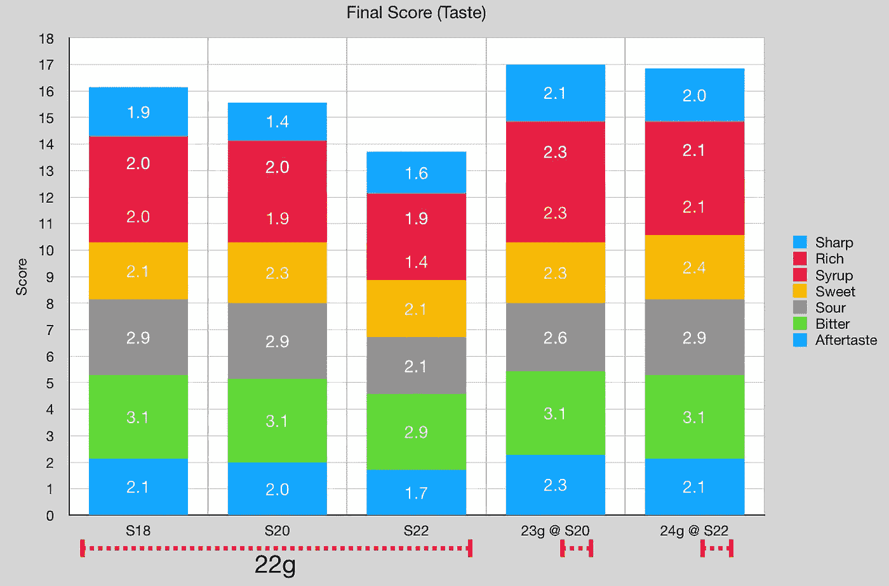
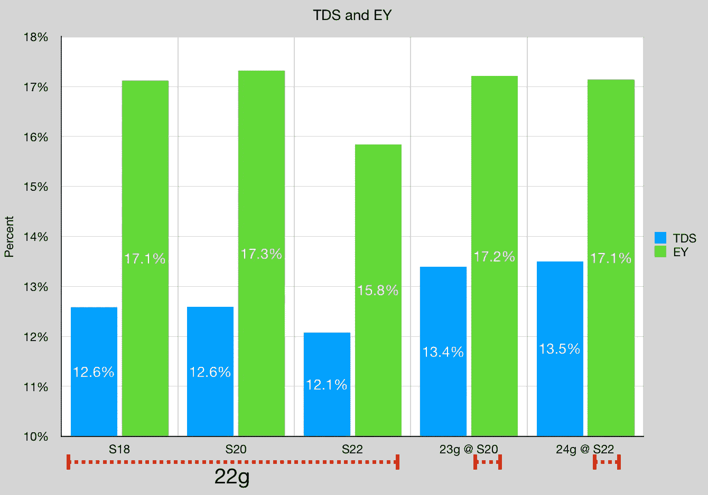
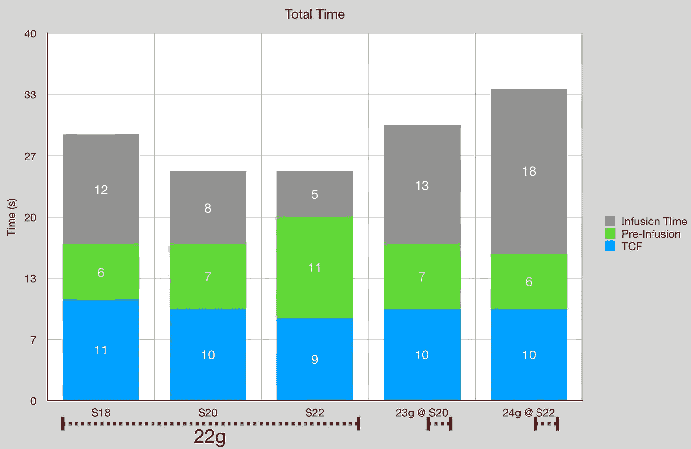

# 探索浓缩咖啡的研磨尺寸和剂量

> 原文：<https://medium.com/nerd-for-tech/exploring-grind-size-and-dose-for-espresso-77515c43d5a0?source=collection_archive---------0----------------------->

## 咖啡数据科学

## 一些探索性数据

当拨入咖啡豆时，通常人们谈论保持剂量恒定。然而，剂量、研磨、[、顶部空间](https://rmckeon.medium.com/head-space-for-espresso-ebf007f5c766)和压紧压力都相互影响。所以我决定尝试几种剂量和研磨粒度的组合，看看它们之间的关系。我没有尝试所有可能的组合，但我确实对更好地探索空间感兴趣。因此，这些数据是探索性的，只应该用来激励其他人也探索自己的空间。

# 设备/技术

[浓缩咖啡机](https://towardsdatascience.com/taxonomy-of-lever-espresso-machines-f32d111688f1) : [像样的浓缩咖啡机](https://towardsdatascience.com/developing-a-decent-profile-for-espresso-c2750bed053f)

[咖啡研磨机](https://towardsdatascience.com/rok-beats-niche-zero-part-1-7957ec49840d) : [小生零](https://youtu.be/2F_0bPW7ZPw)

咖啡:[家庭烘焙咖啡](https://rmckeon.medium.com/coffee-roasting-splash-page-780b0c3242ea)，中杯(第一口+ 1 分钟)

镜头准备:[断奏夯实](https://towardsdatascience.com/staccato-tamping-improving-espresso-without-a-sifter-b22de5db28f6)

[预灌注](https://towardsdatascience.com/pre-infusion-for-espresso-visual-cues-for-better-espresso-c23b2542152e):长，约 25 秒

输液:[压力脉动](https://towardsdatascience.com/pressure-pulsing-for-better-espresso-62f09362211d)

[过滤篮](https://rmckeon.medium.com/espresso-baskets-and-related-topics-splash-page-ff10f690a738) : 20g VST

其他设备: [Atago TDS 计](https://towardsdatascience.com/affordable-coffee-solubility-tools-tds-for-espresso-brix-vs-atago-f8367efb5aa4)、 [Acaia Pyxis 秤](https://towardsdatascience.com/data-review-acaia-scale-pyxis-for-espresso-457782bafa5d)

# 绩效指标

我使用了两组[指标](https://towardsdatascience.com/metrics-of-performance-espresso-1ef8af75ce9a)来评估技术之间的差异:最终得分和咖啡萃取。

[**最终得分**](https://towardsdatascience.com/@rmckeon/coffee-data-sheet-d95fd241e7f6) 是评分卡上 7 个指标(辛辣、浓郁、糖浆、甜味、酸味、苦味和回味)的平均值。当然，这些分数是主观的，但它们符合我的口味，帮助我提高了我的拍摄水平。分数有一些变化。我的目标是保持每个指标的一致性，但有时粒度很难确定。

**使用折射仪测量总溶解固体量(TDS)，这个数字结合咖啡的输出重量和输入重量用于确定提取到杯中的咖啡的百分比，称为**提取率(EY)** 。**

# **数据**

**在味觉方面，更高的剂量对味觉产生了积极的影响，可能是因为 TDS 增加了。随着研磨粒度的增加，味道也有所下降，即使通过 TDS 和 EY，也没有更大剂量的变化那么大。**

****

**剂量在这个测试中有最大的影响，当我做剂量测试时，我总是很惊讶我是如何明显地在我的篮子里少放了剂量。**

****

**就时间而言，更高的剂量或更细的研磨具有更长的喷射时间。这可能与提取率较高有关。**

****

**这些测试继续鼓励我过度包装我的篮子。我通常坚持相同的研磨设置，现在，我需要相应地提高我的剂量。更高的剂量也会减少顶部空间，所以也许篮子可以设计得不同。**

**如果你愿意，可以在 [Twitter](https://mobile.twitter.com/espressofun?source=post_page---------------------------) 、 [YouTube](https://m.youtube.com/channel/UClgcmAtBMTmVVGANjtntXTw?source=post_page---------------------------) 和 [Instagram](https://www.instagram.com/espressofun/) 上关注我，我会在那里发布不同机器上的浓缩咖啡照片和浓缩咖啡相关的视频。你也可以在 [LinkedIn](https://www.linkedin.com/in/dr-robert-mckeon-aloe-01581595) 上找到我。你也可以关注我的[媒体](https://towardsdatascience.com/@rmckeon/follow)和[订阅](https://rmckeon.medium.com/subscribe)。**

# **[我的进一步阅读](https://rmckeon.medium.com/story-collection-splash-page-e15025710347):**

**[我的书](https://www.kickstarter.com/projects/espressofun/engineering-better-espresso-data-driven-coffee)**

**[我的链接](https://rmckeon.medium.com/my-links-5de9eb69c26b?source=your_stories_page----------------------------------------)**

**[浓缩咖啡系列文章](https://rmckeon.medium.com/a-collection-of-espresso-articles-de8a3abf9917?postPublishedType=repub)**

**工作和学校故事集**