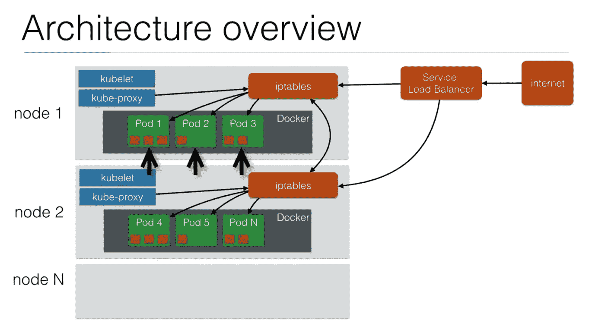
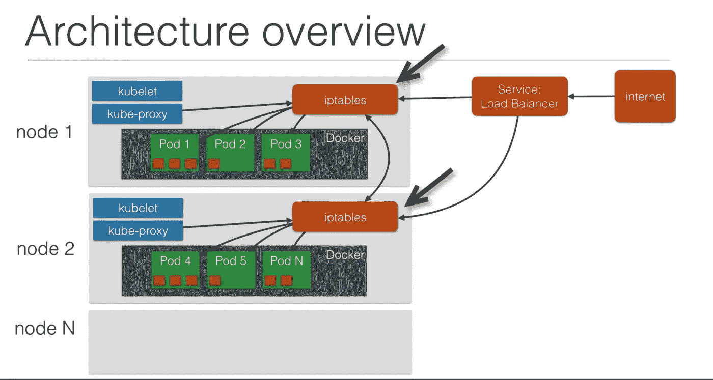

# 探索 Kubernetes 节点架构。

> 原文：<https://medium.com/nerd-for-tech/exploring-kubernetes-node-architecture-3a36df6ae034?source=collection_archive---------8----------------------->


照片由[丹尼·萨尔塔伦](https://unsplash.com/@dsaltaren?utm_source=unsplash&utm_medium=referral&utm_content=creditCopyText)在 [Unsplash](https://unsplash.com/s/photos/architecture?utm_source=unsplash&utm_medium=referral&utm_content=creditCopyText) 拍摄

**在本指南中，我们将探索 Kubernetes 中的节点架构，以及您的容器如何通过网络相互通信**。

# 单元、节点和容器



绿色部分，你可以看到豆荚。在**节点 1** 上有 Pod 1、Pod 2 和 Pod 3，在**节点 2** 上有 Pod 4、Pod 5 和 Pod N。在那些豆荚里，你有里面的容器。此外，您可以看到红色标示的**箱 2** 和**箱 5** 上的一个容器。如果你看一下 Pod 3，你也可以有多个容器。它有 2 个容器，Pod 1 有 3 个容器。

这些容器可以使用端口号& `localhost`轻松地相互通信。如果您有两个小服务，一个是后端，另一个是认证服务，它们可以很容易地通过网络相互通信，就像集群中的 pod 也可以相互通信一样，但这必须通过网络。上图中 pod 中的容器运行在 Docker 上，在您的节点上，您需要安装 Docker。您也可以使用替代的容器引擎，但是最好总是使用 Docker。

# **Kubelet 和一个 Kube-proxy**

在这些节点上，还运行着 **Kubelet 和一个 Kube-proxy** 服务。库伯莱号负责发射吊舱。它将连接到主节点获取信息。

Kube-proxy 将把关于这些节点上有哪些 pod 的信息提供给`iptables.` iptables 是 Linux 中的防火墙，它可以用来路由流量。因此，每当启动新的 pod 时，Kube-proxy 都会更改 iptables 规则，以确保您的 pod 在集群中是可路由的。

# 服务

记住服务如何工作的最简单的方法就是把自己想象成一个负载平衡器😅。您的服务可以是 AWS 上的 ELB(弹性负载平衡器)。AWS 上的这个弹性负载均衡器将公开发布，这样来自互联网的客户端就可以连接到您的负载均衡器，然后您的负载均衡器会将流量转发到您的 Kubernetes 集群，该集群将列出所有节点，流量将全部到达`iptables.`



`iptables`具有将流量转发到另一个节点的规则。例如，如果 pod 在第二个节点上，那么它会将流量转发到 pod 和 Pod 中的特定容器。服务和节点之间的通信通过一个端口进行。在 AWS 的情况下，您可以将您的 ELB 配置为使用一个已配置的端口，这样您的所有节点都可以监听该端口，并且`iptables`会将来自该端口的流量路由到正确的 pod。

## 要将它转换成一个`Yaml`文件:

```
apiVersion: v1kind: Podmetadata:name: hello-world.example.comlabels:app: hello-worldspec:containers:- name: docker-demoimage: thecraftman/docker-demoports:- name: python-portcontainerPort: 3000
```

根据上面的配置，我们有一个容器和 pod 定义。`spec`指的是一个容器，这个容器指的是上面我们的**图中 pod 内的红色块。整个绿色吊舱实际上是你在上面的`yaml`配置中看到的完整定义。`container`是你在`spec.`下看到的一切**

> 如果您有两个容器，那么您将只有一个包含两个容器的规范。

# 谢谢

喜欢阅读吗？在下面留下一些“掌声”,以便其他人可以找到这篇文章🙂