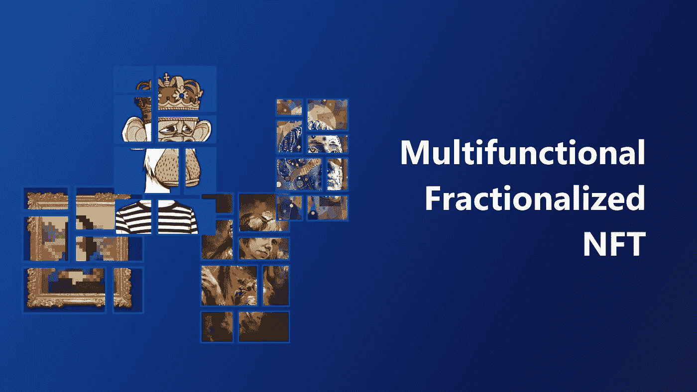

# 探索 web3 中细分化 NFT 的概念

> 原文：<https://medium.com/nerd-for-tech/exploring-the-concept-of-fractionalized-nft-in-web3-39a4b42007ed?source=collection_archive---------2----------------------->

随着一些 NFT 收藏品受欢迎程度的提高，它们的底价也在上涨。对于在市场早期进入该领域的收藏家、投资者和艺术家来说，这是一个好消息。但是那些愿意进入市场的人呢？虽然大多数人负担不起他们需要的更昂贵的非功能性食物，但他们也许可以探索细分的非功能性食物。

[NFT 细分化](https://www.leewayhertz.com/fractional-nft/)是这个快速增长的加密、区块链和去中心化领域的下一个篇章。NFT 分割意味着 NFT 的所有权被分割成更小的部分。这允许多个人拥有一个 NFT。再解释一下，NFT 不是加密货币，不能兑换其他资产。但是，分数 NFT 允许您分割 NFT 的所有权。例如，不可能将蒙娜丽莎的原画换成另一幅画。然而，可以将这幅画分割成更小的部分。同样，随着 NFT 的细分化，几个人可以拥有同一件稀有物品。智能合同使[非功能性金融服务细分化。](https://www.leewayhertz.com/fractional-nft/)

# 细分的 NFT 是如何工作的？

为了说明细分的 NFT，我们将使用令牌开发标准 [ERC20 和 ERC721](https://www.leewayhertz.com/erc-20-vs-erc-721-vs-erc-1155/) 。ERC721 令牌作为使用以太坊区块链创建不可替换令牌的标准，而 ERC20 标准用于创建可替换令牌。可替代代币可以代表可替代物品，如黄金、货币和任何其他商品。另一方面，不可替换的令牌可以用来表示任何稀有物品，例如可收集的游戏卡。

一个可替换的令牌是灵活的，你可以把它换成另一个同类的，不会有任何损失。因此，我们可以部署一个智能合约来生成链接到 ERC721 NFT 的 ERC20 令牌，默认情况下这是不可分割的。通过这种方式，任何持有 ERC20 代币的人都可以分享珍贵的 NFT。这就是 NFT 实现部分所有权的方式。智能契约还可以保护区分部分 NFT 和其他 NFT 的数据。这个想法也适用于任何支持智能合同的区块链网络。这样，NFT 被锁定在智能合约中，多个可替换的令牌代表其所有权。智能合同控制这些令牌的供应。

# 分数化的 NFT 可以逆转吗？

我们可以逆转分裂的 NFT，建立一个完整的 NFT。在 NFTs 的细分过程中，我们在与之相关的智能合约中获得买断期权。这种买断选项使部分 NFT 持有者能够购买解锁原始 NFT 所需的所有部分。一旦部分 NFT 持有者将几个 ERC20 令牌转移到智能合约中，它就启动收购。这将启动回购拍卖，并将持续一段时间。如果收购成功，它将自动向智能合约返回分数，买方将获得 NFT 的全部所有权。

# web3 开发中细分 NFT 的好处

## 民主化

由于一些最受欢迎的非传统艺术品的价格越来越高，小投资者和收藏家参与 [NFT 市场](https://www.leewayhertz.com/nft-marketplace-development-company/)是负担不起的。昂贵的 NFT 的成本通过细分得到降低，任何人都更容易获得。

## 更大的流动性

NFT 的日益流行使得大众收藏更加昂贵。然而，昂贵的 NFT 只对富有的投资者开放。借助分数 NFTs，您可以将您的 ERC721 令牌或 ERC1155 令牌分成多个 ERC20 令牌，使它们更加实惠。

## 价格发现

由于交易历史有限，很难确定高端 NFT 的当前价格。细分的 NFT 让交易者更便宜、更容易获得，也让买家更容易确定 NFT 的真实价值。

## 创作者更高的可见性

由于细分化，数字创作者在网上有更大的知名度，可以在更具流动性的市场中接触到更多的受众。

# 哪里可以买到分数 NFT？

许多平台允许用户创建和购买细分的 NFT。

*   **奥的斯**是一个 NFT 投资平台，允许用户投资 NFT 艺术品和收藏品，管理他们的投资组合，并通过奥的斯应用进行交易。该平台允许投资者购买加密资产的部分份额。
*   **unily**——它面向那些希望将自己的 NFT 藏品转化为保证流动性的可交易资产的投资者。该平台允许投资者将非金融交易凭证化，并创建任何规模的可交易集合。
*   **Fractional.art** —这个平台允许投资者购买、出售和铸造分数的 NFT。此外，NFT 持有者可以利用该平台创建细分的 NFT 藏品或 NFT 藏品。

# 分数 NFT 是一个好的投资吗？

分数 NFT 可能是一项伟大的投资。它们有助于增加蓬勃发展的 NFT 市场的流动性和包容性。它们通过提供流动性、价格发现和民主化，增加了 NFT 市场的潜力。然而，细分的 NFT 也有风险。它们通常会遇到与非技术转让相同的问题，如合同、宣传和知识产权。虽然将整个 NFT 作为数字收藏品进行销售或购买可能不会给证券法带来问题，但细分的 NFT 可能会引起监管机构的警惕，因为金融监管机构可能会将它们视为未经授权的 ico(首次发行硬币)。

随着非金融资产和细分非金融资产市场的持续增长，围绕这些资产的法律规则也将发生变化。目前，NFT 相关企业的投资者和所有者需要意识到潜在的法律问题。

# 结果

随着 NFT 市场越来越受欢迎，需求越来越大，随着区块链技术的发展，我们将会看到更多有趣的发展和使用案例。虽然分数 NFT 仍处于起步阶段，但它似乎将成为不断增长的密码行业的下一个大趋势。NFT 细分允许更大的流动性，因此开辟了无尽的投资选择。这为更广泛的投资者打开了市场，并确保细分的 NFT 将推动数字资产货币化的下一波浪潮。