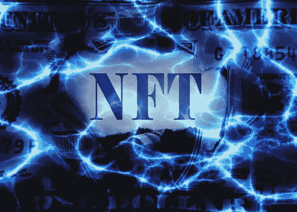
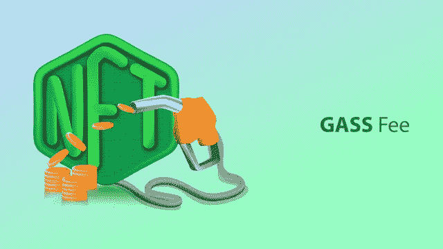
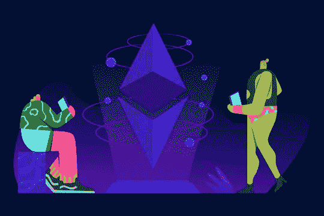
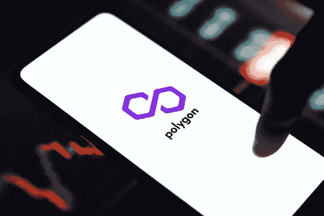
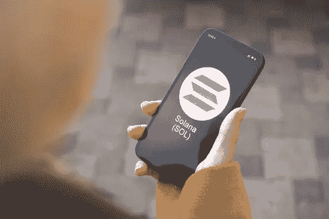
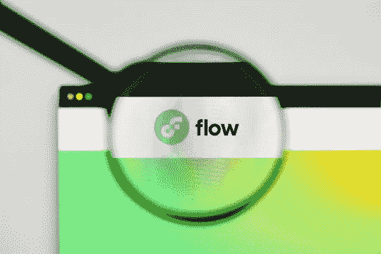

# 探索创建 NFT 发展平台的成本

> 原文：<https://medium.com/nerd-for-tech/exploring-the-cost-for-creating-an-nft-development-platform-ff4cc6057622?source=collection_archive---------6----------------------->

毫无疑问，由于 NFTs 的采用，创作者经济得到了一针强心剂。这些独特的加密收藏品是在各种区块链网络上创建的。此外，它在艺术、游戏、体育、娱乐、时尚、房地产等各个领域都很流行。同样，让我们知道 [**NFT 发展方案**](https://www.appdupe.com/nft-development-services?utm_source=Medium&utm_medium=Blog&utm_campaign=Narmatha) 的重要性。

## **近距离观察 NFT 市场的情况**

*   总体而言，交易量排名前五的 NFT 交易平台是 OpenSea、LooksRare、Bloctobay、Axie Infinity 和 NBA Top Shot。他们像以太坊，流一样在区块链上操作，像 Ronin 和 Polygon 一样在侧链上操作。
*   就市值而言，领先的 NFT 收藏是 Mathcastles 的 Terraforms、More Loot、Meebits、隐形朋友、无聊猿游艇俱乐部(BAYC)和突变猿游艇俱乐部(MAYC)
*   销量靠前的 NFT 有哪些？在价值最高的 10 件收藏品中，CryptoPunks 和 Bored Ape Yacht Club 被购买的次数最多。

## **分析 NFT 铸币的意义**

艺术家必须决定他们希望作为不可替代的象征出售的资产(NFT)。他们应该上传他们的照片，视频，表情符号，gif，产品等文件。随后，创作者必须按下薄荷选项，并支付所需的天然气费。他们应该从硬件和软件钱包中处理交易。后来，资产变成了 NFT，并显示在收藏品部分。用户应该在购买之前验证加密收藏品的真实性。他们可以看到令牌 ID、合同地址、铸造日期和时间以及令牌标准等详细信息。

## **与 NFT 发展相关的各种费用是什么？**

**天然气费—** 是指为处理一笔交易所需的能源而支付给矿工的费用。同样，艺术家在区块链网络上进行各种活动时，必须支付一定的费用。重要的是，根据其他投资者的需求和区块链网络的活动程度，天然气费用可能会增加。

**上市费用—** 现在，几个 NFT 市场已经出现在世界各地。一些区块链驱动的交易平台通常允许艺术家免费制作他们的非功能性交易。然而，创作者需要支付特定的金额，同时列出他们的资产进行出售。

**转售费用—** 从创作者处购买了限量版 NFT 的投资者可以在特定期限后出售。他们必须据此定价，在二级市场上进行拍卖。买家会出价购买。

## **哪些因素决定了制造 NFT 的成本**

## **区块链网络的选择:**

✔️ **以太坊**

毫无疑问，开源的区块链网络是 NFT 市场发展的首选。例如，像 OpenSea、Rarible、Decentraland、Foundation 和 Sandbox 这样的平台在以太坊上运行。有趣的是，储户在联邦储蓄银行增加了 250 亿美元的巨额存款。随着公共测试网的运行，以太坊已经做好了从工作证明(PoW)向利益证明(PoS)机制转变的准备。

以太坊的天然气费用取决于多个方面，如计算能耗水平、投资者处理的交易数量以及智能合同中包含的条款和条件。有时，高度拥堵会导致支付暂停。

✔️ **多边形**

Polygon sidechain 刚刚获得 4.5 亿美元的融资，发展迅速。layer Ethereum-2 扩展解决方案已经与几个 NFT 市场集成，如 OpenSea、Aavegotchi、Playdapp、DraftKings 等。总的来说，在 Polygon 上已经建立了 7000 个分散式应用程序(DApps)。

重要的是，Polygon 还允许投资者通过 MetaMask、比特币基地钱包、Bitski、Venly 和 WalletConnect 开源协议等软件钱包轻松处理交易。除此之外，它还提供了多种扩展解决方案，如以太坊虚拟机(EVM)的 Polygon Proof-of-Stake (PoS)、Polygon Edge、Polygon Hermez 和 Polygon Nightfall Testnet。

此外，Polygon 还集成了几个分散金融(DeFi)平台，如 Aave、SushiSwap、QuickSwap、Curve。金融，保利网，EasyFi，沼泽。金融、多边贷款等。

创作者获得了大量的好处，如低交易费、多层安全措施、24x7 数字资产交易和互操作性。

✔️ **索拉纳**

公共区块链网络提供了几个优势，如快速处理交易，抵制审查，以及低费用。Solana 拥有大约 1592 个节点，为分片链提供了一个可行的替代方案。除此之外，它已经成为不可替代代币(NFT)、分散金融(DeFi)项目和 Web 3.0 游戏的首选。艺术家和 NFT 收藏家获得了更多的好处，如更大的吞吐量，他们的个人和财务数据的安全存储，以及定制铸造他们的资产。

目前，索拉纳上受欢迎的 NFT 市场是 Magic Eden、Solanart 和 Solsea。大约 5.7 个不可替代的代币(NFT)现在已经在索拉纳上被铸造，平均铸造成本只有 1.5 美元。

✔️ **流量**

NBA Top Shot、UFC、华纳音乐集团、西甲联赛和国家橄榄球联盟(NFL)都在 Flow 区块链网络上出售了价值数十亿美元的 NFT。一般情况下，用户在流量令牌中支付 2 笔费用(账户创建费和交易费)。在多节点架构上运行，艺术家和投资者受益于可扩展性、低能耗和去中心化。

还有哪些著名的区块链网络 [**打造 NFT**](https://www.appdupe.com/nft-development-services?utm_source=Medium&utm_medium=Blog&utm_campaign=Narmatha) 开发平台？它包括币安智能链(BSC)、Tezos、Avalanche、Waves 和 WAX 等。

## **分析懒人造币的意义**

创作者可以直接铸造他们的 NFT，而不会产生任何气体费用。例如，像 OpenSea 和 Rarible 这样的 NFT 市场提供了惰性铸造选项。整个机制是如何运作的？一般来说，NFT 并不是在艺术家创作的时候被开发出来的。

此外，当购买者购买稀有的 NFT 时，他/她会招致汽油费。一般来说，用户应该在 NFT 市场上创建一个帐户，并同步他们的硬件和软件钱包。随后，艺术家应该选择具体的区块链，以太坊，Tezos，和流量。之后，他们应该添加有关其资产的信息。过一会儿，他们应该处理交易。

一位买主将出价购买 NFT。内容创建者将选择最佳报价，并将加密收藏品直接转让给相关人员。艺术家们有充分的自由去燃烧懒惰的铸造的 NFT。他们需要支付特定的汽油费。

## **总结一下，**

想要在 Web 3.0 的世界里开始一场革命吗？联系一家[**白标解决方案提供商**](https://www.appdupe.com/nft-development-services?utm_source=Medium&utm_medium=Blog&utm_campaign=Narmatha) 并利用他们的 NFT 开发服务。