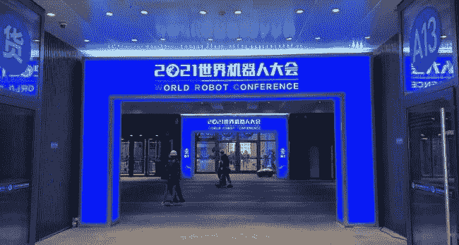
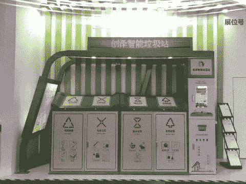

# 探索世界机器人大会的热门产品

> 原文：<https://medium.com/nerd-for-tech/exploring-the-hot-products-of-the-world-robot-conference-899da8465f31?source=collection_archive---------11----------------------->

## **AI 让生活更简单**

世界机器人大会

在生活中，你是否因为不懂垃圾分类而浪费了很多时间？你是因为不会做饭而苦恼吗？你担心你的猫和小狗，你不能安心工作吗？别担心，机器人朋友会帮你解决这些问题。

2021 世界机器人大会于 9 月 10 日至 13 日在北京举行。以“**共享新成果，注入新动能**为主题，吸引了 110 多家企业、500 多款产品参展。在同期举行的机器人博览会上，各种智能机器人纷纷拿出看家本领，炫耀自己的“才华”。

## **人工智能帮助垃圾分类**

“小青小青，香蕉皮是什么垃圾？”"香蕉皮是厨房垃圾."话音刚落，厨余垃圾桶的盖子就自动打开了。展厅内，一座人工智能垃圾站吸引了众多参观者驻足体验。垃圾站配有语音交互系统。如果不确定垃圾的类型，可以问垃圾站的人工智能“小青”。当“小青”回复查询时，对应类型垃圾桶的盖子会在一秒内自动打开。

**在 2021 世界机器人大会博览会现场，人工智能垃圾站引人注目。**

这个人工智能垃圾站共有四个垃圾桶:可回收垃圾、有害垃圾、厨余垃圾和其他垃圾。当你想扔掉垃圾时，只要站在相应的垃圾箱前，盖子就会自动打开。彩屏下还有一个手机电池回收站。垃圾站右侧配有消毒机。人们扔掉垃圾后，只需将手轻轻放在机器下面，消毒液就会自动挤出来。垃圾站的顶部还装有摄像头和灭蚊灯。摄像头可以方便工作人员实时监控垃圾处理情况。

[https://t.ynet.cn/baijia/31413574.html](https://t.ynet.cn/baijia/31413574.html)

一台以智能化的方式帮助人们完成日常垃圾分类工作的机器，无论对于垃圾分类管理者还是普通居民都是非常方便的。据工作人员介绍，该人工智能垃圾站已在北京、山东、河北、甘肃等地的许多住宅小区和科技园区得到应用。

## **数据标注需求持续增长**

从人工智能技术的研究方向来看，无论是在传统机器学习领域还是深度学习领域，基于训练数据的**监督学习仍然是一种主要的模型训练方法**。尤其是在深度学习领域，需要更多的标记数据来提高模型的有效性。

目前，各行业对最优质的 AI 训练数据需求迫切。人工智能应用于各个领域，如教育、法律、智能驾驶、银行和金融等。每个领域都有细分和专业化的要求。

其中，尤其是智能转型的传统企业和科技企业，更需要有丰富项目经验的培训数据服务商的协助，帮助整理数据标注指令，获取更合适的数据。在特殊场景下使用高质量的数据，减少研发周期，加速实施过程，帮助企业更快更好地进行智能化转型。

**对话式 AI 智能体是用大规模人工标注数据构建的。然而，大规模的人工标注通常是昂贵且耗时的。因此，丰富而有用的数据集是人工智能开发的宝贵资产。**

## NLP 服务

我们在电子商务、零售、搜索引擎、社交媒体等领域提供不同类型的自然语言处理。我们的服务包括语音分类、情感分析、文本识别和文本分类(聊天机器人相关性)。

ByteBridge 与全球 30 多个不同的语言社区合作，现在提供[数据收集和文本注释服务](https://tinyurl.com/2p8vzx97) ，涵盖的语言有**英语、中文、西班牙语、韩语、孟加拉语、越南语、印度尼西亚语、土耳其语、阿拉伯语、俄语等等**。

# 结束

将你的数据标注任务外包给[字节桥](https://tinyurl.com/2p8vzx97)，你可以更便宜更快的获得高质量的 ML 训练数据集！

*   无需信用卡的免费试用:您可以快速获得样品结果，检查输出，并直接向我们的项目经理反馈。
*   100%人工验证
*   透明和标准定价:[有明确的定价](https://www.bytebridge.io/#/?module=price)(含人工成本)

为什么不试一试呢？

资料来源:https://baijiahao.baidu.com/s?id = 1710756629985464799 & wfr = spider & for = PC