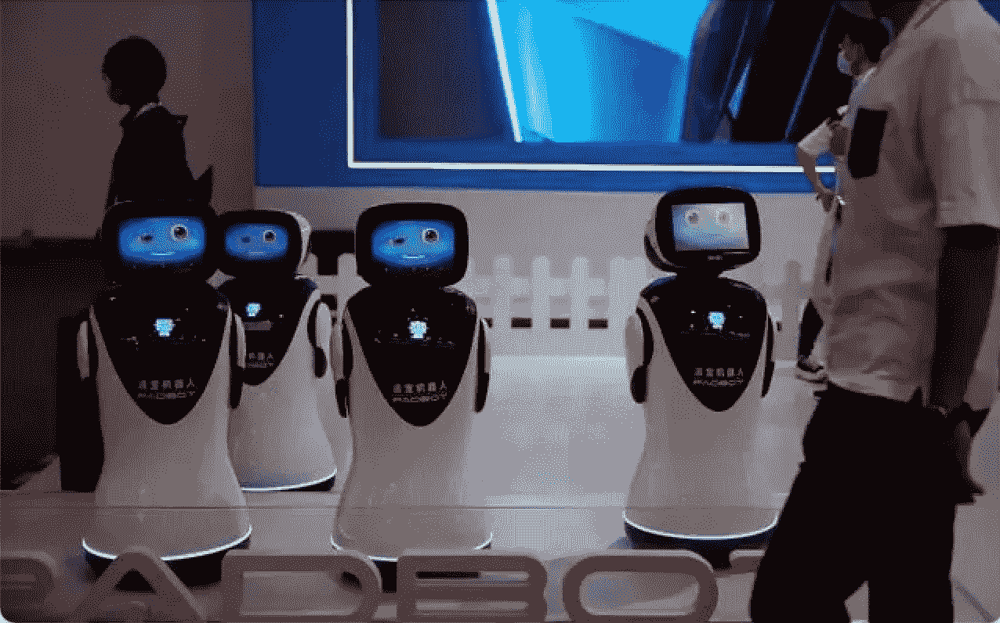
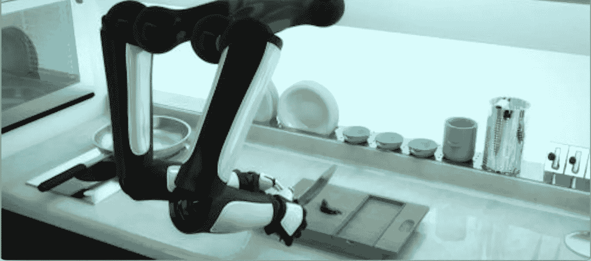

# 探索世界机器人大会的热门产品——第二部分

> 原文：<https://medium.com/nerd-for-tech/exploring-the-hot-products-of-the-world-robot-conference-part2-26809952c7f0?source=collection_archive---------7----------------------->

[http://nimg.ws.126.net/?URL = http % 3A % 2F % 2f dingyue . ws . 126 . net % 2f 2021% 2f 848d 609 DJ 00 qz 9y 4k 000 VC 000 hs 00 bvg . jpg&thumbnail = 650 x 2147483647&quality = 80&type = jpg](http://nimg.ws.126.net/?url=http%3A%2F%2Fdingyue.ws.126.net%2F2021%2F0911%2F848d609dj00qz9y4k000vc000hs00bvg.jpg&thumbnail=650x2147483647&quality=80&type=jpg)

## **机器人烹饪大师，帮你轻松解决烹饪问题**

在 2021 世界机器人博览会的展厅里，一排可爱的、头上有配料的宠物模样的机器人吸引了大家的目光。观众紧挨着站在摊位前。烹饪机器人可以听、说、走。它拥有许多烹饪技术，包括炒，煨，蒸，切，称重和识别事物。

【https://huaban.com/pins/616997670/ 

## **烹饪机器人大师“小优”**

不管体积小，内置 3000+AI 数字全球美食图谱库，智能引导烹饪，想吃什么样的菜就吃什么样的菜。只需在搜索框里搜索你想做的菜的名字，或者问“小优，小优，我想吃 XXX”。无论是糖醋排骨，还是红烧海鲜，它都让你在最少或没有烹饪技巧的情况下完成食物准备，秒变烹饪高手。

同时，它还具有健康监测、中医诊疗、用药提醒、运动健康、营养食谱等多种保健功能，可以照顾全家人的健康。

## **智能伴侣**机器人**宠物**

在 2021 世界机器人博览会的展厅里，一个小小的圆形机器人非常引人注目，旁边还有两只公仔猫。这个机器人只有小猫大小，头上有一只“眼睛”。原来这是一款智能宠物陪伴机器人。

虽然体积很小，但它有很多有趣的技术。智能陪伴宠物机器人轻松拥有智能玩耍陪伴、激光挑逗、实时视频、双向语音、食物奖励等 5 大功能。可以说陪伴宠物的能力是非常强大的。机器人内置零食盒，可以给宠物喂零食。主人还可以通过手机上的应用程序打开机器人的激光抚摸模式。如果主人出差在外，可以使用机器人与宠物进行语音或视频“聊天”，拍摄视频，记录宠物的可爱瞬间。

一个小型机器人可以轻松解决无法在家照顾宠物的麻烦，例如外出工作和出差，让智能饲养宠物变得更加容易，也让宠物的生活更加丰富。

## **定制数据集**

随着 AI 商业化进程的加快，以及辅助驾驶、客服聊天机器人等 AI 技术在各行各业的应用，人们对特殊场景下的数据质量的期望越来越高。**高质量的标签数据将是人工智能公司的核心竞争力之一。**

如果说之前的算法模型使用的一般数据集是粗粮，那么算法模型目前需要的是定制的营养餐。如果公司想要进一步提高某些模型的商业化，他们必须逐步从通用数据集向前发展，以创建独特的数据集。

## NLP 服务

我们在电子商务、零售、搜索引擎、社交媒体等领域提供不同类型的自然语言处理。我们的服务包括语音分类、情感分析、文本识别和文本分类(聊天机器人相关性)。

ByteBridge 与全球 30 多个不同的语言社区合作，现在提供[数据收集和文本注释服务](https://tinyurl.com/2pzefkm8)，涵盖**英语、中文、西班牙语、韩语、孟加拉语、越南语、印度尼西亚语、土耳其语、阿拉伯语、俄语等语言**。

# 结束

把你的数据标注任务外包给 [bytebridge.io](https://tinyurl.com/2pzefkm8) ，你可以更便宜更快的获得高质量的 ML 训练数据集！

*   无需信用卡的免费试用:您可以快速获得样品结果，检查输出，并直接向我们的项目经理反馈。
*   100%人工验证
*   透明和标准定价:[有明确的定价](https://www.bytebridge.io/#/?module=price)(包含人工成本)

为什么不试一试呢？

来源:https://baijiahao.baidu.com/s？id = 1710756629985464799 & wfr = spider & for = PC