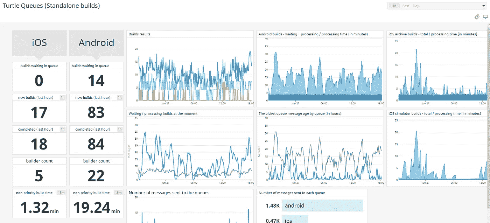
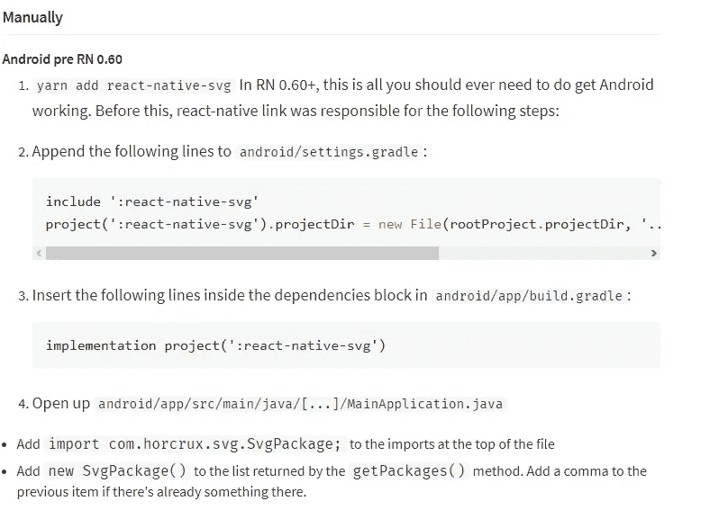
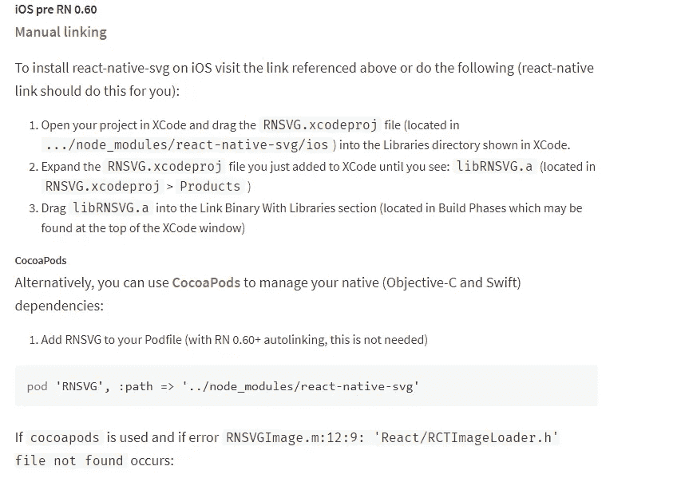

# Expo v/s React 本机 CLI。选择什么，远离什么。

> 原文：<https://medium.com/nerd-for-tech/expo-v-s-react-native-cli-what-to-choose-and-what-to-stay-away-from-85afc81597bc?source=collection_archive---------0----------------------->

React 本机 CLI v/s Expo

这篇文章完全基于我个人对 React Native 和 Expo 的体验。到目前为止，我已经使用 React Native 进行混合移动应用程序开发一年多了，同时也接触到了 Expo 框架。在此期间，我不得不为几个项目在两个平台之间周旋。我承认转向 Expo 的大部分原因是因为我没有个人 Mac 环境来构建和测试 iOS 应用程序。:)

让我们从介绍平台开始。React Native 将本地开发的最佳部分与 React 相结合，React 是用于构建用户界面的最佳 JavaScript 库。而 [Expo 基本上是一个建立在 React Native 之上的工具](https://docs.expo.io/)。你们中熟悉这两者的读者可能会说这两者是一样的。唯一的区别是你如何建造它们。我同意你的观点。两者都使用 React Native 的代码结构，但是也有很大的不同。从现在开始，我将只列出主要的区别。

# 添加本机模块:

原生模块可能是用 Java 为 Android 和 Swift 为 iOS 编写的任何东西。React Native 最终被 JavaScript 桥接转换成 Java 代码。你可以在这里了解更多关于这个[的信息。本地模块总是比 JS 代码快，在为 React Native 写这篇文章的时候是这样的。如果您想编写自己的本机模块并将其与 React 本机应用程序集成，那么您可以使用 React 本机 CLI 轻松完成，但如果您使用 expo，那么您将很难做到这一点。当然可以](https://dev.to/wjimmycook/how-the-react-native-bridge-works-and-how-it-will-change-in-the-near-future-4ekc)[弹出世博项目](https://docs.expo.io/expokit/eject/)。但是使用这种方式，你必须完全依赖 expo 进行弹射，这有时会造成问题。就像 Expo SDK 从 38 升级到 39 时一样，大多数开发人员面临的问题是他们甚至无法运行应用程序。

弹出 Expo 项目会构建一个裸露的 React 原生项目，如果您添加了一个原生模块并想要重新构建，您将需要一个用于 iOS 的 Mac 系统。因此，如果您退出 expo 应用程序，您将最终获得 React Native CLI 项目。因此，这里的重点是对本机 CLI 做出反应。

# 建筑项目:

使用 Expo 进行建筑时，您必须注册进入 [expo](https://expo.io/) 。这样你就可以为 android 构建一个 apk/aab，为 iOS 构建类似的包。一切都发生在他们的云中。源代码从你的文件夹中取出并上传到他们的平台上。构建在那里进行，他们会给你一个最终的包，你可以下载。你甚至可以在那里查看[正在建设的项目的状态。](https://expo.io/turtle-status)

世博会建造队列

你不必太担心建设程序，因为世博会自己会处理。在 React Native CLI 中，构建过程完全在您的系统上进行。正如我前面提到的，我只构建了 android 应用程序，因为我只有 windows 系统，你必须有一个 MacOS 来构建 iOS 版本。我在[做的一个项目 React Native CLI 就在这里](https://play.google.com/store/apps/details?id=com.daktar)。所以你将不得不面对构建错误，比如 Gradle 失败，manifest 错误等等。这并不是一件坏事，因为你将开始学习，但也意味着你需要一点 Java/Kotlin 和 xml 文件的知识，以及像 android Studio 这样的原生 Android 构建平台。因此，世博会的意义在于它的简单性。

然而，Expo 可能很简单，但它通常构建 55MB 大的 apk，这对于移动应用程序来说是一个相当大的文件。我试了两次 builds Expo，都在 50MB 以上。而我用 React Native CLI 构建了几个版本，最多只有 30MB。相信我，CLI 的项目比 Expo 的大得多。除此之外，在世博会中建造需要你排队等候，有时你会排得很晚，建造可能需要 3 4 个小时才能完成。所以重点去反应原生 CLI。

# 知识/技能要求:

谈到这两个平台所需的技术技能，开发人员必须对 React Native、ReactJS 和普通 JavaScript 有很好的了解，才能履行他们的职责。如果一个人没有这么多的知识，那么他将不能做很多事情。确切的事情适用于博览会，与上述领域的知识，人们可以很容易地设计，开发他们的应用与博览会。但是，对于 React 原生 CLI 开发人员来说，这还不够。他们应该对 Java 没什么经验，因为项目最终会用 Java 代码来桥接。您甚至可以在 React Native CLI 中使用的包中看到它。它们给出了在手工添加包的情况下，在 Java 文件中何处添加代码的明确指示。(存在 npm 没有正确安装软件包的情况。)比如我们可以看到一个包， [react-native-svg](https://www.npmjs.com/package/react-native-svg) 。在软件包的文档中有关于如何手动添加软件包的明确说明。而在 expo 中，你可以用“expo install package-name”命令轻松地安装软件包，只要 expo 本身支持你要安装的软件包，你就不必担心。

Android 中的手动包链接

iOS 的手动包链接

了解一些事情并没有坏处，所以我给出了在这一点上反应本地 CLI 的要点。

# 应用程序共享/测试:

让我们考虑一个例子，您希望与您的朋友或开发伙伴共享您的应用程序，以便他们可以在他们的设备上运行该应用程序，并且您可以从。对于 React Native CLI，您必须构建 apk(它再次处理构建错误和所有的东西)，与您的朋友共享 apk，并从他们那里获得反馈。另一方面，世博会很容易在这方面帮助你。我为此写了一份完整的申请，你可以在这里阅读。

基本上，通过 expo，您可以将您的应用程序隧道化，让您的朋友扫描 Expo 生成的二维码，或者发送电子邮件下载应用程序，并让他们测试应用程序。另一个很棒的事情是，他们可以在 Android、iOS 甚至 web 上这样做。世博会给予了这一切。所以这一次的重点是世博会。

因此，如果你计算一下分数，基于上面提到的事情，我们在 React Native CLI 上有 3 分，在 Expo 上有 2 分。这并不意味着世博会不如 CLI。然而，它确实指出，在随机开发之前，应该明智地考虑完全依赖于构建在另一个框架之上的工具。有各种各样的例子，当人们因为各种原因不得不放弃世博会的应用程序，只是为了摆脱世博会的依赖。但是对于学习和发展来说，Expo 对开发者来说是一个福音，坦白地说，对我来说也是一个福音。

## 结论:

我不会说一个优于另一个，我相信学习和体验这两个平台是有利的，但我更喜欢使用 CLI，如果你有 iOS 版本的系统，因为这样你就有机会处理更多的 android 原生模块。然而，如果你刚刚开始，那么你可以选择 Expo，因为它很容易学习和使用。

感谢您的阅读。