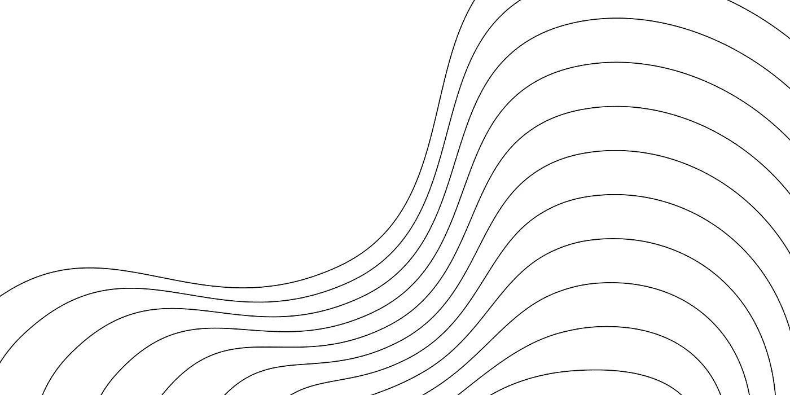

# 人工智能发展的指数增长

> 原文：<https://medium.com/nerd-for-tech/exponential-gains-in-ai-progress-3f569839dfb8?source=collection_archive---------5----------------------->

OpenAI 博客上的这篇文章最近引起了我的注意，我对此非常兴奋，所以我需要与你分享它。我们正走向一个未来，人工智能的力量将以我们无法想象的方式实现。早在 1965 年，摩尔定律就准确预测了 iPhone 的计算能力。它对未来几年有什么预测？

## 摩尔定律

飞兆半导体(Fairchild Semiconductors)和英特尔(Intel)的联合创始人乔治·摩尔(George Moore)做了一个简单的观察，这个观察将在接下来的半个世纪乃至更长的时间里持续定义一个实证现象。摩尔定律表明，每个硅片上的晶体管数量每年都会翻一番:他的观察是经济性的——摩尔写道，“每个组件的成本几乎与组件的数量成反比。”他推断计算能力将呈指数增长，而成本将会降低。

在某种程度上，这一预言的力量是自我实现的预言:半导体行业将它视为黄金法则和奋斗目标。随着投资涌入以维持增长并推动计算能力的极限，美国的生产率增长激增。**摩尔定律**是对历史趋势的观察和预测:每两年，硬件的能力往往会翻倍。

## 结果

在 Danny Hernandez 和 Tom Brown 的论文中，他们认为算法效率和硬件效率——人工智能进步的两个关键驱动因素——呈指数增长。算法效率似乎超过了摩尔定律。

在传统的计算机科学中，算法效率是通过考虑算法的成本如何随着输入大小而增长来衡量的，我们可以使用 Big-O 符号来描述这一点。例如，随着要排序的项目数量的增加，我们可以通过计算找到解决方案所需的操作数量来衡量排序算法的效率。

对于机器学习问题，这种方法不太管用，因为很难清楚地定义问题的难度。在这篇论文中，作者使用了一个聪明的技巧来衡量机器学习算法的效率:他们分析训练成本(即所需的计算能力)，保持性能不变。

使用这种方法，作者发现，在 2012 年至 2019 年期间，达到性能基准所需的计算量减少了 44 倍。摩尔定律表明下降了 11 倍。因此，在这段时间里，作者发现神经网络架构比最初的摩尔定律发展得更快。

想象一下算法效率 50 年后的未来会是什么样子。这就像从 1965 年的 16 位微型计算机发展到 2015 年你口袋里的强大的 iPhone。我认为我们可以看到工业革命规模的东西，这不是没有道理的。

今天，你可以和一个几乎和人类没有区别的人工智能聊天。这些功能上的进步下一步将把我们带向何方？