# 使用 AWS Glue 将 Oracle 数据库导出到 PostgreSQL！

> 原文：<https://medium.com/nerd-for-tech/export-oracle-database-to-postgresql-using-aws-glue-551860965c58?source=collection_archive---------3----------------------->

> **什么是 AWS 胶水？**

AWS Glue 是一个完全托管的 ETL 服务(提取-转换-加载),它使得在各种数据存储和数据流之间清理数据、分类数据、移动数据、丰富数据变得简单而经济。

> **AWS 粘合术语与架构图**

AWS Glue 的架构图

→ **数据目录:**持久元数据存储在 AWS Glue 中。包含表定义、作业定义和管理 AWS Glue 环境的其他受控信息。

→ **分类器**:确定数据的模式。Glue 为 CSV、JSON、XML 等常见文件类型提供了分类器。

→ **连接**:它包含连接数据存储所需的属性。

→ **爬虫**:用表格填充数据目录。这是大多数 AWS Glue 用户使用的主要方法。

→ **数据库**:数据目录中的数据库是保存表格的容器。手动或通过运行 crawler 在数据库中创建表。

→ **数据存储**:它是一个永久存储您的数据(例如 S3 水桶，RDS)。

→ **Job** :执行 ETL 工作所需的业务逻辑。由源数据库、转换脚本和目标数据库组成。

→ **脚本**:包含从数据源提取数据的代码(python、pyspark 或 Scala)——转换数据——将数据加载到目标中。

# **它是如何实现的？**

> ***先决条件:***

→需要有一个 AWS 账户。

→python/pyspark/Scala 的基础知识，用于根据用例编写脚本。

→确保创建了 Oracle 和 PostgreSQL 数据库。

→确保您已经为计算环境的公共/私有子网创建了一个 vpc(点击[此处](https://docs.aws.amazon.com/batch/latest/userguide/create-public-private-vpc.html))

→创建一个特定于角色的 IAM 来粘合(点击[此处](https://docs.aws.amazon.com/IAM/latest/UserGuide/id_roles_create_for-user.html))

> **涉及的步骤:**

## ***添加胶水连接:**

1.  转到 AWS 控制台中的 Glue Service，然后在导航窗格中的**数据目录**下，选择**连接。**
2.  通过给出**连接名称**、**连接类型** (如 JDBC)和**描述** (可选)，添加源连接，点击下一步，如下图所示。

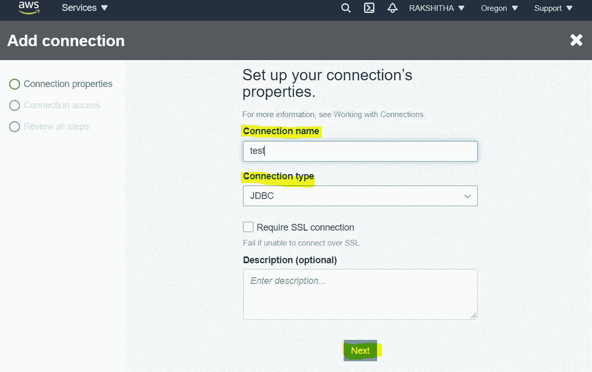

第二步:身材

3.添加与您的连接相关的 **JDBC URL** 和**用户名**和**密码**以及包含您的数据存储的 **VPC** 名称。单击下一步并查看更改。

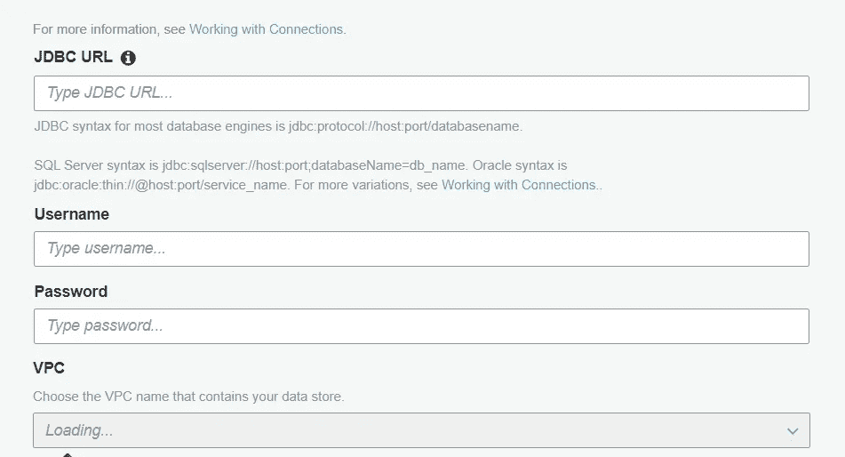

第三步:身材

4.测试连接。

***按照步骤 1 到 4 为 PostgreSQL(目标数据库)创建连接***

## *添加数据库(源和目标)

1.  转到**数据目录**中的**数据库选项卡**并点击**添加数据库**。单击创建。*(目的数据库也是如此)*

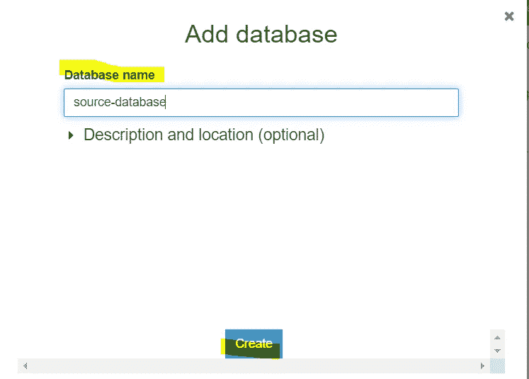

第一步:身材

## ***添加爬虫(源和目的)**

1.进入数据目录中的**爬虫**，点击**添加爬虫**，给**一个爬虫名称**，如下图所示。(标签、描述和其他信息是可选的)，单击下一步。

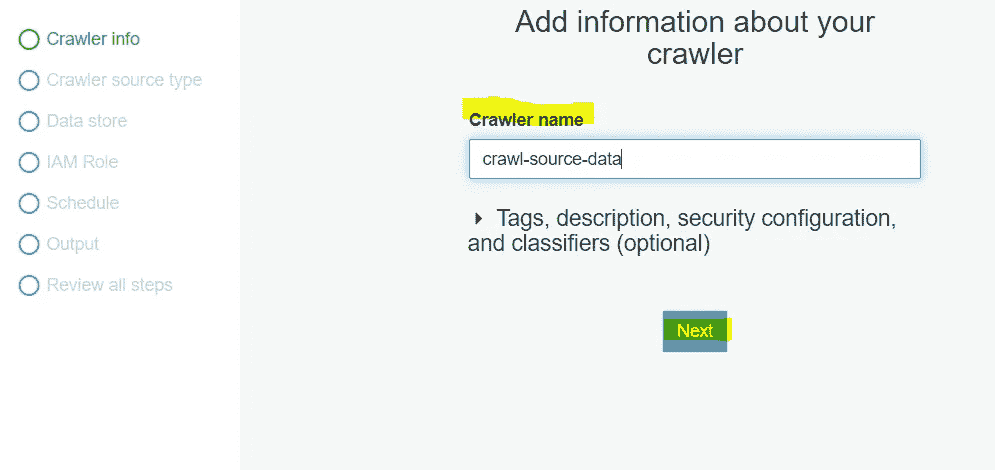

第一步:身材

2.如下图所示指定**爬虫源类型**，然后点击下一步。

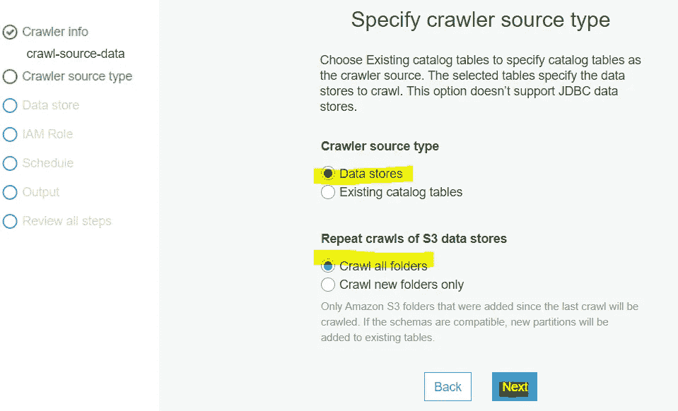

第二步:身材

3.添加一个数据存储->选择一个**数据存储作为 JDBC** - >添加连接(例如。test)我们在前面的步骤中创建了- >包含一个路径的表(例如。MyDatabase/Myschema/%)。这里%从 MyDatabase 中抓取所有的表，它的模式名是:MySchema。

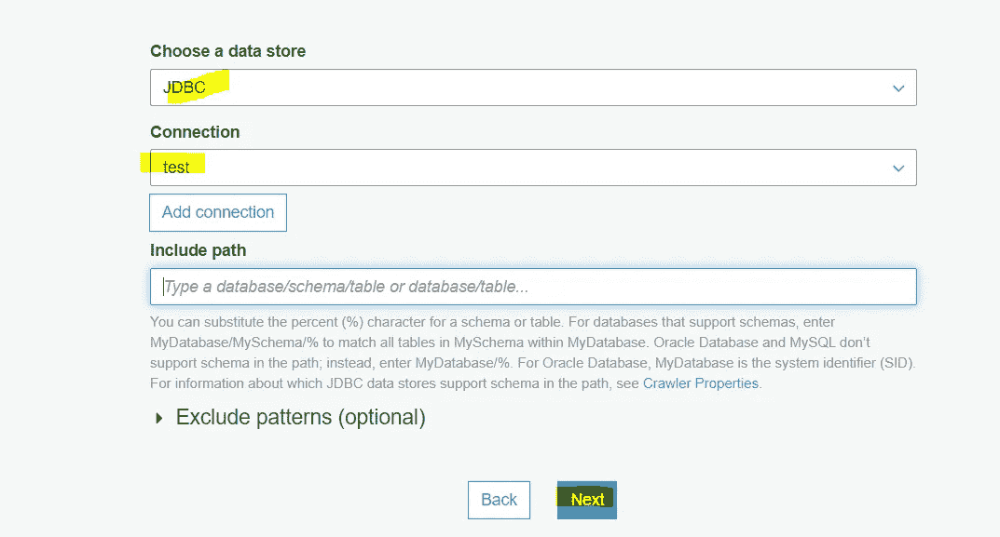

第三步:身材

4.在继续这些步骤之前，选择我们已经创建的 IAM 角色。

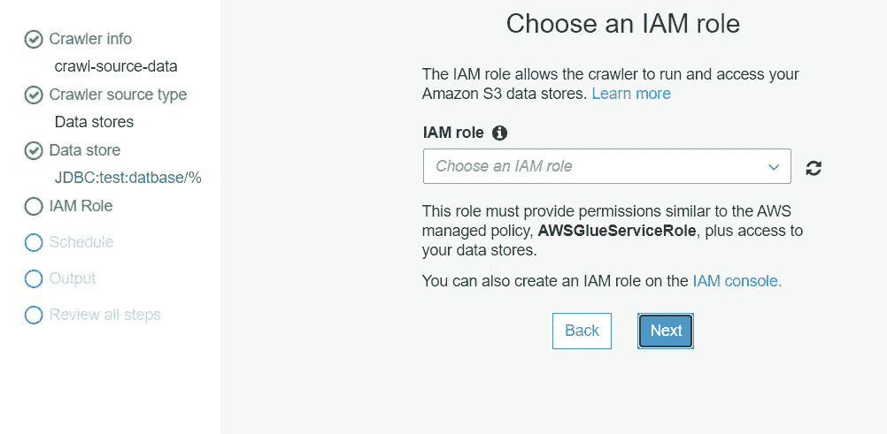

第四步:身材

5.根据您的要求为该爬网程序创建一个计划。

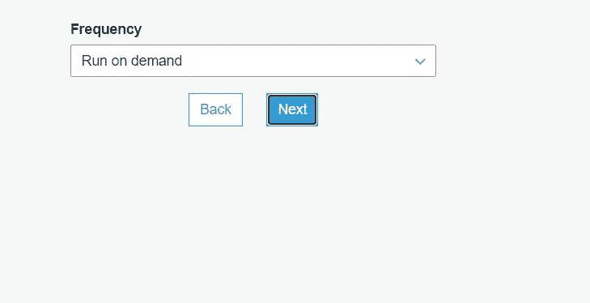

第五步:身材

6.配置爬网程序的输出。添加我们在前面步骤中创建的数据库(例如源数据库)

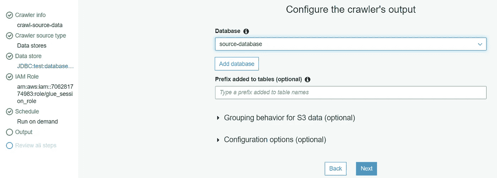

第六步:身材

*按照相同的步骤对目标数据库进行爬网*

## **添加作业*

1.  *点击**添加作业**创建一个 ETL 作业，从源数据库提取、转换和加载相关列到目标数据库。类型是 **Spark** 在这种情况下(你可以使用 python shell)，你也可以改变胶水版本。(此处**胶水版本 1.0** )。它还提供监控选项(可选)，各种安全配置(可选)更多关于这一点..(点击[这里](https://docs.aws.amazon.com/glue/latest/dg/add-job.html))。*

*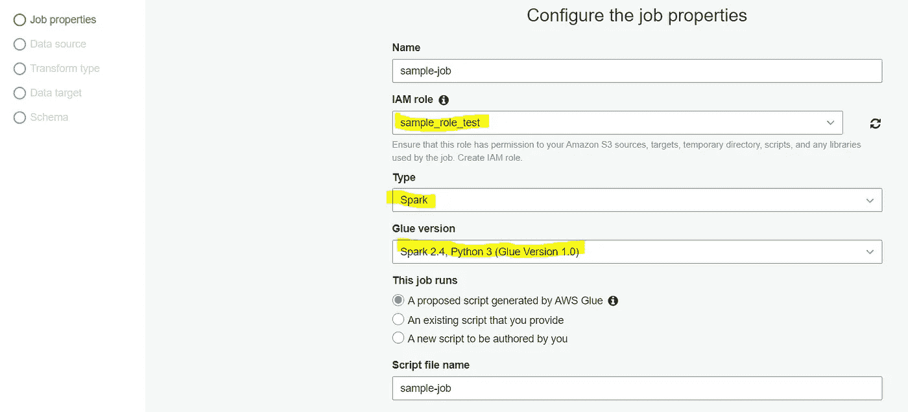*

*第一步:身材*

*2.在我们的例子(源数据库)中，选择**数据源**，即(从源数据库中选择必要的表名)。*

*3.同样，选择**目标数据源** (PostgreSQL)。*

*4.验证由 AWS Glue 创建的映射。您可以相应地更改映射。*

*5.**保存作业。**自动脚本将由 AWS Glue 服务器创建。*

*6.根据您的使用情况编辑作业，然后单击保存并运行！*

*7.作业启动时间大约是 10 分钟，所以，等到它完成。(如果出错，错误消息将显示在作业控制台/脚本控制台中。对于详细的错误消息，您可以随时转到如下所示的历史选项卡中的日志:)。*

*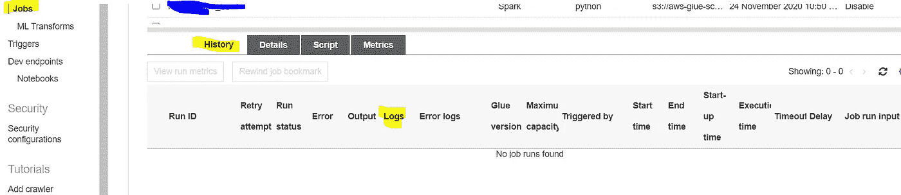*

*第七步:身材*

> ***万岁！***
> 
> ***你的第一份工作成功了！您已成功将数据从 Oracle 导出到 PostgreSQL。***

***谢谢你！***

*希望你喜欢它，并发现它有用！*

*如有任何疑问/澄清，请随时评论或发送邮件！我很乐意帮忙:)*