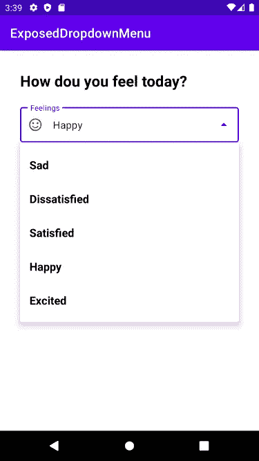

# Android 中暴露的下拉菜单

> 原文：<https://medium.com/nerd-for-tech/exposed-drop-down-menu-in-android-37b7b3823723?source=collection_archive---------0----------------------->

在本文中，我们将探索 Android 中**暴露的下拉菜单**。在暴露的下拉菜单的帮助下，我们可以快速方便地从列表中选择一项。

让我们通过一个简单的应用程序来学习使用暴露的下拉菜单，该应用程序询问用户今天感觉如何。

# 第一步

在 Android Studio 中创建新项目。

# 第二步

打开 **activity_main.xml.** 添加一个 TextView 编写问题文本。

文本视图

然后添加一个 **TextInputLayout** ，它包含一个 **AutoCompleteTextView** 来使用暴露的下拉菜单。

TextInputLayout 和 AutoCompleteTextView

您可以使用 TextInputLayout 中的 **style** 属性为暴露的下拉菜单选择您想要的样式。

风格

你可以用 TextInputLayout 中的**提示**属性将一个标题放到你暴露的下拉菜单中。

暗示

您可以使用 TextInputLayout 中的 **startIconDrawable** 属性将图标放在您的公开下拉菜单中。

图标

# 第三步

转到 **strings.xml** 并在那里添加字符串数组项。

strings.xml

# 第四步

创建一个名为 **dropdown_item.xml** 的新布局文件，然后添加一个 TextView，它将代表所显示的下拉菜单中的一个菜单项。

**dropdown_item.xml**

# 第五步

打开 **MainActivity.kt** 和**创建一个名为 **feelings** 的变量并获取对字符串数组的引用。然后创建一个数组适配器，并传递上下文、下拉布局和数组。最后，将**自动完成文本视图的适配器**设置为**数组适配器。****

主活动. kt

# 第六步

运行您的应用程序。

输出

*任务完成！感谢阅读。*

完整的代码:

 [## GitHub-eminenan/ExposedDropDownMenu:Android 中暴露的下拉菜单

### Permalink 无法加载最新的提交信息。Android 中暴露的下拉菜单 Android 中暴露的下拉菜单…

github.com](https://github.com/emineinan/ExposedDropDownMenu)