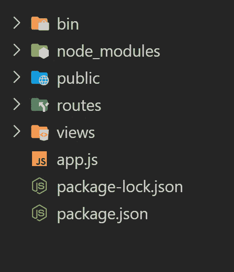
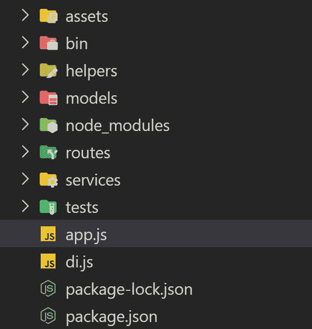

# 快递 Js，如何美化可读性

> 原文：<https://medium.com/nerd-for-tech/express-js-how-to-beautify-and-readable-ad87228cbc14?source=collection_archive---------4----------------------->


# 什么是**故事**

4 年前我开始开发 NodeJs。起初，我正在处理一些紧急项目，我被迫尽快完成它们，我没有足够的时间为我的项目创建任何好的结构。

过了一会儿，我坚持我的[意大利面条代码](https://en.wikipedia.org/wiki/Spaghetti_code)和**我学会了如果我有 10 分钟砍所有的树，磨利我的斧头 9 分钟，和 1 分钟砍所有的树。**而现在我想分享我避免意大利面代码的经验，分享我的代码结构。

## 第一步——决定框架。

不要忘记使用一个框架，正确地选择它。如果你打算创建一个处理端点的大型应用程序，我推荐使用类似于 [NestJS](https://nestjs.com) ( **不要忘记，如果是一个大型应用程序**)的类型脚本，或者如果你想处理一些东西或者你的应用程序不太大，使用类似于 [ExpressJS](https://expressjs.com) 的类型脚本。我的大多数项目都是 MVP，所以，在这里我们将继续 ExpressJs。

## 安装 Express。

我看到很多次，开发者安装了 ExpressJs 他们就直接开始写服务器代码。但是我强烈推荐你，用 [Express CLI](https://expressjs.com/en/starter/generator.html) 。然后你可以在 5 秒钟内开始你的代码。

```
mkdir test-project
cd test-project
express
```



如果你打开你的代码，你会看到类似这样的内容。这是 ExpressJs 框架的基本结构。但是我想改成我的风格。像我一样，如果你不想要任何 UI，那么移除 **public** 和 **views** 文件夹来清理你的结构。

让我们来看看项目框架。在 bin 文件夹中有一个名为 **www** 的文件。这是一个包含运行**服务器**所有代码的文件。我认为你现在不需要改变这个文件中的任何东西。**路线**文件夹包含在所有路线配置中。有两个默认的 index.js 和 users.js，你的**主代码**是进入 **app.js**

# 提高技术能力

首先，我更喜欢创建一些文件夹，**服务**，**资产**，**模型**，**测试**和**助手**。

*   **资产**包括密钥、配置文件等资产文件。
*   **助手**包含在日志管理或中间件等实用程序文件中
*   **模型是**数据库中包含的模型文件
*   **服务**包含在业务层中，将您的路线连接到您的逻辑和模型
*   **测试**包含在所有测试文件中

此外，我在每个项目中都有一个文件，我称之为 di.js，用于管理我的数据库。最后，你会得到这样的东西:



我的项目框架

# 命名文件

为了轻松找到你的文件，我总是根据文件夹名来设置它们的名称。例如，如果我想为计算定义一个新的服务，我将它命名为 calculation.service.js，或者对于路由，我使用 users.route.js。因此，我在项目的第一个位置将所有路由文件重命名，将 index.js 重命名为 **index.route.js** ，将 users.js 重命名为 **users.route.js** 。我还应该在 **app.js** 中更改路线名称

```
var indexRouter = require('./routes/index.route');
var usersRouter = require('./routes/users.route');
```

另外，如果你想了解更多关于骷髅的知识，我推荐你看这个视频

# 什么是 DI.js 文件

假设您在一个项目中使用 Redis、Postgres 和其他一些数据库。所以我们不能在每个服务文件中定义 Redis 连接。为了解决这个问题，我决定创建自己的 DI(依赖注入)。

```
**const** Sequelize = **require**('sequelize');
**const** Redis = **require**("async-redis");
**class** di{
   config = {};
   **constructor**(_config){
      **this**.config = _config;
      **this**.postgres = **null**;
      **this**.redis = **null**;
   }
   **async** connectToPostgres(){
   **const** config = **this**.config;
   **this**.postgres = **new** Sequelize(`postgres://${config.postgres.username}:${config.postgres.password}@${config.postgres.host}:${config.postgres.port}/${config.postgres.db_name}`, {logging: **false**}); **try** {
      **await** **this**.postgres.authenticate();
      console.log('Connection to postgres has been established      successfully.');
   } **catch** (error) {
   console.error('Unable to connect to the database:', error);
   }
} **async** connectToRedis(){
   **const** config = **this**.config;
   **this**.redis = Redis.createClient(config.redis);
   }
}**const** setting = **require**("./assets/setting");
**const** DI = **new** di(setting.test.database);**module**.exports = DI;
```

为了初始化 DI，我们应该在 app.js 中加载这个类

```
**const** di = **require**("./di");
di.connectToPostgres();
di.connectToRedis();
```

在下一课中，我将解释如何实现一个日志系统。
别忘了提出你的问题，请随时在这里写下你的评论。

**在 Youtube 和 Instagram 上关注**我，获取**更新**

[Youtube 频道](https://cutt.ly/Nx81N4C)
[Instagram](https://cutt.ly/1x80uXx)