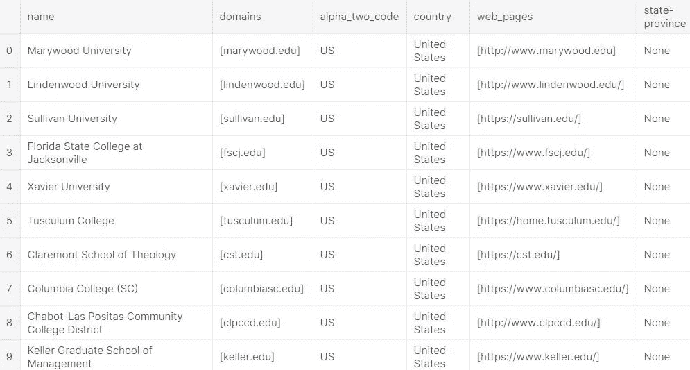
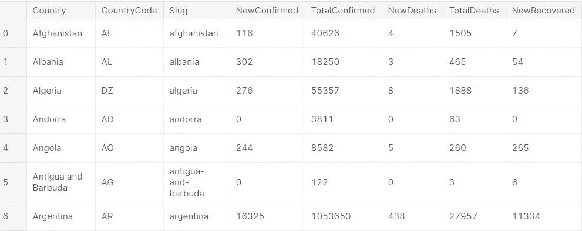

# 使用 Python 从 API 中提取数据

> 原文：<https://medium.com/nerd-for-tech/extracting-data-from-an-api-using-python-38e9fbd2525c?source=collection_archive---------2----------------------->

> 本文展示了从各自的 API 中提取大学信息和新冠肺炎的过程。本文假设读者对 API 有一个基本的了解。

图片由[米切尔罗](https://unsplash.com/@mitchel3uo?utm_source=medium&utm_medium=referral)在[上挥洒](https://unsplash.com/?utm_source=medium&utm_medium=referral)

首先，我们将导入所需的包，如下所示。

【在第一个例子中，让我们从[**http://universities.hipolabs.com/search?country=**](http://universities.hipolabs.com/search?country=india)**美国**提取大学数据

我们创建一个名为*‘api _ extract’*的函数，它将*‘country’*和要返回的记录数作为参数，并返回一个包含 API 数据的数据帧。

在需要的地方用注释清楚地解释了代码。让我们看看对于 country = United States 和 n=10，函数调用返回什么。

作者图片

该函数调用返回一个列出美国大学的数据框，并且只返回前 10 条记录。

**在第二个例子中，让我们从**[**https://api.covid19api.com/summary**](https://api.covid19api.com/summary)提取新冠肺炎数据

图像由 [KOBU 机构](https://unsplash.com/@kobuagency?utm_source=medium&utm_medium=referral)在 [Unsplash](https://unsplash.com/?utm_source=medium&utm_medium=referral) 上拍摄

作者图片

上述数据框架列出了新冠肺炎案例的国别数据。