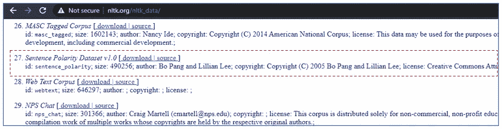
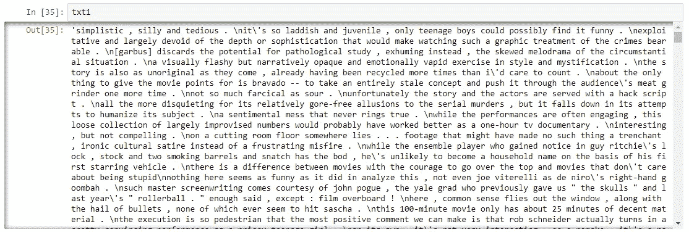
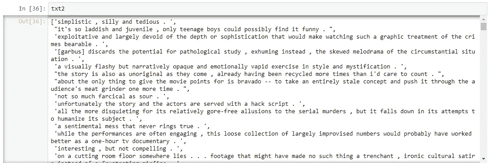
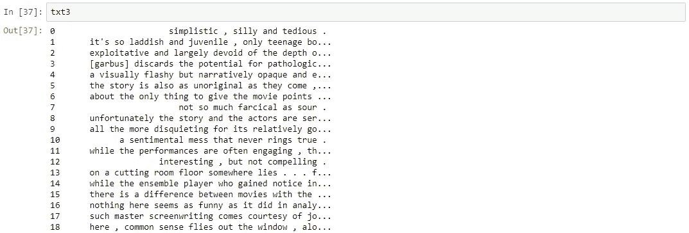
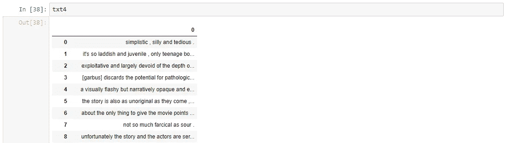
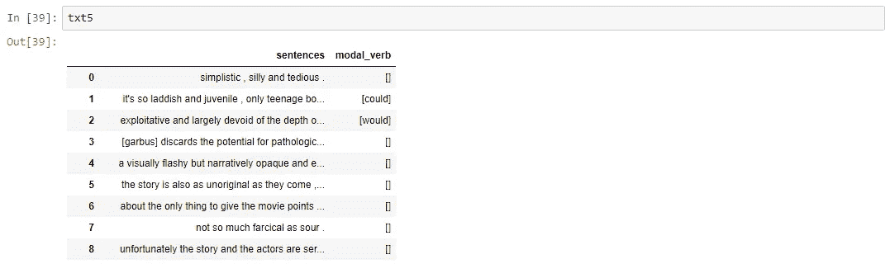
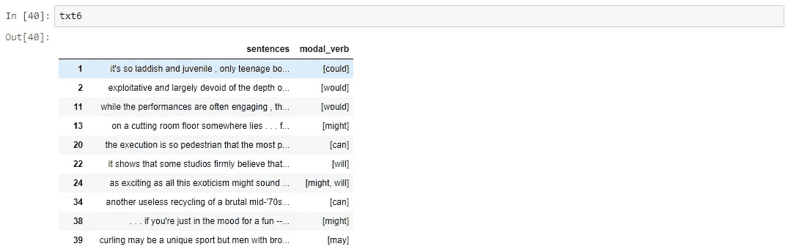
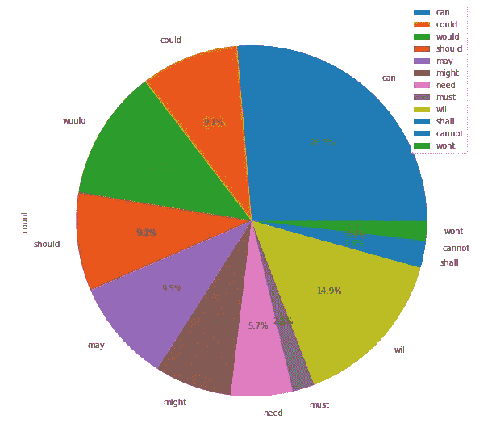

# 使用 Python RegEx(模态动词分析)从英语句子中提取单词

> 原文：<https://medium.com/nerd-for-tech/extracting-words-from-english-sentences-using-python-regex-modal-verbs-analysis-e89233e498a9?source=collection_archive---------10----------------------->


罗曼·维尼斯在 Unsplash 拍摄的照片

[情态动词](https://dictionary.cambridge.org/grammar/british-grammar/modal-verbs-and-modality)是英语句子中一种特殊类型的动词，它提供了跟在其后的[主动词](https://dictionary.cambridge.org/grammar/british-grammar/verbs-types?q=Main+verbs)的功能的附加信息。在语言学领域，情态动词的分析是确定句子的情态意义的一个特殊领域。此后，该信息用于监督学习，以在自然语言处理的各个领域中进行进一步分析( [NLP](https://en.wikipedia.org/wiki/Natural_language_processing) )。

**简介**

在本文中，我们将简要介绍如何使用 Python 中的正则表达式( [RegEx](https://en.wikipedia.org/wiki/Regular_expression) )从英语句子(我们上下文中的情态动词)中提取单词。首先，我们需要下载一个包含英语句子的数据集。 [NLTK 语料库](http://www.nltk.org/nltk_data/)为我们提供了一些英语句子的数据集(sentence_polarity)。对于我们的分析，我们将考虑具有负极性的句子(请注意，在本文中，我们不是在分析句子的极性)。

**下载并清理数据**

我们会去 NLTK 语料库网站下载我们的数据。序号 27，*句子极性数据集 v1.0，*是我们需要的数据集。我们将考虑负极性数据集， *sen_pol_neg(已重命名)*，用于我们的分析。



*句子极性数据集(NLTK 语料库)*

现在，我们使用一些代码行将数据集加载到 Python 程序中。我们还使用正则表达式在“新行”拆分句子。我们将正则表达式导入我们的程序。

```
my_file=open(“C:\\Users\\Pritam\\Downloads\\sen_pol_neg.txt”)
txt1=my_file.read()import re
txt2=re.split("[\r\n]+",txt1)
```

我们还将 Pandas 和 NumPy 库导入到我们的程序中进行分析。使用下面的代码行，我们将数据组织成一个 Pandas 数据框。

```
import pandas as pd
import numpy as nptxt3=pd.Series(txt2)
txt4=pd.DataFrame(txt3)
txt5=txt4.rename(columns={0: “sentences”})
```

我们还将在数据框中添加一列“modal_verb ”,我们将在其中插入模态动词，我们将在稍后的分析中从句子中提取这些模态动词。

```
txt5.insert(1,’modal_verb’,’’)
```

我们已经到了分析的最重要阶段，我们将从数据框架中的句子中提取情态动词。对于这个任务，我们可以编写一个函数，当它被调用时为我们完成任务。首先，我们再次关注正则表达式来构建我们的函数。请注意，在下面的代码行中，我们可以使用一个包含所有模态动词的“列表”和一个“for 循环”来简化函数代码集为了让我们的一些读者更好地理解，我保留了代码行的原样:)

```
def **modals_func**(sentence):
 modals_list=[]

 re_pattern = “can” 
 regex = re.compile(re_pattern)

 for m in regex.finditer(sentence):
  g=m.group()
  modals_list.append(g)

 re_pattern = “could” 
 regex = re.compile(re_pattern)

 for m in regex.finditer(sentence):
  g=m.group()
  modals_list.append(g)

 re_pattern = “may” 
 regex = re.compile(re_pattern)

 for m in regex.finditer(sentence):
  g=m.group()
  modals_list.append(g)

 re_pattern = “might” 
 regex = re.compile(re_pattern)

 for m in regex.finditer(sentence):
  g=m.group()
  modals_list.append(g) 

 re_pattern = “must” 
 regex = re.compile(re_pattern)

 for m in regex.finditer(sentence):
  g=m.group()
  modals_list.append(g)

 re_pattern = “need” 
 regex = re.compile(re_pattern)

 for m in regex.finditer(sentence):
  g=m.group()
  modals_list.append(g)

 re_pattern = “will” 
 regex = re.compile(re_pattern)

 for m in regex.finditer(sentence):
  g=m.group()
  modals_list.append(g)

 re_pattern = “would” 
 regex = re.compile(re_pattern)

 for m in regex.finditer(sentence):
  g=m.group()
  modals_list.append(g)

 re_pattern = “shall” 
 regex = re.compile(re_pattern)

 for m in regex.finditer(sentence):
  g=m.group()
  modals_list.append(g)

 re_pattern = “should” 
 regex = re.compile(re_pattern)

 for m in regex.finditer(sentence):
  g=m.group()
  modals_list.append(g)

 re_pattern = “cannot” 
 regex = re.compile(re_pattern)

 for m in regex.finditer(sentence):
  g=m.group()
  modals_list.append(g)

 re_pattern = “shan’t” 
 regex = re.compile(re_pattern)

 for m in regex.finditer(sentence):
  g=m.group()
  modals_list.append(g)

 re_pattern = “won’t” 
 regex = re.compile(re_pattern)

 for m in regex.finditer(sentence):
  g=m.group()
  modals_list.append(g)

 return modals_list
```

在下面的代码行中，我们将使用我们的函数从句子中提取情态动词。

```
list1=[]for i in txt5.sentences:
 j=**modals_func**(i)
 list1.append(j)new_col=pd.DataFrame({‘modal_verb’:list1})
txt5.update(new_col)
```

最后，我们从我们的分析中删除了句子中没有情态动词的观察结果。

```
txt6=txt5[txt5.astype(str)[‘modal_verb’] != ‘[]’]
```

**输出**



**结论**

最后，在我们结束之前，我为我们的读者提出了一个小任务。我们可以画一个饼状图(用熊猫)来显示每个情态动词出现的次数吗？ ***请使用评论区让我知道:)***

