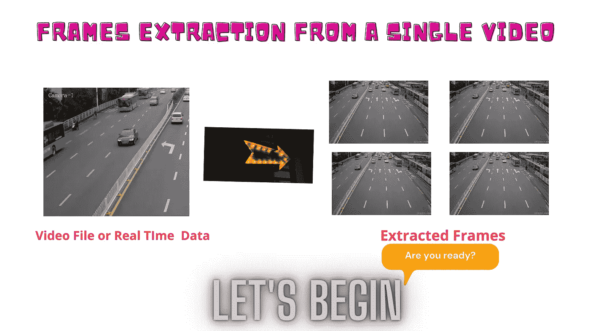
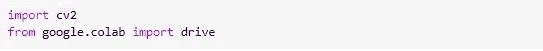
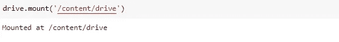
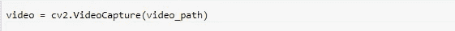
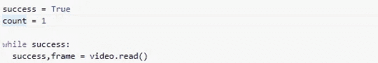
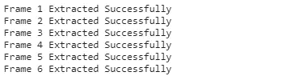

# 从单个视频中提取帧？

> 原文：<https://medium.com/nerd-for-tech/extraction-of-frames-from-a-single-video-2b9fdd901208?source=collection_archive---------1----------------------->

我们知道，计算机视觉在现实生活中的应用正在迅速增加，例如使用 CCTV 摄像机进行交通监控、出于安全目的的人员识别、疾病检测和分类以及许多其他应用。

> 我们知道，对于任何计算机视觉应用程序开发，我们都需要一个数据集，我们在其上训练我们的模型。有时客户会给你一个数据集，但在很多情况下，客户会要求你收集或查找数据集，所以在这种情况下，你需要找到一个数据集，但如果你搜索数据却什么也没找到，会发生什么呢？因此，这里的实时数据收集将是一个很好的方法来解决这个问题，现在在这篇文章中，我们将从视频和实时数据集。

我们将在 Google-Colab 上工作，但对于 Jupyter 笔记本用户可以遵循相同的步骤，因为在 Google-Colab 中，我们将使用存储在 google drive 中的视频，所以这里我们将首先需要安装 google drive，而在 Jupyter 笔记本中，您将直接从系统文件夹中设置视频的路径。对于 notebook 的实现和 Colab 的实现，所有其他步骤都是相同的。

> 让我们一步一步地开始执行。如果你将遵循以下步骤，所以在最后你将能够从现场视频或存储视频提取帧。

**步骤 1:** 我们将从导入库开始，这将帮助我们实现问题的解决方案。Jupyter 笔记本用户只需要导入 OpenCV 库。

导入的库

**步骤 2:** 现在我们需要安装 google drive 来访问视频，我们将从中提取帧。

已安装 google drive

**步骤 3:** 现在我们将为视频设置路径，我们将从中提取帧。我用的视频可以在这里 *找到 [*。*对于实时，可以跳过这一步。](https://github.com/RizwanMunawar/Extraction-of-frames-from-single-video-computer-vision-/blob/main/video2.mp4)*

视频路径

**步骤 4:** 现在，我们将借助 OpenCV 视频捕获模块捕获视频(从上述路径)。对于实时，您需要将视频路径替换为 0(零)。

捕获的视频

**步骤 5:** 我们将使用 while 循环进行帧提取。此外，read 函数将用于从捕获的视频中提取每一帧，该 read 函数将返回两件事，

*   **成功**，将返回一个布尔值(真/假)。其中真值将指示帧被成功提取。而假值将指示帧未被提取。
*   **图像**，如果成功，将给出提取的帧。
*   **注意:**计数变量将用于计算提取的总帧数。

while 循环

**步骤 6:** 现在，我们将提取的帧存储在一个文件夹中，为此，您需要在 google drive 中创建一个文件夹，而笔记本用户可以在任何位置创建文件夹，但请记住，存储帧的路径需要正确。

框架路径

**步骤 7:** 现在我们需要保存提取的帧，为此我们将以特定的方式使用 if-else 条件。

*   如果帧将被提取，则成功将为真，因此我们将存储帧，而如果成功将为假，因此我们将通过 break 语句停止代码。

**第 8 步:**如果上面的代码成功运行，那么你将能够看到如下输出中提取的帧。

提取的帧

> 这就是所有关于从视频或实时提取帧的内容，您可以在自己的视频上尝试。
> 
> 项目 Github : [链接](https://github.com/RizwanMunawar/Extraction-of-frames-from-single-video-computer-vision-)

**关于我:**

我有超过 1 年半的软件开发工作经验。目前，我是一名软件工程师，通过使用零售分析、建立大数据分析工具、创建和维护模型以及加入引人注目的新数据集，为我们的客户改进产品和服务。

*之前，我是 Spark 基金会的计算机视觉实习生，在那里我获得了分析来自不同开源平台(包括 Kaggle、Google Images、Open Images 等)的视觉数据的经验。，并在这些数据上训练不同的深度学习模型。*

*   [*在 LinkedIn 上联系我*](https://www.linkedin.com/in/muhammadrizwanmunawar/)
*   [*与我协商*](https://www.upwork.com/services/product/consultation-1477666319161577472?ref=project_share)
*   [*我的 yolov5 服务*](https://www.upwork.com/services/product/you-will-get-image-classification-projects-using-machine-learning-with-python-1323963101029052416?ref=project_share)

***如有任何疑问，欢迎在下方评论***