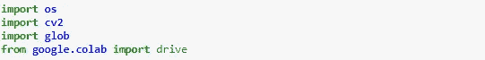
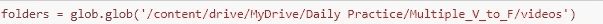
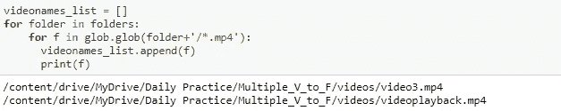
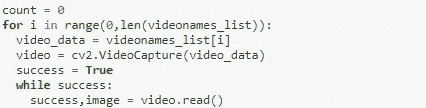
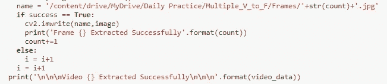
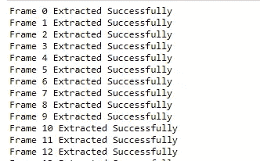

# 从多个视频中提取帧

> 原文：<https://medium.com/nerd-for-tech/extraction-of-frames-from-multiple-videos-3ddbced6f3c2?source=collection_archive---------5----------------------->

我们知道，计算机视觉在现实生活中的应用正在迅速增加，例如使用 CCTV 摄像机进行交通监控、出于安全目的的人员识别、疾病检测和分类以及许多其他应用。

多视频帧提取

> 我们知道，对于任何计算机视觉应用程序开发，我们都需要一个数据集，我们在其上训练我们的模型。有时客户会给你一个数据集，但在很多情况下，客户会要求你收集或查找数据集，所以在这种情况下，你需要找到一个数据集，但如果你搜索数据却什么也没找到，会发生什么呢？因此，在这里，实时数据收集将是解决这个问题的一个好方法，现在在本文中，我们将从视频和实时*中创建一个数据集。*

**注意:**我们将在 Google-Colab 上工作，但对于 Jupyter-Notebook 用户可以遵循相同的步骤，因为在 Google-Colab 中，我们将使用存储在 google drive 中的视频，所以这里我们将首先需要安装 google drive，而在 Jupyter notebook 中，您将直接从系统文件夹中设置视频的路径。对于 Jupyter-notebook 的实现和 Google-Colab 的实现，所有其他步骤都是相同的。

> 让我们一步一步地开始执行。如果你将遵循以下步骤，所以在最后你将能够从现场视频或存储视频提取帧。

**步骤 1:** 我们将从导入库开始，这将帮助我们实现问题的解决方案。Jupyter 笔记本用户不需要导入 google。colab 模块。

导入库

**第二步:**现在我们需要安装 google drive 来访问我们将从中提取帧的视频。jupyter-笔记本用户可以跳过这一步。

安装 google drive

**步骤 3:** 现在我们将从文件夹中读取所有视频。我用的视频可以在这里**找到。*对于实时，可以跳过这一步。*

**

*从文件夹中读取内容*

***步骤 4:** 现在，我们将对文件夹运行 for 循环，该文件夹将在以(. mp4)结尾的视频列表中追加项目。*

**

*阅读多个视频*

***Step-5:** 现在，我们将使用 for 循环按索引读取每个视频，然后我们将使用 while 循环进行帧提取。此外，read 函数将用于从捕获的视频中提取每一帧，该 read 函数将返回两件事，*

*   ***成功**，将返回一个布尔值(真/假)。其中真值将指示帧被成功提取。而假值将指示帧未被提取。*
*   ***图像**，如果成功，将给出提取的帧。*
*   ***注意:**计数变量将用于计算提取的总帧数。*

**

*For 循环用于视频索引，而 while 循环用于帧提取*

***步骤 6:** 现在我们将提取的帧存储在一个文件夹中，为此你需要在 google drive 中创建一个文件夹，而笔记本用户可以在任何位置创建一个文件夹，但请记住存储帧的路径需要正确。*

**

*框架路径*

***步骤 7:** 现在我们需要保存提取的帧，为此我们将以特定的方式使用 if-else 条件。*

*   *如果将提取帧，则成功将为真，因此我们将存储帧，而如果成功将为假，则下一个视频将在 for 循环的帮助下读取(通过在 video_list 中索引)。*

**

*帧提取成功*

***步骤 8:** 如果上面的代码成功运行，那么您将能够在输出中看到提取的帧，如下所示。*

**

*帧提取可视化*

> *这就是所有关于从视频或实时提取帧的内容，您可以在自己的视频上尝试。*
> 
> **项目 Github :* [*链接*](https://github.com/RizwanMunawar/Extraction-of-frames-from-multiple-frames-computer-vision-)*
> 
> *测试视频: [*链接*](https://github.com/RizwanMunawar/Extraction-of-frames-from-multiple-frames-computer-vision-/tree/main/videos)*
> 
> *Jupyter 笔记本: [*链接*](https://github.com/RizwanMunawar/Extraction-of-frames-from-multiple-frames-computer-vision-/blob/main/Video_2_Frames_M.ipynb)*

***关于我:***

*我有一年多的软件开发工作经验。目前，我是一名软件工程师，通过使用零售分析、建立大数据分析工具、创建和维护模型以及加入引人注目的新数据集，为我们的客户改进产品和服务。之前，我是 Spark 基金会的计算机视觉实习生，在那里我体验了来自不同开源平台(如 kaggle、google images、open images 等)的视觉数据分析。)并根据这些数据训练了不同的深度学习模型。*

*   *[*在 LinkedIn 上联系我*](https://www.linkedin.com/in/muhammadrizwanmunawar/)*
*   *[*与我协商*](https://www.upwork.com/services/product/consultation-1477666319161577472?ref=project_share)*
*   *[*我的 yolov5 服务*](https://www.upwork.com/services/product/you-will-get-image-classification-projects-using-machine-learning-with-python-1323963101029052416?ref=project_share)*

****如有疑问请在下方随意评论****