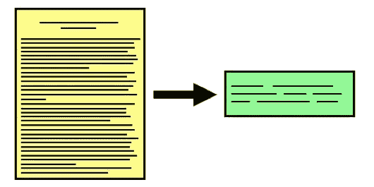
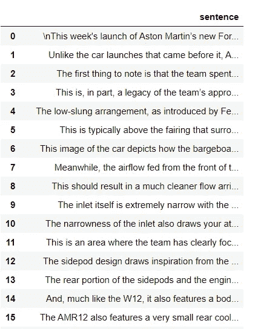
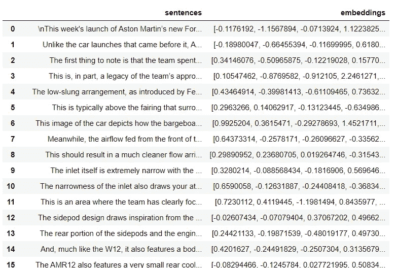
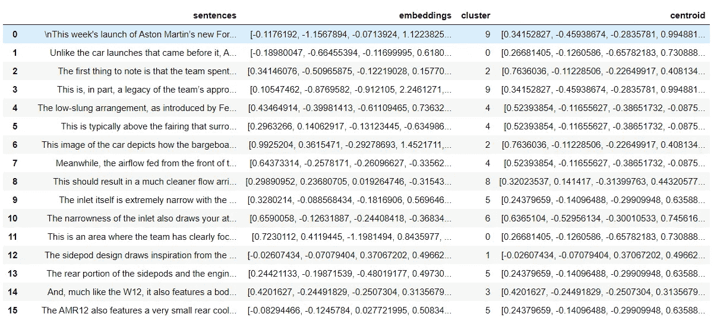
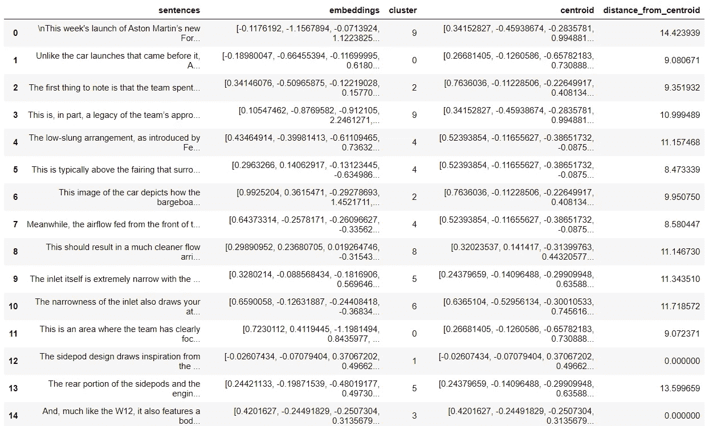

# 使用上下文嵌入的抽取文本摘要

> 原文：<https://medium.com/nerd-for-tech/extractive-text-summarization-using-sentence-transformer-and-kmeans-clustering-algorithm-e942a6b33860?source=collection_archive---------6----------------------->



摘自:[https://www.kdnuggets.com](https://www.kdnuggets.com/2019/11/getting-started-automated-text-summarization.html)

文本摘要是从大量文本中生成一个紧凑且有意义的概要的过程。此类文本的来源包括新闻文章、博客、社交媒体帖子、各种文档等等。如果你是 NLP 新手，并且想阅读更多关于文本摘要的内容，[这篇](https://machinelearningmastery.com/gentle-introduction-text-summarization/)文章将帮助你理解基本的和高级的概念。本文的目的是演示使用最先进的上下文嵌入实现一个提取文本摘要器。

# 方法

构建汇总器的方法可以分为以下步骤:

1.  使用 nltk 的句子标记器将文章/段落转换成句子列表。
2.  对于每个句子，使用句子转换器提取上下文嵌入。
3.  对嵌入应用 Kmeans 聚类。这个想法是将上下文相似的句子聚类，并从每个聚类中挑选一个最接近平均值(质心)的句子。
4.  对于每个句子嵌入，计算距质心的距离。有时，质心是实际的句子嵌入，在这种情况下，距离为零。
5.  对于每个聚类，选择离质心距离最小的嵌入(句子)，并根据句子在原文中出现的顺序返回摘要。

# 句子转换器

Sentence Transformer 是一个 python 包，可以让你用密集向量来表示你的句子和段落。该套件与伯特、罗伯塔、XLM-罗伯塔等最先进的型号兼容。选择正确的模型是非常重要的，因为模型在它们被设计来处理的任务上表现得更好。对于我们的用例，我们将使用基于 STS(语义文本相似性)的模型。要阅读更多关于句子转换器的内容，请查看以下链接；

源代码:

[](https://github.com/UKPLab/sentence-transformers) [## uk plab/句子-变形金刚

### 这个框架提供了一个简单的方法来计算句子和段落的密集向量表示(也称为…

github.com](https://github.com/UKPLab/sentence-transformers) 

预训练模型列表:

 [## 预训练模型-句子-变压器文件

### 我们提供各种预先训练的模型。使用这些模型很容易:或者，您可以从…

www.sbert.net](https://www.sbert.net/docs/pretrained_models.html) 

STS 型号列表:

[](https://docs.google.com/spreadsheets/d/14QplCdTCDwEmTqrn1LH4yrbKvdogK4oQvYO1K1aPR5M/edit#gid=0) [## 句子变压器预训练模型

### 英文预训练模型模型名称、基础模型、池、训练数据、STSb 性能(更高=更好)、速度(已发送。/…

docs.google.com](https://docs.google.com/spreadsheets/d/14QplCdTCDwEmTqrn1LH4yrbKvdogK4oQvYO1K1aPR5M/edit#gid=0) 

# 履行

既然我们已经了解了用例及方法，让我们深入到概要生成器的实现中。我们将使用以下 python 包:

1.  熊猫
2.  Numpy
3.  句子转换器
4.  NLTK 的 KMeanClusterer

所以让我们导入上面提到的包:

```
import nltk
import pandas as pd
from sentence_transformers import SentenceTransformer
from nltk.cluster import KMeansClusterer
import numpy as np
```

下一步是用适当的模型初始化 SentenceTransformer。如上所述，我将使用基于 STS 的模型，即 stsb-roberta-base。请随意尝试其他模型。

```
model = SentenceTransformer('stsb-roberta-base')
```

我们将对描述阿斯顿·马丁一级方程式赛车的最新文章进行总结。

```
article='''
This week's launch of Aston Martin’s new Formula 1 car was one of the most hyped events of the pre-season so far, as fans were intrigued by how the new-look AMR21 would be painted. Unlike the car launches that came before it, Aston Martin left very little to the imagination, releasing detailed shots of the entire car. The first thing to note is that the team spent both of its development tokens on redesigning the chassis, in order that it could unlock aerodynamic performance from the central portion of the car. This is, in part, a legacy of the team’s approach for 2020, having assimilated the overall design package of the previous year’s championship winning Mercedes including a more conventional position for the side-impact protection spars (SIPS). The low-slung arrangement, as introduced by Ferrari in 2017, is now considered critical from an aerodynamic perspective, with the sidepod inlet positioned much like a periscope. This is typically above the fairing that surrounds the SIPS, which is used to inhibit the turbulence created by the front tyre and therefore also aids the transit of cool air that’s supplied to the radiators within the sidepods. This image of the car depicts how the bargeboards are used to filter the turbulence created by the front tyre and convert it into something more usable. Meanwhile, the airflow fed from the front of the car, including the cape, is forced around the underside of the sidepod whilst the fairing around the SIPS shields the airflow entering the sidepod inlet. This should result in a much cleaner flow arriving at the radiators, with the air having not been worked too hard by numerous surfaces en route. The inlet itself is extremely narrow with the team recovering some of that with the sculpting on the sides of the chassis. The narrowness of the inlet also draws your attention to the substantial fin that grows out of the sidepod’s shoulder and helps to divert airflow down over the revamped sidepod packaging behind. This is an area where the team has clearly focused its resources, knowing that getting this right will reap aerodynamic rewards for other areas of the car. The sidepod design draws inspiration from the new bodywork that the team installed in Mugello last season (below) but falls short of having the full ramp to floor transition, instead favouring the dipped midriff like we’ve seen adopted elsewhere. The rear portion of the sidepods and the engine cover have extremely tight packaging, with the AMR21 akin to the W12 with the bodywork almost shrink wrapped to the componentry inside. And, much like the W12, it also features a bodywork blister around the inlet plenum, a feature of the power unit which is believed to be bigger this season as a result of some of the performance and durability updates introduced by HPP. The AMR12 also features a very small rear cooling outlet that not only shows how efficient they expect the Mercedes-AMG F1 M12 E Performance power unit to be, but also how much they have focused on producing a car that recovers the downforce lost by the introduction of the new regulations. The extremely tight packaging creates a sizable undercut beneath the cooling outlet too, which buys back some of the floor that has been lost to the new regulations and drives home the performance of the coke bottle region. This is aided further by the token-free adoption of the Mercedes gearbox carrier and rear suspension from last season, an arrangement that Mercedes was particularly proud of because of the aerodynamic gains that it facilitates. The new arrangement sees the suspension elements lifted clear of the diffuser ceiling, which has become more prominent as the teams push the boundaries of the regulations, while the rear leg of the lower wishbone being positioned so far back also results in the ability to extract more performance from the diffuser. Aston Martin is the first team to unmask all the aerodynamic tricks it will use to make up the difference on the edge of the diagonal floor cut-out. The first of these tricks shares a similarity to the design shown by AlphaTauri, with a trio of outwardly directed fins installed just behind the point where the floor starts to taper in. The airflow structures emitted from these fins will undoubtedly interact with the AlphaTauri-esque floor scroll and floor notch just ahead of them and help to mitigate some of the losses that have been created due to fully enclosed holes being outlawed and the reduced floor width ahead of the rear tyre. It’s here where we find a solution akin to the one that Ferrari tested at the end of 2020 too, as a series of fins form an arc. This should help influence the airflow ahead of the rear tyre and reduce the impact that tyre squirt has on the diffuser. Interestingly, it has also added two offset floor strakes inboard of this where teams normally only opt for one strake, with Mercedes in the pre-hybrid era being an advocate of such designs. A new solution appears on the rear wing too, as the thickness of the upper front corner of the endplate has been altered to allow for another upwash strike. Teams had already started to look for ways to redesign this region last year, with the removal of the louvres in 2019 resulting in an increase in drag. The upwash strike is positioned in order that it can affect the tip vortex that’s generated by the top flap and endplate juncture and will undoubtedly be a design aspect that the rest of the field will take note of. While Aston Martin did show us a lot of its new car, it did keep one element secret for now – the rear brake ducts (not pictured, above). It does seem like a strange omission given it has shown us so much around the rest of the car but we must remember that this is one aspect of the 2021 cars that’s affected by the new regulations. Perhaps the team feels it has found a small pocket of performance in that regard and doesn’t want to unnecessarily hand its rivals a chance to see it ahead of testing.
'''
```

现在，我们将上面的文章转换成一个句子列表。我们将使用 nltk 的 **sent_tokenize()** 方法。

```
sentences=nltk.sent_tokenize(article)# strip leading and trailing spaces
sentences = [sentence.strip() for sentence in sentences]
```

输出:

```
["\nThis week's launch of Aston Martin’s new Formula 1 car was one of the most hyped events of the pre-season so far, as fans were intrigued by how the new-look AMR21 would be painted.",
 'Unlike the car launches that came before it, Aston Martin left very little to the imagination, releasing detailed shots of the entire car.',
 'The first thing to note is that the team spent both of its development tokens on redesigning the chassis, in order that it could unlock aerodynamic performance from the central portion of the car.',
 'This is, in part, a legacy of the team’s approach for 2020, having assimilated the overall design package of the previous year’s championship winning Mercedes including a more conventional position for the side-impact protection spars (SIPS).',
 'The low-slung arrangement, as introduced by Ferrari in 2017, is now considered critical from an aerodynamic perspective, with the sidepod inlet positioned much like a periscope.',
 'This is typically above the fairing that surrounds the SIPS, which is used to inhibit the turbulence created by the front tyre and therefore also aids the transit of cool air that’s supplied to the radiators within the sidepods.',
 'This image of the car depicts how the bargeboards are used to filter the turbulence created by the front tyre and convert it into something more usable.',
 'Meanwhile, the airflow fed from the front of the car, including the cape, is forced around the underside of the sidepod whilst the fairing around the SIPS shields the airflow entering the sidepod inlet.',
 'This should result in a much cleaner flow arriving at the radiators, with the air having not been worked too hard by numerous surfaces en route.',
 'The inlet itself is extremely narrow with the team recovering some of that with the sculpting on the sides of the chassis.',
 'The narrowness of the inlet also draws your attention to the substantial fin that grows out of the sidepod’s shoulder and helps to divert airflow down over the revamped sidepod packaging behind.',
 'This is an area where the team has clearly focused its resources, knowing that getting this right will reap aerodynamic rewards for other areas of the car.',
 'The sidepod design draws inspiration from the new bodywork that the team installed in Mugello last season (below) but falls short of having the full ramp to floor transition, instead favouring the dipped midriff like we’ve seen adopted elsewhere.',
 'The rear portion of the sidepods and the engine cover have extremely tight packaging, with the AMR21 akin to the W12 with the bodywork almost shrink wrapped to the componentry inside.',
 'And, much like the W12, it also features a bodywork blister around the inlet plenum, a feature of the power unit which is believed to be bigger this season as a result of some of the performance and durability updates introduced by HPP.',
 'The AMR12 also features a very small rear cooling outlet that not only shows how efficient they expect the Mercedes-AMG F1 M12 E Performance power unit to be, but also how much they have focused on producing a car that recovers the downforce lost by the introduction of the new regulations.',
 'The extremely tight packaging creates a sizable undercut beneath the cooling outlet too, which buys back some of the floor that has been lost to the new regulations and drives home the performance of the coke bottle region.',
 'This is aided further by the token-free adoption of the Mercedes gearbox carrier and rear suspension from last season, an arrangement that Mercedes was particularly proud of because of the aerodynamic gains that it facilitates.',
 'The new arrangement sees the suspension elements lifted clear of the diffuser ceiling, which has become more prominent as the teams push the boundaries of the regulations, while the rear leg of the lower wishbone being positioned so far back also results in the ability to extract more performance from the diffuser.',
 'Aston Martin is the first team to unmask all the aerodynamic tricks it will use to make up the difference on the edge of the diagonal floor cut-out.',
 'The first of these tricks shares a similarity to the design shown by AlphaTauri, with a trio of outwardly directed fins installed just behind the point where the floor starts to taper in.',
 'The airflow structures emitted from these fins will undoubtedly interact with the AlphaTauri-esque floor scroll and floor notch just ahead of them and help to mitigate some of the losses that have been created due to fully enclosed holes being outlawed and the reduced floor width ahead of the rear tyre.',
 'It’s here where we find a solution akin to the one that Ferrari tested at the end of 2020 too, as a series of fins form an arc.',
 'This should help influence the airflow ahead of the rear tyre and reduce the impact that tyre squirt has on the diffuser.',
 'Interestingly, it has also added two offset floor strakes inboard of this where teams normally only opt for one strake, with Mercedes in the pre-hybrid era being an advocate of such designs.',
 'A new solution appears on the rear wing too, as the thickness of the upper front corner of the endplate has been altered to allow for another upwash strike.',
 'Teams had already started to look for ways to redesign this region last year, with the removal of the louvres in 2019 resulting in an increase in drag.',
 'The upwash strike is positioned in order that it can affect the tip vortex that’s generated by the top flap and endplate juncture and will undoubtedly be a design aspect that the rest of the field will take note of.',
 'While Aston Martin did show us a lot of its new car, it did keep one element secret for now – the rear brake ducts (not pictured, above).',
 'It does seem like a strange omission given it has shown us so much around the rest of the car but we must remember that this is one aspect of the 2021 cars that’s affected by the new regulations.',
 'Perhaps the team feels it has found a small pocket of performance in that regard and doesn’t want to unnecessarily hand its rivals a chance to see it ahead of testing.']
```

***注意:*** 由于我们使用的是变压器型号，建议不要去掉停用词、标点等。因为与预处理文本相比，它们有助于捕捉更多的上下文。

为了有效地应用不同的数据转换，我们将使用 Pandas DataFrame。让我们将上面的列表转换成熊猫数据框；

```
data = pd.DataFrame(sentences)data.columns=['sentence']
```

输出:



下一步是将句子表示为密集向量。我们将创建一个小的 UDF，返回给定句子的向量。我们已经在上面创建了句子转换器的一个实例。

```
def get_sentence_embeddings(sentence):
    embedding = model.encode([sentence])
    return embedding[0]
```

使用上述 UDF 创建一个新列“嵌入”。

```
data['embeddings']=data['sentence'].apply(get_sentence_embeddings)
```

输出:



现在我们有了文本嵌入，让我们使用 NLTK 的 KMeansClusterer 对它们进行聚类。

```
NUM_CLUSTERS=10iterations=25X = np.array(data['embeddings'].tolist())kclusterer = KMeansClusterer(
        NUM_CLUSTERS, distance=nltk.cluster.util.cosine_distance,
        repeats=iterations,avoid_empty_clusters=True)assigned_clusters = kclusterer.cluster(X, assign_clusters=True)
```

***注意:NUM_CLUSTERS 参数的直觉是最终用户期望摘要中的句子数量。***

正如您所观察到的，在 NLTK 的 KMeanClsuterer 中，我们可以使用 cosine_distance 作为度量来确定 2 个向量之间的距离/相似性。

输出:

```
[9,0,2,9,4,4,2,4,8,5,6,0,1,5,3,5,5,5,8,5,6,6,9,8,9,2,9,4,5,6,7]
```

最后，我们计算句子向量和质心(也称为均值)向量之间的距离。为了实现这一点，我们需要根据集群编号为每一行分配质心。

```
data['cluster']=pd.Series(assigned_clusters, index=data.index)
data['centroid']=data['cluster'].apply(lambda x: kclusterer.means()[x])
```

输出:



为了计算距离，我们将使用 scipy 的 **distance_matrix** 函数。

```
from scipy.spatial import distance_matrix
def distance_from_centroid(row):
    #type of emb and centroid is different, hence using tolist below
    return distance_matrix([row['embeddings']], [row['centroid'].tolist()])[0][0]data['distance_from_centroid'] = data.apply(distance_from_centroid, axis=1)
```

输出:



最后一步是生成摘要。为此，我们将采用以下步骤:

1.  根据聚类列对句子进行分组。
2.  根据 distance_from_centroid 列按升序对组进行排序，并选择第一行(与平均值的距离最小的句子)
3.  根据句子在原文中的顺序进行排序。

上述步骤可以使用一行代码来实现:

```
summary=' '.join(data.sort_values('distance_from_centroid',ascending = True).groupby('cluster').head(1).sort_index()['sentence'].tolist())
```

摘录摘要:

```
The first thing to note is that the team spent both of its development tokens on redesigning the chassis, in order that it could unlock aerodynamic performance from the central portion of the car. This is, in part, a legacy of the team’s approach for 2020, having assimilated the overall design package of the previous year’s championship winning Mercedes including a more conventional position for the side-impact protection spars (SIPS). This is typically above the fairing that surrounds the SIPS, which is used to inhibit the turbulence created by the front tyre and therefore also aids the transit of cool air that’s supplied to the radiators within the sidepods. This is an area where the team has clearly focused its resources, knowing that getting this right will reap aerodynamic rewards for other areas of the car. The sidepod design draws inspiration from the new bodywork that the team installed in Mugello last season (below) but falls short of having the full ramp to floor transition, instead favouring the dipped midriff like we’ve seen adopted elsewhere. And, much like the W12, it also features a bodywork blister around the inlet plenum, a feature of the power unit which is believed to be bigger this season as a result of some of the performance and durability updates introduced by HPP. The AMR12 also features a very small rear cooling outlet that not only shows how efficient they expect the Mercedes-AMG F1 M12 E Performance power unit to be, but also how much they have focused on producing a car that recovers the downforce lost by the introduction of the new regulations. The airflow structures emitted from these fins will undoubtedly interact with the AlphaTauri-esque floor scroll and floor notch just ahead of them and help to mitigate some of the losses that have been created due to fully enclosed holes being outlawed and the reduced floor width ahead of the rear tyre. This should help influence the airflow ahead of the rear tyre and reduce the impact that tyre squirt has on the diffuser. Perhaps the team feels it has found a small pocket of performance in that regard and doesn’t want to unnecessarily hand its rivals a chance to see it ahead of testing.
```

如您所见，我们采用的方法在生成描述汽车的摘要方面做得不错。如果你仔细阅读，只要我们从每个聚类中挑选出最上面的句子，这些句子几乎都是内联的。例如，概要的开始部分谈到 SIPS(侧面碰撞保护翼梁),即句子 2、3 和 4，而接下来的句子谈到车身，即句子 5 和 6，等等。因此，我们通过实现提取文本摘要，用几个句子成功地描述了汽车的各个方面。

**这里解释的代码在我的** [**Github**](https://github.com/satishsilveri/NLP/blob/master/Extractive%20Text%20Summarizer/Extractive_text_summerization_using_kmeans.ipynb) 上也有。随便叉，随便玩。

感谢您的阅读！喜欢并留下评论，如果你觉得有趣和有用。

## 参考资料:

[](https://www.hindawi.com/journals/complexity/2020/4750871/) [## 基于句子嵌入的讨论线索摘要语义聚类方法

### 网络上的大量数据来自论坛，其中包含数百万条线索。讨论线程是一个有价值的…

www.hindawi.com](https://www.hindawi.com/journals/complexity/2020/4750871/)  [## nltk.cluster.kmeans - NLTK 3.5 文档

### docs]def cluster _ vector space(self，vectors，trace = False):如果 self。_ 手段和自我。_repeats > 1:打印(…

www.nltk.org](https://www.nltk.org/_modules/nltk/cluster/kmeans.html)