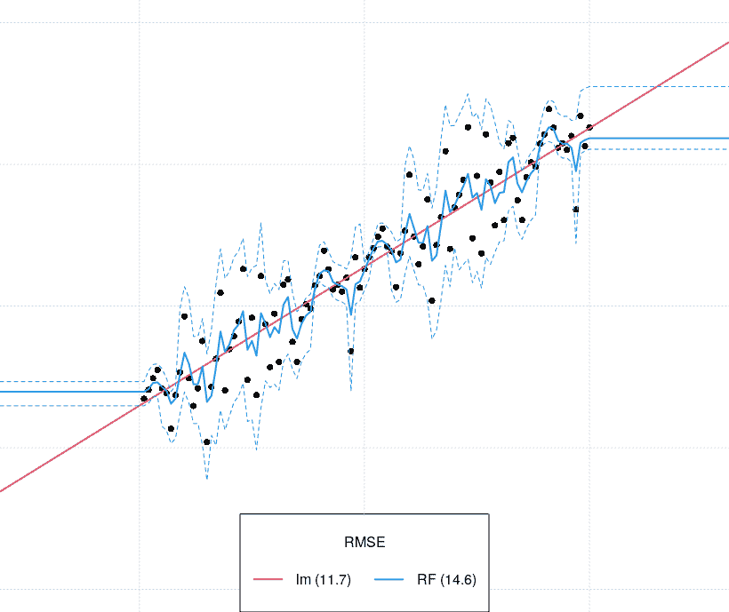
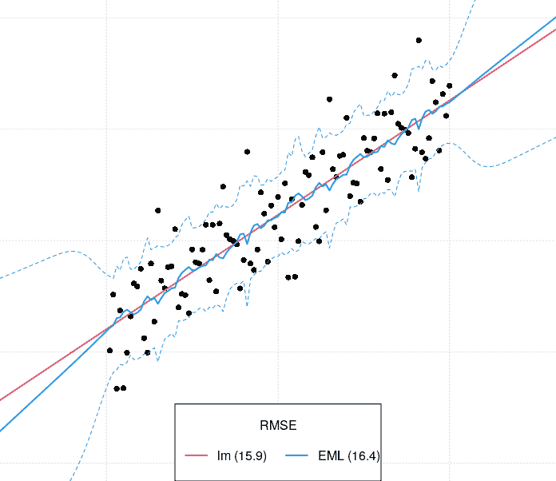
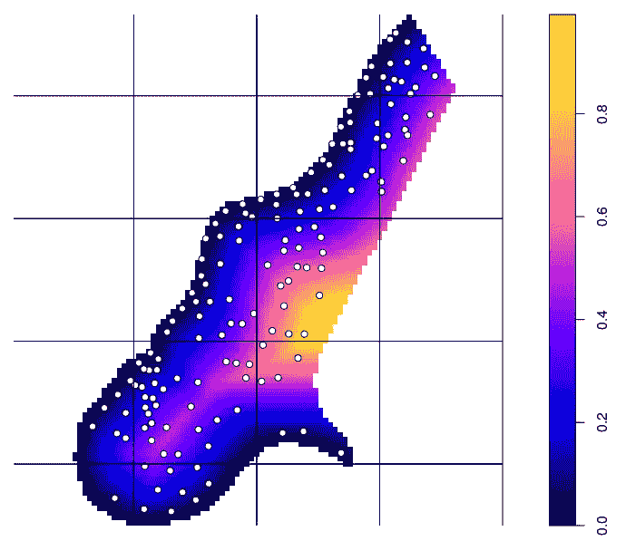
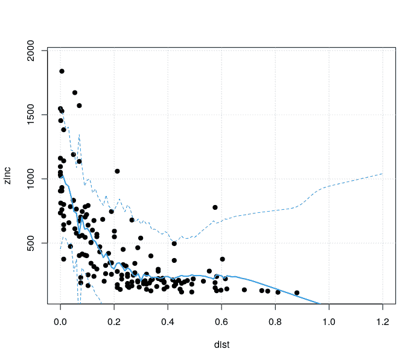

# 外推对于树(基于树的学习者)来说是困难的，结合不同类型的学习者使得它不那么困难

> 原文：<https://medium.com/nerd-for-tech/extrapolation-is-tough-for-trees-tree-based-learners-combining-learners-of-different-type-makes-659187a6f58d?source=collection_archive---------4----------------------->

*编制人:汤姆·亨格尔(OpenGeoHub)*

> *一些流行的基于树的机器学习(ML)算法，如随机森林(RF)和/或梯度提升(Gradient Boosting)，因特征空间中的过拟合效应和预测/外推而受到批评，这可能导致严重的错误和伪像。对于回归问题来说，外推似乎特别麻烦，许多数量级不太复杂的模型在外推时似乎优于 RF。由于外推和过拟合导致的严重伪像会降低 RF 的可信度，尤其是在预测区间不切实际的情况下。在这里，我们证明了一种集成方法，它结合了不同的学习者(复杂的和简单的，基于树的和线性的和多项式的模型)和健壮的交叉验证，可以用来在数据的拟合优度和结构之间找到一个工作折衷。此外，在集成 ML 框架中，预测误差是无模型的，因此不容易受到个体学习者的限制。使用集合 ML 估计的预测不确定性更符合实际，尤其是在外推空间。集成方法的缺点是计算量和更高的复杂性，包括更高的理解模型的努力、更多的参数、更多的结果、需要更多的步骤来分类、微调和解释结果。*

# 简括的随机森林

随机森林(RF)是 2020 年使用最多的机器学习算法之一。它可以用于分类、回归和生存问题，并且存在许多实现，其中 [ranger](https://github.com/imbs-hl/ranger) (R)和 [scikit-learn](https://scikit-learn.org/stable/) (python)也适用于大型数据集，即可以很容易地并行化。

有很多优秀的介绍射频的入门书籍和手册。ML 技术(如随机森林)的主要优势是:

*   它在几十个案例研究和 kaggle 竞赛中表现出优于线性和非线性统计模型，
*   它可以普遍应用于分类、回归和生存问题，
*   它非常适合具有复杂结构的复杂多维多元数据，
*   可以对其进行微调，这通常会提高精确度，

要了解更多关于兰登森林的信息，我们建议跟随一些带插图的 R 教程或阅读 T2 的 Biau 和 scount et(2016)T3。要了解如何使用 RF 在 R 中生成空间和时空预测，请参考 [Hengl 等人，(2019)](https://peerj.com/articles/5518/) 。

# 随机森林的外推和过拟合问题

许多文献也讨论了射频的缺点。射频的四个常见缺点是:

1.  根据数据和对数据的假设，它可以在分析师没有注意到的情况下过度拟合值。
2.  它仅在具有足够训练数据的特征空间内预测良好。外推法，即训练空间之外的预测会导致较差的性能。
3.  它的计算代价很高，计算量随着协变量的数量呈指数增长。
4.  它需要高质量的训练数据，并且对数据中的错误和错别字很敏感。

在本文中，我们只讨论 RF 的前两个限制:外推和过拟合问题。

说明 RF 的**过拟合**和**外推**问题的最佳方式可能是使用合成数据，然后测试 RF 对不同级别(纯)噪声和不同数据结构(分布)的灵敏度。这种类型的分析在统计学中非常常见，也称为“敏感性分析”。RF 过拟合和外推问题的一个已知示例是名为[的示例，“外推对树来说很难！”](http://freerangestats.info/blog/2016/12/10/extrapolation)几年前由彼得·埃利斯发布，在迪伦·博德特的 [Twitter feed](https://twitter.com/DylanBeaudette/status/1410666900581851138) 中也有进一步的讨论。

在该实验中，RF 用于拟合基本上具有简单结构的数据中的模型，对于统计学家来说，选择分布、模型和估计预测区间是不需要动脑筋的。生成合成数据集的代码是:

我们也可以用 RF 模型拟合这些数据，然后画出线性模型和 RF 之间的差异。这会产生以下情节:



合成数据集与线性(红线)和随机森林(蓝线)模型吻合。预测间隔是使用 forestError 包导出的。

预测区间，即上面显示的预测上限和下限是使用预测+/- 1 标准预测误差导出的。对于随机森林，可以使用例如 [forestError 包](https://cran.r-project.org/package=forestError) ( [卢&哈丁，2021](https://jmlr.org/papers/v22/18-558.html) )导出预测间隔，该包报告每个新预测位置的标准预测误差、上限和下限，甚至估计潜在偏差。

因为这是一个合成数据，我们知道拟合线只适合噪音，我们知道在外推空间的预测似乎不可信。然而，请注意，从上面的例子来看，如果来自[森林误差包](https://cran.r-project.org/package=forestError)的预测区间更现实地表达了预测偏离数据中的“线性结构”，那么外推可能不会成为太大的问题。假设在预测之后，人们最终会收集上述 RF 模型的地面实况数据，这些数据可能会显示预测误差/预测区间完全偏离。大多数传统统计学家会认为这些预测过于狭隘和乐观，拟合线过度拟合，因此，任何进一步的过度乐观预测不确定性都会导致决策者过于自信，导致错误决策，从而使用户对 RF 失去信心。

[Meyer & Pebesma (2020)](https://doi.org/10.1111/2041-210X.13650) 详细讨论了忽略外推空间中预测的后果:通常，在覆盖训练数据的特征空间内使用交叉验证得出的准确度评估将不适用于外推空间。问题的实际解决方案？您可以尝试将预测限制在具有足够训练数据的特征空间，即所谓的“适用区域”(观看 Hanna Meyer 的[讲座)。这可能有些令人失望，因为我们将不能对整个感兴趣的区域产生完全一致的预测。](https://www.youtube.com/watch?v=EyP04zLe9qo&list=PLXUoTpMa_9s0Ea--KTV1OEvgxg-AMEOGv&index=19)

# 使用不同集成 ML 算法的回归

在前面的示例中，我们已经展示了 RF 在对存在可见结构的关系进行建模时存在的问题，例如线性回归。当它围绕点弯曲时，它往往有点过度拟合，因此基本上符合噪声，并且 forestError 包中的默认设置无助于检测外推不确定性的更现实的估计。这当然不能归咎于 RF(RF 的一个已知特性是，它仅在由训练数据确定的特征空间内进行可靠预测)，但是数据科学家/统计学家可能会忽略数据的一些属性和相关假设。

如何帮助 ML 得到更准确的回归估计，如何防止这样的问题？一种解决方案是考虑任何数据集本质上可以是非线性和线性结构的组合，并且对于数据的部分，不同类型的学习算法可以执行较高或较低的成功。这就是所谓的**系综机器学习方法** ( [张&马，2012](https://www.springer.com/gp/book/9781441993250) )。

例如，对于上面的合成数据，我们可以选择拟合，而不是仅使用 RF，具有非常不同属性的 5 个学习者的组合:

*   [regr.glm](http://www.rdocumentation.org/packages/stats/) : GLM 即线性模型，
*   [regr.cvglmnet](http://www.rdocumentation.org/packages/glmnet/) :带套索或弹性网正则化的 GLM(交叉验证 Lambda)，
*   [regr.gamboost](http://www.rdocumentation.org/packages/mboost/) :平滑分量的梯度提升，
*   [regr.ranger](http://www.rdocumentation.org/packages/ranger/) :随机森林，
*   [regr.ksvm](http://www.rdocumentation.org/packages/kernlab/) :支持向量机，

所有这四种都是非常不同的算法，并且是为各种回归目的而独立开发的。我们可以使用 [**mlr 包**](https://mlr.mlr-org.com/) ( [Bischl et al，2016](https://jmlr.org/papers/v17/15-066.html) )将它们组合起来:

默认情况下，我们推荐使用所谓的堆叠方法来集成 ML，在这种情况下，使用额外的(元)学习器从基础学习器学习。在 [Polley & van der Laan，(2010)](https://biostats.bepress.com/ucbbiostat/paper266/) 中描述了集成学习的最新**超级学习者方法。**

结果模型和预测(使用的元学习者是简单线性回归)表明该模型类似于简单线性模型:它解释了 87%的变化，即它与线性模型一样好。

接下来我们需要估计预测误差。这通常不是微不足道的，因为对于系综 ML，我们不能使用一些参数技术，但是我们需要使用一些[引导技术](/@qucit/a-simple-technique-to-estimate-prediction-intervals-for-any-regression-model-2dd73f630bcb)，即重复重新拟合模型，然后在新的位置确定误差。这里，我们应用一个简单的高效计算程序，它由三个步骤组成:

1.  使用重复交叉验证确定全局预测误差/ MSE。
2.  确定多个学习者在新预测位置的方差。
3.  使用质量保持校正因子在新的预测位置调整多个学习者的方差。

校正因子通常大于 1，这意味着大多数学习者过度拟合数据，实际预测误差略高。您应该始终检查校正系数，因为如果它远远高于 1，则过度拟合是显著的，您可能需要检查并调整交叉验证设置。

使用合成数据的最终图，这次使用系综 ML 拟合，如下所示:



注意，从上面的图来看，外推空间中的预测误差区间可能相当宽，这更好地反映了我们的预期。根据经验，一旦预测误差超过训练数据中的全局方差，预测就变得如此不确定，以至于我们不建议在外推空间中做出任何决策(因此预测也可能被屏蔽掉或不用于决策制定)。

总之，似乎结合线性和非线性基于树的模型既有助于减少过度拟合，又能产生不确定性/预测区间的现实预测。总体 ML 框架正确地将线性模型识别为比随机森林或类似模型更重要。基于使用交叉验证和/或 bootstraping 的不确定性评估有助于产生预测误差的无模型估计。

# 将集合 ML 应用于真实数据集

在下一个示例中，我们通过使用真实数据集(例如来自 sp 包的 [meuse 数据集](https://cran.r-project.org/web/packages/gstat/vignettes/gstat.pdf))来查看 Ensemble ML 的性能。该数据集已被广泛用于演示各种地质统计学和最大似然空间预测技术(参见 Bivand 等人，2013 年)。

我们通过使用上述四个学习器再次拟合集合 ML，旨在解释土壤中锌浓度的空间分布，作为距河流距离的函数。我们可以使用[地图包](https://github.com/Envirometrix/landmap)在一行中拟合集合 ML 模型:

```
library(landmap)
library(geoR)
library(rgdal)
demo(meuse, echo=FALSE)
SL.library = c("regr.ranger", "regr.glm", "regr.gamboost", "regr.ksvm")
eml.m <- landmap::train.spLearner(meuse["zinc"], covariates=meuse.grid[,c("dist")], spc = FALSE, SL.library = SL.library, oblique.coords = FALSE)
summary(eml.m@spModel$learner.model$super.model$learner.model)
# Residuals:
#   Min      1Q  Median      3Q     Max
# -632.90 -101.75  -38.21   64.08  898.94
#
# Coefficients:
#   Estimate Std. Error t value Pr(>|t|)
# (Intercept)   11.291829  43.162115   0.262    0.794
# regr.ranger   -0.284509   0.171958  -1.655    0.100
# regr.glm      -0.006867   0.143319  -0.048    0.962
# regr.gamboost  1.255944   0.306575   4.097 6.83e-05 ***
# regr.ksvm      0.012866   0.334695   0.038    0.969
# ---
#   Signif. codes:  0 ‘***’ 0.001 ‘**’ 0.01 ‘*’ 0.05 ‘.’ 0.1 ‘ ’ 1
#
# Residual standard error: 236.3 on 150 degrees of freedom
# Multiple R-squared:  0.5964, Adjusted R-squared:  0.5857
# F-statistic: 55.42 on 4 and 150 DF,  p-value: < 2.2e-16
```

这次，我们使用所谓的**空间交叉验证**，即 CV，防止值的空间自相关影响模型参数的估计( [Lovelace 等人，2019](https://geocompr.robinlovelace.net/) )。为此，我们通过使用 [geoR 包](https://cran.r-project.org/web/packages/geoR/geoR.pdf) (Brown，2015)拟合目标变量的变差函数来确定块大小，然后将块大小设置为与空间相关性的范围相对应。位于同一空间块中的点要么用于训练，要么用于验证，但从不同时用于两者。



默兹数据集训练点的空间(块)分割。落在一个块中的点或者用于训练或者用于验证，这有助于防止任何过拟合效应。

拟合集成 ML 的结果表明，now regr.gamboost 是性能最好的学习器，而 RF 和 other 是勉强有用的。该模型解释了数据中 59%的方差，这比我们仅使用简单的线性回归(41%)要好得多。使用上面解释的相同程序导出的预测区间显示:



同样，外推空间接收最高的预测不确定性。注意，集合 ML 再次不知道目标变量(在这种情况下:锌的负值是不可能的),因此可以通过使用对数变换或类似方法，或者简单地通过用 0 值代替负预测来进一步调整估计。

因此，总之，我们希望我们已经证明，即使外推对于树(基于树的模型)来说是困难的，但是通过结合不同的学习者并运行带有重新调整的交叉验证，我们可以减少过度拟合效应，并产生更现实的预测误差估计，包括对于外推空间。然而，集成方法的缺点是计算量大，包括理解模型的更大努力。还需要更多的参数、更多的结果、更多的步骤来排序、微调和解释结果。要了解更多关于 Ensemble ML 的信息，请参考[本教程](https://gitlab.com/openlandmap/spatial-predictions-using-eml)和 r 中的 landmap 包。本文中用于生成示例的代码可在 [**此处**](https://gist.github.com/thengl/eafb19b99b20042c689c9ea899435f57) 获得。

警告:尽管 [landmap 包](https://github.com/Envirometrix/landmap)看起来非常易于使用，因为预测可以用两行代码生成，但它仍然会导致不切实际的估计和严重的偏差，因此强烈建议进行大量的模型诊断和建模后解释，即使所有步骤都是完全自动化的。此外，该软件包还不适合大型数据集。例如，我们建议阅读 Christoph Molnar 的《可解释的机器学习》一书，以了解更多关于如何进行建模后诊断以及理解为什么模型以它们预测的方式进行预测的信息。

*重要提示:本文中的示例基于 mlr 包的使用。此包不幸停产，建议* ***用户迁移到*** [***mlr3 包***](https://mlr3.mlr-org.com/) *。如果您使用 mlr3 成功安装了此处列出的相同型号，请分享，我们将更新代码。*

# **引用参考文献:**

1.  Biau G，swoon et e .(2016 年)。随机森林导游。测试 25(2):197–227，[https://doi.org/10.1007%2Fs11749-016-0481-7](https://doi.org/10.1007%2Fs11749-016-0481-7)
2.  Bischl，m . Lang，l . Kotthoff，l .斯基夫纳，j . Richter，j . studer us，e .…Jones，Z. M. (2016)。[MLR:R 中的机器学习](https://jmlr.org/papers/v17/15-066.html)。机器学习研究杂志，17(1)，5938–5942。
3.  比万德、R. S .、佩贝斯马、E. J .、戈麦斯-卢比奥诉案(2013 年)。[应用空间数据分析与 R](https://www.springer.com/gp/book/9781461476177) (第 747248717 卷)。纽约:斯普林格。https://asdar-book.org/
4.  布朗，P. E. (2015)。基于模型的地质统计学。统计软件杂志，63(12)，1–24。【https://www.jstatsoft.org/article/view/v063i12 
5.  t .亨格尔、娜斯鲍姆、m .赖特、M. N .赫韦林克、G. B .、格勒和 B. (2018 年)。[随机森林作为空间和时空变量预测建模的通用框架](https://peerj.com/articles/5518/)。PeerJ，6，e5518。
6.  Lovelace，r .，Nowosad，j .，& Muenchow，J. (2019)。[带 R 的地理计算](https://geocompr.robinlovelace.net/)。CRC 出版社。
7.  陆，b .，，哈丁，J. (2021)。[随机森林预测误差估计的统一框架](https://jmlr.org/papers/v22/18-558.html)。机器学习研究杂志，22(8)，1–41。
8.  Meyer 和 e . Pebesma(2020 年)。预测到未知空间？估计空间预测模型的适用范围。生态学与进化方法。[https://doi.org/10.1111/2041-210X.13650](https://doi.org/10.1111/2041-210X.13650)
9.  Polley，E. C .，& van der Laan，M. J. (2010 年)。预测方面的超级学习者。加州大学伯克利分校生物统计学分部。从 https://biostats.bepress.com/ucbbiostat/paper266[取回](https://biostats.bepress.com/ucbbiostat/paper266)
10.  Seni，g .，& Elder，J. F. (2010)。数据挖掘中的集成方法:通过组合预测提高精确度。摩根&克莱普出版社。[https://doi.org/10.2200/S00240ED1V01Y200912DMK002](https://doi.org/10.2200/S00240ED1V01Y200912DMK002)
11.  m . n . Wright 和 a .齐格勒(2017 年)。ranger:用 C++和 r 快速实现高维数据的随机森林。统计软件学报，77(i01)。[https://www.jstatsoft.org/article/view/v077i01](https://www.jstatsoft.org/article/view/v077i01)
12.  张，陈，马，杨(2012)。集成机器学习:方法和应用。斯普林格纽约。