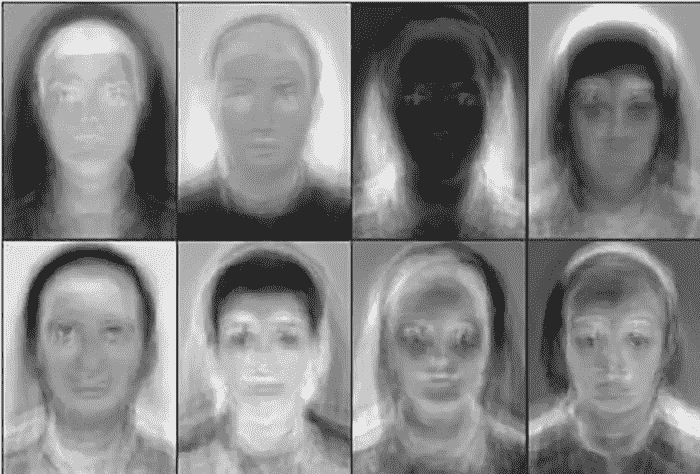
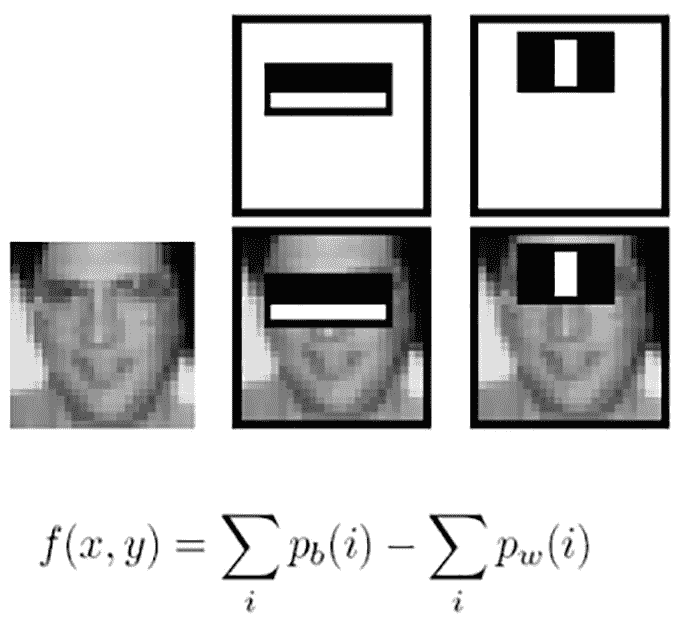
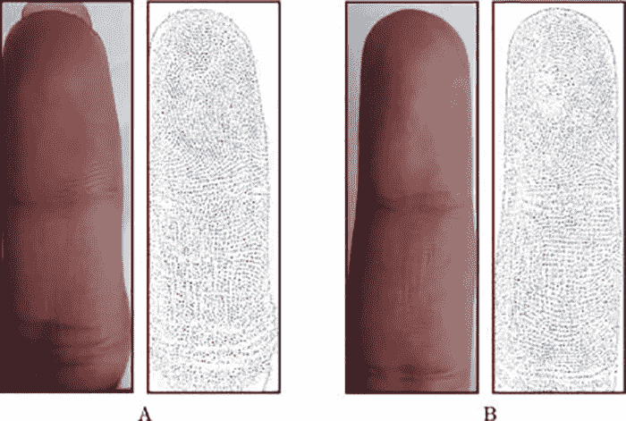

# 人脸检测与识别:机器学习方法和算法如何使之成为可能？

> 原文：<https://medium.com/nerd-for-tech/face-detection-recognition-how-machine-learning-approaches-and-algorithms-make-it-possible-4b5896aefb88?source=collection_archive---------3----------------------->

在通过机器学习算法实现的其他任务中，人脸检测和识别是一项至关重要的计算机视觉任务。首先，人脸检测和识别是相关的，但在口语上是不同的。人脸检测是比人脸识别更广泛的方面，并且在机器学习的帮助下被应用。无论是关于监控中的人脸检测、用于医疗诊断的映射图像，还是用于智能目的的视频中人脸的深度分析，ML 模型都适用于检测和识别目的。

# **进化:人脸检测的机器学习方法&识别**

人脸检测被认为是与 AI 或人工智能相关的计算机视觉领域的一部分。根据人脸的动态特性，研究已经导致了多种人脸检测 ML 方法的应用，例如 Viola Jones 算法、Kohonen 方法、局部二进制模式直方图(LBPH)、特征脸、Karhunen-Loeve 检测器。这些方法有助于改进机器学习算法，这些算法现在用于许多人脸检测软件，并与 ML 模型结合使用，以提供准确的结果。让我们看看它们。

**特征脸:**最早的人脸识别方法之一包括特征脸。当对人脸检测技术的研究开始酝酿时，采用了特征脸方法。用于人脸检测和识别的特征脸方法是基于 2D 视角的。它应用基于高维向量空间上的概率分布的协方差矩阵产生特征向量，在此基础上产生用于训练的人脸变化。后来，该方法与 PCA 或主成分分析(一种数学计算)一起使用，它定义了与数据的主成分相关的点(用于分析)。特征脸方法使得人脸检测几乎没有挑战性，因为它对面部变化、光照和环境敏感。

图片来源:【www.researchgate.net 

**Kohonen 方法:**在人脸检测的早期先驱中，Kohonen 方法也称为自组织映射(SOM ),它使用单层神经网络中的特征脸网络，通过基于人脸图像矩阵的序列相关性来近似特征向量。Kohonen 方法是一种无监督的训练方法，通常是一维或二维的。然而，这种方法在现实生活环境中影响较小。在下一阶段，Kohonen 方法通过使用代数进行人脸识别而得到了扩展。

**Fisher face:**Fisher face 基于人脸空间维度的降低，并利用 PCA 或主成分分析来帮助降低维度，并专注于投影方向以最大化所有类别的人脸和图像的分散性，由 Robert Fisher 开发用于分类学分类。Fisherface 算法使用 LDA 或线性判别分析来降低维数。与特征脸不同，Fisherface 方法能够处理面部变化、光照和环境问题。

**维奥拉·琼斯:**用这样的方法**维奥拉·琼斯法**在 2001 年被采用。这是一种打破混乱的方法，Viola-Jones 框架中应用的方法围绕人脸检测，然后提取一些特征，接着在现有数据中进行特征比较。它基于弱检测器的二元分类。*当检测窗口逐像素移动时，该方法使用 Haar 滤波器、级联分类器进行检测，同时窗口中的图像区域移动导致级联分类。*

图片来源:[www.stackoverflow.com](http://www.stackoverflow.com)

## **应用于人脸检测和识别的 ML 算法**

人脸检测和识别一直是一项引人入胜的技术；通过人工智能应用，结合机器学习方法建立一个有效的模型。在遵循传统的人脸及其特征检测方法的道路上，最早的机器学习算法一直努力首先找到人眼，然后是嘴、鼻子、眉毛和鼻孔等其他特征。一旦检测到人脸，人脸识别算法就开始工作。

几种基于组合的人脸高级学习方法，如基于规则的方法、特征不变量、模板匹配和基于外观的方法，在当今可用的核心 ML 模型中得到应用。有时， [**训练数据也使用类似地标标注**](https://www.cogitotech.com/landmark-annotation/) 的技术来理解面部上的显著点。

已经广泛应用于学习面部形式和表情以及理解与面部识别相关的环境条件的机器学习算法是**局部二进制模式直方图(LBPH)。**它由 Ahonen 于 2004 年开发并首次展示，在 2004-2006 年间使用。在这种方法中，一张人脸被分成 7×7(数量不等)个大小相等的单元，然后根据局部二进制模式直方图计算每个单元。LBPH 或局部二进制模式是基于**纹理谱**模型的视觉描述符。对于 2D，该算法对于以高精度识别 3D 图像也是理想的。

图片来源:Sciencedirect.com

**局部二进制模式直方图(LBPH)** 是一种流行的 ML 算法，用于在计算机视觉应用中提供高精度的人脸识别。该算法还产生了异常的结果，绕过了面部变化、光照和姿势问题的挑战。它还被深度神经网络应用程序用于检测和分析人脸，以及在真实世界的场景中，如 [**deepfake 检测**](https://www.cogitotech.com/blog/what-is-deepfake-works-detection-services/) 。LBPH 已被证明有助于使几种人脸识别方法有效工作，准确地说，使 CNN(卷积神经网络)和 ann(人工神经网络)能够用于人脸检测和识别的真实世界应用。

**结论注释**

机器学习算法已经成为人类解决复杂计算挑战的核心。面部检测源于 20 世纪 60 年代进行的心理学研究，用于检测人类大脑的面部表情、情绪和手势解释。随着技术变革步伐的加快，始于 60 年代的心理学研究成果被应用到工程领域。

用于人脸识别的最大似然算法在人脸的正图像和负图像的数据上被训练以预测准确的结果。多种过程也可用于进行人脸检测和识别，并且通常，方法和算法的组合被 ML 从业者应用。如果我们谈论编程的趋势，那么使用 Python 的人脸检测和使用 OpenCV 的人脸检测已经成为执行大多数人脸识别实现的规范。

PS:到目前为止，面部识别方面的任何突破性进展预计都不会到来。人脸识别的所有当前实践都是基于我们上面讨论的方法和途径。