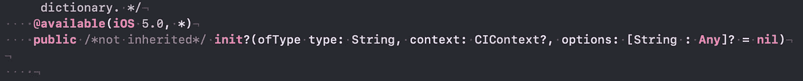
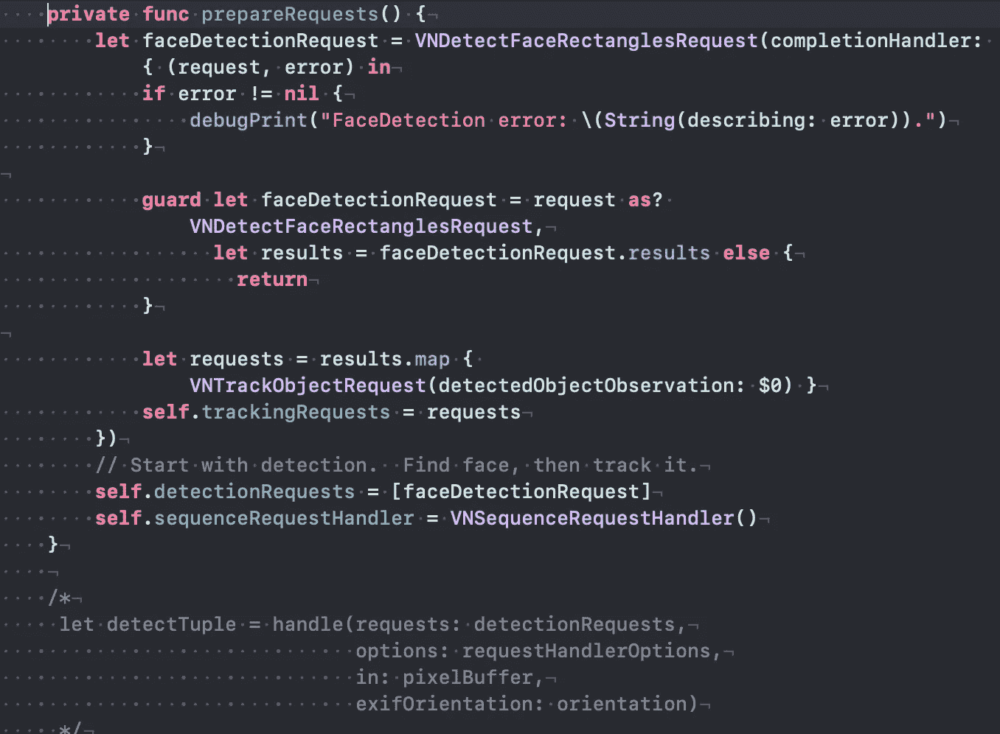
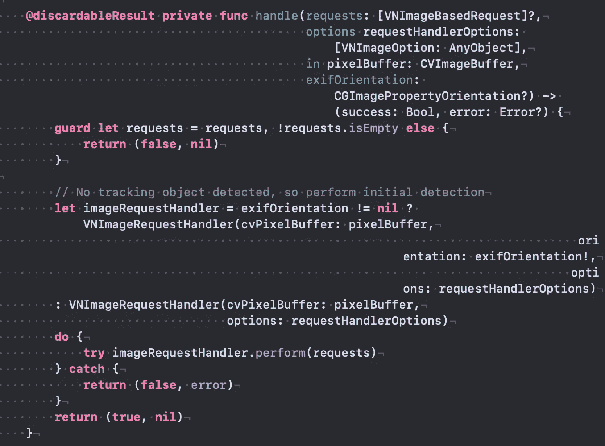
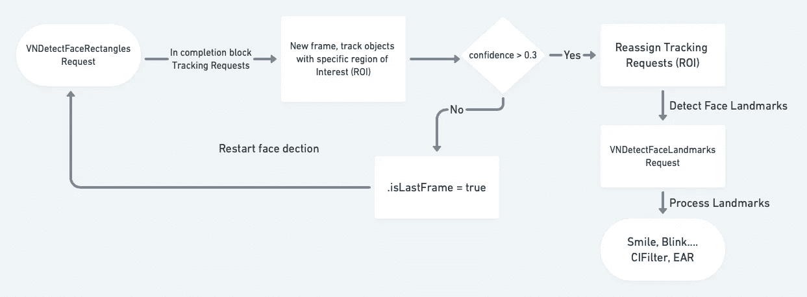

# 人脸特征:从核心图像到视觉

> 原文：<https://medium.com/nerd-for-tech/face-features-from-coreimage-to-vision-d45a36ccecb?source=collection_archive---------6----------------------->

在本文中，我们将考虑**CoreImage**&**Apple Vision**主要用于面部跟踪和面部特征检测的可能性。

## **CoreImage**

令我惊讶的是，CoreImage 能够像苹果视觉一样检测大部分特征。看一看 **CIDetector。** **Init** 方法接受探测器类型:



CIDetector 构造函数方法

```
CIDetectorTypeFace // face detection
CIDetectorTypeQRCode // qr code
CIDetectorTypeText // text
```

其他配置可以通过选项字典来完成。在我看来，有趣的设置是:

```
CIDetectorAccuracy // high or low accuracy
CIDetectorTracking // feature tracking should be used
CIDetectorMinFeatureSize // min feature size relative to image's size
CIDetectorEyeBlink //detect blink
CIDetectorSmile //detect smile
CIDetectorMaxFeatureCount // # of features
```

有一点，它主要在 **CIImage 上运行，**幸运的是我们可以将像素缓冲区转换为核心图像。

关键的一点是，在视觉中你不能察觉眨眼和微笑，你有可能用于计算的点。下面是可以使用的过滤器:

CoreImage 眨眼和眼睛检测器

参见公共方法 **detectFaceFeatures** (在类上方的注释中提到)

> *还有跟踪的可能性* (CIDetectorTracking *)。它为找到的对象分配 UDIDs，但是如果对象离开并在下一帧中返回，它将被认为是一个新的对象，对于突然跟踪也是如此。*

我认为在跟踪的情况下，视觉效果更好一些:)

## 视力

在苹果视觉的例子中，我们有请求处理器，它执行请求。

请求可能有完成阻塞，或者在执行时可能有结果(甚至错误):



用完成块检测 FaceRectangle 请求

如果请求被执行，那么它将包含结果



处理请求，如果计划并执行，则返回布尔值

**流程图**:



人脸跟踪和地标检测

我们有面部检测请求(**vndetectfaceretanglesrequest)，**在完成我们定义的跟踪请求。以下帧允许我们跟踪以前检测到的对象。

如果置信水平低(在我们的情况下为 **0.3** ，则跟踪将被停止(**)。isLastFrame = true** ) &人脸检测应该重启。否则，在新的跟踪请求中，我们指定找到的人脸的 ROI(感兴趣区域)并检测人脸标志。从面部标志中，我们可以检测到一些关键特征。例如，我们检测眨眼，但是因为在视觉的情况下，我们得到矩形，所以我使用一些等式(EAR)来检测眨眼。

我想最好演示一些代码:

跟踪面部和阈值近似闪烁…

## **检测人脸特征**

瞬移是由**阿德里安**[罗斯布鲁克](https://www.pyimagesearch.com/2017/04/24/eye-blink-detection-opencv-python-dlib/) **的大教程中的公式近似计算出来的。**见上面的**计算年**。它使用 6 个点计算所谓的眼睛纵横比(EAR ),在 iOS 12 上我们得到 8 个点，但计算是以类似的方式完成的。为了获得更高的精度，我们可以使用上面的**滤波器**。但是与使用 CIFilter 检测面部特征相比，视觉“操作”父亲。只是不要忘记裁剪图像，以减少检测时间。

> 当裁剪面部以过滤时，你必须包括整个头部。没有额头的脸是不够的: ***滤镜*** *可能无法正常工作。*

在这篇文章中，我们已经考虑了如何使用视觉，或者除了 CoreImage 之外，还使用视觉来跟踪人脸并检测他们的特征。