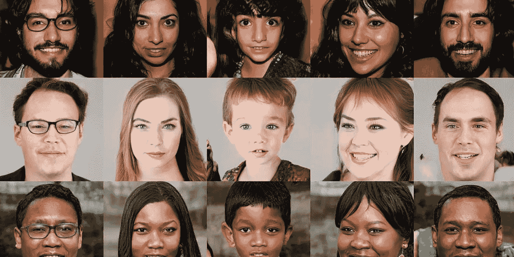
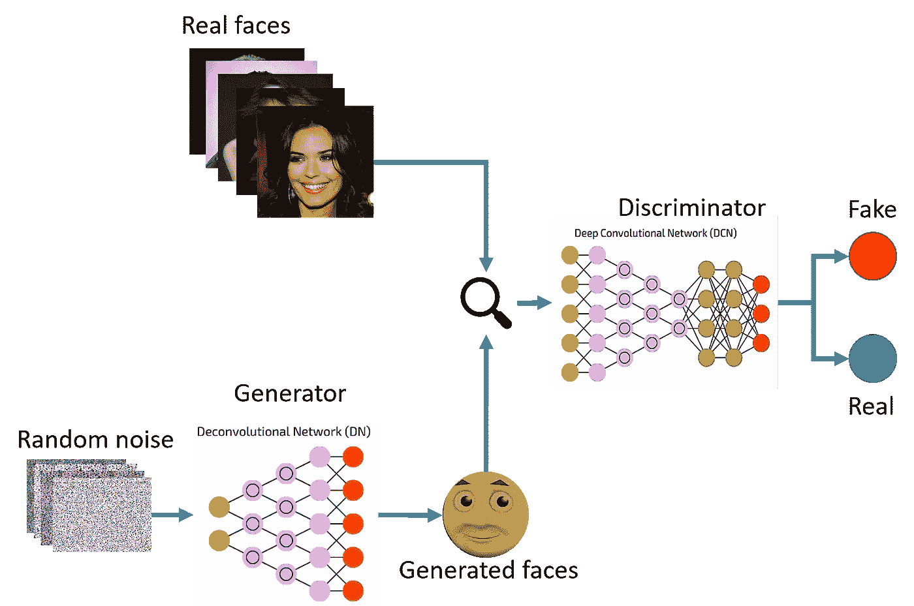
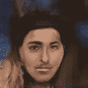

# 基于生成对抗网络的人脸生成

> 原文：<https://medium.com/nerd-for-tech/face-generation-using-generative-adversarial-networks-gan-6d279c2d5759?source=collection_archive---------4----------------------->

> 生成对抗网络是近十年来机器学习中最有趣的想法

# 介绍

随着人工智能行业的蓬勃发展，在深度学习领域出现了许多类型的基于神经网络的架构，除了最流行的卷积神经网络(CNN)，通常使用单个神经网络的递归神经网络(RNN)，还有一种新的东西，由 Ian J. Goodfellow 和合著者在 2014 年创立，称为生成对抗网络(GAN)，正在人工智能行业中迎头赶上，因为它使用两个神经网络工作。gan 用于许多有趣和有用的任务，它们用于生成看起来接近原始的假东西，例如生成假人脸、假视频，它们不限于此，但它们也可以用于创建一个人发表演讲的假视频。听起来是不是很神奇？所以，让我们深入到假人类的世界。

> 甘很危险？

# 什么是生成性对抗网络，它们是如何工作的？

gan 是生成模型，用于生成图像、音频和视频等虚假内容。GANs 包含两个神经网络:生成器和鉴别器。生成器生成新的随机数据模式，而鉴别器检查将鉴别器生成的数据模式分类为真实(属于原始训练集)或虚假。

为什么对抗性这个名称来了，这里的任何两个事物之间有冲突吗？是的，对抗性这个名称的由来是因为两个网络生成器和鉴别器以冲突或相反的方式工作。生成器的主要目的是欺骗鉴别器，但是怎么做呢？GANs 的工作原理是这样的，首先生成器生成一些假数据模式并发送给鉴别器来检查它是真是假，生成器的主要动机是如此细致地创建假数据模式，以至于鉴别器将其归类为真。

# GANs 如何生成假脸？

以下步骤之后是用于面部生成的 GAN:

1.  生成器获取大小等于种子大小的随机数数组，并生成图像。
2.  所生成的具有相同数量的真实人脸图像(用于训练)的图像被传递给鉴别器，用于它们的真假分类。
3.  鉴别器现在将其结果作为损失再次传递给生成器，以使其更准确地生成假图像。
4.  这个过程持续迭代期望的次数，因此生成器持续改进其输出以欺骗鉴别器。

鉴别器和生成器不会同时运行。

要创建你的假图像世界，看看我生成的一些样本面孔，你可以访问我的 [Github](https://github.com/MILIND-RAJ/Face-Generation-Using-Generative-Adversarial-Network-GAN-) 。

每 50 次迭代改进后，生成器生成的所有人脸的 gif 图

*继续生成！*