# 使用 Nvidia Jetson Nano (Yolov5)进行面罩检测

> 原文：<https://medium.com/nerd-for-tech/face-mask-detection-with-nvidia-jetson-nano-yolov5-b66f286f16d4?source=collection_archive---------0----------------------->

本教程展示了如何实现一个系统，通过该系统可以区分戴面具的人**、**没戴面具、**和戴错了**面具的人**。**

这是一个经典的分类问题，对此我们不需要重新发明轮子。我们将使用 **Yolov5** 一个基于 **PyTorch** 构建的神经网络分类框架，PyTorch 是一个用 C++编写的机器学习框架，可以作为一个库在 **Python** 中访问。

作为硬件，我们将使用 Nvidia 的 **Jetson Nano** ，通过其**128**CUDA 核心加速底层线性代数运算。此外，将使用一个 **ESP32 摄像头**，通过 **WIFI (HTTP)** 提供其摄像头流。

*ESP32 CAM 没有 USB 连接器，因此我们还需要一个 FTDI 编程器，该编程器通过跳线直接连接到 ESP32 CAM 的 GPIO 引脚，并可通过迷你 USB 转 USB 电缆连接到 PC。*

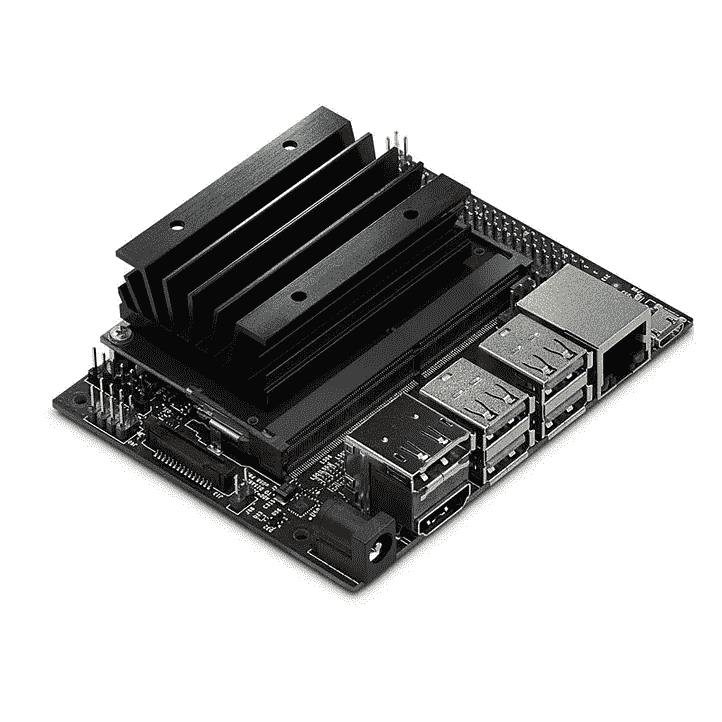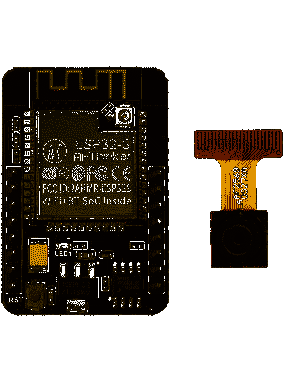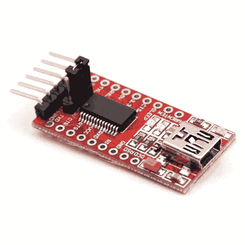

从左至右:Nvidia Jetson NanoESP32 凸轮；FTDI 程序员

# 1.初始化杰特森纳米

在我们可以使用我们的 Jetson Nano 之前，我们必须在 micro SD 卡上刻录官方 JetPack SDK。Jetpack 的图片可以在 Nvidia 的官方网站上找到并下载。遵循[入门](https://developer.nvidia.com/embedded/learn/get-started-jetson-nano-devkit#write)教程，该教程描述了如何在 SD 卡上蚀刻图像以及如何访问您的 Jetson Nano。

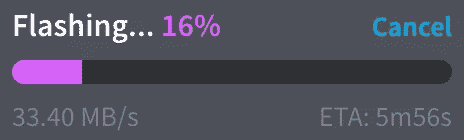

闪烁的 Nvidia 的 JetPack 图像

完成教程后，我们开始更新 Nano 上的包。*(整个项目需要互联网连接)*:

```
sudo apt update && sudo apt upgrade
```

# 2.在 Nvidia Jetson Nano 上安装支持 GPU (Cuda)的 PyTorch

我们从安装 PIP(python 包管理器)开始:

```
sudo apt install curl
curl https://bootstrap.pypa.io/get-pip.py -o get-pip.py
sudo python3 get-pip.py
```

通常会出现一个错误，说明*“pip 的依赖解析器当前没有考虑所有已安装的包”。*可以忽略。

现在我们需要为 PyTorch 下载轮子。这是 Nvidia 工程师预先构建的库:

```
sudo apt-**get** install libopenblas-**base** libopenmpi-devcurl -LO [https://nvidia.box.com/shared/static/p57jwntv436lfrd78inwl7iml6p13fzh.whl](https://nvidia.box.com/shared/static/p57jwntv436lfrd78inwl7iml6p13fzh.whl)mv [p57jwntv436lfrd78inwl7iml6p13fzh.whl](https://nvidia.box.com/shared/static/p57jwntv436lfrd78inwl7iml6p13fzh.whl) torch-1.8.0-cp36-cp36m-linux_aarch64.whlsudo pip3 install torch-1.8.0-cp36-cp36m-linux_aarch64.whl
```

安装 PyTorch 之后。可以通过运行以下命令来确认这一点:

```
sudo python3 -c "import torch; print(torch.cuda.is_available())"
```

如果返回 **true** PyTorch 已经成功安装，CUDA 库已经找到。

PyTorch 也需要火炬视觉。以下代码用于构建火炬视觉。这可能需要一段时间:

```
sudo apt install libjpeg-dev zlib1g-dev
git clone --branch v0.9.1 [https://github.com/pytorch/vision](https://github.com/pytorch/vision) torchvision
cd torchvision/
sudo python3 setup.py install
cd ..
```

# 3.下载 YOLOv5 脚本

我们将继续下载 YOLOv5 并安装它的需求。

```
git clone [https://github.com/ultralytics/yolov5.git](https://github.com/ultralytics/yolov5.git)
cd yolov5
export OPENBLAS_CORETYPE=ARMV8
sudo apt install libfreetype6-dev python3-dev
sudo pip3 install numpy==1.19.4
sudo pip3 install --ignore-installed PyYAML>=5.3.1
sudo pip3 install -r requirements.txt
```

现在，我们可以通过在命令提示符下键入以下命令来测试 YOLOv5:

```
sudo python3 detect.py
```

如果一切正常，输出应该如下所示:

```
Namespace(agnostic_nms=False, augment=False, classes=None, conf_thres=0.25, device=’’, exist_ok=False, half=False, hide_conf=False, hide_labels=False, imgsz=640, iou_thres=0.45, line_thickness=3, max_det=1000, name=’exp’, nosave=False, project=’runs/detect’, save_conf=False, save_crop=False, save_txt=False, source=’data/images’, update=False, view_img=False, weights=’yolov5s.pt’)
YOLOv5 🚀 v5.0–177-g5c32bd3 torch 1.8.0 CUDA:0 (NVIDIA Tegra X1, 3956.1328125MB)Fusing layers… 
Model Summary: 224 layers, 7266973 parameters, 0 gradients
image 1/2 /home/xlagor/yolov5/data/images/bus.jpg: 640x480 4 persons, 1 bus, 1 fire hydrant, Done. (0.809s)
image 2/2 /home/xlagor/yolov5/data/images/zidane.jpg: 384x640 2 persons, 2 ties, Done. (0.226s)
Results saved to runs/detect/exp2
Done. (3.082s)
```

# **4。相机软件和 IDE 配置**

现在我们需要一个摄像机流来输入 YOLOv5。从技术上讲，人们可以使用任何 **HTTP MJPEG 流**，但我们将使用 ESP32 CAM 模块。它有一个内置的 WIFI 模块，非常适合许多使用案例，因为它更灵活。

首先在你的台式电脑上下载并安装 [Visual Studio 代码](https://code.visualstudio.com/download)。一旦进入 VSCode，我们就可以安装名为 **PlatformIO IDE** 的扩展。这是一个 IDE，改进了处理嵌入式设备时的工作流程。

现在是下载代码的时候了，该代码将被刷新到 ESP32 CAM 模块上。将其克隆到您选择的目录中:

```
git clone [https://github.com/FrederikRogalski/esp32-cam-mjpeg](https://github.com/FrederikRogalski/esp32-cam-mjpeg)
```

在 Visual Studio 代码中打开目录。PlatformIO 识别 platformio.ini 文件并激活自身。这可以通过观察 IDE 底部的工具栏来验证。

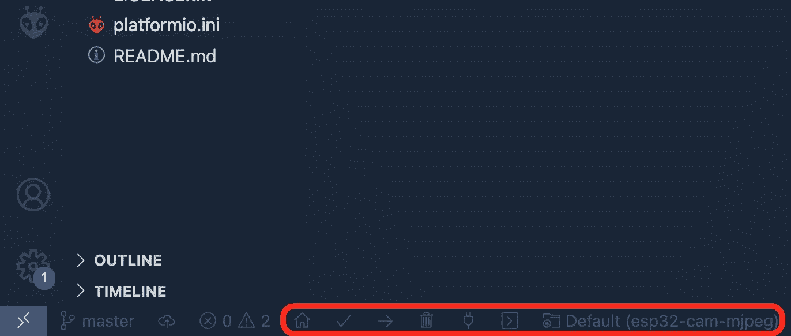

平台视频图标

该代码还需要 wifi 凭据。将它们放在目录 *src* 中名为 *home_wifi_multi.h* 的文件中。这可以通过下面的命令来实现。确保您位于 git 存储库的底部:

```
echo '#define SSID1 "<Your WIFI Name>"\n#define PWD1 "<Your WIFI Password>"' > ./src/home_wifi_multi.h
```

之后，软件就可以上传了。

# **5。闪烁 ESP32 凸轮模块**

在刷新之前，模块必须连接到台式 PC。这是通过利用 FTDI 编程器、一些跳线和迷你 USB 到 USB 电缆来实现的。

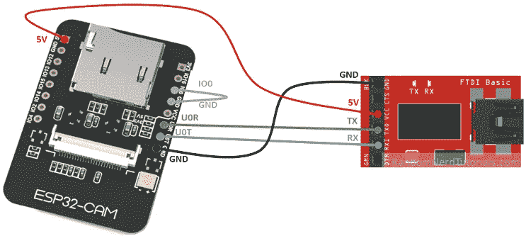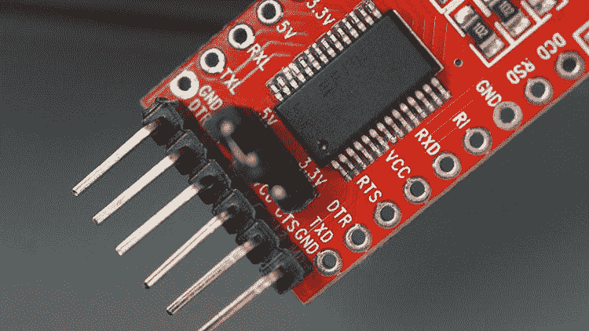

从[如何编程/上传代码到 ESP32-CAM AI-Thinker(Arduino IDE)](https://randomnerdtutorials.com/program-upload-code-esp32-cam/)连接 ESP32 CAM 到 FTDI 适配器原理图

按照示意图所示连接跳线。在将台式 PC 连接到适配器之前，确保编程器的跳线正在连接 5V 配置引脚。

将 USB 电缆连接到台式 PC 后，可以编译和上传代码。这是通过按 IDE 中的箭头按钮(➔)来实现的。一旦出现以下内容，点击 ESP32 cam 模块上的复位按钮(标记为 *rst* ):

```
Connecting........___
```

如果一切正常，终端应该显示如下内容:

```
Writing at 0x########...
```

如果不成功，再试一次。有时需要几次。

上传完成后，点击电气插头图标(🔌)并拆除连接 IO0 和地线的电线。这将禁止引导，按下复位按钮，程序开始运行。

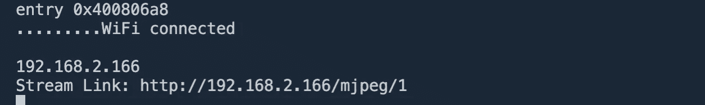

如果成功连接到 wifi，该程序将自动输出其 IP 地址。该链接可以在您选择的浏览器中打开，以访问摄像机流。请注意，一次只能有一个连接，因此在继续之前，请确保通过关闭选项卡来关闭连接。

# 6.从 YOLOv5 访问流

现在，我们可以通过在 Jetson Nano 上运行以下代码来连接这两个组件(确保更改 IP 地址):

```
sudo python3 detect.py --source [http://<ip-of-esp32-cam>/mjpeg/1](http://192.168.2.166/mjpeg/1) --view-img
```

默认情况下，YOLOv5 将运行一个模型，在 COCO 数据集上进行预训练。但是如果我们想训练自己的模型呢？

# 7 .**。获取数据**

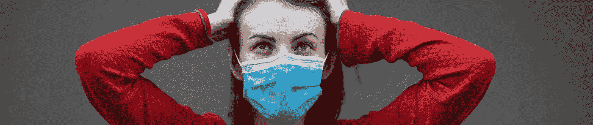

如果我们想要训练我们自己的模型来分类人们戴口罩是正确的，不正确的，或者甚至不戴口罩，我们需要这三类的数据。幸运的是，已经有数据集抑制这些类。一个例子是来自 Kaggle 的[人脸面具检测数据集](https://www.kaggle.com/andrewmvd/face-mask-detection)。

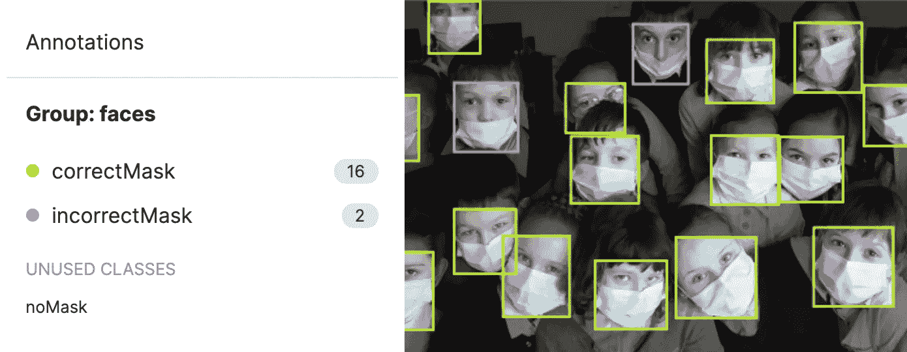

给图片贴标签

但是找到数据只是成功的一半。将它转换成正确的格式，并通过组合多个数据集甚至自己标记它们来平衡它，这是另一半。让这一步变得更容易的最简单的方法是使用像 [Roboflow](https://roboflow.com/) 这样的端到端平台。上传所有数据，标记未标记的图像，并扩充数据集。对于导出，选择 YOLOv5 格式。

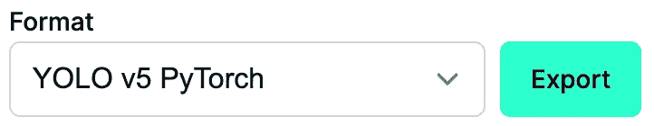

# 8.训练模型

训练肯定不会在 Jetson Nano 上进行，而是在一台更强大的计算机上进行。配置这样的训练机器超出了本教程的范围，但是可以在网上找到很多安装 CUDA 的教程。

在培训计算机上克隆 YOLOv5 存储库。

```
git clone [https://github.com/ultralytics/yolov5.git](https://github.com/ultralytics/yolov5.git)
cd yolov5
```

此外，将数据集复制到训练计算机上 YOLOv5 存储库的根文件夹中。使用 Roboflow 时，只需在导出选项卡中选择 ***终端*** 并执行训练机上显示的命令。它看起来有点像这样:

```
curl -L "https://app.roboflow.com/ds/#######?key=#######" > roboflow.zip; unzip roboflow.zip; rm roboflow.zip
```

之后，可以通过调用以下命令开始训练:

```
python3 train.py --img 640 --batch 16 --epochs 5 --data <your-dataset-definition>.yaml --weights yolov5s.pt
```

该命令以 16 个为一批，大小为 640x640，训练 5 个历元。这些参数可以根据您的需要进行配置。我发现训练大多在 100 个纪元后收敛。

# 9.运行自定义模型

训练后可以在***【权重】*** 文件夹中找到训练好的模型。最后训练的权重将被称为 ***last.pt*** ，最好的将被称为 ***best.pt*** 。只需将它复制到您的 Jetson Nano 上，并使用以下命令指定它:

```
sudo python3 detect.py --source [http://<ip-of-esp32-cam>/mjpeg/1](http://192.168.2.166/mjpeg/1) --view-img --weights <path/to/custom/weights.pt>
```