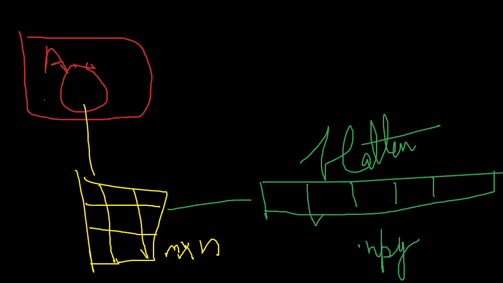
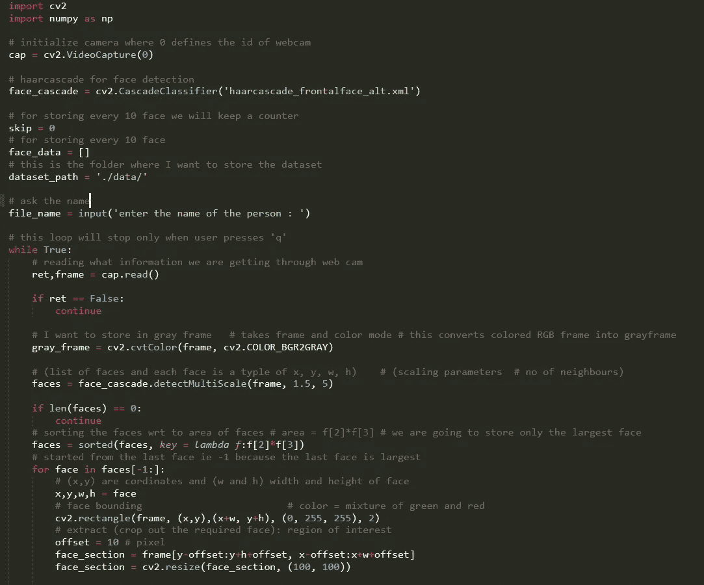
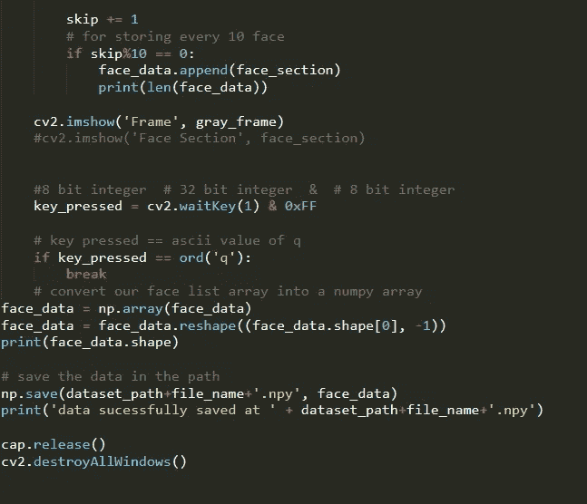
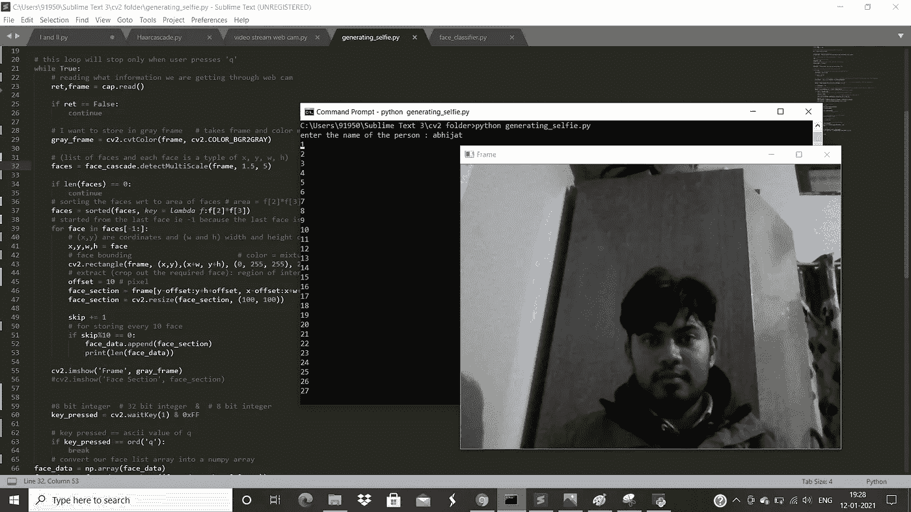
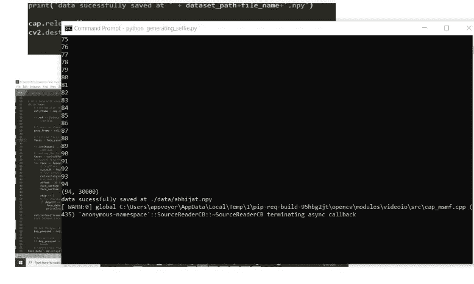
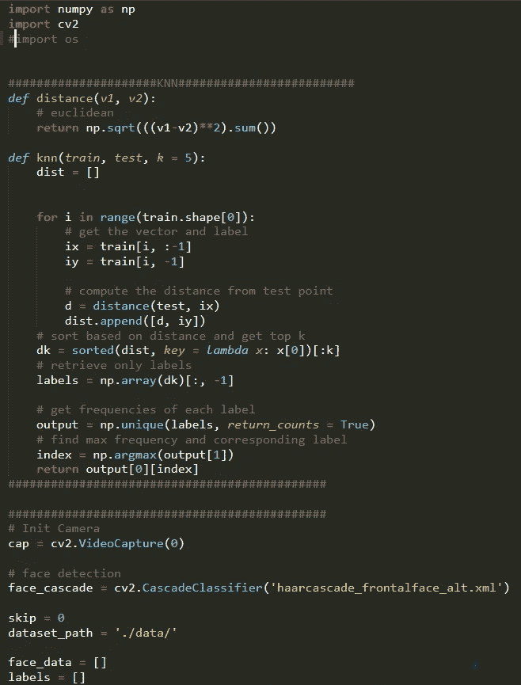
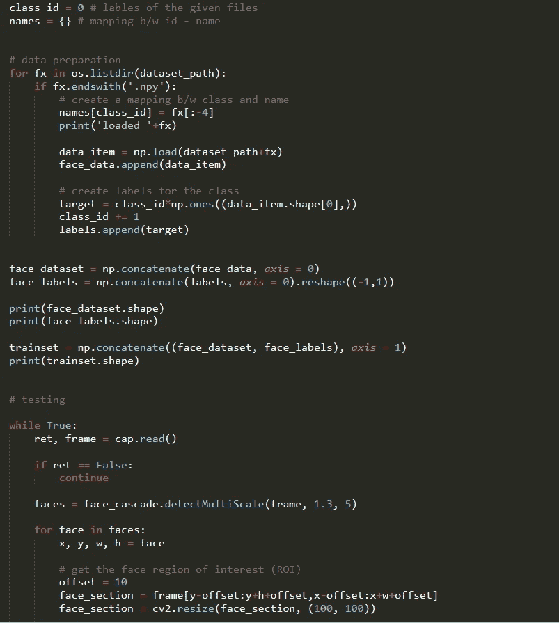
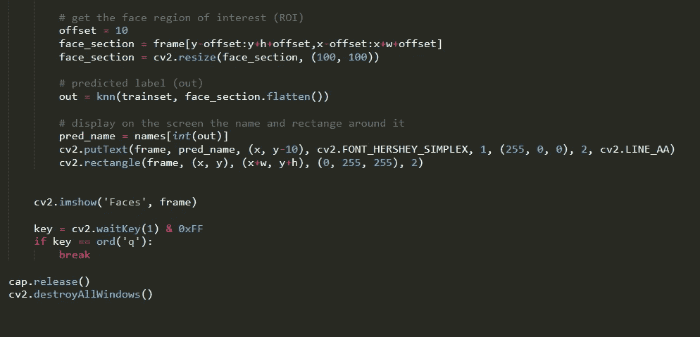
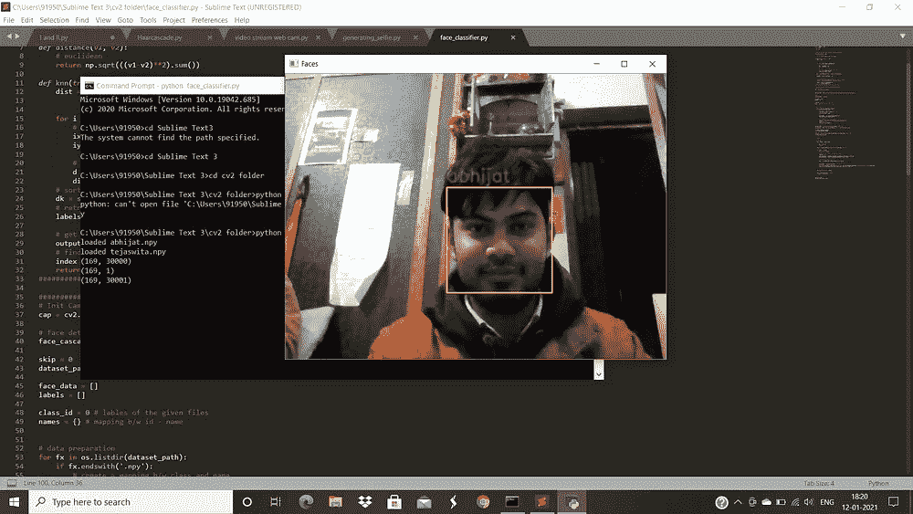
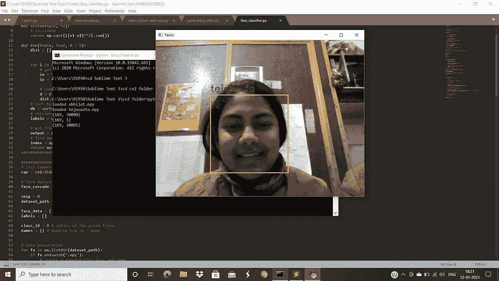

# 使用 KNN 的人脸识别

> 原文：<https://medium.com/nerd-for-tech/face-recognition-using-knn-4e9e19290316?source=collection_archive---------2----------------------->

**监督机器学习**算法是一种依赖于标记的输入数据来学习函数的算法，当给定新的未标记数据时，该函数会产生适当的输出。K 最近的邻居

KNN 是一种懒惰学习，非参数算法。它使用具有多个类别的数据来预测新样本点的类别。KNN 是非参数化的，因为它不对正在研究的数据做任何假设，即模型是根据数据分布的。

KNN 非常简单，经常被用作支持向量机(SVM)和人工神经网络(ANN)等更复杂分类器的基准。

# KNN 算法在机器学习中的应用

为了更好地理解工作 KNN 算法，在使用它时应用以下步骤:

步骤 1 —当实现一个算法时，你总是需要一个数据集。因此，您从加载训练和测试数据开始。

步骤 2 —选择最近的数据点(K 值)。k 可以是任何整数。

步骤 3-对每个测试数据执行以下操作

3.1-使用欧几里得距离、汉明或曼哈顿计算测试数据和每行训练之间的距离。欧几里得方法是计算距离时最常用的方法。

3.2-根据距离值按升序对数据集进行排序。

3.3 —从排序后的数组中，选择前 K 行。

3.4-基于这些行中出现最多的类别，它将为测试点分配一个类别。

第 4 步—结束

“物以类聚，人以群分”很好地证明了 KNN 算法。

# **我们的任务:通过网络摄像头的自拍生成一些实时训练数据**

# **准备自拍模型的训练数据集**

#加载数据和培训:

# **KNN 上场**

