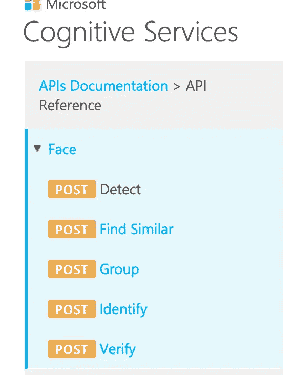
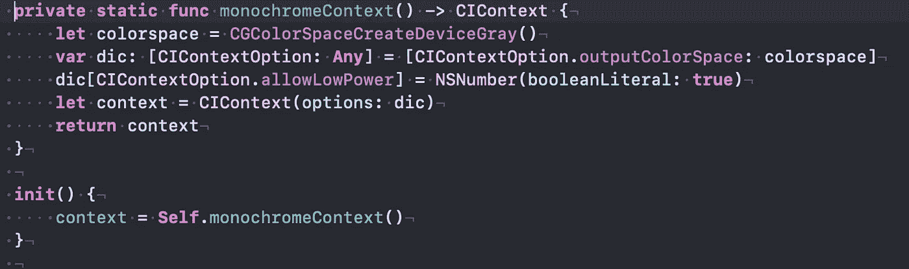
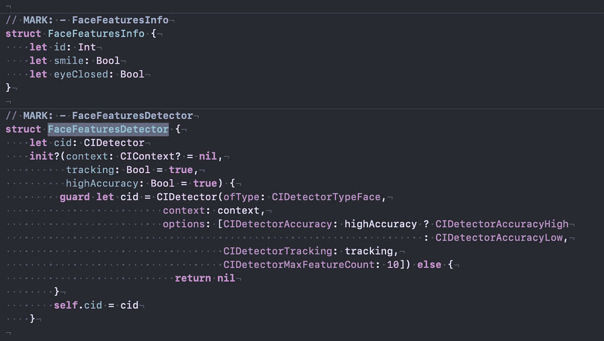
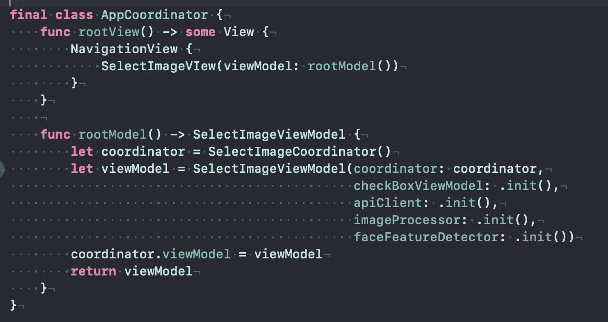
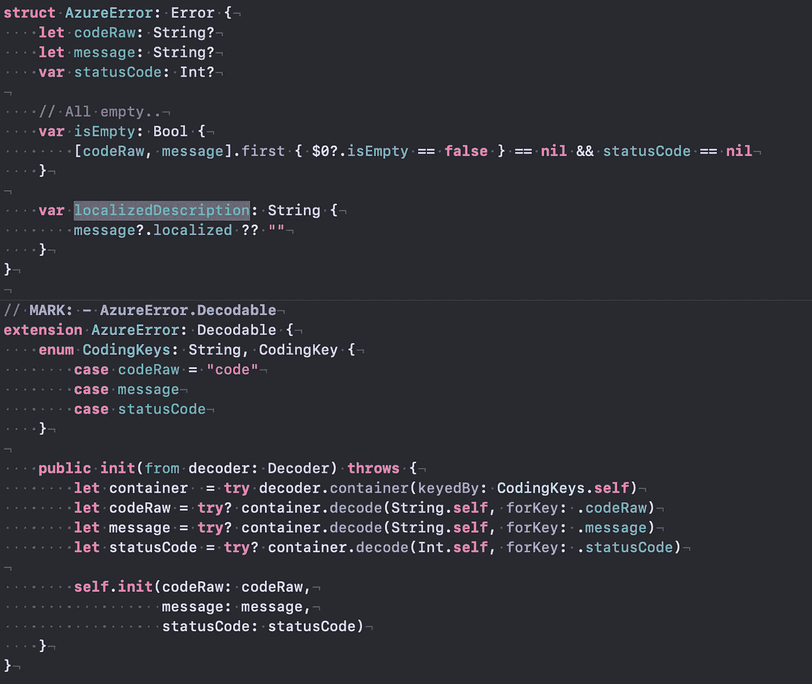
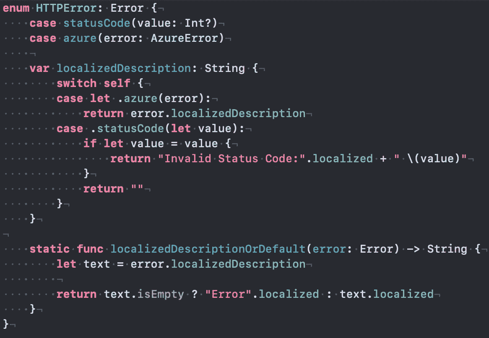
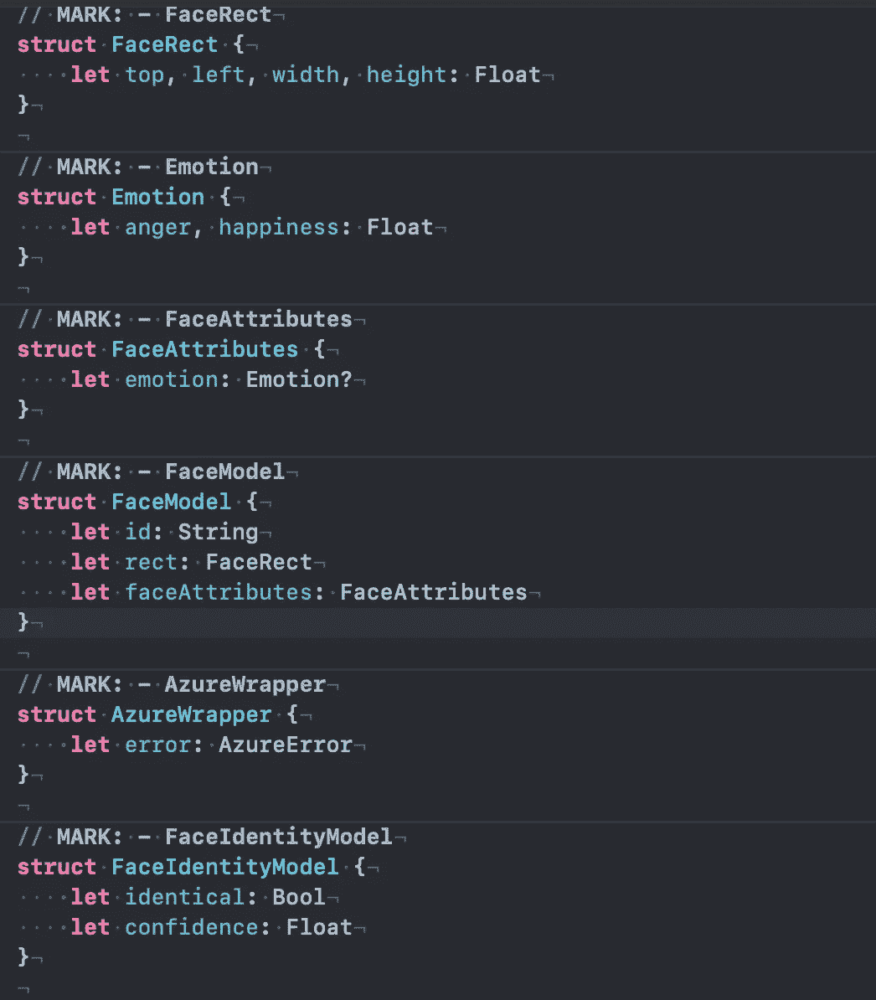

# 使用 Azure API 的人脸相似度

> 原文：<https://medium.com/nerd-for-tech/face-similarity-using-azure-api-a918efab366d?source=collection_archive---------4----------------------->

在这篇文章中，我们将考虑使用 Azure API 的人脸相似性的样本应用程序。

## 很久以前…

我曾经是。NET 开发人员很久以前。老实说，考虑到那是大约 10 年前的事情，MS Visual Studio 给我的印象比 Xcode 好得多。令我惊喜的是，我有机会使用微软 Azure Cognitive API 进行人脸相似度测试。

从字面上来说，我们将使用**检测**和**验证**休息方法:



Face API

[蔚蓝](https://azure.microsoft.com/en-us/)提供一年试用期。只需提供一些信用卡，你会得到每月 20K 请求，每天 20。足够审判的费用..


Azure 菜单

可以在创建资源、选择主机之后测试 API。(点击 API 控制台)。

只是不要忘记提供密钥，更准确地说是*Ocp-Apim-Subscription-Key。*

## 共同点:

首先我们调用 **Detect** 方法，它在提供的图像中检测人脸并返回给我们 IDs &一些特征。然后我们用 id 调用**验证**方法。标识符(id)保存在一天后到期的会话的后端。

为了减少流量，因为 azure 有一些大小限制(如果我没有弄错的话，大约在 3MB 附近)，我将图像转换为**灰度** &试图缩小它的大小，使其大约为 **300KB** 。

看看[图像处理器](https://github.com/yakushevichsv/FaceMatchSample/blob/main/FaceMatch/Services/ImageProcessor.swift)。“灰度”是由单色环境完成的:



单色背景

CoreImage 被用作人脸特征检测器，只是为了比较 Azure & CIDetector 返回的情绪，并在前端验证任何图片，以避免浪费 API 调用。看看 GitHub 上服务文件夹下的 [FaceFeaturesDetector](https://github.com/yakushevichsv/FaceMatchSample/blob/main/FaceMatch/Services/FaceFeaturesDetector.swift) :



CIDetector 配置

面部检测精度可能很高，最大特征数为 10。

## 建筑:

这个例子只有一个屏幕(两个按钮&总是“启用”复选框)，我可以说这是 MVVM+协调员。MVVM(因为 **SwiftUI** )。仅用于呈现 UIImagePickerController 和创建根 ViewController 的协调器(AppCoordinator):



根协调员

我更喜欢使视图被动，因此将功能委托给视图模型。

## 型号:

在示例 app api 中，错误由[**azure error**](https://github.com/yakushevichsv/FaceMatchSample/blob/main/FaceMatch/Models/Azure/AzureError.swift)**:**表示



Azure 错误表示

为了处理所有错误情况，创建了适当的包装器(enum [**HTTPError**](https://github.com/yakushevichsv/FaceMatchSample/blob/main/FaceMatch/Models/HTTPError.swift) ):



HTTPError 枚举

## Azure JSONs:

代表 API 响应的模型由适当的[实体](https://github.com/yakushevichsv/FaceMatchSample/blob/main/FaceMatch/Models/Azure/CognitiServiceModels.swift)表示



响应实体

例如，FaceModel 表示人脸的信息(在我们的例子中是矩形和情感)。

## 检测:

此外，具有二进制正文数据的方法接受 URL 查询参数:

```
**let** queryItems: [String: **Any**] = ["returnFaceId": **true**,
"returnFaceLandmarks": **false**,
"recognitionModel": "recognition_02",
"returnFaceAttributes": "emotion",
"returnRecognitionModel": **false**,
"detectionModel": "detection_01"]
```

有不同的识别和检测模型(如果参数错误，您将得到一个错误)。我们也探测情感:恐惧，或者快乐..

## 识别:

该方法接收 face1 & face2 IDs 并返回概率(0…1)。代码在 [GitHub](https://github.com/yakushevichsv/FaceMatchSample) 上。

第一个模型(识别 _01，检测 _01)在样本图像和我的照片上很好地检测到了 6 年的差异。然而[参战男子的照片](https://www.yaplakal.com/forum2/topic2136203.html)被认定为相同的概率很低(0.4)。嗯，但这对于神经网络来说是一个“异常值”。这对于一个人的生活和外表来说确实是巨大的改变。