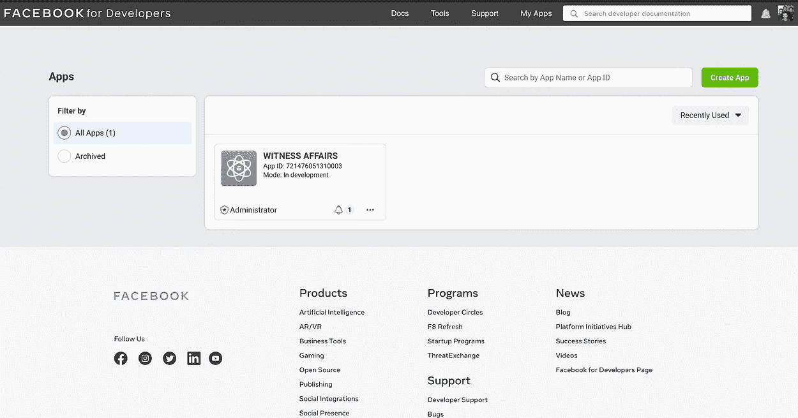
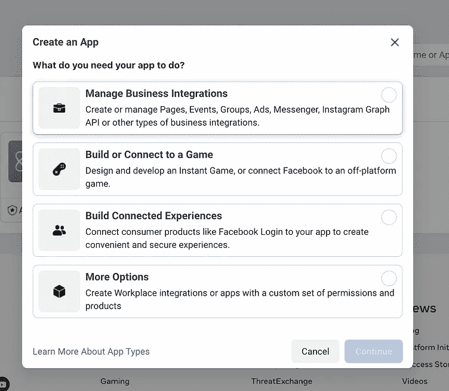
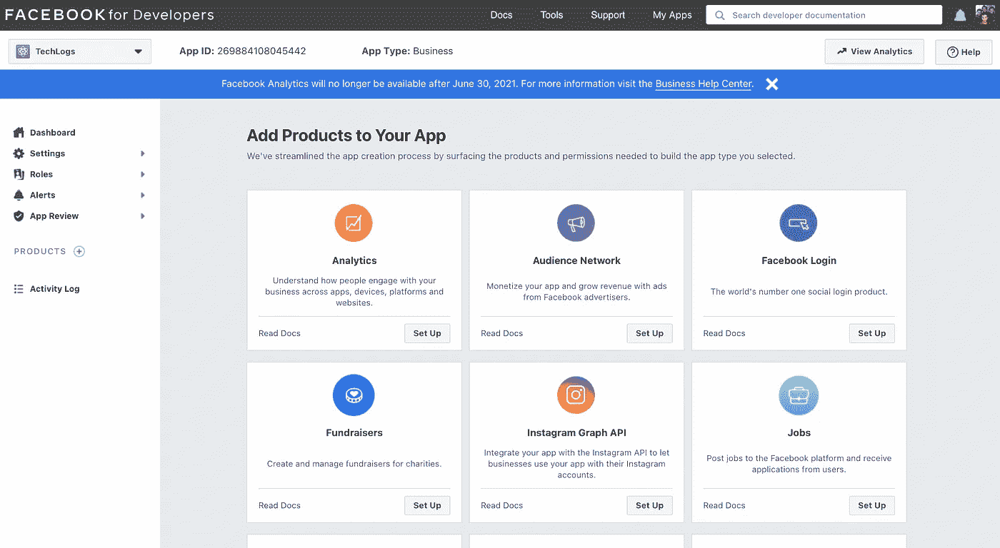
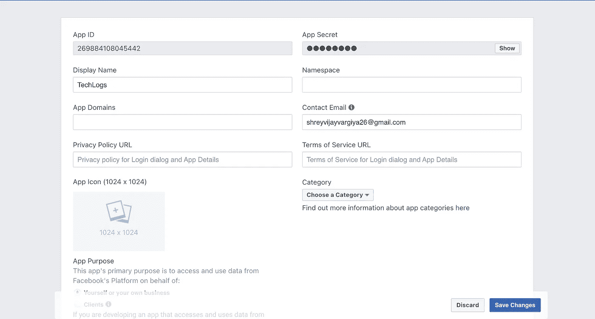
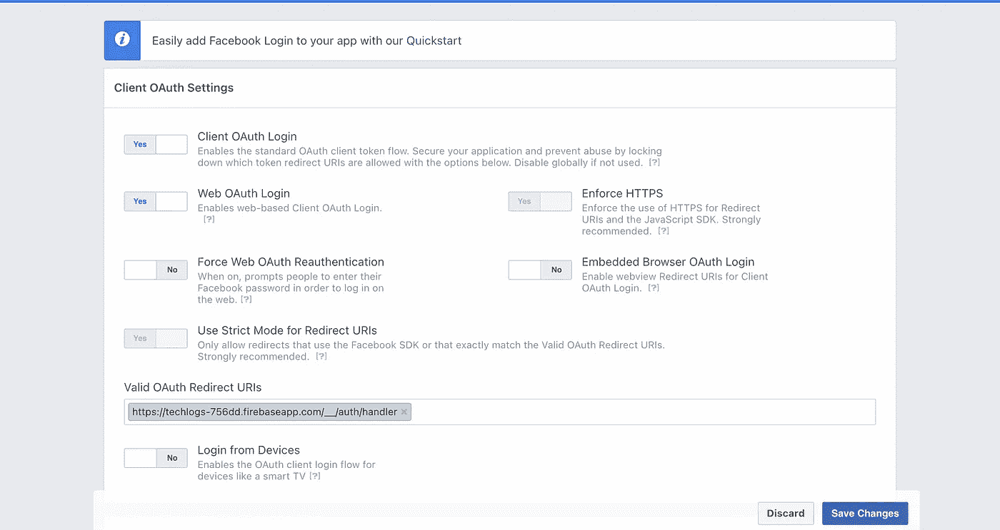
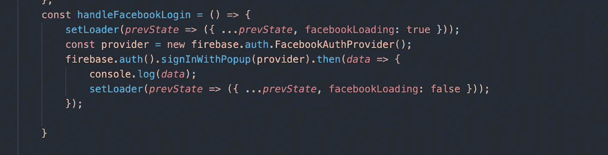
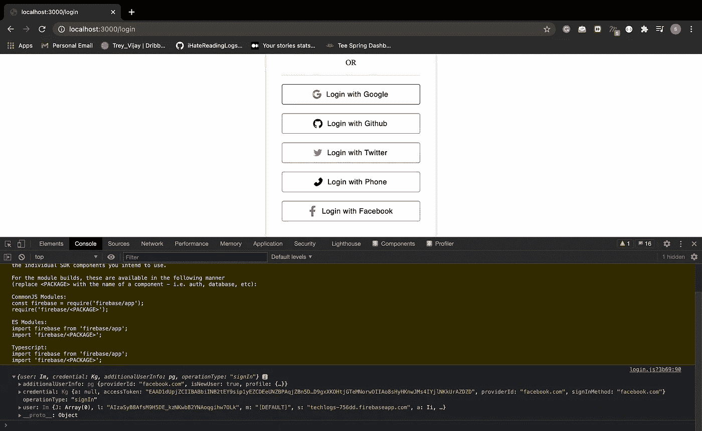
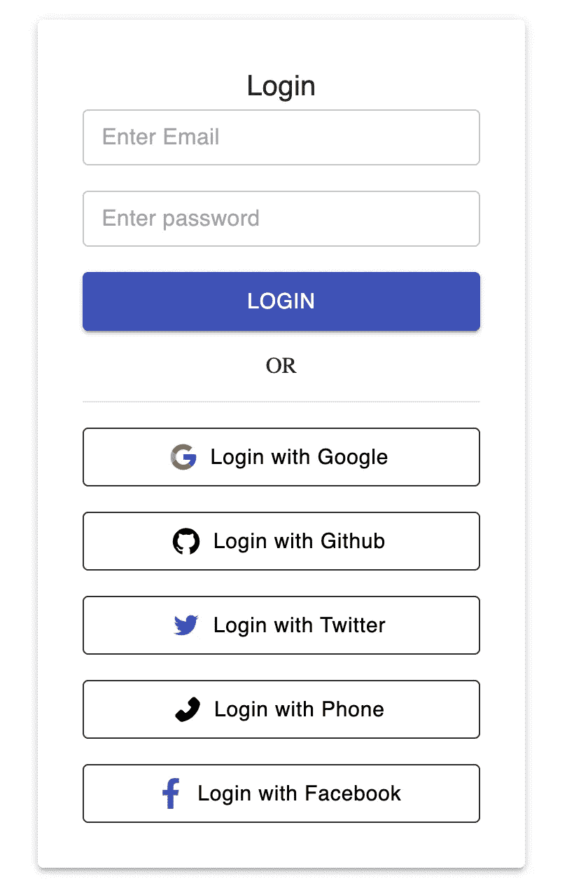

# 使用 Firebase 的脸书认证

> 原文：<https://medium.com/nerd-for-tech/facebook-authentication-using-firebase-ebb70d6df22a?source=collection_archive---------5----------------------->

通过 Firebase 使用脸书认证您的用户


[点击阅读所有其他文章](http://i-hate-reading-logs.vercel.app/)

感谢阅读这篇文章，我已经写了一大堆关于如何通过 Firebase 认证使用 Google、Twitter、Github、Email & Password 和电话号码的用户的文章。你可以通过下面的链接阅读这些文章。

```
[http://i-hate-reading-logs.vercel.app/](http://i-hate-reading-logs.vercel.app/)
```

# 概观

1.  创建脸书开发人员应用程序并启用 web 脸书登录
2.  在 Firebase 身份验证登录方法中输入脸书应用 ID 和应用密码
3.  输入从 firebase 身份验证到脸书登录设置页面的 OAuth 回调 URL。
4.  在前端添加 Firebase 提供的脸书登录方法。

# **打造脸书开发者 App**

进入这个链接(【https://developers.facebook.com/】T4)，点击右上角的我的应用。继续创建一个新应用程序，您将被重定向到仪表板页面。在仪表板页面上，为 web 启用脸书登录。现在是获取您的应用 ID 和应用密码的时候了。我会一步一步地添加所有的图像，让你更容易。



左图是脸书开发者应用程序，右图是创建新应用程序的模式。

左图是您已经在脸书开发者门户上创建的应用。当您点击带有**“创建应用程序”**文本的绿色按钮时，右图为模式打开。继续选择您的应用程序所属的类别，然后单击**“继续”**。



脸书开发者仪表板

创建应用程序后，您将被重定向到仪表板，如上图所示。点击**脸书登录**设置按钮。启用脸书登录后，您可以在左侧边栏的**产品**部分看到脸书登录。

下一步是从脸书开发者门户获取应用 ID 和应用密码。



脸书开发者仪表板上的设置->基本页面

从该页面复制粘贴您的**应用 ID** 和**应用密码**以供将来使用。

转到 Firebase 控制台，在**身份验证- >登录方式**选项卡中启用脸书登录。你会看到一个小方框，如下图所示。添加您的上述 **App ID** 和 **App Secret** 并复制粘贴回调 URL 以备后用，然后点击**“保存”**按钮。


下一步也是最后一步是添加上图所示的回调 URL，并将其输入到脸书开发者仪表板->产品->脸书登录->设置，如下图所示。



我从 Firebase 控制台回调的 URL 被标记为蓝色。

# 编写代码

如果过程看起来太长，请原谅。现在让我们直接跳到代码部分。我们将使用用于其他 Firebase 身份验证文章的相同存储库。

```
[https://github.com/shreyvijayvargiya/iHateReadingLogs/tree/main/TechLogs/PhoneNumberAuthentication](https://github.com/shreyvijayvargiya/iHateReadingLogs/tree/main/TechLogs/PhoneNumberAuthentication)
```

在登录页面中，我们将为脸书登录创建一个新按钮，并为脸书登录添加 Firebase 提供的方法。步骤如下-

1.  使用 Firebase 身份验证提供程序为脸书创建一个提供程序
2.  创建接受上述提供者的 Firebase 登录方法
3.  一切正常后，获取脸书登录令牌和用户凭证。

# 供应者

我们将使用 Firebase Github auth provider 方法来创建一个提供者。

```
const provider = new firebase.auth.FacebookAuthProvider;
```

下一部分使用" **signInWithPopup"** 方法，该方法接受提供者作为参数并返回 Promise。我们将在承诺的决议中获得用户凭证。



登录页面

我们的 handleFacebookLogin 方法简单地定义了提供者，然后使用 Firebase signInWithPopup 方法。在解决了**里面的承诺之后。然后**我们将获得用户凭证，我在控制台中通过脸书登录后记录了我们的凭证。



浏览器控制台中的我的用户凭据



我们的最终登录页面

# 结论

脸书登录也很简单，如果你读过我所有的 Firebase 认证登录方法的文章，你会很容易发现所有的方法几乎都遵循相同的模式。Firebase 还每次为每个登录方法提供相同数据类型的凭证。

下次再见，祝大家愉快。

```
Code repository => [https://github.com/shreyvijayvargiya/iHateReadingLogs/tree/main/TechLogs/FacebookAuthentication](https://github.com/shreyvijayvargiya/iHateReadingLogs/tree/main/TechLogs/FacebookAuthentication)
```