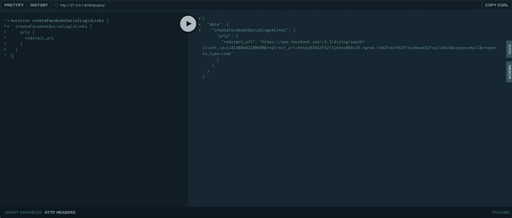
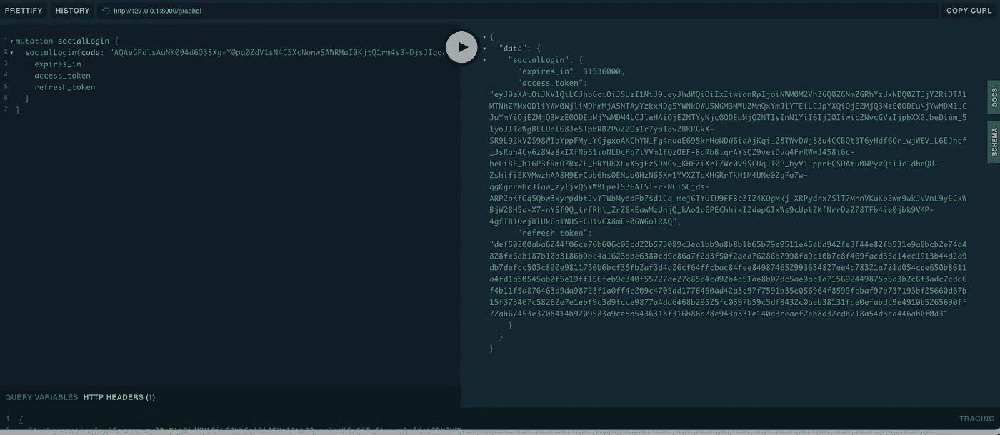

# 在 Laravel 中使用 GraphQl 驱动的 API 进行脸书登录

> 原文：<https://medium.com/nerd-for-tech/facebook-login-with-graphql-powered-api-in-laravel-796e4c98411e?source=collection_archive---------7----------------------->


[Firmbee.com](https://unsplash.com/@firmbee?utm_source=medium&utm_medium=referral)在 [Unsplash](https://unsplash.com?utm_source=medium&utm_medium=referral) 上拍照

在这篇文章中，我将带你通过 [Laravel 的交际花](https://laravel.com/docs/8.x/socialite)包和 GraphQl 完成脸书登录集成。为此你需要有一些关于 GraphQl 的基础知识，你可以看看我下面创建的系列:

[](/nerd-for-tech/build-a-forum-with-graphql-powered-api-in-laravel-part-1-de032d13d628) [## 在 Laravel 中用 GraphQL Powered API 构建一个论坛[第 1 部分]

### 首先让我们把这个拿出来。GraphQl 是什么？三言两语大概是这样的:

medium.com](/nerd-for-tech/build-a-forum-with-graphql-powered-api-in-laravel-part-1-de032d13d628) 

要开始使用 Socialite，请使用 Composer 包管理器将包添加到项目的依赖项中:

```
composer require laravel/socialite
```

在 providers 中注入 socialite 类，在 **config/app.php** 文件中别名数组。

```
....
....
'providers' => [
    ....
    ....
    Laravel\Socialite\SocialiteServiceProvider::class,
],'aliases' => [
    ....
    ....
    'Socialite' => Laravel\Socialite\Facades\Socialite::class,
],
....
....
```

# 迁移用户身份验证表中的脸书 ID

要在 Laravel 应用程序中使用脸书登录，您的 Users 表必须有一个 facebook_id，所以通过运行下面的命令添加它。

```
php artisan make:migration add_facebook_id_column_in_users_table --table=users
```

打开**timestamp _ add _ Facebook _ id _ column _ in _ users _ table . PHP**，将以下代码放入其中。

```
/**
     * Run the migrations.
     *
     * @return void
     */
    public function up()
    {
        Schema::table('users', function (Blueprint $table) {
            $table->string(**'facebook_id'**)->**unique**()->**nullable**();
        });
    }

    /**
     * Reverse the migrations.
     *
     * @return void
     */
    public function down()
    {
        Schema::table('users', function (Blueprint $table) {
            $table->dropColumn('facebook_id');
        });
    }
```

# 注册脸书应用 ID 和密码

接下来，访问[developers.facebook.com/apps](https://developers.facebook.com/apps)工具，创建脸书应用 id 和密码，然后在**配置/服务**文件中注册 id 和密码。

```
return [
    ....
    'facebook' => [
        'client_id' => 'App id goes here',
        'client_secret' => 'Secret goes herre',
        'redirect' => 'http://localhost:8000/auth/facebook/callback',
    ],
]
```

在我们完成应用程序的配置和迁移后，我们将创建用于脸书认证的突变。

我想到的第一个变化是将在前端显示的重定向链接的生成，从我的角度来看，该变化看起来像这样:

为了实现我们的目标，我们需要覆盖一些来自社交网站核心的类，这样我们才能获得重定向 url。我们需要这样做，因为我们需要访问的方法是受保护的，我们不能访问它。我采用的解决方案是这样的:

我们的突变类会是这样的:

现在让我们来测试一下:



在您访问该链接后，您将被重定向到脸书以批准所请求的信息，如果一切顺利，您将被重定向回我们的申请。重定向链接将类似于:

```
[https://314eea898cd5.ngrok.io/auth/facebook/callback?code=AQDHpfVI_OL6LKj2ypb1h3239hIRM2R6oiAPvo2ozdlLvOPzGwCm7sxLWPuJAIZPIdYBSXSqxA5Z-uE8IVOGPgdlsZvm40yPoRzIXVAqqViLqqhdF-G3v5O5DzgiJiZwgi4coRA7Pu5gg88T1pBawZ3gyfwxL-YBI2Q5LWqlExMZ4sAjyVzZxwpX6_AwuzmIUoD3x7GHh3fWh1cgeztpnfOpsfydhjTew5Kxqc_EYzv4I-DgwqQBkC5owUra30N1Fvm6QOzzWF4GSx6H44xCRBkS14zeCyWntbIbQ7l-Kc5uh0caR35NAxwSnMoKXCe9kQk#_=_](https://314eea898cd5.ngrok.io/auth/facebook/callback?code=AQDHpfVI_OL6LKj2ypb1h3239hIRM2R6oiAPvo2ozdlLvOPzGwCm7sxLWPuJAIZPIdYBSXSqxA5Z-uE8IVOGPgdlsZvm40yPoRzIXVAqqViLqqhdF-G3v5O5DzgiJiZwgi4coRA7Pu5gg88T1pBawZ3gyfwxL-YBI2Q5LWqlExMZ4sAjyVzZxwpX6_AwuzmIUoD3x7GHh3fWh1cgeztpnfOpsfydhjTew5Kxqc_EYzv4I-DgwqQBkC5owUra30N1Fvm6QOzzWF4GSx6H44xCRBkS14zeCyWntbIbQ7l-Kc5uh0caR35NAxwSnMoKXCe9kQk#_=_)
```

我们例子中的回调将由前端框架(next.js，nuxt.js …)处理。他们将使用脸书提供的代码调用一个突变，以获得访问令牌。

为了创建登录，我使用了 **laravel/passport** 。我们在教程中使用的东西在下面的文章中有详细介绍:

[](/nerd-for-tech/build-a-forum-with-graphql-powered-api-in-laravel-part-2-auth-ede9b57a3cf0) [## 在 Laravel 中用 GraphQL 驱动的 API 构建一个论坛—[第 2 部分] Auth

### 在这一部分中，我们将讨论用户的认证。为此，我们将使用 Laravel 护照。运行…

medium.com](/nerd-for-tech/build-a-forum-with-graphql-powered-api-in-laravel-part-2-auth-ede9b57a3cf0) 

我们将使用与普通用户登录相同的方法，只是我们需要为脸书创建一个新的授权类型，它将接受您将被重定向回的代码，通过该代码，我们可以获得用户数据。

我们需要做的另一件事是创建另一个方法，该方法将接受**代码**作为参数，以便向脸书 API 发出请求，它看起来像这样:

```
**public function** getUser(**string** $code): ?User
{
    **if** ($this->**user**) {
        **return** $this->**user**;
    }

    $response = $this->getAccessTokenResponse($code);

    $this->**user** = $this->mapUserToObject($this->getUserByToken(
        $token = Arr::*get*($response, **'access_token'**)
    ));

    **return** $this->**user**->setToken($token)
        ->setRefreshToken(Arr::*get*($response, **'refresh_token'**))
        ->setExpiresIn(Arr::*get*($response, **'expires_in'**));
}
```

下一步是为 facebook 创建新的授权类型。我所做的是看看**通行证**是如何制作的，并遵循几乎相同的步骤，你可以在这里找到它:

```
vendor/league/oauth2-server/src/Grant/PasswordGrant.php
```

在我们的例子中，当函数 **validateUser** 被调用时，我们向脸书发出请求，根据所提供的代码获取用户的详细信息，如果一切顺利，我们将创建该用户。最终代码如下所示:

创建授权类型后，我们需要注册它，为此我们创建了一个服务提供者，它看起来像这样:

剩下的工作就是创建变异，用脸书提供的代码处理登录。这种变异看起来与下面的类似:

```
# AuthPayload response
type AuthPayload {
  # access token
  access_token: String!# refresh token
  refresh_token: String!# expires in
  expires_in: Int!# token type
  token_type: String!# User profile
  user: User!
}type Mutation {

  socialLogin(code: String!): AuthPayload
}
```

变异的代码看起来像这样:

现在让我们来测试一下

