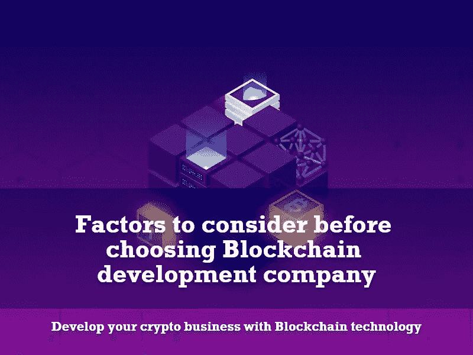

# 选择区块链开发公司前需要考虑的因素

> 原文：<https://medium.com/nerd-for-tech/factors-to-consider-before-choosing-blockchain-development-company-5f77ac06d0bc?source=collection_archive---------6----------------------->

**简介**

区块链最初是在 20 世纪 90 年代左右作为存储和保护数字信息的有效方式而开发的。区块链可以解释为一个开放的账本，可以由多方同时访问。作为主要好处的一部分，区块链记录了很难更改的信息，除非所有相关方达成任何协议。区块链存储的每条新记录都成为一个带有特殊标识哈希的块。将这些块链接成一个巨大的记录链的过程被称为区块链。

区块链技术基本上有助于验证和跟踪需要验证和可追溯性的几个步骤的交易。区块链技术能够提供安全的交易，减少合规性，并加快数据传输处理。区块链技术也有助于管理合同以及审计原始产品。除了保护和不可篡改方面，还有几个其他的观点来说明为什么要为您的企业开发区块链技术。

选择区块链发展公司前需要考虑的因素

**开发区块链业务的理由**

区块链技术是一个在线分布式分类帐，主要用于支持加密货币。然而，区块链技术的潜力远不止支持数字货币，因为它允许虚拟信息被分发，但完全禁止复制。发展商业区块链的一些主要原因是:

*   **增强的安全性:**区块链本身本质上是一种完全分散的技术，因为它不依赖于任何类型的中央机构来验证交易。然而，这些交易是由多个用户的共识进行双重检查的。区块链技术使得数据篡改在计算上几乎不可能，并且非常适合处理安全交易。
*   **更高的透明度:**由于其权力下放的性质，腐败的可能性非常小。除此之外，它很难被任何一种中央权威所控制。整个区块链的所有信息都将向所有人开放，这使得企业更容易提高透明度。
*   **即时交易可追溯性:**区块链使企业能够相对更容易地沿着整个供应链跟踪他们的购买历史。这被认为是区块链最好的优势之一。由于所有信息都可以在分布式分类账上获得，公司可以运行带时间戳的审计来追踪生产中所用材料的来源。
*   **提高效率和速度:**区块链的加入为企业带来了更高的效率，让他们可以省去中间商。正如多个来源进行验证一样，区块链技术消除了对中介的需求。因此，交易速度加快，使整个过程更加高效。

上面提到的是一些关键的原因，将区块链技术纳入您的业务。话虽如此，目前的商业部门已经将区块链技术融入到他们的应用中。让我们看一看区块链技术已经应用的一些商业领域。

**区块链在商业领域的应用**

自从推出以来，区块链技术已经成功地改变了多个商业领域在安全性和匿名性方面的看法。在这方面，下面给出的商业部门是一些已经采用区块链技术实现无缝工作的独家企业。它们是:

*   **加密交易所:**在过去的几年里，一些公司已经开始提供分散的加密货币交易所。随着区块链的使用，货币转账将比现有的货币转账服务更便宜、更快。
*   **贷款:**贷款人可以利用区块链，通过智能合同执行抵押贷款。基于区块链构建的智能合约支持自动触发某些事件，如服务支付、保证金通知、贷款偿还和抵押品释放。
*   **保险:**当区块链和智能合同被引入保险工作方法时，可以为客户和保险提供商提供大量的透明度。记录在区块链上的索赔将防止客户为同一事件重复索赔。
*   **资金转移:**跨境交易的过程相对较慢，而且相当昂贵。然而，包括区块链在内的资金转移比利用现有的资金转移服务更便宜、更快捷。这仅仅是因为当区块链参与时，资金转移在几分钟内完成。
*   **房地产:**房地产涉及大量文书工作，包括数据、所有权详情、完整的转让契约以及新业主的所有权。记录房地产交易的区块链技术的参与可以提供一种可靠和可访问的验证方法以及所有权转移。
*   投票:当个人信息存储在区块链上时，人们就离使用区块链技术投票只有一步之遥了。通过引入区块链技术，我们可以绝对确保没有人投票超过一次，这也将大大降低运行选举的成本。
*   **医疗保健:**通过在区块链存储医疗记录，医生和医疗专业人员可以获得关于其患者的最新准确信息。这将保证看几个医生的病人得到最好的治疗。除此之外，它还可以加快系统获取医疗记录的速度，并确保在一些情况下得到更及时的治疗。
*   **不可替换的令牌:**不可替换的令牌通常被视为拥有数字艺术版权的一种方式。由于区块链不允许数据存在于多个地方，因此在区块链使用 NFT 可以确保数字艺术只存在一个副本。NFT 是非常通用的，它们当然是一种传递任何可以用数据表示的东西的所有权的方式。
*   **供应链:**使用区块链技术跟踪物流或供应链中的物品具有多种优势。它最初在合作伙伴之间提供无缝通信，因为他们在一个安全的公共账本上连接。这仅仅意味着供应链合作伙伴和物流可以在高度信任的情况下携手合作。
*   **物联网:**物联网(IoT)致力于让我们的生活更加便捷，但它也带来了第三方访问一些重要系统的威胁。为了解决这一障碍，物联网引入了区块链技术。区块链技术能够通过在分散的网络而不是集中的服务器上存储密码来提供大量的安全性。

这些是区块链技术在商业领域的多种应用。然而，区块链技术和底层智能合约的质量将完全取决于设计者或编码者。在这方面，以下是选择最佳区块链开发公司所需的参数。

**评选最佳区块链发展公司**

即使区块链技术有大规模的应用，可以在其中发挥重要作用，但如果在区块链运行的智能合同没有足够高的质量，这一切都将是徒劳的。在这方面，下面列出的是一些选择最好的区块链发展公司的详细方法。它们是:

*   **公司质量:**首先也是最重要的，开发公司的质量非常重要。这仅仅是因为区块链的整体质量将决定所期望的服务类型。不管预算如何，一定要选择一个高度专注的开发团队。
*   **检查他们跟踪最新市场趋势的能力:**当前的数字空间正在积极试验和更新区块链技术，以获得最大可能的利益。这是我们拥有一支专业开发团队的主要原因，该团队在区块链行业处于领先地位。因此，一定要确保所选择的公司紧跟 IT 生态系统的发展趋势。
*   **评估他们的项目是否符合你的商业模式:**在挑选开发团队之前，确保首选的区块链公司有能力开发适合你商业模式的合同。确保将控制权移交给能够理解您的需求并为其提供解决方案的开发团队。
*   **分析公司的安全性和客户支持:**域名的类型并不重要，确保所选公司能够提供持续的安全性以及全天候的客户支持。
*   **仔细检查公司使用的技术:**尽管区块链的经营理念相似，但他们在执行功能上有所不同。因此，确保公司使用最新和最合适的技术来设计你的商业模式。
*   **涉及一个精英专业团队进行开发:**一个软件只会和创作者一样好。因此，部署一个高度熟练的设计师团队来执行您的业务模型设计。
*   **为你的项目选择一个长期的解决方案提供商:**每当你要根据你的业务做出一个巨大的决定时，要非常肯定它必须是长期适用的。这是因为长期愿景对于项目的成功至关重要。
*   **查看客户评价:**通过翻看过去的客户评价，了解公司过去的表现和评价。当你分析客户的意见时，你会对任何公司的工作程序有一个清楚的了解。
*   **截止日期满足能力:**始终确保你接触的公司有能力在给定的截止日期内完成规定的工作。在技术领域，在期望的时间内完成工作是非常关键的。
*   **参考公司成本:**交接缰绳前，查看对比公司承接你的项目收取的成本。在创业过程中，有预算意识是非常重要的。

**最终想法**

这些都是发展你的区块链商业模式所需要或验证的参数。所有提到的方面都是与设计基于区块链的商业模式相关的一些关键要素。由于近来有更多的企业家对区块链生态系统表现出兴趣，因此对高质量的发展服务提供商有更多的需求。然而，做适当的研究，并控制加密生态系统中最好的区块链开发公司之一**。拥有一支世界知名的区块链开发团队将为您提供超越竞争对手的技术优势。**