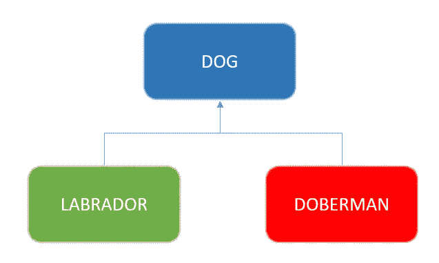

# Dart 中的工厂构造器—第 1 部分

> 原文：<https://medium.com/nerd-for-tech/factory-constructor-in-dart-part-1-1bbdf0d0f7f0?source=collection_archive---------0----------------------->

工厂构造器是 dart 初学者比较困惑的话题之一。要更好地理解它，首先必须理解工厂设计模式。


图片 src:[https://www.freepik.com/jcomp](https://www.freepik.com/jcomp)

## 什么是工厂设计模式？

**定义:** *在工厂模式中，我们创建对象而不向客户端公开创建逻辑，并使用公共接口引用新创建的对象。*

如果你感到困惑，让我试着通过代码和**工厂**构造来解释。



如果我们需要用以下标准创建这些子类的对象，

1.  举**杜宾**的例子，如果用户想要一只狗来守护
2.  给**拉布拉多**实例，否则。

我们怎么能天真地这样做呢？

这在一个地方没问题，如果你想在多个地方都有这个逻辑呢？你必须重复使用 if-else 语句。我们该如何简化这一点？答案是**工厂构造器。**

现在，我们已经将实例创建逻辑移到了父类。我们如何使用这个构造？

要创建看门狗，请使用

```
Dog myGaurdDog = Dog.createDog(name:’Rocky’,gaurdDog:true);
```

否则使用，

```
Dog myPetDog = Dog.createDog(name:’Tommy’,gaurdDog:false);
```

现在如果你看看工厂设计模式的定义，就更好理解了

1.  ***我们创建对象，而不向客户端公开创建逻辑***

是的，我们没有向客户端公开对象创建逻辑( *main()* method)，它隐藏在我们的父类‘Dog’内部，客户端需要用所需的参数调用工厂构造函数来获得所需的对象。

2. ***我们* *指使用公共接口新创建的对象。***

这也是真的，我们返回的是类型为 **Dog、**而不是 **Labrador(或 Doberman)的实例。父类是这里的公共接口，因为它与两个子类都兼容。**

我希望，现在你明白了工厂构造器是如何让我们的生活变得更加容易的。实现工厂设计模式并不是工厂构造器唯一有用的东西。我们还可以使用工厂构造函数实现**缓存**特性。我将在下一篇文章中讨论'**使用工厂'**进行缓存，并在后续文章中讨论'**命名构造函数和工厂构造函数'**之间的区别。谢谢你。