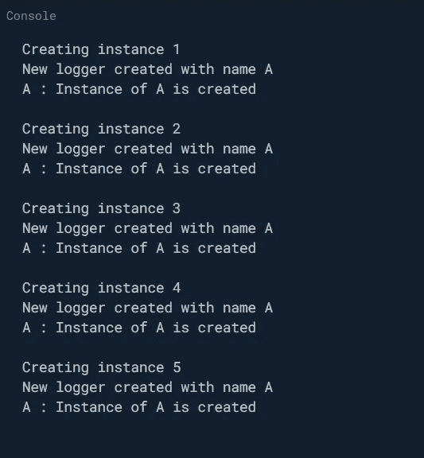
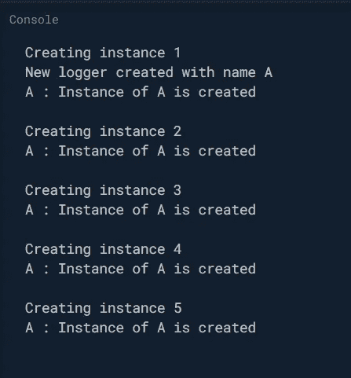

# Dart 中的工厂构造器—第 2 部分

> 原文：<https://medium.com/nerd-for-tech/factory-constructor-in-dart-part-2-7db2a5981ac3?source=collection_archive---------1----------------------->

在[上一篇文章](https://imsaravananm.medium.com/factory-constructor-in-dart-part-1-1bbdf0d0f7f0)中，我们已经讨论了如何使用工厂构造函数实现简单的工厂设计模式。然而，我们还没有完全探索和理解工厂构造函数的力量。在本文中，我们将学习如何使用工厂构造函数实现缓存。


**什么是缓存？**

缓存是一种在本地存储中存储数据的方法，这样我们就可以重用它，而不是再次进行相同的计算。

**示例** : *您的脸书个人资料图片会缓存在您手机的本地存储中，这样就不需要一直从互联网上获取了。*

但是在本文中，我们将要对工厂构造函数进行的缓存是完全不同的。我们将在地图中缓存实例。

我能给出的关于缓存的最好例子是不同记录器的**缓存**，如果你不知道一个记录器做什么，它被用来打印消息到控制台用于调试目的。我们通常为每个类都准备了一个日志记录器来打印它们自己的调试消息，消息前面有它们的类名(这样我们就可以识别“哪个消息属于哪个类”)

假设我们已经实现了自己的简单日志类

这个 Logger 类非常明显，它只有一个属性 ***名称*** 和一个方法***void log(String msg)***。我们将为每个类创建一个日志记录器的实例，将它的类名作为参数传递。但是如果你每次都为同一个类创建同一个实例(从头开始),这不是一个好的做法，而且当实例非常昂贵时，将花费大量的计算时间。

示例场景，

```
class A{
 late final Logger _logger;
 A(){
    _logger = Logger(‘A’);
 }
}
```

在 main()方法中，让我们创建 5 个 A 的实例，

```
main() {
   for(int i=1;i<=5;i++){
       print("Creating instance ${i}");
       A a = A();
       print(""); //newline
   }
}
```

输出将是



每当创建的实例时，也会创建相应的记录器实例。有什么方法可以重用 logger 实例吗？是的，我们有，通过缓存我们可以做到这一点。

## 启用缓存的记录器类

> **注意**:工厂建造者无权访问`this`。这就是我们将 _cache 声明为**静态的原因。**

如果你看看这个新的 logger 类，我做了一些显著的改变。

1.  移除了公共构造函数并添加了私有构造函数记录器。_internal()，这样我们就不能直接创建 Logger 类的实例了。
2.  引入了一个映射' ***_cache*** '，用于存储之前创建的实例，并以它们的类名作为关键字。
3.  添加了一个工厂构造函数，它将决定是返回一个新的实例还是一个已经存在的实例。

如果您再次运行 main()方法，我们的输出将是



正如您所看到的，logger 实例仅在我们初始化时第一次创建，然后在后续的实例化中被重用。

## 它是如何工作的？

1.  当您第一次创建 A 的实例时，它会要求 Logger 的工厂构造函数给它一个名为“A”的 Logger 实例。
2.  工厂构造函数将在 _cache 映射中查找关键字为“A”的记录器实例。由于这是第一次，它找不到任何带有关键字' A '的日志记录器。因此，它创建了一个名为“A”的 Logger 的新实例，将它存储在 map 中，键为“A ”,并返回相同的结果。
3.  对于后续调用，由于缓存中已经存在键为“A”的记录器，因此它不会创建新的实例并返回缓存的实例。

如果我们需要创建的实例非常昂贵(需要大量计算时间)，这种缓存技术会非常方便。

你可以争辩说，缓存本身可能会占用大量空间。是的，你是对的，但是我们可以使用各种缓存算法来解决这个问题，但是如果你只有几个实例要缓存，这也可以。

在下一篇文章中，我将告诉您命名构造函数和工厂构造函数之间的区别，以及何时更喜欢哪一个。谢谢你。