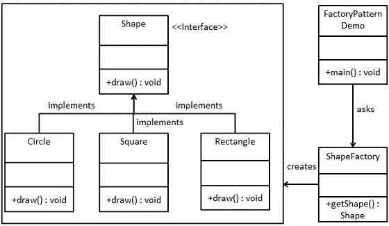
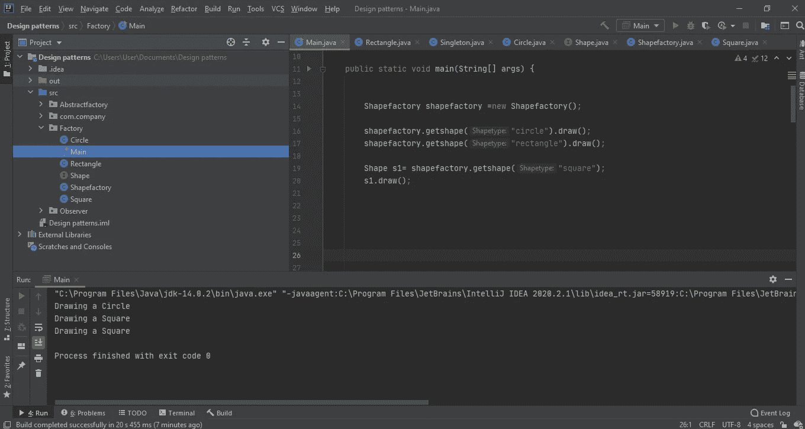
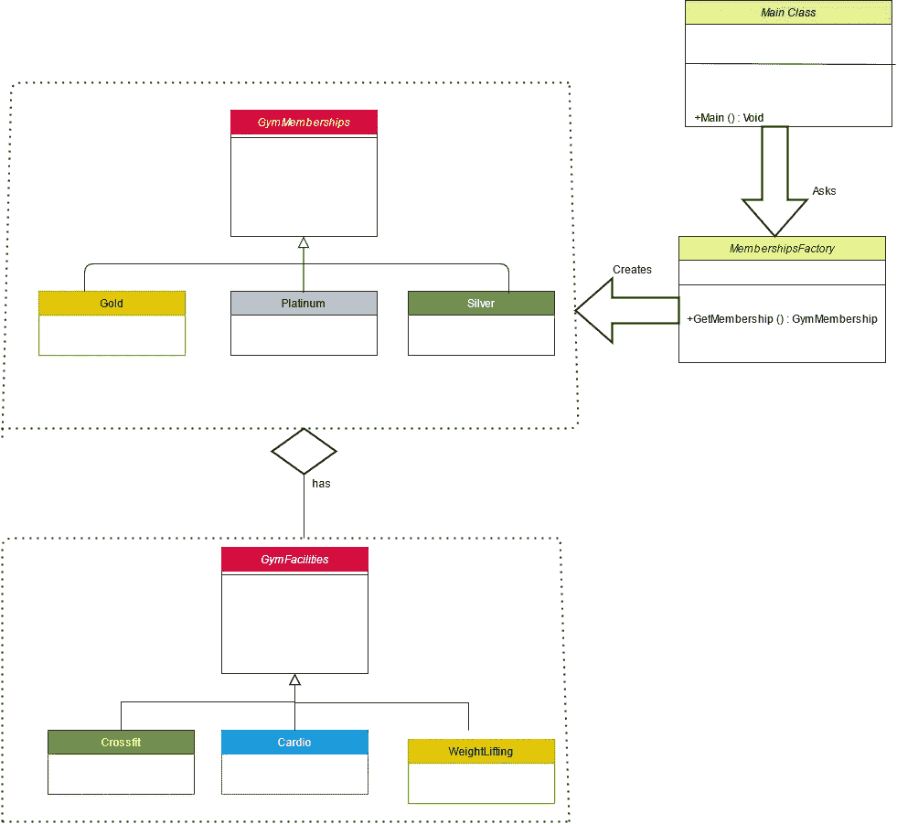
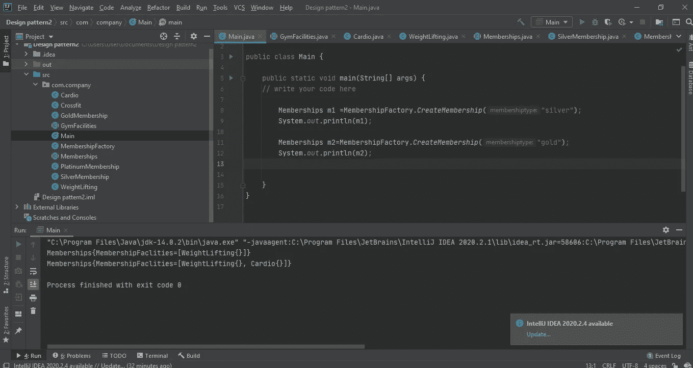

# 工厂设计模式

> 原文：<https://medium.com/nerd-for-tech/factory-design-pattern-a570cc3ad804?source=collection_archive---------13----------------------->

在我的上一篇文章中，我已经讨论了单体设计模式。因此，如果你是设计模式的新手，你可以去学习设计模式和单体设计模式的介绍，这是我以前的文章。所以在这篇博客中，我将解释工厂设计模式。这种设计模式属于创建模式，因为这种模式提供了创建对象的最佳方式之一。让我们先看一个简单的例子，因为它容易理解。

如上图所示，我们需要创建形状接口和具体的类(这里的子类是圆形、正方形、矩形)。然后我们需要创建 Shapefactory 类。在我们的 Shape Factory 类中，有一个方法调用 get shape，它返回用户请求的形状的一个实例。用户请求是通过主类完成的。我们的演示类有一个 main 方法，它将使用 ShapeFactory 来获得一个 Shape 对象。它会将信息(圆形/矩形/正方形)传递给 ShapeFactory，以获取它需要的对象类型。正如您所看到的，这是工厂设计模式的基本概念。所以我们来实现这个。我已经实现了如下的形状接口。它包含一个绘制方法。

然后矩形、圆形和方形类应该从 Shape 接口实现，并覆盖 draw 方法，如下所示。我只把矩形类放在下面，但是你也需要像这样实现其他类(圆形类和三角形类)。

然后在 Shapefactory 类中，我们需要实现 getshape 方法，该方法返回 shape 类型实例。您需要实现一个逻辑来检查用户是否在询问哪个形状。在这里，我使用 if else 来确定，并根据用户的选择，它会给用户选择的形状对象。

在我们的主类中，我从 Shapefactory 创建了一个实例，并使用 shapefactory 实例调用 get shape 方法来传递我想要的形状，如下面的代码段所示。

完整实现的输出如下。

这是工厂设计模式的基本实现。现在让我们看一个高级的真实世界的例子。假设有健身房。基本上健身房有一些设施，如举重机，有氧健身器和交叉健身。不是每个成员都能使用那些机器。用户可以根据他们的成员类型来使用它们。有三种会员类型。那些是银的、金的和白金的。

1.  银卡会员只允许使用举重机。
2.  黄金会员只允许使用有氧健身器和举重机。
3.  白金会员可以使用有氧健身器、举重机和交叉健身区。

所以在下面你可以看到 UML 图。

现在让我们一个一个地实现这个场景。所以让我们将 GymFacilities 类实现为一个抽象类。

然后我们需要使用健身房提供的设施。所以我创建了一个名为 cardio 的类，并从 GymFacilities 类扩展而来。实际上，这些 facilities 子类只是空类，只有 to string()方法。如下图所示，我对所有其他的健身课程也是这样做的(交叉训练课和举重课)。

现在我创建一个成员类，并将其设置为抽象类。在会员类中，我有一个包含健身设施的受保护列表。接下来，您可以看到该类的构造函数，它调用 CreateMembership()方法。然后我们有了 to string 方法。

然后，我们可以创建银牌、金牌和白金会员级别，并从会员级别扩展这些级别。正如我前面提到的，银牌会员只能使用举重机。黄金会员只允许使用有氧健身器和举重机。白金会员可以使用有氧健身器、举重机和交叉健身区。所以你需要把那些设施相应地加入到会员设施列表中。

在我们的 MembershipFactory 类中，我们有一个 createmembership 方法，它返回成员类型实例。在该方法中，您需要实现一个逻辑来检查用户是否在询问哪个成员资格。在这里，我使用 if else 来确定，并根据用户的选择，它会给用户选择的成员对象。

在我们的 main 方法中，您可以从成员资格创建一个实例，并且可以使用 MembershipFactory 类创建成员资格。

程序的输出。

现在让我们了解一下工厂设计模式的优缺点。

## 工厂设计模式的优势

1.  工厂方法模式允许子类选择要创建的对象类型。
2.  它消除了将特定于应用程序的类绑定到代码中的需要，从而促进了松散耦合。
3.  允许您隐藏实现细节。

## **工厂设计模式的缺点**

1.  可能很复杂，因为它会增加系统中的类的总数。

## 工厂设计模式的使用

*   当一个类不知道需要创建什么子类时
*   当一个类希望它的子类指定要创建的对象时。
*   当父类选择创建对象到它的子类时。

您已到达这篇文章的结尾。所以我希望你了解工厂设计模式。我将把 git hub repository 链接放在参考资料中，然后您可以遵循完整的编码示例。那就另文再见了。

# 参考

 [## dilshanushara/Krish _ LP _ Training

### 在 GitHub 上创建一个帐户，为 Dilshanushara/Krish _ LP _ Training 的发展做出贡献。

github.com](https://github.com/Dilshanushara/Krish_LP_Training/tree/master/Design%20Patterns/Factory)  [## 设计模式-工厂模式

### 工厂模式是 Java 中最常用的设计模式之一。这种类型的设计模式属于创造性的…

www.tutorialspoint.com](https://www.tutorialspoint.com/design_pattern/factory_pattern.htm)  [## 工厂方法设计模式-Java point

### 工厂模式或工厂方法模式表示只需定义一个接口或抽象类来创建一个对象…

www.javatpoint.com](https://www.javatpoint.com/factory-method-design-pattern)