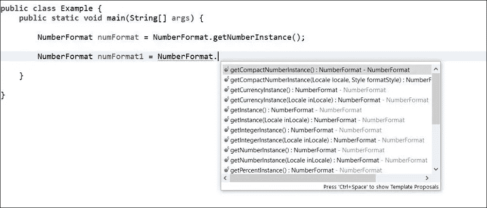
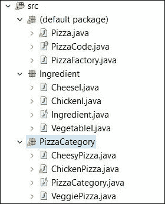
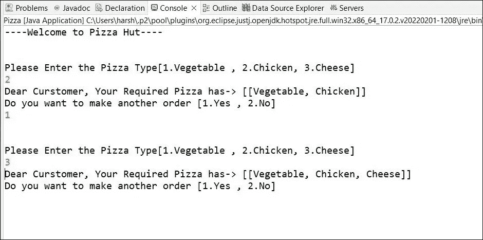

# 工厂设计模式

> 原文：<https://medium.com/nerd-for-tech/factory-design-pattern-b14127b39eff?source=collection_archive---------0----------------------->

这是作为单一个体的造物模式。工厂设计所做的是*当我们想从不同的类中获得一个实例时，它的行为就像一个工厂*。它根据我们的需要给我们任何东西。

我们可以把它想象成一个来自现实世界的服装厂。在服装厂，他们生产各种各样的衣服，像罩衫、连衣裙、t 恤衫、衬衫和所有其他的东西。如果我们需要女衫，我们向服装部索要女衫，它有责任提供我们需要的物品。我们不知道如何做那些衣服。但是我们只能通过和服装厂沟通来询问和使用做好的衣服。你可以用你的案例来想象工厂设计模式。

举个例子，如果你需要颜色。你可能有一个颜色工厂，可以提供任何颜色。那么简单地说，你可以来从颜色工厂要你想要的颜色。

所以，今天我们将看看如何在编码示例中使用工厂设计模式。

# **独生子女和工厂模式一样吗？**

是的，我们不得不接受他们都在创造设计模式下。但这并不意味着这些是一样的。如果这些是相同的，为什么我们需要有两种模式。对吗？

在 Singleton 中，*确保它将只提供一个来自类*的实例，而工厂模式*定义一个接口/抽象类来创建所需的对象*。

当我们使用 singleton 时，不应该传递更多的参数。在工厂中，用户传递参数，说明你想得到哪种类型的实例。你在工厂模式中看不到实例化逻辑。

# **有工厂设计模式的例子吗？？**

当然，为什么不呢？

我将提供 java 中真实世界的用例，以及有趣用例的演示示例。

1.谈到 java， **NumberFormat** 使用工厂模式。

数字格式的工作原理

在这里，您可以看到我们可以获得不同类型的实例，如 IntegerInstance、NumberInstance 等。

2.接下来，我将提供一个工厂设计模式的演示。

## 披萨演示游戏攻略:

每个人可能都喜欢吃披萨，对吗？大多数人肯定喜欢吃比萨饼。那我们把混乱的工厂模式映射出来做一个披萨怎么样？听起来很酷，对吧？

有时候，你可能有复杂的东西要学。不要努力。要聪明而不是努力。它会给你的学习带来更有效的结果。

因此，我们将把购买比萨饼映射到工厂设计模式中。但是我们怎么做呢？

**来自真实世界的演示背景:**

请你好好理解这一点。那么你最终会对工厂模式有一个很好的了解。

就拿披萨店来说吧，它提供三种披萨，比如**鸡肉披萨、奶酪披萨和蔬菜披萨**。人与人之间的选择是不同的。因此，商店将提供 3 类比萨饼。

通常当商店做比萨饼时，他们用不同的配料做不同的比萨饼。

在我们的例子中，为了简单起见，假设我们只有 *3 种配料*，比如**蔬菜、鸡肉和披萨**。

如果有人需要*蔬菜披萨* - >，那就只有**蔬菜**。

如果有人需要*鸡肉披萨* - >就会有**蔬菜和鸡肉**。

如果有人需要*奶酪披萨* - >，它会有所有的**蔬菜、鸡肉和奶酪**作为配料。

当我们买比萨时，我们不需要做比萨，也不需要了解如何做比萨。相反，我们有比萨饼店，我们可以去他们的比萨饼分类中要任何我们想要的比萨饼。然后他们会提供我们要求的比萨饼。

**如何将购买披萨映射到工厂模式:**

1.在这种情况下，工厂是什么？

披萨店是我们的工厂。(因为他们做披萨，给我们提供)

2.我们需要做什么，吃披萨吗？

我们必须点比萨饼，说明我们想要哪种比萨饼。(例如:鸡肉披萨)

3.你点了之后，会发生什么？

披萨店会用相关食材做披萨。(例:他们会用蔬菜和鸡肉做鸡肉披萨)

然后，商店会提供鸡肉比萨饼。

现在你知道了，我们的工厂是披萨店。然后我们点一些比萨饼。比萨饼店在店里制作比萨饼，这意味着比萨饼工厂根据要求制作比萨饼。如果要求是鸡肉比萨饼，配料是蔬菜和鸡肉。商店将提供鸡肉比萨饼给你，这是工厂模式的例子。

**披萨工厂演示:**

你有一个主要的类(*Pizz.java*)a 去要一些比萨饼。那是我们的主要课程。然后你订购比萨饼，PizzaFactory 将接受参数并从所需的比萨饼创建新的实例(例如。鸡肉比萨，然后它将从鸡肉比萨创建一个实例。)在鸡肉比萨类中，我们有 *makePizza()* ，它会添加蔬菜和鸡肉等配料。然后它将返回鸡肉比萨饼实例。

根据我们的要求，我们将制作名为配料和披萨分类的文件夹。

项目结构

1.Ingredient.java 是抽象类，将由奶酪、鸡肉和蔬菜扩展。(我将提供例子，假设鸡肉比萨饼是用户需要的一个)

2.现在，我们有配料了。然后我们想开设课程来制作添加配料的比萨饼。为此，我们将使用名为 PizzaCategory.java 的抽象类，它将由鸡肉比萨、奶酪比萨和蔬菜比萨类扩展。

我们所做的是，我们创建一个抽象类，它将有一个数组列表，可以保存成分列表。使用 makePizza()方法，每一个 Pizza 类都会制作带有配料的 Pizza。

在 ChickenPizza.java，我们会加入蔬菜和鸡肉作为配料。为此，我们将从 VegetableI 和 ChickenI 向 ingredientsList arraylist 添加新实例。

3.现在我们有了所有的配料类和披萨类别类。现在，我们可以使用我们的工厂，创造新的比萨饼。

在 PizzaFactory 中，我们有 orderPizza()方法。它将采取用户的要求，并检查用户想要什么。

我们可以简单地使用 enum 来保存比萨饼代码，如 VEG、CHICKEN 和 CHEESY。

如果用户要求鸡肉比萨，在 PizzaFactory 中，它将切换到 case 并返回新的 Chicken Pizza()实例。

这就是披萨工厂发生事情。

4.最后，我们可以有我们的主要应用程序，这将允许要求比萨饼。

运行主应用程序后，我们可以得到这样的结果。

你可以在这里看到，第一次用户要求鸡肉比萨饼。所以用户输入 2。然后它会说“亲爱的顾客，你需要的披萨有->[[蔬菜，鸡肉]]”因为鸡肉披萨是用蔬菜和鸡肉做的。

在第二次，用户要求一个奶酪比萨饼，它将提供与蔬菜，鸡肉，奶酪。

我希望您现在对什么是工厂模式以及我们如何实现工厂设计模式有一个很好的想法。

**代码示例:**

[https://github . com/harshani 2427/learn-with-krish/tree/master/Design % 20 patterns/Factory](https://github.com/harshani2427/learn-with-krish/tree/master/Design%20Patterns/Factory)