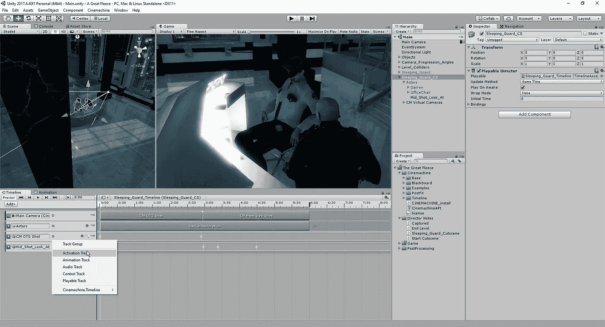
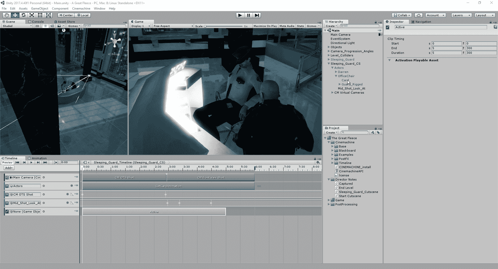
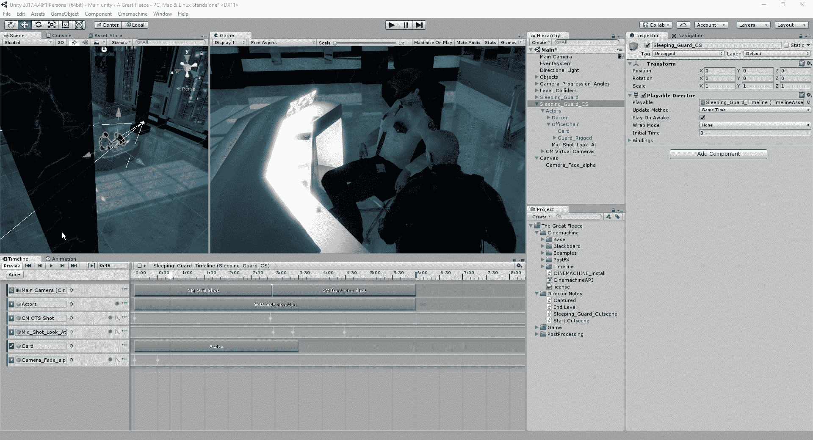
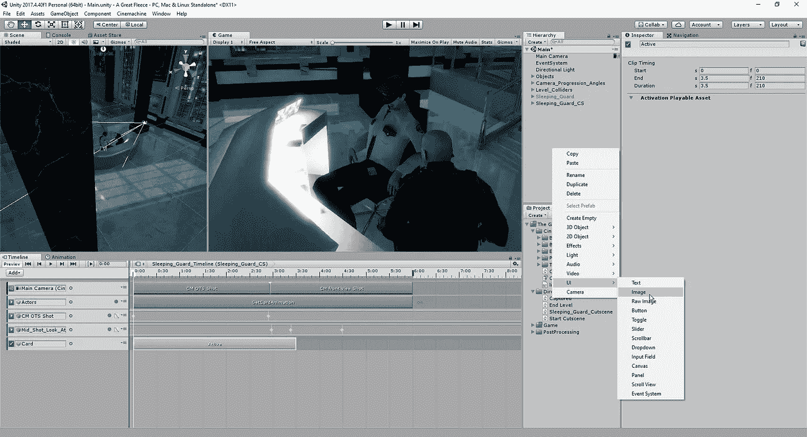
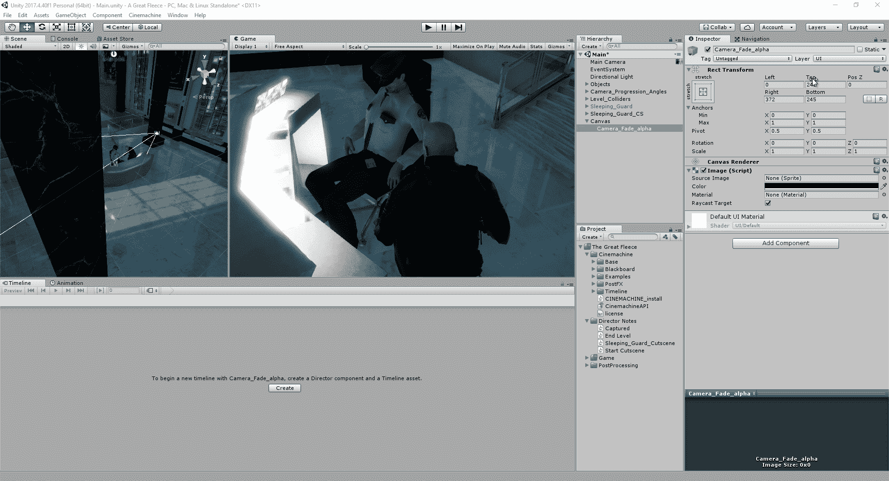
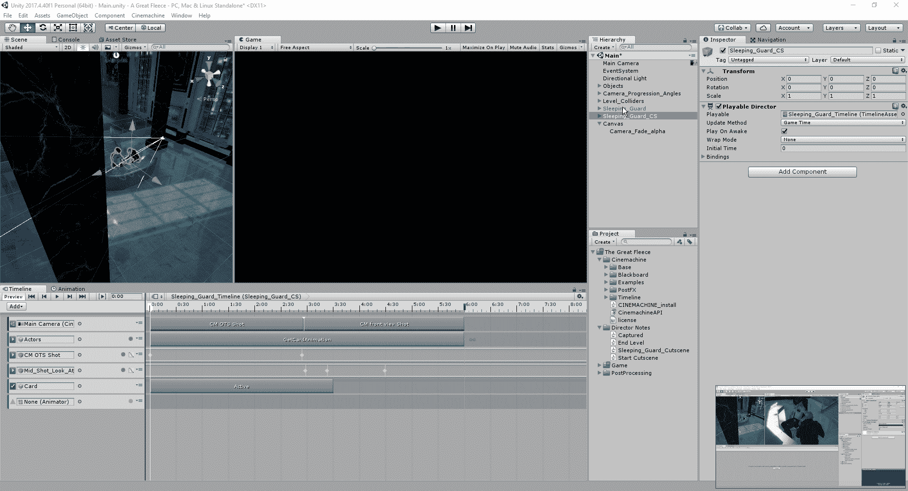
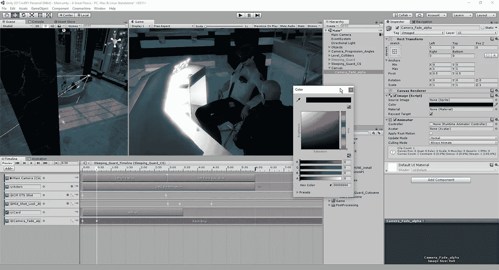
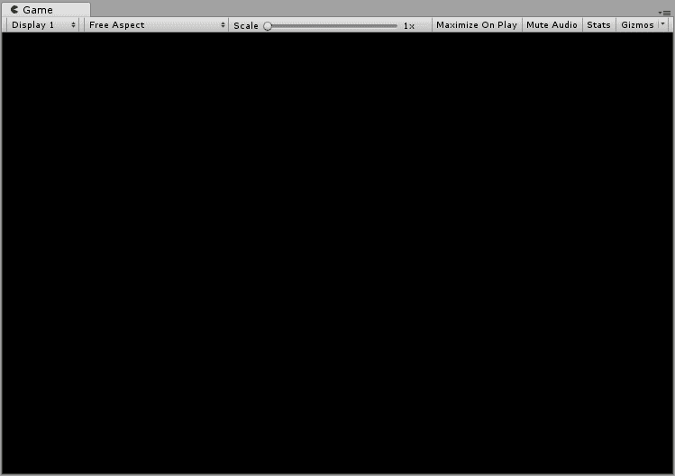
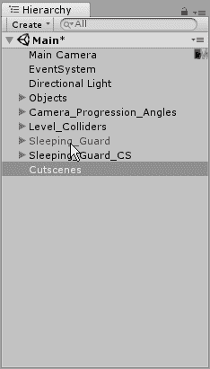

# 淡入和激活轨道

> 原文：<https://medium.com/nerd-for-tech/fading-in-and-activation-tracks-48b9b2b2574e?source=collection_archive---------25----------------------->

## 激活轨迹

我们要做的第一件事是，当我们让我们的球员去拿的时候，让守卫卡从他的裤子里消失。首先，我们需要在我们的时间线上创建一个激活轨道:

在这里，我们将打开层次结构中的 actors 类别，并将卡片移动到空的位置:

然后，我们会将活动栏调整到玩家去抓卡的位置，一旦过了这段时间，卡就会消失:

## 渐显

接下来，我们将看看如何使用 alpha 为过场动画创建淡入效果。首先，我们需要创建一个 UI 图像:

从这里开始，我们将允许它覆盖整个游戏视图，因此我们将调整图像的位置，使其延伸到整个场景，同时将值更改为 0，以便它覆盖所有内容:

从这里，我们将创建一个动画轨迹并将我们的图像拖到它上面:

最后，我们将进入场景大约 0.3 秒左右，为场景创建结束帧，并将 alpha 降低到 0，就像我们对窗口所做的一样，这将为场景提供淡入风格介绍:

现在我们已经完成了过场动画，我们可以稍微清理一下我们的层次结构，这样所有和这个场景相关的东西都在一起，我们不会把它和任何未来的场景混淆。

现在我们已经完成了第一个过场动画，我们可以展望这个项目的下一部分了。