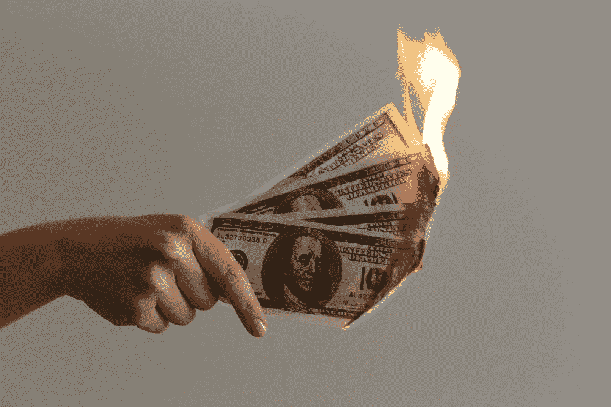

# 未能成为百万富翁…更未能成为亿万富翁

> 原文：<https://medium.com/nerd-for-tech/fail-to-become-millionaire-fail-more-to-become-a-billionaire-caa6dd142366?source=collection_archive---------1----------------------->

## 失败导致成功

## 3 个悲惨失败的成功人士的例子

照片由[Jp Valery](https://unsplash.com/@jpvalery) 来自 Unsplash

纽约大学教授、9 家成功公司的创始人斯科特·加洛威表示，大多数**超级富豪**都有一个共同点:

> 失败……很多很多。