# 如何在 Laravel 中使用模型工厂和数据库 Seeders

> 原文：<https://medium.com/nerd-for-tech/faking-it-till-you-make-it-a6b9b1bb82cf?source=collection_archive---------3----------------------->

在本文中，您将了解到:

*   什么是数据库种子
*   为什么使用数据库种子
*   如何使用数据库种子

> 如果你正在阅读这篇文章，假设你知道基本的 PHP。这很可能是您的第一篇 Laravel 文章，但是 PHP 知识会非常有用。

# 入门指南

大多数时候，当我们必须用虚拟数据开发应用程序时，我们自己键入它们或者使用 [Postman](https://www.postman.com/) to [POST](https://zubairidrisaweda.medium.com/routing-in-laravel-8-e8e373413b8f#7aa5) 到我们的数据库。这个有用，但是很烂。😢

其他时候，在完成我们的应用程序后，我们需要它们有一些数据作为开始。我们仍然可以输入这些，或者再次使用 Postman。它有效，但仍然很糟糕。😢 😩

[Laravel](https://laravel.com/)——专为开发人员打造——提供测试应用程序或启动应用程序所需的数据。Laravel 为您提供了数据库种子，这是在您的应用程序中轻松获取数据的方法。这可能是一些真实的数据，你不想强调自己输入，或者只是假数据，以测试你的 API。

在深入研究如何使用之前，这里有一些您想要使用数据库种子的原因:

*   Seeders 非常容易使用，比你自己输入数据要容易得多
*   Seeders 让您不费吹灰之力就可以启动并运行，只需对数据库进行一次播种，就可以创建数百行数据
*   seeder 可以在多个服务器上重用，这意味着部署到一个新的服务器只意味着再次运行 seeder 并再次获取数据库中的数据

使用播种机还有很多原因，但让我们开始使用它们吧。😆

# 让我们开始吧

像这样轻松地创建一个新的 Laravel 项目:

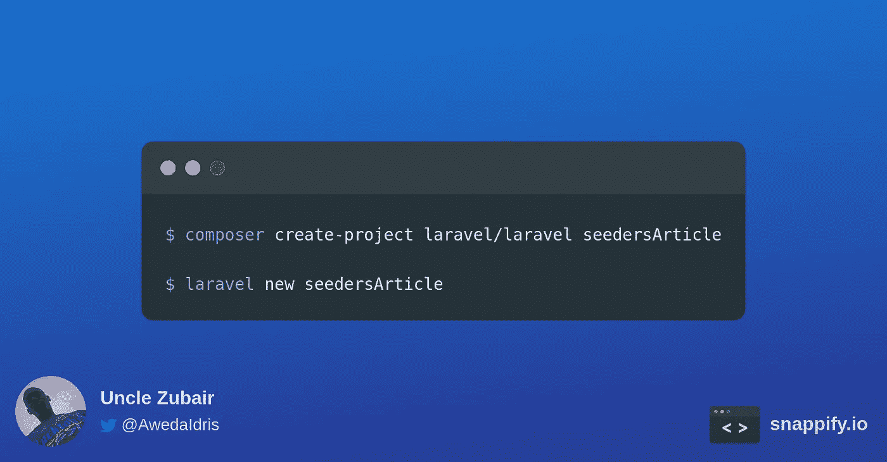

# 设置您的数据库

创建应用程序后，我们继续设置要使用的数据库。您应该创建一个 MySQL 数据库(或者您喜欢的任何其他数据库)并更新*。env* 文件来反映这个变化。

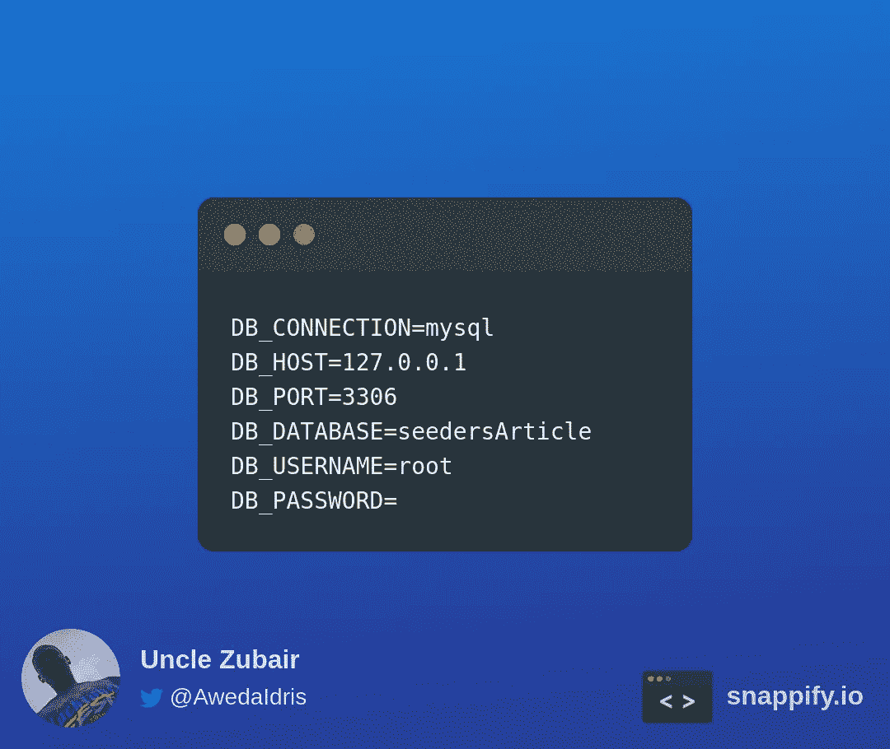

这里，我的数据库名与我的项目名相同。更新`DB_USERNAME`和`DB_PASSWORD`以匹配您的数据库凭证。

现在，数据库已经准备好了，我们可以为我们的数据制作表格*和模型*。

# 制作模型和迁移

我们制作了一个`Post`模型和一个与之配套的迁移。

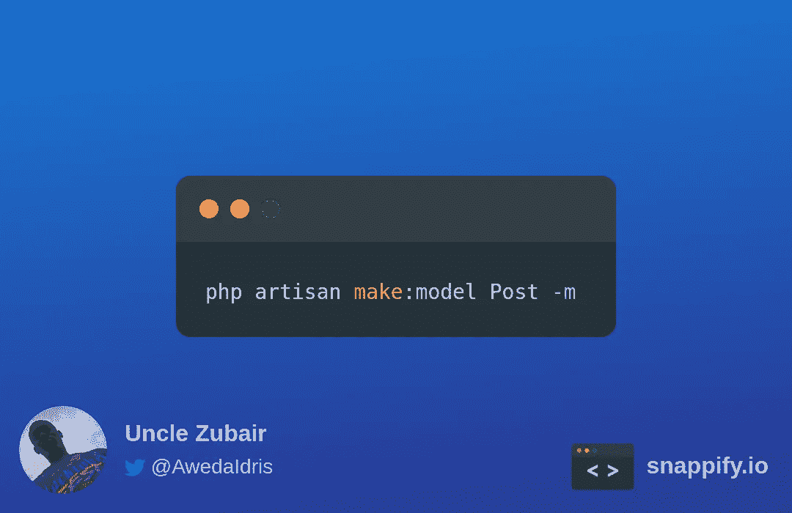

运行此命令将创建两个新文件，一个模型文件和一个迁移文件。

在`Post.php`文件中，我们看到这个类使用了`HasFactory`特征。这意味着数据创建可以是自动化的，或者可以使用工厂来模拟(稍后将详细介绍)。

让我们编辑迁移文件，通常命名为*2021 _ 04 _ 12 _ 235242 _ create _ posts _ table*，以具有*标题*、*正文、*和*作者*字段。

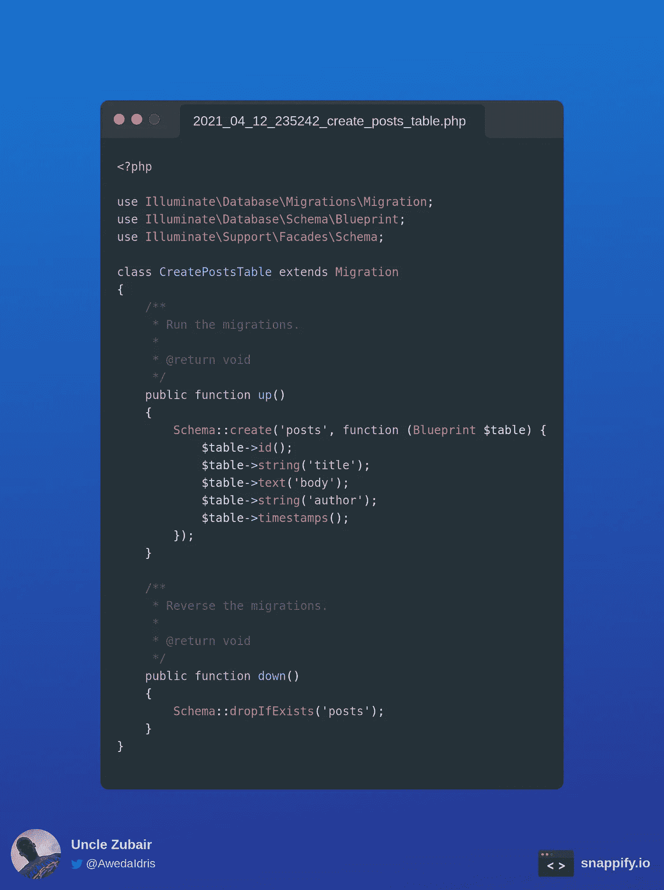

最后的数据库设置是运行迁移，这样我们的表就创建好了，并准备好保存我们的数据。

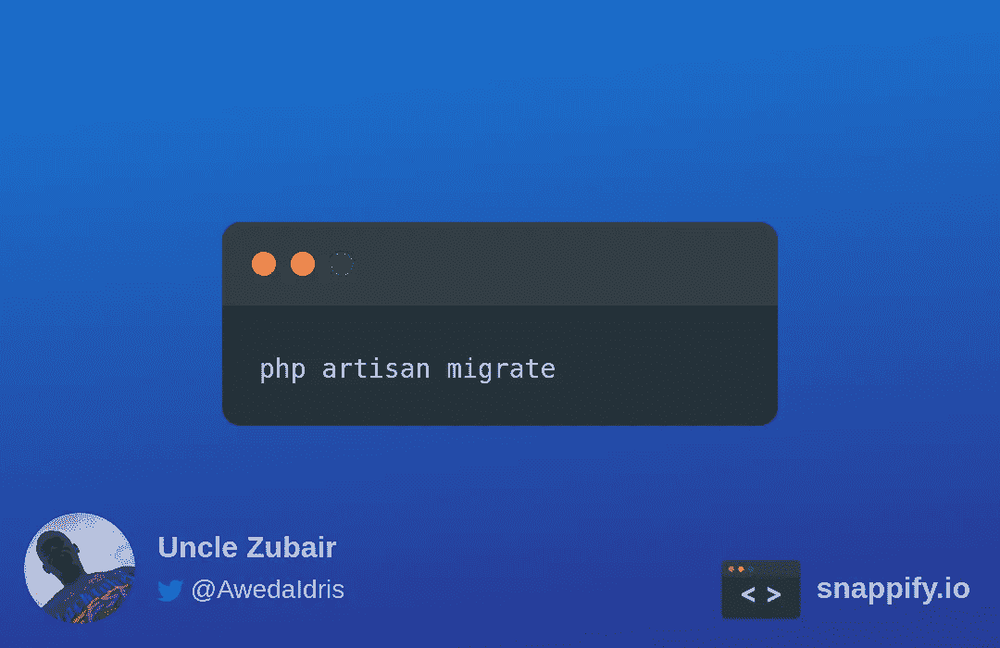

# 创建种子

就像我们到目前为止所做的其他事情一样，创建一个播种器也不难。

运行这个命令会在我们的`database`文件夹的`seeders`文件夹中创建一个新文件。默认情况下，该文件如下所示:

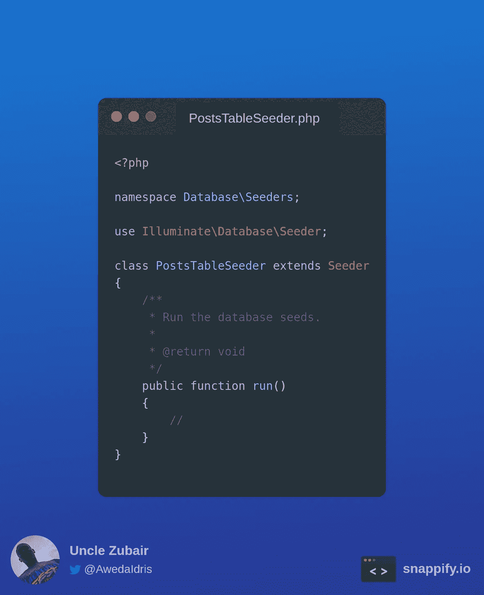

我们的大部分代码都在 run 方法中。但在此之前，我们引进了`Post`模式。然后我们可以创造一些职位。

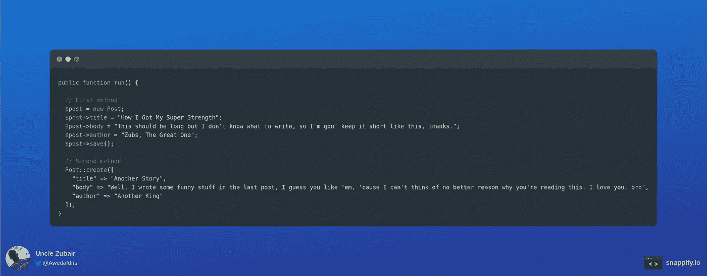

现在，我们已经创建了一些希望在应用程序中使用的数据。那么我们实际上在哪里把它添加到我们的数据库中呢？

我们告诉我们的`DatabseSeeder`使用我们刚刚创建的`PostsTableSeeder`。

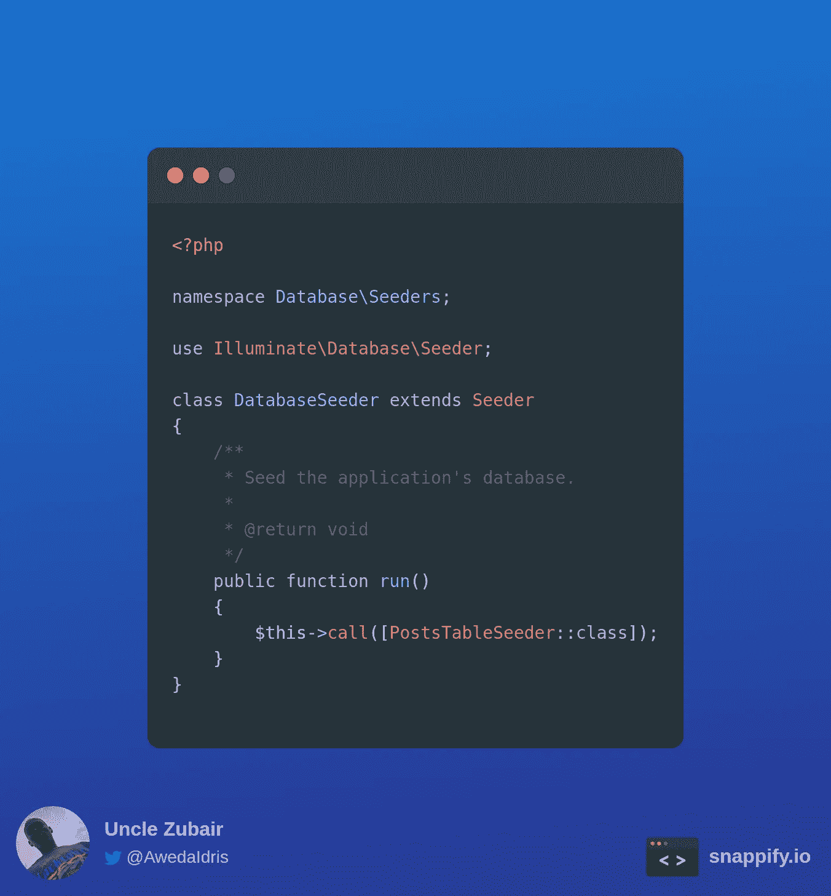

> `DatabaseSeeder`文件由 Laravel 自动创建。

## 使用模型工厂

现在让我们学习如何使用 Laravel 获得虚拟数据。为此，我们创建了一个工厂来生成假数据。

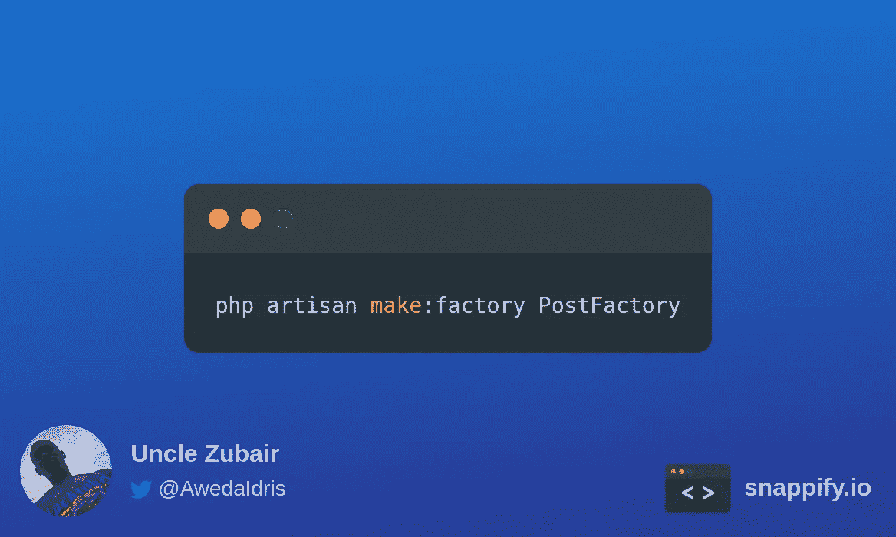

运行这个命令会在我们的工厂文件夹中创建一个`PostFactory`文件。默认情况下，这个文件应该和我这里的一样。

正是在这个文件中，我们定义了要创建的数据的结构——我们设置了我们想要的字段。

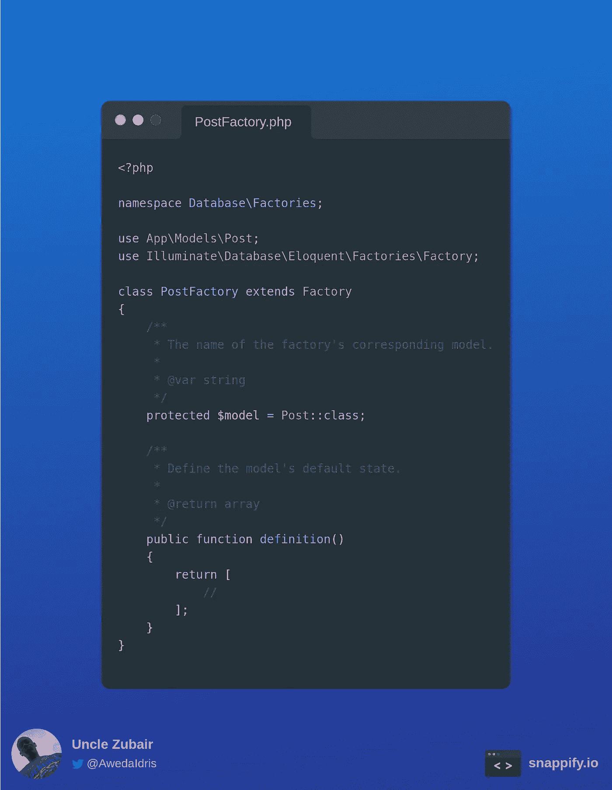

更新`PostFactory`的`definition`方法，创建*标题*、*正文、*和*作者*结果为:

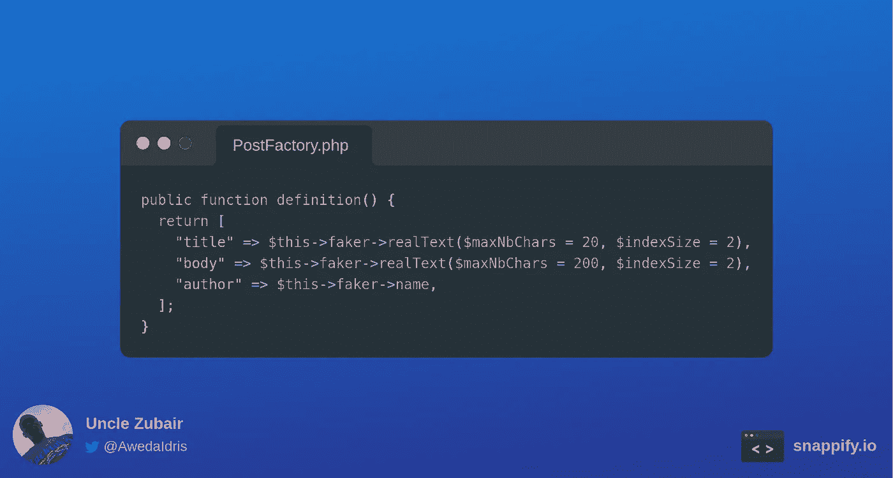

使用这个工厂非常简单，我们在`PostsTableSeeder`文件中调用模型的工厂方法。

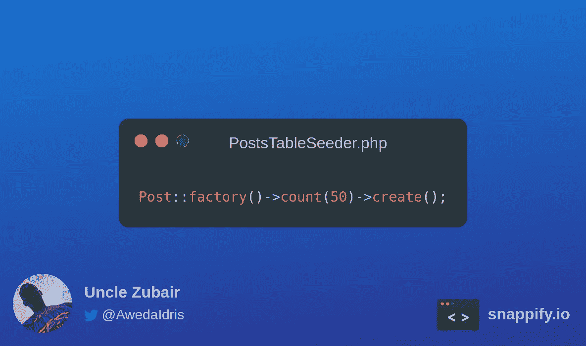

当数据库最终被播种时，这将创建 50 个随机的帖子。

# 运行播种机

我们确实写了相当多的代码，但我们仍然有一个空的数据库。好了，这即将改变，运行下面的命令来运行我们的 seeders，并用我们与 Laravel 一起创建的这些帖子填充我们的数据库。😄

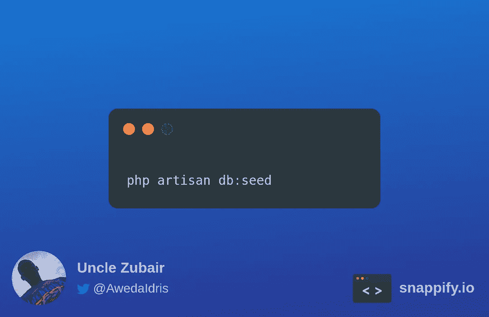

> 这篇文章的代码可以在[这里](https://github.com/Zubs/seedersArticle)找到。

# 结束了

如果你有任何问题或相关的好建议，请在评论区留下。

要阅读更多我的文章或关注我的作品，您可以在 [LinkedIn](https://www.linkedin.com/in/idris-aweda-zubair-5433121a3/) 和 [Twitter](https://twitter.com/AwedaIdris) 上与我联系。又快又简单，还免费！

豪伊·R 在 [Unsplash](https://unsplash.com?utm_source=medium&utm_medium=referral) 上拍摄的照片