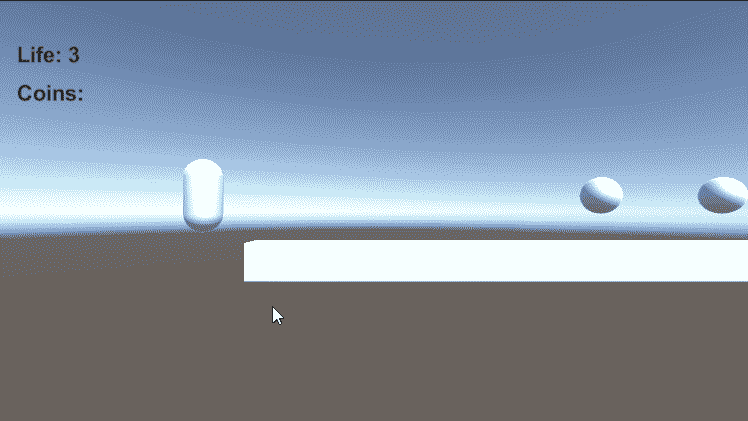
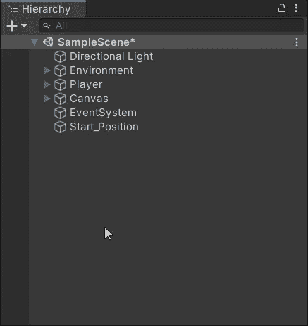
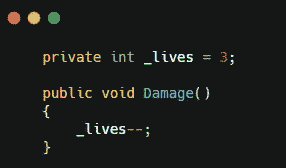
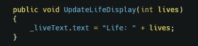
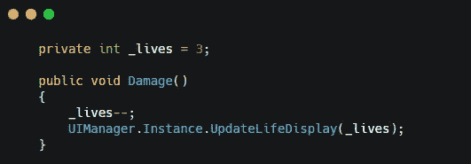
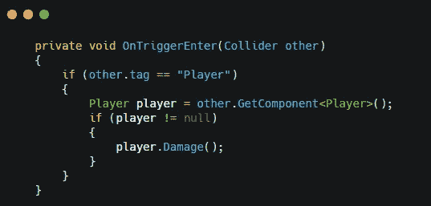
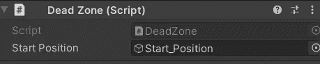
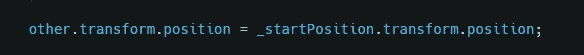
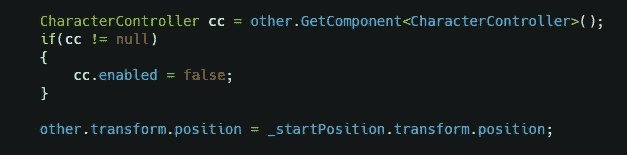
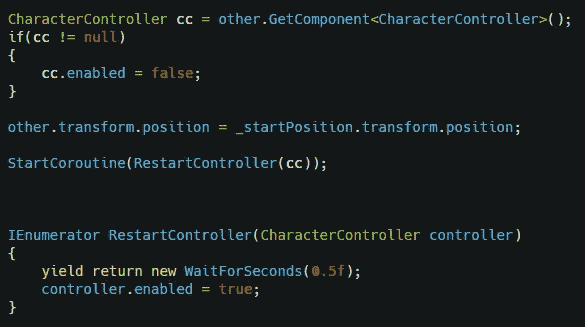

# 坠落重生与伤害-游戏开发系列 82

> 原文：<https://medium.com/nerd-for-tech/falling-respawn-damage-game-dev-series-82-97d8ef09ed94?source=collection_archive---------22----------------------->

目的:平台游戏伤害系统快速指南。

当脱离游戏边界时，在起始位置重生是一个简单且平衡的游戏选项。

在这篇文章中，我们将创建一个简单易行的系统，让玩家跌倒后在起点重生。

## 管理死区和重生位置

首先，我们需要复制玩家来创建一个新的游戏对象。删除除 transform 之外的所有组件，这将是之后重生的位置。

然后创建一个立方体对象，并在整个游戏场景的底部缩放它。让碰撞器作为触发器，并添加一个刚体，这将是死区检测。

确保范围将涵盖所有的游戏场景。

现在创建一个名为“**死区**的新脚本，并将其附加到立方体上。
在这个脚本中，我们将检测玩家是否与。在此之前，我们需要添加一些代码到播放器。

## 生命的定义

在玩家脚本中，创建一个新的整数变量作为生命计数。然后创建一个公共方法来更新当前的生活。

不仅要在 Player 中计算值，还要在 UIManager 中计算值。使用场景中的新文本对象在 UIManager 中创建一个公共方法。那么我们的生活也应该在 UI 上更新。

而且我们可以给 Damage()添加更多的线。

有了这些设置，我们现在可以编写死区脚本了。

## 重生

创建一个 **OnTriggerEnter()** 方法并检查播放器是否与。如果是玩家，调用 **Damage()** 从玩家处取 1 活。

用 **SerializeField** 创建一个 gameobject 变量作为起始位置，并在编辑器中将 gameobject 拖入其中。然后将播放器的位置替换到**开始位置**。

然而，如果你玩并且测试它，你会注意到它不工作。玩家下落速度太快，无法让**角色控制器**处理位置切换。
我们需要禁用控制器，在玩家回到 Start_position 后启用。

首先，在位置切换之前禁用控制器。

然后将控制器重新设置为在协程中工作。

现在当玩家从游戏中掉出时，应该回到开始的地方。